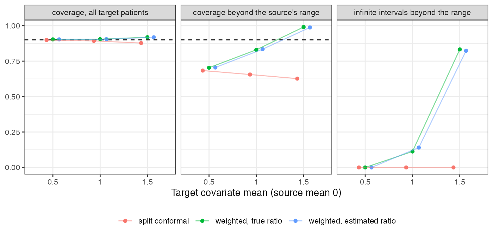

# Weighted conformal prediction keeps its marginal guarantee under shift
by returning infinite intervals where the source has no data
Ahmad Sofi-Mahmudi
2026-09-23

# Abstract

**Background.** Weighted split-conformal prediction reweights
calibration scores by the target-to-source density ratio and keeps
marginal coverage under covariate shift. It has been proposed as the
honest interval for flexible standardization in population-adjusted
comparisons. Catalog problem ADJ-04 asks whether it solves the support
problem.

**Methods.** A spline outcome model fitted to a source with
$x \sim N(0, 1)$, curvature where the source is thin, target means 0.5,
1 and 1.5; split and weighted conformal intervals (true and estimated
density ratio) at nominal 0.9; 500 replicates per shift.

**Results.** Over all target patients the weighted intervals covered
0.904 to 0.919. Beyond the source’s largest covariate value they covered
0.704 at a target mean of 0.5 and 0.830 at 1, and at 1.5 they covered
0.991 because 83% of those intervals were infinite. Estimating the
density ratio changed none of this.

**Conclusion.** The guarantee is marginal over the target. In the region
the extrapolation concerns, the method either undercovers or reports
that it knows nothing. It makes the support problem visible; it does not
solve it.

# The problem

Weighted conformal prediction ([1](#ref-tibshirani2019)) extends split
conformal prediction ([2](#ref-lei2018)) to covariate shift by weighting
each calibration score by the density ratio $w(x) = dF_T/dF_S$. The
weighted $(1-\alpha)$ quantile includes a point mass at infinity with
weight $w(x_{\text{new}})$, so when a target patient’s own weight
exceeds $\alpha$ of the total the interval is infinite. The effective
calibration size is about $n/\{1 + \chi^2(F_T \Vert F_S)\}$, which for a
normal mean shift $\mu$ is $n e^{-\mu^2}$. Coverage is guaranteed on
average over the target, not conditionally on where in the target a
patient sits. DESIGN.md predicted that the region beyond the source’s
support is where it fails.

# Design

Registered protocol: `protocol.md`. Source $x \sim N(0, 1)$: 300
patients to fit a natural spline with 3 degrees of freedom and 300 to
calibrate. Outcome $y = 1 + 0.5x + 0.4\max(x - 1, 0)^2 + e$,
$e \sim N(0, 1)$. Target $x \sim N(\mu, 1)$, 1000 patients per
replicate. Scores $\lvert y - \hat y\rvert$. The estimated ratio is a
logistic regression of 1000 unlabeled target draws against the
calibration points. “Beyond the source’s range” means above the largest
source $x$. The registered runner reused the outcome function’s name for
a file path and failed; the variable was renamed and the run restarted
before any result existed.

# Results

Figure 1: Coverage over all target patients and beyond the source’s
range, and the share of infinite intervals there. Dashed: nominal 0.9.

Table 1: 500 replicates per shift; coverage beyond the range is averaged
over replicates with at least one such patient.

| target mean | interval | coverage | beyond range | infinite beyond range | median finite width | calibration ESS | $n e^{-\mu^2}$ |
|---:|----|---:|---:|---:|---:|---:|---:|
| 0.5 | split | 0.899 | 0.684 | 0.000 | 3.34 | 235 | 234 |
| 1.0 | split | 0.893 | 0.656 | 0.000 | 3.34 | 119 | 110 |
| 1.5 | split | 0.878 | 0.627 | 0.000 | 3.33 | 51 | 32 |
| 0.5 | weighted, true ratio | 0.904 | 0.704 | 0.000 | 3.38 | 235 | 234 |
| 1.0 | weighted, true ratio | 0.905 | 0.830 | 0.113 | 3.44 | 119 | 110 |
| 1.5 | weighted, true ratio | 0.919 | 0.991 | 0.833 | 3.58 | 51 | 32 |
| 0.5 | weighted, estimated ratio | 0.904 | 0.705 | 0.000 | 3.38 | 235 | 234 |
| 1.0 | weighted, estimated ratio | 0.905 | 0.834 | 0.140 | 3.44 | 119 | 110 |
| 1.5 | weighted, estimated ratio | 0.918 | 0.988 | 0.823 | 3.58 | 51 | 32 |

The registered failure condition held on both counts
(<a href="#fig-tail" class="quarto-xref">Figure 1</a>,
<a href="#tbl-main" class="quarto-xref">Table 1</a>). Over the whole
target the weighted intervals were valid, and split conformal fell to
0.878 at the largest shift. Beyond the source’s range, split conformal
covered about two thirds of patients at every shift, because its
residual quantile comes from the region where the model fits. Weighting
raised that coverage in step with the share of infinite intervals: at a
target mean of 1, 11% of intervals there were infinite and coverage was
still 0.830; at 1.5 almost all were infinite. At 0.5 the tail patients’
weights were too small to trigger the infinite interval and too small to
widen the finite one, and coverage there was 0.704, barely above split
conformal’s 0.684.

The calibration ESS matched $n e^{-\mu^2}$ at the two smaller shifts and
exceeded it at 1.5 (51 against 32), because the $\chi^2$ divergence is
driven by weights too rare to appear in 300 calibration points.

# What this does not answer

Prediction intervals for individual outcomes, not intervals for a
marginal treatment effect; one covariate; one outcome model; no BART or
Gaussian process arm; no support diagnostic evaluated as a classifier.
Peer review has not been done.

# References

1.
Ryan J. Tibshirani, Rina Foygel
Barber, Emmanuel J. Candès, Aaditya Ramdas. Conformal prediction under
covariate shift. In: Advances in neural information processing systems
32. 2019.

2.
Jing Lei, Max G’Sell, Alessandro
Rinaldo, Ryan J. Tibshirani, Larry Wasserman. Distribution-free
predictive inference for regression. Journal of the American Statistical
Association. 2018;113(523):1094–111.
doi:[10.1080/01621459.2017.1307116](https://doi.org/10.1080/01621459.2017.1307116)

