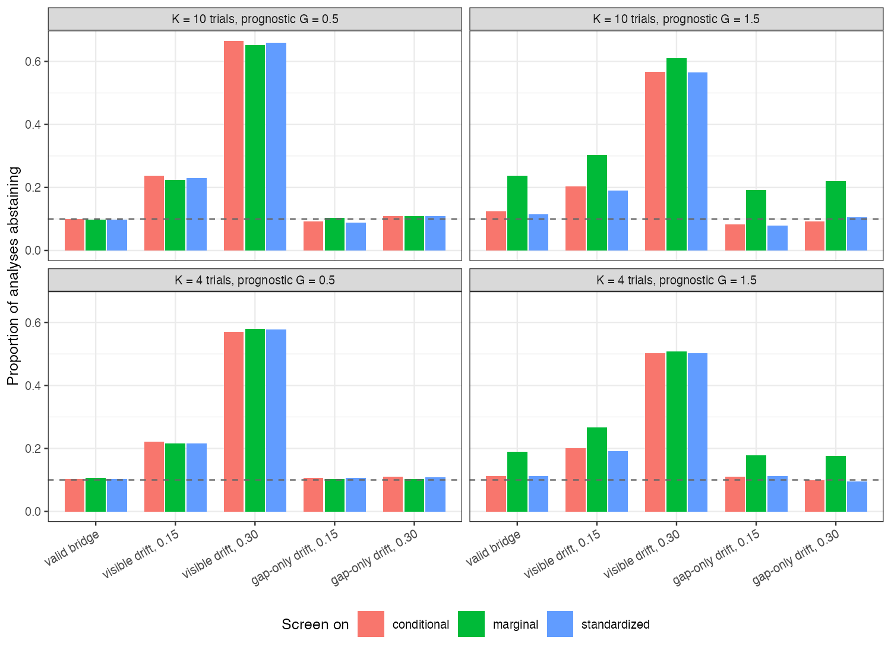

```{r setup}
s <- read.csv("../results/summary.csv")
f3 <- function(x) formatC(x, format = "f", digits = 3); f2 <- function(x) formatC(x, format = "f", digits = 2)
m <- s[s$ctrl == "none", ]
v <- m[m$drift == "none" & m$G == 1.5, ]
vis <- m[m$drift == "observed_and_gap", ]; go <- m[m$drift == "gap_only", ]
val <- m[m$drift == "none", ]
ctl <- function(k, col) s[s$ctrl == k, col]
```

# Abstract {.unnumbered}

**Background.** A bridging assumption carries an effect into a gap where no trial
exists. Checking the stability of effects across the trials that do exist can refute
the bridge but never confirm it. Catalog problem ADJ-09 asks how such a screen performs
and whether screening marginal effects creates false alarms through non-collapsibility.

**Methods.** Four or ten trials whose covariate laws and baseline risks differ, and a
gap environment beyond them. The conditional log odds ratio was constant (valid bridge),
drifted with an environment feature visibly across the trials and into the gap, or
drifted only in the gap. Cochran's $Q$ screen abstaining at $p < 0.10$, on marginal,
conditional or standardized log odds ratios: 20 scenarios and 3 controls, 1000
replicates each.

**Results.** Under a valid bridge with strong prognostic covariates the marginal screen
abstained in `r f3(min(v$abst_marg))` to `r f3(max(v$abst_marg))` of analyses against
`r f3(min(v$abst_cond))` to `r f3(max(v$abst_cond))` on the conditional scale; standardizing
first removed the excess. Drift visible across the trials that biased the gap estimate by
about 0.28 was flagged in only `r f3(min(vis$abst_cond[vis$size == 0.15]))` to
`r f3(max(vis$abst_cond[vis$size == 0.15]))` of analyses, and drift of twice that size in
`r f3(min(vis$abst_cond[vis$size == 0.3]))` to `r f3(max(vis$abst_cond[vis$size == 0.3]))`. Drift
confined to the gap was never flagged above the null rate. Among analyses that passed,
coverage in the gap was no better than among all analyses.

**Conclusion.** Run stability screens on conditional or standardized effects. Treat a
pass as uninformative about the gap and a failure as a prompt for sensitivity analysis:
with realistic numbers of trials the screen misses most drift it could in principle see.

# The problem {#sec-problem}

Invariance across the observed environments is a property of those environments. A
bridge can fail in the gap while every observed trial agrees, so a stability screen,
like invariant-prediction methods generally [@peters2016], can only refute. Whether a
failed screen predicts failure in the gap depends on whether the mechanism that varies
across trials is the one the bridge relies on. A second problem is a design artifact: on
the odds ratio scale the marginal effect varies with the covariate distribution and
baseline risk even when the conditional effect is constant, so a screen on marginal
effects fires wherever trial populations differ.

# Design {#sec-design}

Registered protocol: `protocol.md`; ADEMP structure [@morris2019]. Trial $k$ at
environment feature $z_k \in [-1, 1]$, 300 per arm, $x \sim N(0.6z_k, s_k^2)$ with
$s_k \in \{0.5, 1, 1.5\}$, baseline $\operatorname{logit}(0.3) + N(0, 0.3^2)$,
$\operatorname{logit}p = a_k + Gx + A\{-0.6 + \text{drift}(z_k)\}$. Gap at $z = 2$; estimand
the conditional log odds ratio there. Drift: none; linear in $z$ at 0.15 or 0.3 per unit;
or zero on $[-1, 1]$ and rising only beyond. Screen: Cochran's $Q$ [@cochran1954] across
trial estimates. The transported estimate is the pooled conditional log odds ratio.
Controls: identical trials; a linear risk model with constant risk difference, where the
marginal scale is collapsible; large visible drift.

# Results {#sec-results}

{#fig-abstain}

The non-collapsibility artifact was confirmed (@fig-abstain): with $G = 1.5$ the marginal
screen's false abstention exceeded the conditional one's by `r f3(min(v$abst_marg - v$abst_cond))`
to `r f3(max(v$abst_marg - v$abst_cond))`, growing with the number of trials. With $G = 0.5$
the scales agreed. On the collapsible risk-difference scale the marginal screen stayed
at `r f3(ctl("rd", "abst_marg"))`, and with identical trials every screen was near nominal.
The conditional screen itself ran slightly above nominal with strong prognosis
(up to `r f3(max(val$abst_cond))`).

Sensitivity to visible drift rose with its size and slightly with the number of trials
but stayed low: a pooled estimate biased by about 0.28 in the gap was reported without
abstention in about four of five analyses. Large drift (0.6 per unit, the positive control)
was flagged in `r f3(ctl("positive", "abst_cond"))` of analyses. Gap-only drift was
indistinguishable from a valid bridge, as it must be, while biasing the gap estimate by
up to `r f2(max(abs(go$bias)))`.

Screening did not improve the analyses that were reported: coverage among passed analyses
differed from coverage among all by at most
`r f3(max(abs(m$coverage_passed - m$coverage_all)))`.

# What this does not answer {#sec-limits}

One event-rate level, no measurement shift between trials, and Cochran's $Q$ rather than
a sign-stability rule or a formal invariance test. Environments were valid by construction;
in practice establishing that trials are exchangeable environments is the hard part. Peer
review has not been done.

# References {.unnumbered}
