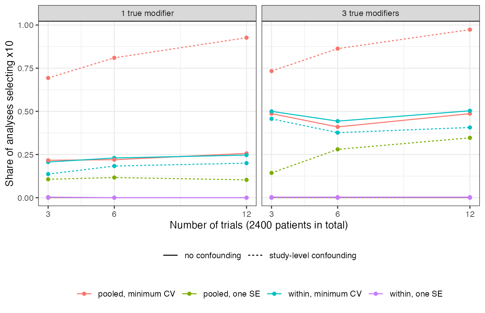

# Modifier discovery across trials: no penalty is both stable and
powerful, and study-level heterogeneity creates a false modifier that
more trials entrench
Ahmad Sofi-Mahmudi
2026-09-23

# Abstract

**Background.** Population adjustment needs the effect modifiers, and
data-driven discovery from pooled trial data is proposed when they are
unknown. Catalog problem ADJ-10 asks whether discovered sets are stable
and correct enough to use, and whether study-level factors create
modifiers that more data do not remove.

**Methods.** Three to twelve trials with 2400 patients in total, ten
candidate covariates whose means vary across trials, one or three true
modifiers, and an unmeasured study-level factor that shifts the
treatment effect and, when confounded, tracks one covariate’s trial
mean. Lasso on the interactions at the minimum-cross-validation penalty
and by the one-standard-error rule, pooled or with trial-specific
treatment effects; 300 replicates per cell, each with an independent
second dataset for stability.

**Results.** At the minimum-error penalty the true modifiers were found
in almost every analysis, together with 1.65 to 2.83 false modifiers
among seven null covariates, and the selected sets agreed across
independent datasets with Jaccard similarity 0.37 to 0.57. The
one-standard-error rule was stable only when it selected nothing: a
single modifier was found in 0.027 to 0.053 of analyses. With
study-level confounding, pooled discovery selected the confounded
covariate in 0.69 of analyses with 3 trials and 0.93 with 12;
trial-specific treatment effects held it to 0.14 to 0.46, the rate for
any null covariate.

**Conclusion.** Discovery is a hypothesis generator. Where effect
heterogeneity has a study-level cause, pooled discovery converts it into
a false modifier, and more trials at the same total size make that more
certain, not less.

# The problem

A covariate modifies the treatment effect within trials if patients who
differ in it respond differently. Across trials, a covariate whose trial
mean correlates with the trial’s treatment effect looks like a modifier
whatever the reason, the ecological bias that IPD meta-analysis guidance
separates by estimating interactions within trials
([1](#ref-riley2020)). A pooled analysis with one treatment effect uses
both sources. When a study-level factor such as a protocol difference
moves the treatment effect, every covariate whose trial means happen to
follow it becomes a candidate modifier.

# Design

Registered protocol: `protocol.md`. $K \in \{3, 6, 12\}$ trials of
$2400/K$ patients; covariates $x_j \sim N(m_{kj}, 1)$ with trial means
$m_{kj} \sim N(0, 0.5^2)$;
$y = 0.3\sum_j x_j + A(-0.5 + 0.2\sum_{j \le M} x_j + cS_k) + e$,
$e \sim N(0, 1)$, with an unmeasured $S_k \sim N(0, 1)$. With
confounding ($c = 0.3$), $m_{k,10} = 0.7S_k + N(0, 0.3^2)$. Lasso
([2](#ref-tibshirani1996)) penalizes only the ten interactions; the
pooled model has one treatment effect, the within-trial model one per
trial. Both penalties come from one cross-validated fit. The target
effect at covariate means 0.5 and $S = 0$ is refitted by least squares
with the selected interactions.

# Results

Figure 1: Share of analyses selecting the confounded covariate $x_{10}$.
Dashed: no confounding, where $x_{10}$ is an ordinary null covariate.

Table 1: Ranges over the number of trials (and modifiers where not
stated); 300 replicates per cell. Power is the share of true modifiers
selected; the false-modifier count excludes $x_{10}$.

| analysis | power | false modifiers (of 7) | stability | target bias |
|----|---:|---:|---:|---:|
| pooled, minimum CV, no confounding | 1.00 to 1.00 | 1.65 to 2.83 | 0.37 to 0.57 | -0.001 to 0.005 |
| pooled, minimum CV, confounding | 0.99 to 1.00 | 3.56 to 3.87 | 0.41 to 0.68 | 0.023 to 0.057 |
| within-trial, minimum CV, confounding | 0.99 to 1.00 | 1.55 to 2.76 | 0.40 to 0.58 | -0.010 to 0.008 |
| one SE rule, one modifier, no confounding | 0.027 to 0.053 | 0.00 to 0.01 | 0.90 to 0.95 | -0.095 to -0.089 |
| one SE rule, three modifiers, no confounding | 0.37 to 0.59 | 0.00 to 0.02 | 0.39 to 0.42 | -0.178 to -0.109 |

The registered condition for usability, stability of at least 0.8 with
at most 0.5 false modifiers in every cell, failed for every method
(<a href="#tbl-main" class="quarto-xref">Table 1</a>). The minimum-error
penalty traded stability for power; the one-standard-error rule’s high
stability with a single modifier was agreement on the empty set, and its
target estimate was biased toward no modification.

Study-level confounding affected pooled discovery in two ways
(<a href="#fig-x10" class="quarto-xref">Figure 1</a>). It selected
$x_{10}$ more often as trials were added at the same total size, because
more trials give more trial means with which to fit the study-level
pattern. And it raised the false modifiers among the other null
covariates from 1.65 to 2.83 to 3.56 to 3.87, because their trial means
correlate with $S_k$ by chance. Trial-specific treatment effects
absorbed $S_k$ and removed both effects. The pooled minimum-error target
estimate was biased by 0.023 to 0.057, the spurious interaction times
the target mean.

# What this does not answer

Lasso only; multi-study causal forests and other flexible learners were
not run. Continuous outcome, so event sparsity is absent; linear
modification; one overlap level. The within-trial analysis needs the IPD
of every trial. Selected sets are evaluated as hypotheses;
post-selection inference for the target is DEC-11’s and COV-04’s
subject. Peer review has not been done.

# References

1.
Richard D. Riley, Thomas P. A.
Debray, David Fisher, Miriam Hattle, Nadine Marlin, Jeroen Hoogland,
François Gueyffier, Jan A. Staessen, Jiguang Wang, Karel G. M. Moons,
Johannes B. Reitsma, Joie Ensor. Individual participant data
meta-analysis to examine interactions between treatment effect and
participant-level covariates: Statistical recommendations for conduct
and planning. Statistics in Medicine. 2020;39(15):2115–37.
doi:[10.1002/sim.8516](https://doi.org/10.1002/sim.8516)

2.
Robert Tibshirani. Regression
shrinkage and selection via the lasso. Journal of the Royal Statistical
Society Series B. 1996;58(1):267–88.
doi:[10.1111/j.2517-6161.1996.tb02080.x](https://doi.org/10.1111/j.2517-6161.1996.tb02080.x)

