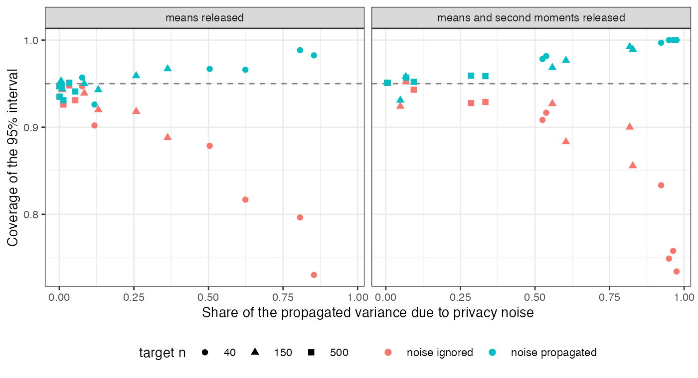

# Differentially private target moments in MAIC: the noise variance is
known, so add it
Ahmad Sofi-Mahmudi
2026-09-23

# Abstract

**Background.** A target trial may release its covariate moments under
differential privacy, adding Laplace noise whose variance the data
holder knows exactly. Catalog problem ADJ-15 asks whether MAIC to noisy
moments needs that noise propagated, and whether releasing more moments
is worth its share of the privacy budget.

**Methods.** MAIC of a source trial (200 per arm) to a target of 40, 150
or 500 patients releasing means, or means and second moments, at budgets
$\varepsilon \in \{0.5, 1, 4\}$ or without privacy; linear or quadratic
effect modification; 48 scenarios, 1000 replicates each. Intervals
ignored the noise or added $\hat g^\top\Sigma_{\text{noise}}\hat g$.

**Results.** At budgets of at least 1 and targets of at least 150,
ignoring the noise gave coverage as low as 0.883; at 40 patients it fell
to 0.730. The noise share of the variance ranged from under 0.01 to
0.975. Adding the known noise variance restored coverage to at least
0.926 in every private scenario, conservatively where noise dominated.
Releasing second moments at small targets and budgets left no feasible
weights in up to 0.872 of replicates, because noisy second moments fell
below the squared means or outside the source data.

**Conclusion.** The noise is not negligible at usable budgets for
trial-sized targets. Its variance is a published number, so the
correction costs nothing and should always be applied. Extra moments pay
only at larger budgets or targets.

# The problem

The Laplace mechanism releases a statistic with sensitivity $\Delta$
plus noise of scale $\Delta/\varepsilon$ and variance
$2(\Delta/\varepsilon)^2$ ([1](#ref-dwork2006)). For a mean over $n_T$
patients of a covariate clipped to a range of 6, $\Delta = 6/n_T$, so
the noise variance scales as $1/(n_T\varepsilon)^2$ while the sampling
variance of the moment scales as $1/n_T$. MAIC
([2](#ref-signorovitch2010)) weights the source to the released moments,
so the estimate moves with the noise by the gradient
$g = \partial\hat\Delta/\partial m$. Unlike other moment uncertainty in
population adjustment, $\Sigma_{\text{noise}}$ needs no estimation.

# Design

Registered protocol: `protocol.md`; ADEMP structure
([3](#ref-morris2019)). Source A versus C, two covariates clipped to
$[-3, 3]$; $y = 0.5\sum x_j + A(-0.4 + 0.4x_1 + \beta_2x_1^2) + e$,
$\beta_2 \in \{0, 0.3\}$. Target covariates $N(0.5, 0.8^2)$. With second
moments released the budget is split equally over four statistics
(sensitivity $9/n_T$ for the second moments). Truth: the effect at the
target trial’s own non-private moments. $\hat g$ by central differences.
Replicates whose noisy moments admitted no weights are counted as
infeasible and excluded from coverage.

# Results

Figure 1: Coverage of the noise-ignoring and noise-propagating intervals
against the share of the propagated variance due to privacy noise. Each
point is a scenario.

Coverage of the noise-ignoring interval fell as the noise share grew,
and the propagated interval held nominal or above
(<a href="#fig-cov" class="quarto-xref">Figure 1</a>). The refuting
sentence fails: at $n_T = 150$, $\varepsilon = 1$, means only, the noise
was 0.084 to 0.131 of the variance and coverage ignoring it was 0.939
(linear) and 0.920 (quadratic); with second moments also released it was
0.883. At $n_T = 500$ or $\varepsilon = 4$ the noise was a few percent
of the variance and could be ignored.

The propagated interval over-covered where noise dominated (up to 1.000
at $n_T = 40$). Two causes contribute: the replicates with the most
extreme noise were infeasible and dropped, and a linearization
overstates the movement of an estimate that cannot leave the range of
the source data.

Releasing second moments halves each statistic’s budget. It paid under
quadratic modification when the budget was large (RMSE 0.171 against
0.229 at $n_T = 150$, $\varepsilon = 4$), and cost accuracy and
feasibility when it was small (infeasible in 0.480 of replicates at
$n_T = 150$, $\varepsilon = 0.5$). Without privacy the three analyses
coincided (coverage 0.929 to 0.952).

# What this does not answer

Laplace mechanism only; the Gaussian mechanism, released correlations
and overlap levels were not varied. Performance is conditional on
feasible weights, so at small budgets with second moments released it
describes a minority of replicates. The choice of budget itself, a
governance question, is outside the study. Peer review has not been
done.

# References

1.
Cynthia Dwork, Frank McSherry,
Kobbi Nissim, Adam Smith. Calibrating noise to sensitivity in private
data analysis. In: Theory of cryptography conference. 2006. p. 265–84.
(Lecture notes in computer science).
doi:[10.1007/11681878_14](https://doi.org/10.1007/11681878_14)

2.
James E. Signorovitch, Eric Q. Wu,
Andrew P. Yu, Charles M. Gerrits, Evan Kantor, Yanjun Bao, Shiraz R.
Gupta, Parvez M. Mulani. Comparative effectiveness without head-to-head
trials: A method for matching-adjusted indirect comparisons applied to
psoriasis treatment with adalimumab or etanercept. PharmacoEconomics.
2010;28(10):935–45.
doi:[10.2165/11538370-000000000-00000](https://doi.org/10.2165/11538370-000000000-00000)

3.
Tim P. Morris, Ian R. White,
Michael J. Crowther. Using simulation studies to evaluate statistical
methods. Statistics in Medicine. 2019;38(11):2074–102.
doi:[10.1002/sim.8086](https://doi.org/10.1002/sim.8086)

