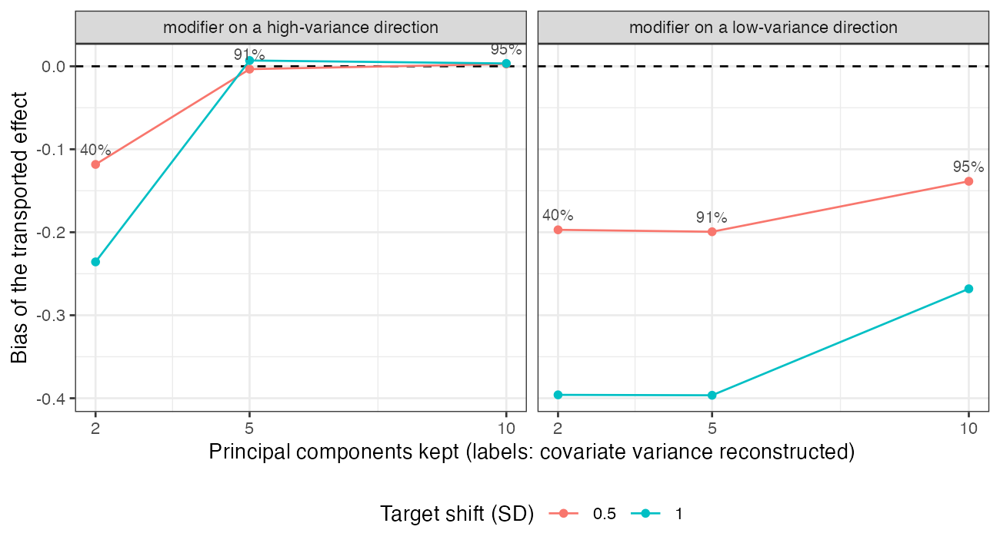

# An encoding that reconstructs 91% of the covariates’ variance dropped
the effect modifier entirely
Ahmad Sofi-Mahmudi
2026-09-23

# Abstract

**Background.** Learned covariate representations are proposed for
harmonizing populations before an indirect comparison. An encoding
trained to reconstruct the covariates keeps the directions of largest
variance. Catalog problem ADJ-17 asks whether a reconstruction check can
certify that the encoding kept what transport needs.

**Methods.** Twenty covariates with five high-variance and fifteen
low-variance directions; the treatment effect modified along one
direction; outcome-regression transport (STC) on 2, 5 or 10 principal
components, on all covariates, or on a declared modifier score; targets
shifted 0.5 or 1 SD along the modifier; 1000 replicates per cell.

**Results.** With the modifier on a low-variance direction, five
components reconstructed 91% of the covariate variance and the
transported effect was biased by -0.199 (coverage 0.488) at a 0.5 SD
shift and -0.396 at 1 SD: the whole modification was lost. Ten
components (95% reconstructed) still lost most of it. The full covariate
set and a declared modifier score were unbiased with nominal coverage in
every cell.

**Conclusion.** Reconstruction quality does not certify transport. An
encoding must be checked for preserving the treatment-by-covariate
interaction, and a declared mapping that names the modifier is the
baseline it has to beat.

# The problem

Transport needs the conditional treatment effect to be expressible in
the variables the adjustment uses ([1](#ref-signorovitch2010)). A
reconstruction objective ranks directions by covariate variance, which
is unrelated to whether a direction modifies the treatment effect. A
modifier on a low-variance direction is exactly what such an encoding
drops first, while its reconstruction error stays small.

# Design

Registered protocol: `protocol.md`. $x \sim N(0, \Sigma)$ in 20
dimensions, $\Sigma$ with five eigenvalues of 3 and fifteen of 0.1 under
a fixed rotation. $y = x'b + a(-0.5 + 0.4s) + e$, $s$ the standardized
score along one eigenvector (the first, high variance, or the twelfth,
low variance), 300 per arm. Target shifted along that eigenvector by 0.5
or 1 SD and along an unrelated high-variance direction by 0.5 SD.
Estimand $-0.5 + 0.4 \times$ shift. Each method is linear STC with
treatment interactions, standardized at the target means.

# Results

Figure 1: Bias of STC on principal components by number kept. Labels:
covariate variance reconstructed.

Table 1: 1000 replicates per cell; bias MCSE at most 0.013.

| modifier direction | components | shift | principal components: bias (coverage) | all covariates | declared score |
|----|---:|---:|----|----|----|
| high | 2 | 0.5 | -0.118 (0.718) | -0.000 (0.953) | -0.002 (0.947) |
| low | 2 | 0.5 | -0.197 (0.462) | -0.001 (0.951) | 0.000 (0.946) |
| high | 5 | 0.5 | -0.003 (0.931) | -0.002 (0.937) | -0.005 (0.937) |
| low | 5 | 0.5 | -0.199 (0.488) | 0.004 (0.947) | 0.001 (0.954) |
| high | 10 | 0.5 | 0.003 (0.945) | 0.004 (0.950) | 0.005 (0.953) |
| low | 10 | 0.5 | -0.139 (0.706) | -0.007 (0.945) | -0.007 (0.950) |
| high | 2 | 1.0 | -0.236 (0.419) | 0.001 (0.945) | 0.002 (0.948) |
| low | 2 | 1.0 | -0.396 (0.018) | -0.002 (0.948) | -0.001 (0.952) |
| high | 5 | 1.0 | 0.007 (0.955) | 0.008 (0.954) | 0.008 (0.961) |
| low | 5 | 1.0 | -0.396 (0.017) | 0.002 (0.954) | 0.002 (0.958) |
| high | 10 | 1.0 | 0.003 (0.956) | 0.003 (0.965) | 0.004 (0.957) |
| low | 10 | 1.0 | -0.268 (0.336) | -0.002 (0.954) | -0.002 (0.950) |

The registered primary was confirmed
(<a href="#fig-bias" class="quarto-xref">Figure 1</a>,
<a href="#tbl-main" class="quarto-xref">Table 1</a>). A low-variance
modifier was lost by every encoding that stopped short of its direction,
however much variance the encoding reconstructed: at five components the
bias equaled the whole modification ($-0.4 \times$ shift). A
high-variance modifier was kept once the encoding spanned the
high-variance subspace (five components); with two components it was
partly lost even though it lay on a leading direction, because the five
high-variance directions had equal variance and the leading two
components were an arbitrary rotation within them. The encoding’s
reconstruction error gave no signal in either case.

# What this does not answer

Principal components as the only encoder; no treatment-effect-preserving
objective, nonlinear encoder, nonlinear heterogeneity or measurement
shift between populations; continuous outcome and linear STC. Peer
review has not been done.

# References

1.
James E. Signorovitch, Eric Q. Wu,
Andrew P. Yu, Charles M. Gerrits, Evan Kantor, Yanjun Bao, Shiraz R.
Gupta, Parvez M. Mulani. Comparative effectiveness without head-to-head
trials: A method for matching-adjusted indirect comparisons applied to
psoriasis treatment with adalimumab or etanercept. PharmacoEconomics.
2010;28(10):935–45.
doi:[10.2165/11538370-000000000-00000](https://doi.org/10.2165/11538370-000000000-00000)

