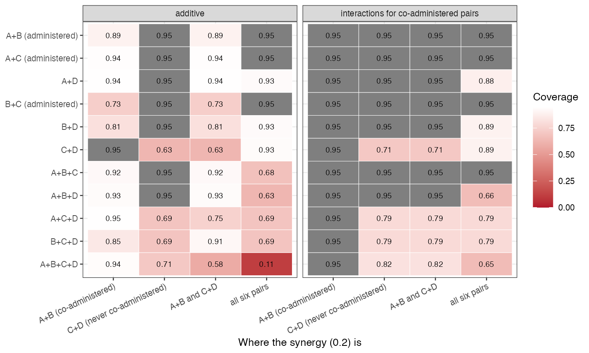

# An omitted component interaction biases never-administered regimens
and leaks into regimens that do not contain it
Ahmad Sofi-Mahmudi
2026-09-23

# Abstract

**Background.** Additive component network meta-analysis
([1](#ref-rucker2020cnma)) makes any combination of observed components
estimable, including regimens no trial administered, and prints them
like randomized ones. Catalog problem CMP-03 asks whether the
interactions additivity omits are small enough for that to be harmless.

**Methods.** An exact calculation on an eight-trial network of four
components with three co-administered and three never co-administered
pairs; synergy of 0.1 to 0.3 on one pair, on two, or spread over all
six; additive and prespecified-interaction models; bias and coverage of
every regimen.

**Results.** At synergy 0.2, 15 of 32 never-administered regimen results
had 95% coverage below 0.90, down to 0.111. Synergy on a never
co-administered pair (C+D) passed entirely into the regimens containing
it (coverage 0.628) and was invisible elsewhere. Synergy on a
co-administered pair (A+B) was absorbed into the component estimates and
leaked into regimens without it: B+C, administered, and B+D, never
administered, were each biased by -0.125. Modeling interactions for the
co-administered pairs removed the leakage and could not touch C+D. The
share of a regimen’s pairs never co-administered did not predict which
de novo estimates failed (AUROC 0.369).

**Conclusion.** An estimable never-administered regimen is a model
extrapolation. Its estimate should be flagged as such, interactions for
co-administered pairs should be modeled where the network allows, and a
bound over plausible synergy for the pairs never co-administered should
accompany it.

# The problem

Under additivity a regimen’s effect is the sum of its components’
effects, and the sum is estimable whenever each component appears
somewhere. No trial needs to have given the combination. If two
components interact, the additive estimate of any regimen containing
both misses the interaction; if the interacting pair was co-administered
somewhere, the least-squares fit spreads the misfit over the component
effects, so regimens that do not contain the pair are biased too.

# Design

Registered protocol: `protocol.md`. Components A, B, C, D (effects
$-0.3, -0.2, -0.25,
-0.15$ against placebo); trials P-A, P-B, P-C, P-D, A vs A+B, B vs B+C,
C vs A+C and P vs A+B, each contrast with variance 0.01. Synergy (same
sign as the effects) of 0.1, 0.2 or 0.3 on A+B, on C+D, on both, or half
that on all six pairs. The additive model and the model with interaction
terms for A+B, B+C and A+C were fitted by generalized least squares;
bias, SD and coverage are exact.

# Results

Figure 1: Coverage of each regimen’s 95% interval at synergy 0.2.

The registered primary was confirmed
(<a href="#fig-coverage" class="quarto-xref">Figure 1</a>). The additive
model reported every regimen as estimable, and three patterns followed
from where the synergy sat. **On a never co-administered pair** the
whole interaction went into the regimens containing the pair: C+D,
A+C+D, B+C+D and A+B+C+D were biased by 0.2 with coverage 0.628 to
0.707, while every other regimen was exact. The data carry no
information about this interaction, so no model fitted to them can
detect or correct it. **On a co-administered pair** the fit absorbed the
interaction into the component effects: A+B itself was underestimated in
magnitude (bias 0.050), and regimens sharing a component but not the
pair were biased by -0.125 (B+C, administered, coverage 0.733) and
-0.125 (B+D, never administered, coverage 0.813). Modeling the three
co-administered pairs’ interactions made every estimate unbiased in that
scenario, at the price of wider intervals. **Spread over all pairs**,
the four-component regimen covered 0.111.

The provenance share $\rho$, the fraction of a regimen’s pairs never
co-administered, was not a useful flag: it assigns B+D and C+D the same
value, but only one of them contains the synergy, and it gives A+B+C,
assembled from co-administered pairs but never administered as a triple,
a value of zero while leakage biased it.

# What this does not answer

A single connected network with a continuous outcome and a fixed-effect
model; no disconnection or subnetwork drift, no covariate adjustment
layer, no heredity-constrained or data-driven selection, and no formal
bound over omitted synergy. Peer review has not been done.

# References

1.
Gerta Rücker, Maria Petropoulou,
Guido Schwarzer. Network meta-analysis of multicomponent interventions.
Biometrical Journal. 2020;62(3):808–21.
doi:[10.1002/bimj.201800167](https://doi.org/10.1002/bimj.201800167)

