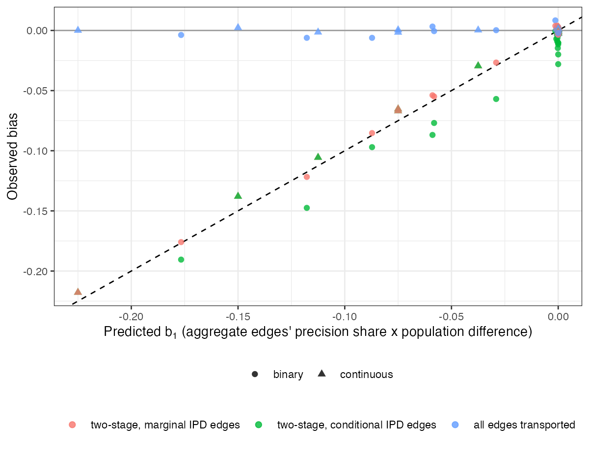

# Pooling standardized and unstandardized edges biases a component
effect by exactly the untransported edges’ share of the population
difference
Ahmad Sofi-Mahmudi
2026-09-23

# Abstract

**Background.** Two-stage component MAIC and STC standardize the
individual-data edges to the target and pool them with aggregate edges
left in their own populations. Catalog problem CMP-11 asks how large the
resulting population mixture is and whether the two-stage route is still
the better practical choice.

**Methods.** Eight trials estimating one component’s effect, a quarter
to three quarters with individual data; aggregate trials 0 to 1 SD from
the target; effect modification 0 or 0.3; continuous or binary outcome;
two-stage pooling with marginal or conditional individual-data edges
against transporting every edge to the target; 1000 replicates per cell.

**Results.** The two-stage bias matched its predicted form, the
aggregate edges’ share of the pooled precision times the difference
between their own-population and target effects (slope 0.967, $R^2$
0.997), and was zero whenever modification or separation was zero. At a
separation of 0.5 SD it reached -0.106 with coverage 0.265; transporting
every edge removed it and had lower RMSE in every such cell (0.038 to
0.089 against 0.047 to 0.113). Pooling conditional rather than marginal
individual-data edges added up to 0.033 on the log odds ratio scale.

**Conclusion.** The two-stage estimate has no single population referent
and its bias does not shrink with sample size. Where the aggregate
trials’ covariate laws are known well enough to transport them, doing so
is better even after paying for the extra variance.

# The problem

Under linear modification an edge’s effect in population $F$ is
$\delta + \beta\bar x_F$. MAIC-type standardization
([1](#ref-signorovitch2010)) moves the individual-data edges to the
target; the aggregate edges stay at their own means. The pooled
component effect is then biased by
$b_1 = \beta\sum_{e\notin\mathcal I} w_e(\bar x_{S_e} - \bar x_T)$, and
component STC adds a second term, $b_2$, from pooling conditional
coefficients with marginal aggregate effects on a non-collapsible scale.

# Design

Registered protocol: `protocol.md`. Eight trials, 200 per arm;
individual-data trials at covariate mean $0.5 - s/2$ and aggregate
trials at $0.5 - s$, target 0.5; $s \in \{0, 0.5, 1\}$; outcome
$0.5x + a(-0.3 + \beta x)$ on the identity or logit scale.
Individual-data edges were fitted with the treatment interaction and
standardized to the target by G-computation (marginal) or evaluated at
the target mean (conditional). The transported arm shifted every
aggregate edge by the effect difference implied by the pooled
individual-data interaction, adding the shift’s variance once and
ignoring its covariance with the individual-data edges; the aggregate
trials’ covariate laws were known exactly, which makes this arm
optimistic.

# Results

Figure 1: Observed bias against the predicted $b_1$ in all 36 cells.
Dashed: equality.

Table 1: Effect modification 0.3; with no modification every method was
unbiased. 1000 replicates per cell; bias MCSE at most 0.005.

| scale | IPD share | separation | two-stage marginal: bias (coverage) | two-stage conditional | transported | RMSE two-stage / transported |
|----|---:|---:|----|----|----|----|
| continuous | 0.25 | 0.0 | 0.001 (0.944) | 0.001 (0.944) | 0.001 (0.944) | 0.040 / 0.040 |
| binary | 0.25 | 0.0 | -0.004 (0.957) | -0.012 (0.954) | -0.004 (0.957) | 0.067 / 0.067 |
| continuous | 0.50 | 0.0 | 0.001 (0.946) | 0.001 (0.946) | 0.001 (0.946) | 0.039 / 0.039 |
| binary | 0.50 | 0.0 | -0.003 (0.939) | -0.020 (0.931) | -0.003 (0.939) | 0.072 / 0.072 |
| continuous | 0.75 | 0.0 | -0.001 (0.946) | -0.001 (0.946) | -0.001 (0.946) | 0.037 / 0.037 |
| binary | 0.75 | 0.0 | -0.002 (0.948) | -0.028 (0.928) | -0.002 (0.948) | 0.070 / 0.070 |
| continuous | 0.25 | 0.5 | -0.106 (0.265) | -0.106 (0.265) | -0.001 (0.940) | 0.113 / 0.050 |
| binary | 0.25 | 0.5 | -0.085 (0.783) | -0.097 (0.743) | -0.006 (0.940) | 0.112 / 0.089 |
| continuous | 0.50 | 0.5 | -0.065 (0.625) | -0.065 (0.625) | -0.002 (0.934) | 0.076 / 0.042 |
| binary | 0.50 | 0.5 | -0.055 (0.878) | -0.077 (0.830) | -0.001 (0.952) | 0.090 / 0.077 |
| continuous | 0.75 | 0.5 | -0.029 (0.888) | -0.029 (0.888) | 0.000 (0.945) | 0.047 / 0.038 |
| binary | 0.75 | 0.5 | -0.027 (0.935) | -0.057 (0.877) | 0.000 (0.944) | 0.078 / 0.075 |
| continuous | 0.25 | 1.0 | -0.218 (0.001) | -0.218 (0.001) | 0.000 (0.906) | 0.222 / 0.074 |
| binary | 0.25 | 1.0 | -0.176 (0.382) | -0.191 (0.332) | -0.004 (0.911) | 0.194 / 0.136 |
| continuous | 0.50 | 1.0 | -0.138 (0.079) | -0.138 (0.079) | 0.002 (0.925) | 0.144 / 0.053 |
| binary | 0.50 | 1.0 | -0.122 (0.665) | -0.147 (0.557) | -0.006 (0.940) | 0.142 / 0.091 |
| continuous | 0.75 | 1.0 | -0.067 (0.639) | -0.067 (0.639) | 0.000 (0.931) | 0.078 / 0.044 |
| binary | 0.75 | 1.0 | -0.054 (0.895) | -0.087 (0.819) | 0.003 (0.936) | 0.094 / 0.085 |

The refuting sentence failed
(<a href="#tbl-main" class="quarto-xref">Table 1</a>): at 0.5 SD
separation the transported arm had the lower RMSE in all six cells, and
at 1 SD the two-stage estimates missed the target by more than their own
effect when a quarter of the edges had individual data. The bias tracked
$b_1$ closely (<a href="#fig-b1" class="quarto-xref">Figure 1</a>).
$b_2$ was zero on the continuous scale, as required, and negative on the
log odds ratio scale, growing with the individual-data share because
more conditional coefficients entered the pool. The transported arm’s
coverage was 0.90 to 0.96, lowest at the largest separation with few
individual-data edges, where its variance approximation is weakest.

# What this does not answer

Eight trials of one component rather than a component network; no
one-stage component ML-NMR fit; aggregate covariate laws known exactly;
one network size. Peer review has not been done.

# References

1.
James E. Signorovitch, Eric Q. Wu,
Andrew P. Yu, Charles M. Gerrits, Evan Kantor, Yanjun Bao, Shiraz R.
Gupta, Parvez M. Mulani. Comparative effectiveness without head-to-head
trials: A method for matching-adjusted indirect comparisons applied to
psoriasis treatment with adalimumab or etanercept. PharmacoEconomics.
2010;28(10):935–45.
doi:[10.2165/11538370-000000000-00000](https://doi.org/10.2165/11538370-000000000-00000)

