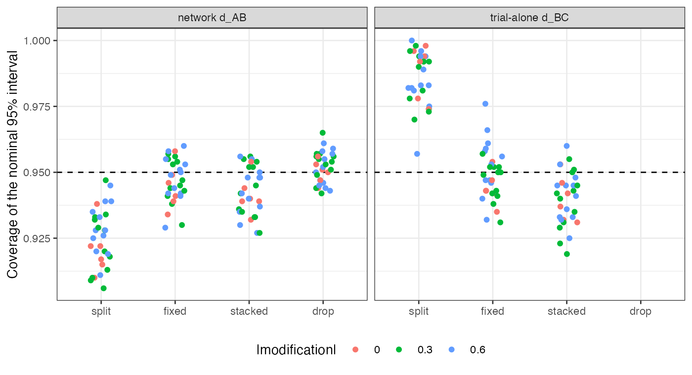

```{r setup}
s <- read.csv("../results/summary.csv"); cv <- read.csv("../results/covariance.csv")
f3 <- function(x) formatC(x, format = "f", digits = 3)
bc <- s[s$contrast == "BC" & s$method == "split_trial", ]
ab_sp <- s[s$contrast == "AB" & s$method == "split", ]; ab_st <- s[s$contrast == "AB" & s$method == "stacked", ]
m <- merge(ab_sp, ab_st, by = "cell")
term2 <- (cv$stacked_trial - cv$fixed_trial) / cv$cov_mc
dr <- merge(s[s$method == "drop" & s$contrast == "AB", c("cell", "width")], ab_st[, c("cell", "width")], by = "cell")
wr <- dr$width.x / dr$width.y
```

# Abstract {.unnumbered}

**Background.** When a three-arm trial's contrasts are population-adjusted, they share
an arm and a weight vector, so their estimates are correlated. Catalog problem CMP-12
asks what is lost when they are treated as independent, as splitting the trial into
pairwise comparisons does, and its design predicted that the error could have either
sign depending on how the arms' effect modification aligns.

**Methods.** A three-arm individual-data trial (A, B, C) weighted by MAIC to a target,
with two aggregate trials (A versus C, B versus C) in the target. Thirty scenarios
crossed effect-modification strength, its alignment across arms, target shift and
the shared arm's size, 1000 replicates each. The pair $(\hat d_{AB}, \hat d_{AC})$ was
given zero covariance (split), a joint sandwich with fixed weights, or a stacked
sandwich over weights and arm means; networks were fitted by generalized least
squares; dropping the trial was the fourth option.

**Results.** Ignoring the covariance made the trial's own $d_{BC}$ interval conservative
in every scenario (coverage `r f3(min(bc$coverage))` to `r f3(max(bc$coverage))`) and the
network $d_{AB}$ interval anticonservative (coverage below nominal beyond Monte Carlo
error in `r sum(ab_sp$coverage + 3 * ab_sp$cov_mcse < 0.95)` of 30 scenarios, against
`r sum(ab_st$coverage + 3 * ab_st$cov_mcse < 0.95)` for the stacked sandwich). The
shared-weighting part of the covariance took both signs, `r round(100 * min(term2))`% to
`r round(100 * max(term2))`% of the total, but never changed which way a contrast erred.
Dropping the trial widened the network interval by `r round(100 * (min(wr) - 1))`% to
`r round(100 * (max(wr) - 1))`%.

**Conclusion.** The sign of the error from ignoring within-trial covariance is set by the
contrast, not by effect-modification alignment: a difference of the two contrasts
gains, a network contrast that borrows through them loses. A joint sandwich is enough;
dropping the trial is unbiased but costs precision a decision would notice.

# The problem {#sec-problem}

For a trial with arms A, B, C adjusted with one weight vector,
$\mathrm{Cov}(\hat d_{AB}, \hat d_{AC})$ has a shared-arm term, $\mathrm{Var}(\hat\mu_A) > 0$,
and a term from estimating the shared weights. For the within-trial
$d_{BC} = d_{AC} - d_{AB}$, the variance is
$\mathrm{Var}(\hat d_{AB}) + \mathrm{Var}(\hat d_{AC}) - 2\mathrm{Cov}$, so a positive
covariance set to zero overstates it. In a network, the same pair is combined with
other evidence by generalized least squares; treating the pair as independent counts
arm A twice and gives the trial too much weight, which understates the variance of
contrasts that borrow through it. DESIGN.md predicted instead that the error's sign
depends on the alignment of the arms' effect modification, through the weighting term.

# Design {#sec-design}

Registered protocol: `protocol.md`. Source $x \sim N(0,1)$, 200 per arm in B and C and
$200r$ in A; $y = 0.5x + d_t + \beta_t x + e$ with $d = (0, -0.3, -0.5)$ and $\beta_A = 0$;
MAIC with one weight vector to $x \sim N(s, 1)$. Aggregate A-versus-C and B-versus-C
trials of 200 per arm run in the target. Factors: $\lvert\beta\rvert \in \{0, 0.3, 0.6\}$
for B and C; alignment $\beta_C = \pm\beta_B$; $s \in \{0.3, 0.8\}$; $r \in \{0.5, 1, 2\}$.
Truths in closed form. The Monte Carlo covariance of the trial's pair is the
reference for each method's estimated covariance.

# Results {#sec-results}

{#fig-cov}

**The within-trial difference.** With the covariance set to zero, the trial's $d_{BC}$
interval covered in `r f3(min(bc$coverage))` to `r f3(max(bc$coverage))`, above nominal
beyond three Monte Carlo standard errors in 29 of 30 scenarios and below it in none
(@fig-cov). The registered sign test, which required overcoverage in some scenarios and
undercoverage in others, therefore withdraws DESIGN.md's prediction.

**The network contrast.** In the network, $d_{AB}$ is estimated from the trial's pair and
from the aggregate trials together. Splitting lowered its coverage by
`r f3(-max(m$coverage.x - m$coverage.y))` to `r f3(-min(m$coverage.x - m$coverage.y))`
relative to the stacked sandwich, taking it below nominal beyond Monte Carlo error in
`r sum(ab_sp$coverage + 3 * ab_sp$cov_mcse < 0.95)` scenarios.

**The weighting term.** Stacked minus fixed-weight covariance was
`r round(100 * min(term2))`% to `r round(100 * max(term2))`% of the Monte Carlo covariance,
positive in some scenarios and negative in others, as DESIGN.md said. It was dominated by
the shared-arm term, so it never reversed a contrast's direction of error. Both joint
sandwiches recovered `r f3(min(cv$stacked_trial / cv$cov_mc))` to
`r f3(max(cv$stacked_trial / cv$cov_mc))` (stacked) of the Monte Carlo covariance, and
the stacked trial-alone intervals undercovered slightly (0.919 to 0.960), the usual
small-sample shortfall of a sandwich with estimated weights.

**Dropping the trial** was unbiased and widened the network $d_{AB}$ interval by
`r round(100 * (min(wr) - 1))`% to `r round(100 * (max(wr) - 1))`% (median
`r round(100 * (stats::median(wr) - 1))`%), beyond the registered 10% materiality in every
scenario.

# What this does not answer {#sec-limits}

Continuous outcome and linear modification; one three-arm trial and a fixed two-trial
aggregate network; no four-arm trials, no one-stage ML-NMR comparator and no bootstrap,
whose whole-trial resampling the stacked sandwich approximates. The target moments are
treated as fixed. Peer review has not been done.

# References {.unnumbered}
