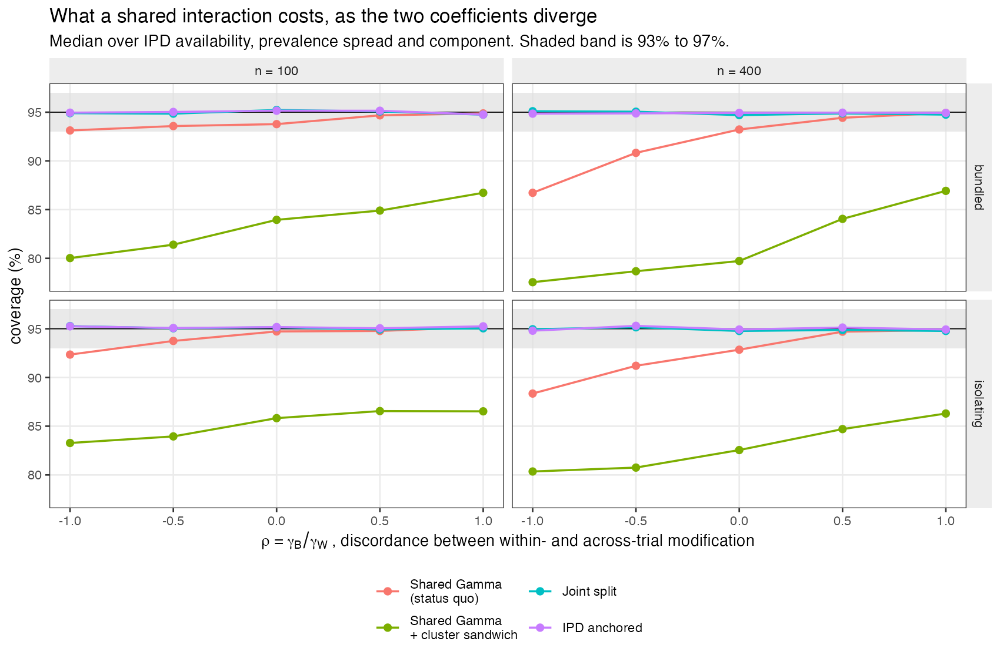
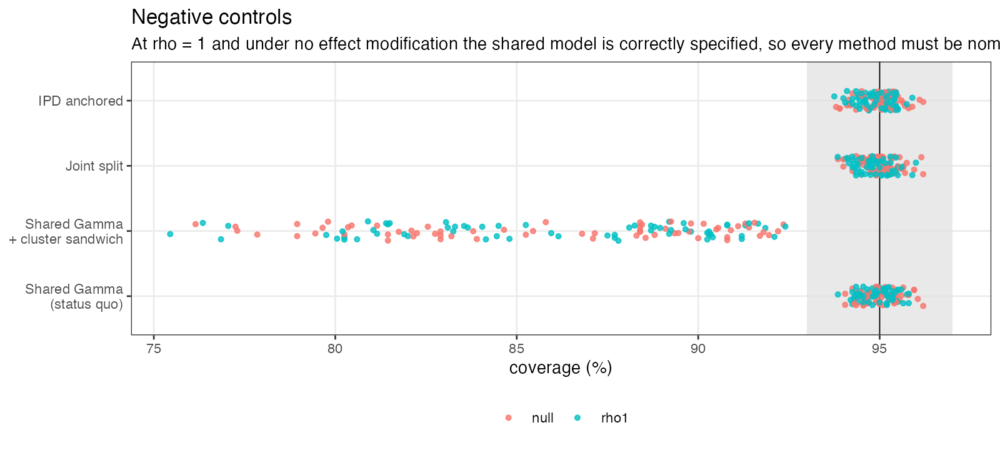
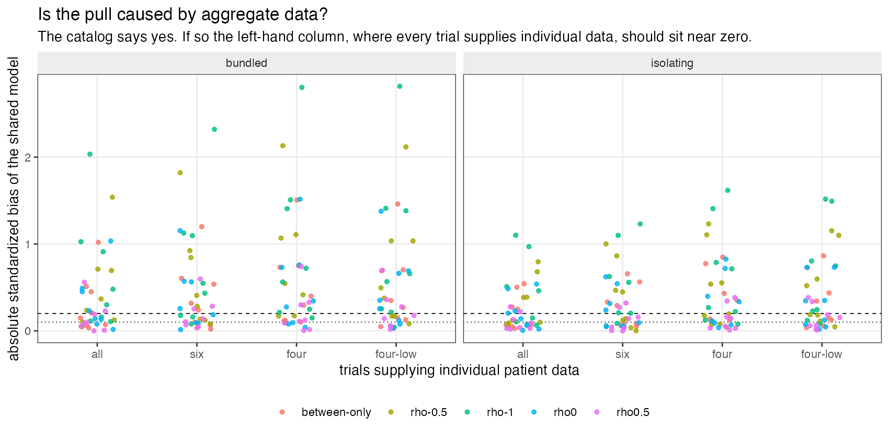
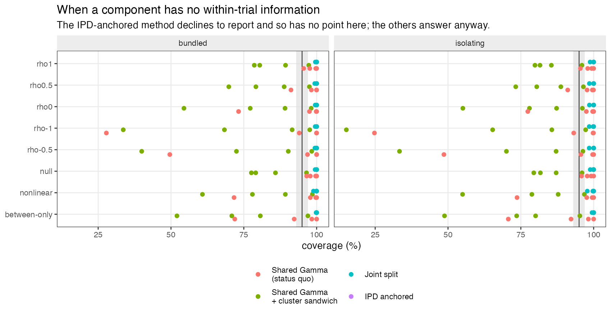

```{r setup}
S <- ".."
s <- read.csv(file.path(S, "results", "summary.csv"), stringsAsFactors = FALSE)
inband <- function(x) x >= 0.93 & x <= 0.97
f1 <- function(x, d = 3) formatC(x, format = "f", digits = d)
pct <- function(x, d = 1) paste0(formatC(100 * x, format = "f", digits = d), "%")

RHO <- c("rho-1", "rho-0.5", "rho0", "rho0.5", "rho1")
s$rho <- c(-1, -0.5, 0, 0.5, 1)[match(s$pattern, RHO)]
DISC <- c("rho0.5", "rho0", "rho-0.5", "rho-1", "between-only")

sh <- s[s$method == "shared-info", ]
sw <- s[s$method == "shared-sandwich", ]
sp <- s[s$method == "joint-split", ]
an <- s[s$method == "ipd-anchored", ]

rng <- function(d, pat = NULL) {
  x <- if (is.null(pat)) d else d[d$pattern %in% pat, ]
  sprintf("%s to %s", f1(min(x$coverage, na.rm = TRUE)), f1(max(x$coverage, na.rm = TRUE)))
}
n_scen <- length(unique(s$scenario))
allipd_sb <- abs(sh$std_bias[sh$ipd == "all" & sh$pattern %in% DISC])
```

# The problem {#sec-problem}

Component network meta-analysis decomposes multicomponent interventions into the parts they
share, so that a network which is disconnected at the level of whole treatments can be
reconnected through common components [@rucker2020]. Multilevel network meta-regression
(ML-NMR) synthesizes individual and aggregate data by specifying a model at the individual
level and integrating it over each study's covariate distribution [@phillippo2020mlnmr;
@phillippo2025]. Component ML-NMR combines the two, and estimates a single interaction
matrix $\Gamma$ describing how covariates modify component effects.

That single matrix is the problem. For a binary modifier $X$ with prevalence $p_s$ in study
$s$, a shared interaction fitted on the globally centered covariate satisfies the identity

$$\gamma\,(X - 0.5) \;=\; \underbrace{\gamma\,(X - p_s)}_{\text{within trial}} \;+\; \underbrace{\gamma\,(p_s - 0.5)}_{\text{across trials}} .$$ {#eq-identity}

The two pieces are not the same kind of quantity. The within-trial coefficient
$\gamma_W$ is identified by randomized comparisons between covariate strata inside a trial;
it is a causal interaction. The across-trial coefficient $\gamma_B$ is the association
between a study's case mix and its treatment effect across trial populations that nobody
randomized, and is confounded by everything else that differs between them: era, setting,
adherence, concomitant care.

@eq-identity shows that fitting one shared $\gamma$ does not pool two sources of
information. It **imposes** $\gamma_W = \gamma_B$.

Separating them by centering covariates at the trial mean is long-standing advice in
individual-participant meta-analysis [@hua2017; @freeman2018; @riley2020]. It has not been
carried into component ML-NMR. `multinma`'s `center` argument does not do it: that centers
regression terms about the *overall* mean, which is numerical conditioning, and only
per-study centering separates the two sources. This was checked against the package
documentation for version 0.9.1.9002.

Two catalog entries state the gap. CMP-13 says a shared $\Gamma$ lets aggregate studies pull
the estimate toward a non-randomized across-trial association. IDN-06 says interaction
directions without adequate within-study individual data are weakly identified and are then
sensitive to aggregate variation, so one coefficient carrying both sources conflates
individual-level effect modification with an ecological gradient.

@eq-identity already settles that the shared model is misspecified when
$\gamma_W \neq \gamma_B$. Three things it does not settle, and which this study measures:
how much the restriction costs and at what discordance; whether the cause is really the
aggregate data, as CMP-13 states; and what happens to a component that has no within-trial
information at all.

# Design {#sec-design}

The protocol was registered before the run and is reproduced at
`studies/CMP-13-within-between-interaction/protocol.md`. Reporting follows ADEMP
[@morris2019].

## Data-generating mechanism

Twelve two-arm randomized trials over four regimens built from two components:
control $=(0,0)$, A $=(1,0)$, B $=(0,1)$, AB $=(1,1)$. One binary modifier $X$ with study
prevalence $p_s$; write $z = X - p_s$. The individual log rate is

$$\eta = \alpha_s + \beta z + \sum_{c \in \{A,B\}} a_c \{\, \delta_c + \gamma_{W,c}\, z + q_c(p_s) \,\},$$ {#eq-dgm}

with $\beta = \log 1.5$, $\delta_A = \log 0.70$, $\delta_B = \log 0.75$, and
$\alpha_s = \log 0.30 + u_s$, $u_s \sim \mathrm{Unif}(-0.2,0.2)$. Outcomes are Poisson with
unit exposure. The across-trial term is $q_c(p_s) = \gamma_{B,c}(p_s - 0.5)$ with
$\gamma_B = \rho\,\gamma_W$, so $\rho$ is the discordance: at $\rho = 1$ a single shared
$\Gamma$ is exactly correct.

Aggregate arms are generated by **exact integration**: the arm total is Poisson with mean
$n\{(1-p_s)e^{\eta \mid X=0} + p_s e^{\eta \mid X=1}\}$, which is also exactly the
distribution of the sum of the individual outcomes. Generating them by a regression on $p_s$
would test a method nobody uses, since ML-NMR integrates precisely to avoid that.

## Factors

| Factor | Levels |
|---|---|
| Network structure | isolating, bundled |
| Discordance | $\rho \in \{1, 0.5, 0, -0.5, -1\}$, plus null, between-only, nonlinear |
| Individual data | all 12 trials, six, four, four lowest-prevalence, none containing component B |
| Participants per arm | 100, 400 |
| Prevalence spread | narrow (0.35 to 0.65), wide (0.15 to 0.85) |

Fully factorial: **`r n_scen` scenarios**, 2000 replicates each, 640,000 networks.

Two of these exist because an adversarial review of the design found the study would
otherwise have answered a different question.

**Network structure.** In the design as first proposed, every contrast added exactly one
component, so each interaction was recoverable from a directly component-isolating
comparison: the study would have tested ordinary network meta-regression while claiming to
test component models. The `bundled` network contains `control:AB`, which moves both
components at once, and `A:B`, which removes one while adding the other, so contrasts are
aliased across components and the component decomposition has to do real work. Both
structures still identify both component main effects.

**A component with no within-trial information.** No proposed pattern produced IDN-06's
actual case. The `no-B-ipd` scheme gives individual data only to trials in which component B
never appears in any arm. Constructing it required a correction: the within-trial estimator
identifies $\gamma_W$ from the covariate slope *inside an arm*, which is
$\beta + \sum_c a_c \gamma_{W,c}$, not from the treatment contrast, so a single arm
containing component B identifies $\gamma_{W,B}$ once $\beta$ is known even where no
contrast in that trial changes B.

## Estimand and methods

The estimand is the within-trial component interaction $\gamma_{W,c}$: the difference in
conditional log rate ratio for adding component $c$ between otherwise comparable randomized
individuals with $X = 1$ and $X = 0$ in the same trial. The truth is the coefficient the
pattern specifies, so no Monte Carlo evaluation is needed.

All methods maximize the same integrated component likelihood by maximum likelihood with
analytic gradients, study intercepts profiled analytically [@stefanski2002], and Newton
polishing until the maximum absolute score falls below $10^{-6}$.

| Method | Interaction parameterization | What may inform $\gamma_W$ |
|---|---|---|
| **Shared** (status quo) | one $\gamma_c$ on $X - 0.5$ | everything, with $\gamma_W = \gamma_B$ imposed |
| **Shared + sandwich** | identical point estimate | as above, with a 12-study cluster sandwich |
| **Joint split** | $\gamma_{W,c}$ on $z$, $\gamma_{B,c}$ on $p_s - 0.5$ | everything, including aggregate curvature |
| **IPD anchored** | $\gamma_{W,c}$ from individual data only, free intercept per study-arm | randomized within-arm covariate contrasts only |

The sandwich variant exists so the comparison cannot be won merely by giving the proposed
method a more robust variance estimator. The IPD-anchored method **declines to report** a
component appearing in no individual-data arm, returning it as not estimable rather than
supplying a number from an ecological gradient.

Failures are not dropped silently: every measure is computed over converged replicates and
again counting a failure as non-coverage, and declining to report is counted separately from
failing to converge, because refusing to answer is a design feature of one method.

# Results {#sec-results}

```{r gates}
gate_conv <- mean(s$failed > 0.05) <= 0.10
gate_den <- all(abs(s$coverage - s$coverage_uncond) <= 0.01, na.rm = TRUE)
ctrl <- function(d) d[d$pattern %in% c("rho1", "null"), ]
```

Convergence was at least `r pct(1 - max(s$failed), 2)` in every scenario, and conditional and
unconditional coverage never differed by more than
`r f1(100 * max(abs(s$coverage - s$coverage_uncond), na.rm = TRUE), 2)` percentage points, so
nothing below depends on how failures are counted.

**Negative controls hold.** Where the shared model is correctly specified, at $\rho = 1$ and
under no effect modification, its coverage ranges `r rng(sh, c("rho1","null"))` and the split
model's `r rng(sp, c("rho1","null"))`. The restriction costs nothing when it happens to be
true, which is what makes the rest of the results attributable to the restriction rather than
to generic estimator failure.

## What the restriction costs {#sec-cost}

```{r tbl-rho}
#| label: tbl-rho
#| tbl-cap: "Coverage of nominal 95% intervals for the within-trial component interaction, as a range over network structure, individual-data availability, arm size, prevalence spread and component."
pat <- c("rho1", "rho0.5", "rho0", "rho-0.5", "rho-1", "between-only", "nonlinear")
lab <- c("$\\rho = 1$ (shared correct)", "$\\rho = 0.5$", "$\\rho = 0$",
         "$\\rho = -0.5$", "$\\rho = -1$", "no within-trial modification",
         "nonlinear across-trial")
tb <- data.frame(
  Discordance = lab,
  Shared = vapply(pat, function(p) rng(sh, p), character(1)),
  `Shared + sandwich` = vapply(pat, function(p) rng(sw, p), character(1)),
  `Joint split` = vapply(pat, function(p) rng(sp, p), character(1)),
  `IPD anchored` = vapply(pat, function(p) rng(an, p), character(1)),
  check.names = FALSE)
knitr::kable(tb, align = "lrrrr", row.names = FALSE)
```

{#fig-cov}

{#fig-controls}

## Is the cause the aggregate data? {#sec-mechanism}

CMP-13 states that aggregate studies pull the shared estimate toward the across-trial
association. That is a claim about cause, and it is separable from the claim about size. If
it is right, the bias should vanish when every trial supplies individual data. The protocol
registered this in advance as a test with numerical thresholds.

```{r tbl-mech}
#| label: tbl-mech
#| tbl-cap: "Absolute standardized bias of the shared model across discordant scenarios, by how many trials supply individual patient data."
lv <- c("all", "six", "four", "four-low", "no-B-ipd")
nm <- c("All 12 trials", "Six trials", "Four trials",
        "Four lowest-prevalence trials", "None containing component B")
d <- sh[sh$pattern %in% DISC, ]
tb2 <- do.call(rbind, lapply(seq_along(lv), function(i) {
  x <- abs(d$std_bias[d$ipd == lv[i]])
  data.frame(`Individual data from` = nm[i], Median = f1(stats::median(x, na.rm = TRUE), 2),
             Maximum = f1(max(x, na.rm = TRUE), 2),
             `Above 0.20` = pct(mean(x > 0.20, na.rm = TRUE), 0), check.names = FALSE)
}))
knitr::kable(tb2, align = "lrrr", row.names = FALSE)
```

{#fig-mech}

## A component with no within-trial information {#sec-noipd}

{#fig-noipd}

# What this answers, and what it does not {#sec-scope}

**Scope.** This is a maximum-likelihood analogue of component ML-NMR. Implemented ML-NMR is
Bayesian, and priors matter most exactly where interactions are weakly identified, so the
coverage numbers here do not transfer directly to `multinma`. What does transfer is
@eq-identity, which is a property of the parameterization rather than of the estimation
paradigm, and therefore the direction of the effect. A Bayesian evaluation is a separate
study.

Also out of scope: continuous or multiple correlated modifiers, misspecified or uncertain
aggregate covariate distributions, component synergy, random component-effect heterogeneity,
inconsistency, time-to-event outcomes, and links other than log. Study prevalences are
reported exactly, and under the $\rho$ patterns the split model is correctly specified, so
the study quantifies the cost of an algebraically known restriction rather than establishing
that real networks contain within/across disagreement or how large it typically is.

Accordingly this **answers CMP-13** for the maximum-likelihood analogue and **answers a named
part of IDN-06**, namely what happens when an interaction has no within-trial support. It
does not touch IDN-05.

# Reproducibility {#sec-repro}

```{r prov, results='asis'}
p <- file.path(S, "results", "provenance.md")
if (file.exists(p)) cat(paste(readLines(p)[-(1:2)], collapse = "\n"))
```

Replicate seeds derive from one master seed through L'Ecuyer-CMRG streams, so a run gives
identical results on any number of cores and an interrupted run resumes. Code, protocol and
results are at
<https://github.com/choxos/ITC-open-problems/tree/main/studies/CMP-13-within-between-interaction>.

```bash
Rscript R/04-run.R        # 320 scenarios, resumable
Rscript R/05-analyze.R
Rscript R/06-figures.R
```

# References {.unnumbered}

::: {#refs}
:::
