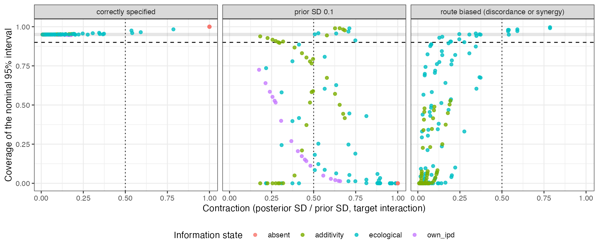

# Prior-to-posterior contraction and effective likelihood rank measure
information, not bias
Ahmad Sofi-Mahmudi
2026-09-22

# Abstract

**Background.** In component network meta-regression, an interaction
informed only by aggregate data can be held to a finite credible
interval by its prior alone. Catalog problem CMP-14 asks for two default
summaries to expose this: prior-to-posterior contraction per interaction
and an effective likelihood rank. We asked what those summaries would
tell an analyst about whether the reported interval covers.

**Methods.** An exact computation on a four-component network with known
truth. The first arm (E1) uses an identity link with known residual
variance, so every posterior is closed form: 504 scenarios crossing the
information state of the target interaction (own trial, additivity,
ecological route, absent), between-study covariate spread, network size,
prior scale on the interactions, between-within discordance and
additivity violation. The second arm (E2) uses a logit link and
asymptotic information over 72 scenarios, adding a curvature state
identified only by differing covariate variances. Coverage of the
nominal 95% interval for the target interaction was classed as failing
(below 0.90), nominal (within 0.01 of 0.95) or neither.

**Results.** No threshold on contraction, on either effective-rank
reading, or on the estimability screen separates failing from nominal
scenarios on either arm: every statistic takes at least one value that
both classes share. The reason is structural. On the identity link the
posterior covariance does not involve the outcomes, so within one design
and prior the summaries are exactly constant while coverage ranges over
0.956. Decomposed by cause, 109 E1 failures come from a prior of SD 0.1
pulling a true interaction of 0.4 toward zero, and 142 from a biased
route, meaning discordance on the ecological route or synergy on the
additivity route. Contraction flags 58.7% of the first kind; no summary
flags any of the second. On the logit arm the summaries separate much
better on average (Youden 0.805 for contraction) because 34 of its 41
failures sit at the tight prior, but the overlap persists.

**Conclusion.** The summaries CMP-14 asks for answer the question they
were designed for, whether the prior dominates a coordinate, and
partially catch the failures a dominant prior causes. They are blind by
construction to the failure an aggregate route adds, which is that the
route is not randomized and can identify the wrong quantity with plenty
of information. A clean contraction is evidence that the likelihood
spoke, not that it told the truth. Every result here is exploratory: E1
ran before the protocol existed and E2’s rules were rebuilt after its
output had been read.

# The problem

Multilevel network meta-regression ([1](#ref-phillippo2020mlnmr)) and
its component extensions estimate how covariates modify treatment
effects by combining individual participant data (IPD), where the
modification is identified within trials, with aggregate data, where it
can only be identified through differences between studies. A proper
prior yields a proper posterior, so an interaction the likelihood barely
touches still gets a finite credible interval ([2](#ref-gelman2017)).
Existing mitigations are visual or require a deliberate refit: prior and
posterior overlays, prior sensitivity refits, power scaling
([3](#ref-kallioinen2024)). CMP-14 asks for two default numerical
summaries so that an analyst who does not ask still sees a warning:

- **contraction**, the marginal posterior standard deviation of the
  interaction over its marginal prior standard deviation, where values
  near 1 mean the data did not move the prior; and
- **effective likelihood rank**, the number of directions in which the
  likelihood outweighs the prior, reported for the whole model and per
  parameter.

Both are functions of Fisher information and the prior. That observation
is the whole study: a summary built from information can tell an analyst
how much the likelihood said, and cannot tell them whether what it said
was right.

# Design

The protocol (`protocol.md`) went through thirteen rounds of adversarial
critique and records its own standing first: **nothing here is
confirmatory**. E1 was computed before the protocol existed; E2’s
separation rules were rebuilt after its output was read. `CHANGES.md`
lists every design choice changed after a number was seen. The
decomposition in
<a href="#sec-cause" class="quarto-xref">Section 3.3</a> was added for
this manuscript, after the decision file, and is labeled post hoc.

## The model

Four binary components. A treatment is an indicator vector
$c \in \{0,1\}^4$ with additive main effect $c'\delta$ and additive
modification $c'\Gamma$ of a scalar covariate $x$. On E1,

$$
E[y] \;=\; \alpha_s + c'\delta + x\,(\beta + c'\Gamma), \qquad
\operatorname{Var}(y) = 1,
$$

with the residual variance known, so the posterior covariance is
$(I + P_0)^{-1}$ in the scale of the prior precision $P_0$ and depends
on the covariate design but not on the outcomes. E2 uses the same linear
predictor on the logit scale, with the likelihood integrated over a
normal within-study covariate law by 64-point Gauss-Hermite quadrature.
Every true interaction is 0.4, every main effect $-0.5$, the prognostic
slope 0.3. Component 3 is the target; components 1, 2 and 4 always have
their own IPD trials.

## Information states for the target interaction

| state | route to the target interaction | randomized |
|----|----|:--:|
| own IPD | its own IPD trial | yes |
| additivity | only inside a combination arm, under additivity | yes |
| ecological | aggregate studies, between-study contrast in covariate means | no |
| curvature (E2 only) | two aggregate studies with equal means and different SDs | no |
| absent | nothing | not applicable |

Every state has the same twelve arms and the same per-arm information
weight, so states differ in route and not in size.

## Departures

Two departures make a route identify the wrong quantity without changing
how much information it carries. **Discordance** adds $0.15$ or $0.40$
to the target interaction in the aggregate rows, so the between-study
association differs from the within-study one. **Synergy** adds $0.2$ to
the covariate slope of the combination arm, violating additivity. The
fitted model has one interaction per component and is otherwise
correctly specified.

## Grid

E1 crosses state, between-study covariate spread (0.3 to 3), total
network size (1000, 3000, 10000), prior SD on the interactions (0.1,
0.5, 1, 2.5), discordance (ecological only) and synergy (additivity
only): 504 scenarios. E2 is a reduced factorial of 72 scenarios on the
logit link at prior SDs 0.1 and 1. Coverage on E1 is exact for a design
realized at its quadrature nodes; on E2 it is the asymptotic normal
approximation.

## Diagnostics and rules

| rule | alarms when | threshold |
|----|----|----|
| contraction | posterior SD / prior SD $\geq$ 0.50 | conventional |
| target ratio | likelihood precision / prior precision on the target $<$ 1 | conventional |
| effective rank | count of eigendirections with likelihood outweighing prior $<$ parameter count | structural |
| rank screen | target coordinate not identified by the likelihood | structural |

A post hoc candidate, the share of the target’s likelihood precision
surviving deletion of the between-study source, is reported in the
protocol and is not part of any claim here.

# Results

## Classes

Table 1: Scenarios by coverage class.

| arm       | failing | nominal | neither | total |
|:----------|--------:|--------:|--------:|------:|
| E1, exact |     251 |     169 |      84 |   504 |
| E2, logit |      41 |      12 |      19 |    72 |

## No threshold separates the classes

For each statistic we asked whether the range of values taken by failing
scenarios overlaps the range taken by nominal ones. One shared value is
enough to show that no threshold can separate them, whatever mixture of
scenarios a practitioner faces. **All four registered statistics overlap
on both arms** (<a href="#tbl-overlap" class="quarto-xref">Table 2</a>).
The rank screen’s overlap is half structural: a non-identified
coordinate has coverage exactly 0 or 1 on both arms and so is never
nominal, but 233 of E1’s 251 failures are identified, so the screen
misses most failures.

Table 2: E1: the most reassuring value among failing scenarios against
the least reassuring value among nominal ones. Where the first is more
reassuring than the second, the ranges overlap.

| statistic | reassuring when | most reassuring failure | least reassuring nominal | overlaps |
|:---|:---|---:|---:|:--:|
| contraction | low | 7.444e-03 | 0.634 | yes |
| target_ratio | high | 1.804e+04 | 1.444 | yes |
| eff_rank | high | 1.400e+01 | 12.000 | yes |
| rank_screen | high | 1.000e+00 | 1.000 | yes |

## Why: the summaries are functions of the design

Within one information state, spread, network size and prior, E1’s
contraction, target ratio and effective rank are exactly constant across
the discordance and synergy levels (largest range 0.0000), while
coverage ranges over 0.956. That is the algebra of the known-variance
Gaussian model: the posterior covariance $(I + P_0)^{-1}$ does not
involve $y$, so a departure that shifts the mean the route identifies
moves the posterior mean and nothing the summaries read.

The failures therefore split by cause, and the split is by design factor
rather than by any outcome
(<a href="#tbl-cause" class="quarto-xref">Table 3</a>, post hoc).

Table 3: Post hoc. Share of E1’s failing scenarios each rule flags, by
cause of failure, and its false-alarm rate among nominal scenarios.
Tight prior: prior SD 0.1. Biased route: prior SD 0.5 or wider with
discordance or synergy.

| rule         | tight prior | biased route | false alarm |
|:-------------|------------:|-------------:|------------:|
| contraction  |       58.7% |         0.0% |        3.6% |
| target_ratio |       41.3% |         0.0% |        0.0% |
| eff_rank     |       56.0% |         0.0% |        0.6% |
| rank_screen  |       16.5% |         0.0% |        0.0% |

Of the 142 failures from a biased route (88 ecological, 54 additivity),
**no rule flags any**. Of the 109 failures from the tight prior,
contraction flags 58.7%, which is the failure the summary was built for
(<a href="#fig-cc" class="quarto-xref">Figure 1</a>). The ecological
route can deliver an interval that is well informed, far from its prior,
and wrong: at discordance 0.4, ecological scenarios with a wide prior
reach coverage as low as 2.0e-57.

Figure 1: E1: contraction against coverage, by cause of failure. The
shaded band is nominal coverage, the dashed line the failure threshold,
the dotted line the contraction alarm.

## Matched information, different coverage

Pairing each additivity scenario with ecological scenarios sharing its
spread, size and prior, the pairs whose contraction differs by less than
0.02 (54 of 216) differ in coverage by up to 0.951. Two evidence
structures an analyst would read as equally well identified differ by
almost the whole unit interval in whether the interval covers. On E2 the
only close pair has no discordance, so the comparison is not available
there.

## The logit arm

On E2 the registered rules look far better on average: Youden 0.805 for
contraction and 0.829 for effective rank, against 0.220 and 0.237 on E1.
The improvement is a property of the grid: 34 of E2’s 41 failures sit at
prior SD 0.1, the cause the summaries catch, and E2 has only 12 nominal
scenarios, so its zero false-alarm rates are weakly determined. On the
curved link the summaries do move a little with the departures, because
Fisher information depends on the parameter, but the overlap of
<a href="#sec-overlap" class="quarto-xref">Section 3.2</a> persists on
E2 for every statistic.

## The sign of the contraction and coverage relation

Across E1’s 144 confounded ecological scenarios the rank correlation
between contraction and coverage is 0.3295: contraction becomes more
reassuring as coverage gets worse, because a larger between-study spread
sharpens the route without reducing the bias it carries, so the interval
narrows around the wrong value. On E2’s eight confounded scenarios the
correlation is -0.5952. A correlation over eight deterministic points
describes those points and settles nothing.

# What this means for CMP-14

The entry is right that nothing in the default output tells an analyst
the prior did the work, and the two summaries it asks for would say so
where it is true. They should be reported. But they should be reported
as what they are, statements about information, and the entry’s framing,
that a proper interval is not evidence that the likelihood contributed,
has a second half it does not state: **a contracted interval is not
evidence that the likelihood was right.** An aggregate route to an
interaction is non-randomized, and its failure mode is confounding,
which is invisible to any summary built from Fisher information and the
prior. The check that addresses that failure is not a contraction number
but a statement of which route identifies each interaction and whether
that route is randomized, which `estimable_effects_at()` in the
unreleased `cpaic` partly provides, together with a within-between
separation of the kind our CMP-13 study evaluated.

# What this does not answer

1.  **Nothing is confirmatory.** E1 ran before the protocol; E2’s rules
    were rebuilt after its output was read; the cause decomposition was
    added for this manuscript.
2.  **Exact, not sampled.** E1 is exact for a design realized at its
    quadrature nodes and E2 is asymptotic; neither is an average over
    realized designs, and no posterior was sampled, so sampler failure
    is outside the study.
3.  **The invariance is specific to known-variance Gaussian models.** On
    E2 the summaries move slightly with the departures. With an
    estimated residual variance or a random-effects model they would
    move more, and whether that movement is ever large enough to warn is
    untested.
4.  **One target component, one covariate, one network geometry**, a
    normal within-study covariate law on the logit arm, and departures
    that act on the mean only.
5.  **Peer review of this manuscript has not been done**, though the
    protocol went through thirteen rounds of critique.

# Reproducing this study

    Rscript R/03-run-e1.R && Rscript R/04-analyze.R
    Rscript R/07-run-e2.R
    Rscript R/05-export.R && Rscript R/11-decision.R
    Rscript R/12-decompose.R && Rscript R/13-figures.R

# References

1.
David M. Phillippo, Sofia Dias, A.
E. Ades, Mark Belger, Alan Brnabic, Alexander Schacht, Daniel Saure,
Zbigniew Kadziola, Nicky J. Welton. Multilevel network meta-regression
for population-adjusted treatment comparisons. Journal of the Royal
Statistical Society Series A. 2020;183(3):1189–210.
doi:[10.1111/rssa.12579](https://doi.org/10.1111/rssa.12579)

2.
Andrew Gelman, Daniel Simpson,
Michael Betancourt. The prior can often only be understood in the
context of the likelihood. Entropy. 2017;19(10):555.
doi:[10.3390/e19100555](https://doi.org/10.3390/e19100555)

3.
Noa Kallioinen, Topi Paananen,
Paul-Christian Bürkner, Aki Vehtari. Detecting and diagnosing prior and
likelihood sensitivity with power-scaling \[Internet\]. 2024. Available
from: <https://arxiv.org/abs/2107.14054>

