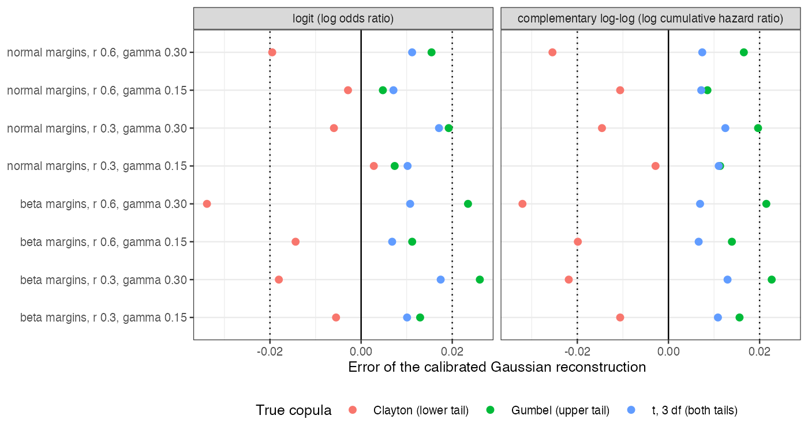

# Calibrating the correlation does not fix the copula: the family moves
a standardized contrast by up to 0.03 on the log odds and log hazard
scales
Ahmad Sofi-Mahmudi
2026-09-23

# Abstract

**Background.** Multilevel network meta-regression integrates over a
target covariate distribution reconstructed from reported margins and
correlations with a Gaussian copula ([1](#ref-phillippo2020mlnmr)).
Calibrating the copula’s latent correlation so that the output
correlations match the reported ones fixes the variance of any linear
predictor. Catalog problem CMP-15 asks whether the remaining error,
which lives in asymmetry and tail dependence, can move a standardized
contrast.

**Methods.** A population-level calculation: three covariates with
normal or skewed margins and a true Clayton, Gumbel or $t$ copula at
Pearson correlation 0.3 or 0.6, against Gaussian copulas calibrated to
the same margins and correlation; logit, complementary log-log and log
links; $10^6$ draws per law with a control variate.

**Results.** The calibrated Gaussian’s error in the standardized
contrast reached 0.034 on the log odds ratio scale and 0.032 on the log
cumulative hazard ratio scale, above the registered threshold of 0.02 in
5 of 16 primary cells, with Monte Carlo error below 0.001. Lower- and
upper-tail dependence pushed the error in opposite directions. On the
log link the error reached 0.629. More integration points did not help:
the error plateaued by 256 points. A wrong flexible family was further
from the truth than the Gaussian in 61% of comparisons.

**Conclusion.** The copula family matters above the second moment,
modestly on the log odds and log hazard scales and strongly on the log
rate scale. Since the family is not identified from published data, the
defensible report is an envelope over families, not a switch to a
different single copula.

# The problem

For a curved inverse link the target-standardized contrast depends on
the covariate law through all moments of the linear predictor. Its
variance depends only on margins and pairwise correlations, so
calibrating the correlation fixes the second-order term. The third- and
higher-order terms depend on the copula’s asymmetry and tail dependence,
which the Gaussian copula sets to zero. Whether that residual is large
enough to matter is an empirical question, and it can only be answered
in a setting where the true joint law is known.

# Design

Registered protocol: `protocol.md`. Covariates with common standard
normal or standardized Beta(2, 6) margins; exchangeable dependence from
a Gaussian, Clayton, Gumbel or $t_3$ copula whose parameter was
calibrated so the mean pairwise Pearson correlation equals
$r \in \{0.3, 0.6\}$ (realized within 0.0057 on independent draws).
Outcome model
$\eta_a = \alpha + 0.5\sum_j x_j + a(-0.5 + \gamma\sum_j x_j)$,
$\gamma \in \{0.15, 0.3\}$. The contrast
$h(E[h^{-1}(\eta_1)]) - h(E[h^{-1}(\eta_0)])$ for identity, logit, log
and complementary log-log links (the last is survival at $t = 1$ under
an exponential model). Each law was evaluated with $10^6$ draws in four
batches, using $\sum_j x_j$, whose mean is exactly zero, as a control
variate. Reconstructions: the Gaussian copula calibrated to $r$, the
Gaussian with latent correlation $r$ (uncalibrated), and each other
family calibrated to $r$; the envelope is the range over the Gaussian,
Clayton, Gumbel and their survival versions.

# Results

Figure 1: Error of the calibrated Gaussian reconstruction. Dotted: the
registered threshold 0.02.

Table 1: Largest absolute error of the calibrated Gaussian over margins,
correlations and $\gamma$. MCSE at most 0.0006 on the logit and
complementary log-log scales and 0.027 on the log scale.

| link                  | largest error, Clayton | Gumbel | $t_3$ |
|-----------------------|-----------------------:|-------:|------:|
| identity              |                  0.000 |  0.000 | 0.000 |
| logit                 |                  0.034 |  0.026 | 0.017 |
| complementary log-log |                  0.032 |  0.023 | 0.013 |
| log                   |                  0.510 |  0.629 | 0.473 |

The registered primary fired: on the complementary log-log scale with a
tail-dependent truth the calibrated Gaussian erred by up to 0.032,
beyond 0.02 in 5 of 16 cells, largest with skewed margins, the higher
correlation and the stronger modification
(<a href="#fig-errors" class="quarto-xref">Figure 1</a>,
<a href="#tbl-main" class="quarto-xref">Table 1</a>). The sign followed
the tail: against a Clayton truth (lower-tail dependence) the Gaussian’s
contrast was too negative, and against a Gumbel truth (upper-tail
dependence) too positive, so the Gaussian sits inside the range the
families span. A symmetric tail-dependent copula ($t_3$) gave smaller
errors. At the identity link every error was exactly zero, as the
second-order argument requires. On the log link, where the marginal rate
is an exponential moment of the linear predictor and is dominated by the
joint upper tail, errors reached 0.629.

Calibration itself was a small correction here: the uncalibrated
Gaussian differed from the calibrated one by at most 0.001 on the logit
and complementary log-log scales. With randomized quasi-Monte Carlo the
calibrated Gaussian’s RMSE against a Gumbel truth fell from 0.026 at 64
points to 0.022 at 256 and stayed at 0.021 at 4096: integration error
vanishes quickly and the copula error remains. DESIGN.md’s prediction
that the error grows with integration order did not hold; it plateaus.

A misspecified flexible family was worse than the calibrated Gaussian in
61% of comparisons, the design’s falsifier for recommending a flexible
copula. The envelope over five families contained the $t_3$ truth, which
lies outside them, in 14 of 16 logit and complementary log-log cells,
with median width 0.031.

The matched-correlation control narrowly failed: the $t$ copula at
$r = 0.3$ with skewed margins realized a correlation 0.0057 from its
target on independent draws, against a tolerance of 0.005, within the
Monte Carlo error of the check.

# What this does not answer

Population-level: no trials, fitting or reconstruction uncertainty.
Three exchangeable covariates with common margins, one parameter per
copula; no mixed or discrete margins, so the numerical inversion of
latent correlations for binary covariates is not measured; no vines.
Peer review has not been done.

# References

1.
David M. Phillippo, Sofia Dias, A.
E. Ades, Mark Belger, Alan Brnabic, Alexander Schacht, Daniel Saure,
Zbigniew Kadziola, Nicky J. Welton. Multilevel network meta-regression
for population-adjusted treatment comparisons. Journal of the Royal
Statistical Society Series A. 2020;183(3):1189–210.
doi:[10.1111/rssa.12579](https://doi.org/10.1111/rssa.12579)

