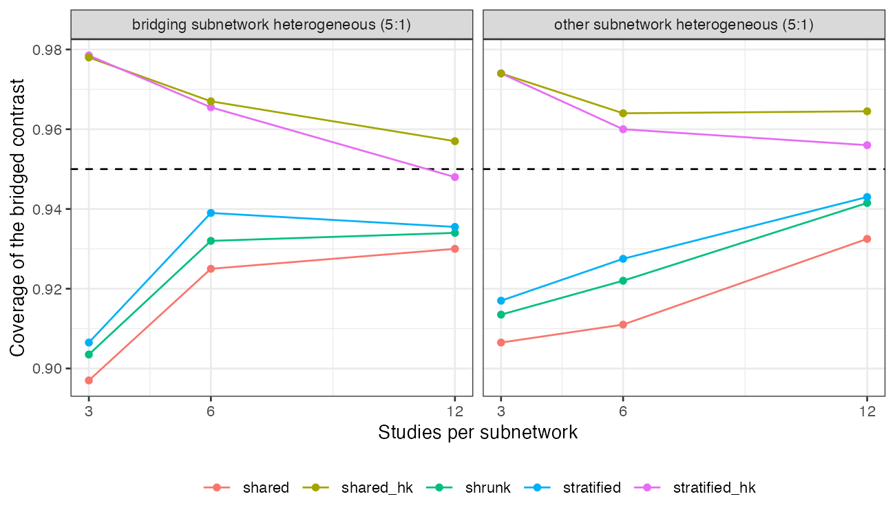

```{r setup}
s <- read.csv("../results/summary.csv"); f3 <- function(x) formatC(x, format = "f", digits = 3)
q <- function(r, h, K, m) s[s$ratio == r & s$het == h & s$K == K & s$method == m, ]
```

# Abstract {.unnumbered}

**Background.** A bridged network contrast pools two subnetworks, and a single
between-study SD $\tau$ lends one subnetwork's heterogeneity to the other. Catalog
problem CMP-16 asks whether that breaks the bridged contrast's interval and whether a
stratified $\tau$ does better at realistic study counts.

**Methods.** A bridged contrast formed as the sum of two subnetworks' pooled effects;
heterogeneity ratio 1, 2 or 5 in the bridging or the other subnetwork; 3, 6 or 12 studies
each; shared, stratified and shrunk REML heterogeneity with Wald intervals, and
Hartung-Knapp intervals; 2000 replicates per cell.

**Results.** With the non-bridging subnetwork five times as heterogeneous, the shared
model's Wald interval covered `r f3(q(5, "other", 3, "shared")$coverage)`, `r f3(q(5, "other", 6, "shared")$coverage)` and `r f3(q(5, "other", 12, "shared")$coverage)` at 3, 6 and 12 studies per
subnetwork, against `r f3(q(5, "other", 3, "stratified")$coverage)`, `r f3(q(5, "other", 6, "stratified")$coverage)` and `r f3(q(5, "other", 12, "stratified")$coverage)` for the stratified model: at most
0.016 apart. Every Wald interval undercovered at few studies, and Hartung-Knapp intervals
covered `r f3(min(s$coverage[grepl("hk", s$method) & s$K == 3]))` to `r f3(max(s$coverage[grepl("hk", s$method) & s$K == 3]))` at three studies, at 1.5 times the width.

**Conclusion.** For a contrast that sums both subnetworks, a shared $\tau$ overstates one
part's variance and understates the other's, and the errors largely offset. The
undercoverage comes from ignoring uncertainty in $\tau$, not from sharing it.

# The problem {#sec-problem}

A shared $\tau$ inflates the homogeneous subnetwork's variance and deflates the
heterogeneous one's. For a contrast that uses only one subnetwork this misstates its
interval directly; for a bridged contrast that sums both, the two errors enter with
opposite signs. Stratifying $\tau$ fixes the structure but estimates two poorly determined
variances instead of one.

# Design {#sec-design}

Registered protocol: `protocol.md`. $K$ studies of component A against its backbone
(effect $-0.3$) and $K$ of B against A (0.1); the target is their sum. Within-study SE uniform
on 0.1 to 0.25; between-study SDs 0.05 in one subnetwork and $0.05R$ in the other. Shared,
stratified and shrunk (weight $K/(K+4)$ toward the shared value) REML heterogeneity; Wald
intervals, and Hartung-Knapp intervals [@hartung2001] for shared and stratified.

# Results {#sec-results}

{#fig-coverage}

| ratio | heterogeneous | studies each | shared | stratified | shrunk | shared, Hartung-Knapp | stratified, Hartung-Knapp |
|---:|---|---:|---:|---:|---:|---:|---:|
`r z <- s[s$method == "shared", ]; paste(sprintf("| %g | %s | %d | %s | %s | %s | %s | %s |", z$ratio, z$het, z$K, f3(z$coverage), f3(vapply(seq_len(nrow(z)), function(i) q(z$ratio[i], z$het[i], z$K[i], "stratified")$coverage, 0)), f3(vapply(seq_len(nrow(z)), function(i) q(z$ratio[i], z$het[i], z$K[i], "shrunk")$coverage, 0)), f3(vapply(seq_len(nrow(z)), function(i) q(z$ratio[i], z$het[i], z$K[i], "shared_hk")$coverage, 0)), f3(vapply(seq_len(nrow(z)), function(i) q(z$ratio[i], z$het[i], z$K[i], "stratified_hk")$coverage, 0))), collapse = "\n")`

: Coverage of 95% intervals, 2000 replicates per cell (MCSE at most 0.007). {#tbl-main}

The registered rule returned mixed: in the registered cells (non-bridging subnetwork
heterogeneous) the shared model never covered below 0.90, and the shrunk model was not
nominal where the shared one fell short (@tbl-main); the lowest shared coverage, 0.897, was
with the bridging subnetwork heterogeneous. Across
the grid the three structures differed by at most 0.016 in coverage and a few percent in
width (@fig-coverage). The gap to nominal was driven by the heterogeneity ratio and the
study count, not by the structure: at a 5:1 ratio and three studies per subnetwork every
Wald interval covered 0.90 to 0.92, rising to 0.93 to 0.94 at twelve. The shared
estimate of $\tau$ sat between the two true values, as it must, and the bridged contrast's
variance, which sums both subnetworks, was close to right on average.

# What this does not answer {#sec-limits}

The bridged contrast here sums both subnetworks; a contrast drawing on one subnetwork
only would carry the shared $\tau$'s error without the offset. Frequentist REML without
priors; no residual-variance arm, IPD studies or sparse network. Peer review has not been
done.

# References {.unnumbered}
