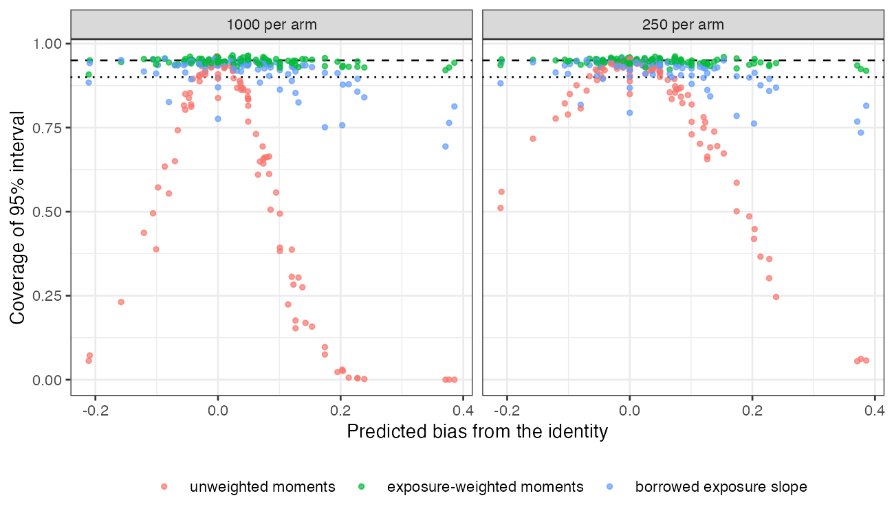

# The aggregate Poisson likelihood is biased by the exposure-rate
covariance, and exposure-weighted covariate moments remove the bias
Ahmad Sofi-Mahmudi
2026-09-23

# Abstract

**Background.** Aggregate count data enter a multilevel network
meta-regression as an arm’s total events and total exposure, with the
expected count computed as total exposure times the mean modeled rate
over the arm’s covariate law ([1](#ref-phillippo2020mlnmr)). That is
exact only if exposure and rate are uncorrelated within the arm;
otherwise the expected count is off by the factor
$1 + \rho\,\mathrm{CV}(T)\,\mathrm{CV}(\lambda)$. Catalog problem CMP-20
asks whether the factor cancels in the reported contrast.

**Methods.** An anchored network, individual data on A versus C and arm
totals on B versus C, with lognormal exposure solved so that each arm’s
exposure-rate correlation and dispersions take registered values; 208
main cells, 1000 replicates each. Integration over the unweighted,
exposure-weighted or slope-tilted covariate moments.

**Results.** The observed bias followed the identity (slope 0.994, SE
0.002). At plausible dispersions with a differential correlation of at
least 0.2, 27 of 64 cells showed material bias or undercoverage; bias
reached 0.140 and coverage fell to 0.169. Integrating over
exposure-weighted moments kept bias within 0.008 and coverage 0.908 to
0.965 in every cell. With no population correlation at all, the
unweighted likelihood still undercovered at large dispersions (0.838),
because the sample covariance is not zero.

**Conclusion.** The covariance cancels in the contrast only when it is
common to both arms. Aggregate count data should be integrated over
exposure-weighted covariate moments, which a publication can report at
no cost.

# The problem

For an aggregate Poisson arm the model’s expected count is
$\sum_i T_i \times E_x[\lambda(x)]$, while the truth is
$\sum_i E[T_i\lambda(x_i)]$. Their ratio is
$1 + \rho_{T,\lambda}\mathrm{CV}(T)\mathrm{CV}(\lambda)$. In a two-arm
aggregate study the study intercept absorbs the control arm’s factor and
the treatment effect absorbs the log ratio of the two arms’ factors, so
the contrast is biased by
$\log\{(1 + \rho_1\mathrm{CV}_1(T)\mathrm{CV}_1(\lambda))/(1 + \rho_0\mathrm{CV}_0(T)\mathrm{CV}_0(\lambda))\}$.
Differential follow-up, where treatment changes who stays long enough to
accumulate exposure, makes the two factors differ. Integrating over the
exposure-weighted covariate law makes the product exact, because
$E[T\lambda(x)] = E[T]\,E_{w}[\lambda(x)]$ with weights proportional to
$T$.

# Design

Registered protocol: `protocol.md`; ADEMP ([2](#ref-morris2019)). Study
1: individual data on A versus C, $x \sim N(0, 1)$; study 2: arm totals
on B versus C, $x \sim N(0.5, 1)$. Rate model
$\log\lambda_a(x) = \mu_s + bx + d_a + 0.2x\,\mathbb{1}[a \text{ active}]$
with $d_A = -0.3$, $d_B = -0.4$, and $b$ set by the control rate’s CV.
Exposure lognormal given $x$ with mean 1, its slope on $x$ and residual
variance solved so that each arm’s correlation and $\mathrm{CV}(T)$ are
exact. Factors: control-arm correlation 0 to $-0.6$, treated-arm
difference 0, 0.2, 0.4, $\mathrm{CV}(T)$ 0.3, 0.6, 1.0, control
$\mathrm{CV}(\lambda)$ 0.2, 0.4, 0.8, 250 or 1000 per arm; 208
attainable main cells and 26 control cells. Estimand: the log marginal
rate ratio B versus C in study 1’s population, in closed form. All
methods fit the same joint likelihood by maximum likelihood and differ
only in the aggregate arms’ integration law: the arm’s reported sample
moments (unweighted), its exposure-weighted moments (weighted), or the
unweighted moments tilted by the exposure slope estimated in study 1
(borrowed). A sensitivity interval shifted the unweighted interval by
the identity over $\rho \in [-0.6, 0]$ per arm.

# Results

Figure 1: Observed bias of each method against the identity’s
prediction, 208 main cells. Dashed: equality.

Figure 2: Coverage against the predicted bias. Dashed 0.95; dotted 0.90.

Table 1: 1000 replicates per cell; bias MCSE at most 0.004. Plausible:
CV(T) at most 0.6 and control CV($\lambda$) at most 0.4.

| method | largest absolute bias | coverage, all cells | coverage, plausible cells with differential correlation | mean width |
|----|---:|---:|---:|---:|
| unweighted | 0.383 | 0.000 to 0.963 | 0.169 to 0.963 | 0.291 |
| exposure-weighted | 0.008 | 0.908 to 0.965 | 0.935 to 0.965 | 0.278 |
| borrowed slope | 0.015 | 0.694 to 0.957 | 0.926 to 0.957 | 0.278 |
| sensitivity | 0.383 | 0.706 to 1.000 | 0.861 to 1.000 | 0.704 |

The registered rule returned **confirmed material**
(<a href="#fig-coverage" class="quarto-xref">Figure 2</a>,
<a href="#tbl-main" class="quarto-xref">Table 1</a>). The bias tracked
the identity closely
(<a href="#fig-identity" class="quarto-xref">Figure 1</a>): slope 0.994
and no cell more than 2.91 MCSE from its prediction. With a common
correlation in both arms the contrast was unbiased while each arm’s
absolute rate was biased, as the second null control required. The
exposure-weighted likelihood removed the bias in every cell, with
coverage 0.908 to 0.965 (0.935 to 0.965 at plausible dispersions). The
borrowed slope removed the bias but undercovered at large rate
dispersion (down to 0.694), because its interval ignores the uncertainty
in the slope it borrows.

Three registered statements did not hold as written. **The null control
failed on coverage, not bias**: at zero correlation in both arms the
unweighted likelihood was unbiased but covered 0.838 to 0.957, falling
as $\mathrm{CV}(T)\mathrm{CV}(\lambda)$ grew, because a finite arm’s
sample exposure-rate covariance is not zero and its variance is missing
from the Poisson arm likelihood; the exposure-weighted likelihood
covered 0.936 to 0.959 in the same cells. **The positive control’s cell
selection was corrected after the run**: the analysis script required
the largest CV(T) and the largest CV($\lambda$) together, a combination
not attainable at $\rho_0 = -0.6$, so it selected no cell; selecting the
attainable cells with the largest product, as the protocol’s text says,
the control passed. And the protocol stated that the sensitivity range
contained every grid value; it did not contain cells whose treated-arm
correlation was positive ($\rho_0 = 0$ with a difference of 0.2 or 0.4,
or $-0.2$ with 0.4), where the sensitivity interval covered as little as
0.706. Its mean width was 2.42 times the unweighted width.

# What this does not answer

One covariate and one lognormal exposure law; no overdispersion; the
exposure mechanism is the same in both studies, which is what makes the
borrowed slope unbiased; the likelihood is the study’s own code, not
multinma. Peer review has not been done.

# References

1.
David M. Phillippo, Sofia Dias, A.
E. Ades, Mark Belger, Alan Brnabic, Alexander Schacht, Daniel Saure,
Zbigniew Kadziola, Nicky J. Welton. Multilevel network meta-regression
for population-adjusted treatment comparisons. Journal of the Royal
Statistical Society Series A. 2020;183(3):1189–210.
doi:[10.1111/rssa.12579](https://doi.org/10.1111/rssa.12579)

2.
Tim P. Morris, Ian R. White,
Michael J. Crowther. Using simulation studies to evaluate statistical
methods. Statistics in Medicine. 2019;38(11):2074–102.
doi:[10.1002/sim.8086](https://doi.org/10.1002/sim.8086)

