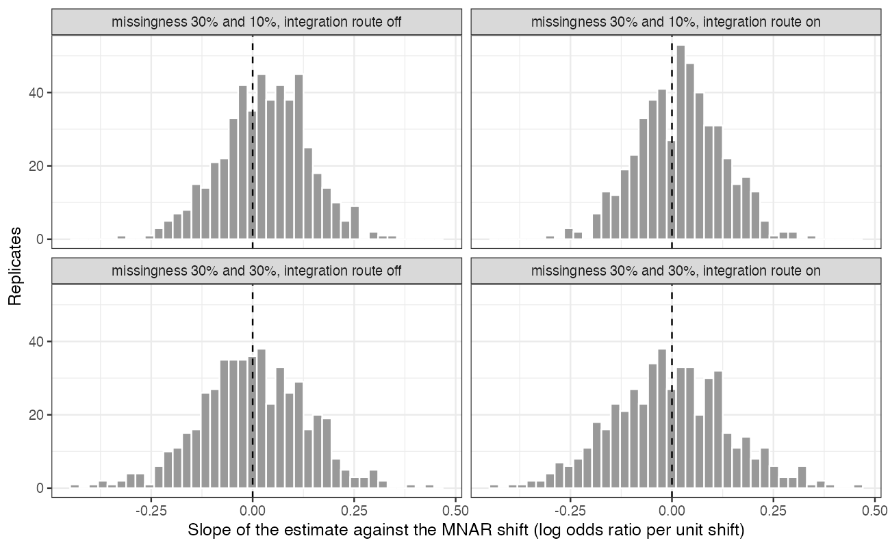

# An MNAR shift moved an anchored transported contrast in a direction
that differed from dataset to dataset, but the tipping set was almost
always one interval
Ahmad Sofi-Mahmudi
2026-09-23

# Abstract

**Background.** A missing-not-at-random (MNAR) shift in imputed
effect-modifier values enters a transported comparison through each
trial’s fitted interaction, through the covariate law used for
integration, and through differences in missingness that an anchor would
otherwise cancel. Catalog problem CMP-21 asks whether these routes can
offset and whether the tipping point of a sensitivity analysis is then
still a single value.

**Methods.** Two individual-data trials anchored through a common
control, the modifier missing not at random in 30% of patients in one
and 30% or 10% in the other, imputation plus a sensitivity shift from
$-1.5$ to $1.5$, and outcome-regression transport to a target; 500
replicates per cell with common random draws across the shift.

**Results.** The tipping set (shifts that reverse the estimate’s sign)
was a single interval in 96% or more of replicates; the registered rate
of non-single sets was 0.030 to 0.044, under the 5% threshold. The
routes did offset on average: the mean slope of the estimate against the
shift was -0.004 to 0.030. But in single datasets the slope’s SD was
0.103 to 0.144 and its sign was positive in 48% to 62% of them, so the
direction in which an MNAR departure moves the contrast was not
predictable from the design. The decision reversed somewhere in the
range in 29% to 30% of replicates.

**Conclusion.** A single tipping point was adequate here, but a
sensitivity analysis must explore both directions of the shift: the
anchor cancels the routes only on average.

# The problem

In an anchored comparison both trials’ estimates move with a common MNAR
shift, and the contrast differences the movements away if they are
equal. They are equal only in expectation, and only if missingness is
the same in both trials. The integration law, when built from the
completed data, adds a third route. If the routes offset, the contrast
can be flat or non-monotone in the shift, and a single tipping point can
understate the region of concern.

# Design

Registered protocol: `protocol.md`; ADEMP ([1](#ref-morris2019)). Trials
of A versus C and B versus C, 300 per arm, $x \sim N(0, 1)$,
$\operatorname{logit}p = -0.5 + 0.6x + a_A(-0.4 + 0.4x) + a_B(-0.6 + 0.4x)$.
$x$ is missing with probability $\operatorname{expit}(c_j + x)$.
Imputation by normal regression of $x$ on outcome, arm and their product
in complete cases, plus the shift $\delta$; one imputation, common
random draws across $\delta$ in steps of 0.1. Each trial is standardized
by G-computation to a target $x \sim N(0.8, s^2)$ with $s = 1$ or $s$
from the completed data. Estimand: marginal log odds ratio B versus A
(truth -0.165).

# Results

Figure 1: Per-replicate slope of the transported contrast against the
MNAR shift.

Table 1: 500 replicates per cell.

| missingness trial 2 | integration route | tipping set not one interval | decision reverses somewhere | mean slope | slope positive | curve moves under 0.05 | bias at $\delta = 0$ |
|---:|----|---:|---:|---:|---:|---:|---:|
| 30% | off | 0.044 | 0.288 | -0.000 | 50% | 0.034 | -0.011 |
| 10% | off | 0.036 | 0.292 | 0.030 | 62% | 0.064 | -0.030 |
| 30% | on | 0.042 | 0.300 | -0.004 | 48% | 0.034 | -0.022 |
| 10% | on | 0.030 | 0.286 | 0.020 | 59% | 0.032 | -0.027 |

The registered primary did not confirm non-unique tipping sets: at most
4% of replicates had more than one reversal interval
(<a href="#tbl-main" class="quarto-xref">Table 1</a>). Because a curve
flat to within 0.05 occurred in up to 6% of replicates with differing
missingness, the registered branch is cancellation without non-unique
tipping sets. The more useful result is
<a href="#fig-slopes" class="quarto-xref">Figure 1</a>: the
per-replicate slope was centered near zero and spread widely in both
directions, with differing missingness shifting its center only
slightly. The registered non-monotonicity count (any sign change in
successive differences) exceeded 75% in every cell, but it counts
sub-0.01 wiggles from refitting and is not interpretable as substantive
non-monotonicity.

# What this does not answer

Two anchored individual-data trials rather than a disconnected component
network; one imputation per shift; a congenial imputation model; one
MNAR mechanism; the tipping set defined by the point estimate’s sign,
not by an interval. Peer review has not been done.

# References

1.
Tim P. Morris, Ian R. White,
Michael J. Crowther. Using simulation studies to evaluate statistical
methods. Statistics in Medicine. 2019;38(11):2074–102.
doi:[10.1002/sim.8086](https://doi.org/10.1002/sim.8086)

