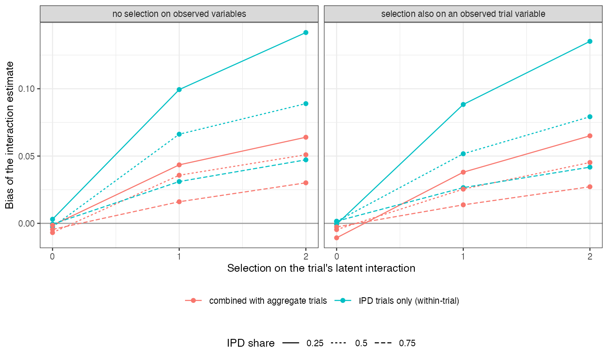

```{r setup}
s <- read.csv("../results/summary.csv")
f3 <- function(x) formatC(x, format = "f", digits = 3); f2 <- function(x) formatC(x, format = "f", digits = 2)
ob <- s[s$s_lat == 0, ]; la <- s[s$s_lat > 0, ]
h <- s[s$share == 0.5, ]; ci <- stats::cor(h$influence, abs(h$bias_target_comb))
```

# Abstract {.unnumbered}

**Background.** Individual participant data carry the within-trial evidence on effect modification,
and which trials supply them is not random. Catalog problem CMP-22 asks what selection on data
availability does and whether a leave-IPD-out diagnostic reveals it.

**Methods.** Twelve trials with trial-specific treatment-by-covariate interactions. Individual data
were available for a quarter, half or three quarters of trials, selected on an observed trial variable,
on each trial's latent interaction, or both (18 scenarios, 1000 replicates each). Interaction and target
effect were estimated from the IPD trials' within-trial interactions alone, or combined with the
across-trial association in all trials.

**Results.** Selection on the observed trial variable left the within-trial estimate unbiased
(`r f3(min(ob$bias_beta_within))` to `r f3(max(ob$bias_beta_within))`). Selection on the latent interaction biased it
by up to `r f3(max(la$bias_beta_within))` (true interaction 0.3), most when few trials supplied data, and coverage fell
to `r f3(min(la$cov_beta_within))`. Combining with aggregate trials halved the bias (at most
`r f3(max(la$bias_beta_comb))`). Leave-IPD-out influence did not respond: at half the trials supplying data it
correlated `r f2(ci)` with the bias across selection strengths.

**Conclusion.** Availability that depends on a trial's own effect modification biases the evidence that
population adjustment relies on, and influence diagnostics cannot see it; only a stated selection model
can address it. Report which trials were missing and use aggregate evidence alongside.

# The problem {#sec-problem}

Combined IPD and aggregate meta-analysis [@riley2008] separates a within-trial interaction, identified
by the IPD trials, from an across-trial association. If trials with stronger modification are more
likely to share data, the within-trial evidence is a selected sample. Selection on observed trial
variables can be modeled; selection on the latent interaction cannot be estimated from the network,
because the trials that would reveal it are the ones without data.

# Design {#sec-design}

Registered protocol: `protocol.md`; ADEMP structure [@morris2019]. Trials of 200 per arm, covariate means
uniform on $[-1, 1]$; $y = x + A(-0.5 + \beta_kx) + e$, $\beta_k = 0.3 + u_k$, $u_k \sim N(0, 0.15^2)$. IPD
available with probability $\operatorname{logit}^{-1}(a + s_{\text{obs}}z_k + s_{\text{lat}}u_k/0.15)$ with $z_k$ an
observed trial variable correlated with the covariate mean. Within-trial interactions pooled by
DerSimonian-Laird; the combined estimator averages that with the across-trial slope by inverse variance.
Influence: the largest change in the combined target estimate when one IPD trial is treated as
aggregate.

# Results {#sec-results}

{#fig-bias}

The bias grew with selection strength and fell as more trials supplied data, since the selected set then
approaches the whole (@fig-bias). The across-trial slope is not selected, so combining diluted the bias in
proportion to its weight. The influence diagnostic changed with the IPD share, because each trial matters
less when more supply data, but not with selection.

# What this does not answer {#sec-limits}

Pairwise meta-analysis with a continuous outcome rather than component ML-NMR; no selection-model
sensitivity analysis; one network size. Peer review has not been done.

# References {.unnumbered}
