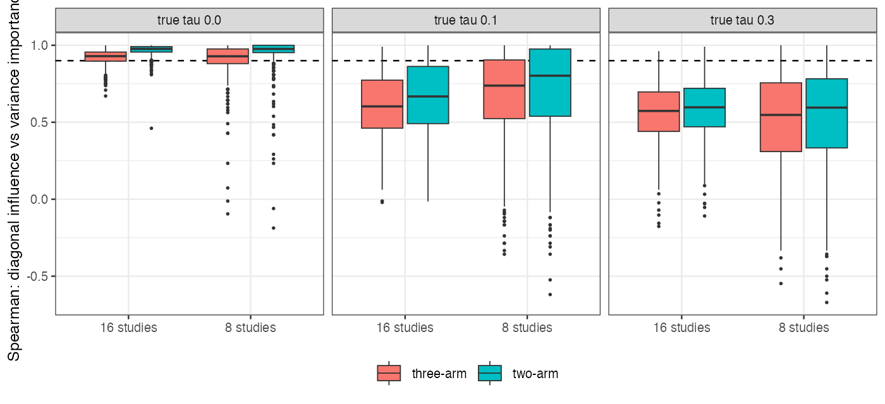

# A diagonal-weight influence ranked studies correctly only with two-arm
studies and heterogeneity held fixed
Ahmad Sofi-Mahmudi
2026-09-23

# Abstract

**Background.** cpaic’s `edge_influence()` reports each study’s
contribution to a requested contrast from a hat matrix with diagonal
inverse-variance weights and $\hat\tau^2$ held fixed. The catalog
(CMP-24) says this is exact for two-arm studies at fixed weights and
approximate otherwise. The refuting sentence: the approximation
preserves the ranking even where it misstates values.

**Methods.** Random connected four-treatment networks of 8 or 16
studies, all two-arm or with three-arm studies, true $\tau$ of 0, 0.1 or
0.3; 500 networks per cell. The diagonal influence was compared with
leave-one-study-out refits of the correct model (within-study
covariance, $\tau$ re-estimated by REML), scored by variance importance.
Registered rule: not fit for ranking if in any cell the mean Spearman
correlation is below 0.9 or the most important study is misidentified in
more than 10% of networks.

**Results.** The diagonal influence equaled the correct hat row for
two-arm networks (largest difference 8.2e-15) and ranked studies well
there with $\tau$ fixed at 0 (Spearman 0.95 to 0.97, top study missed in
5% to 6%). With three-arm studies and $\tau$ fixed, Spearman stayed at
0.90 to 0.92 but the top study was missed in 28% to 46% of networks; in
a post hoc rerun the diagonal’s choice was a three-arm study in almost
all misses. With $\tau$ re-estimated, the mean Spearman was 0.51 to 0.70
(two-arm networks 0.53 to 0.70) and the top study was missed in 20% to
59%. The registered verdict is **not fit for ranking**.

**Conclusion.** The refuting sentence fails. Both dropped terms change
which study the diagnostic names as most influential; the heterogeneity
term lowers the rank correlation more.

# The problem

An influence diagnostic is read as an ordering: which study carries the
contrast. cpaic’s calculation writes the contrast as $a'y$ over all
pairwise rows, $a = m'(X'WX)^+X'W$ with
$W = \operatorname{diag}\{1/(v_j + \hat\tau^2)\}$, and sums $|a_j|$ over
each study’s rows. Two terms are dropped. A multi-arm study’s pairwise
rows are correlated and linearly dependent, so the diagonal weights
count its information more than once. Removing a study changes
$\hat\tau^2$ and thereby every weight, which a fixed-$\hat\tau$ hat
matrix cannot see. The reference is the refitted influence, following
the variance-based definition of study importance
([1](#ref-rucker2020)).

# Design

Registered protocol: `protocol.md`. Treatments A to D with true effects
$(0, -0.2, -0.3, -0.4)$ against A; target D versus A. Each study
compares a random pair, or with probability 0.3 a random triple
(three-arm cells); arm sizes 50 to 300; random effects with correlation
0.5 within multi-arm studies. The diagonal influence is reimplemented
from cpaic’s formula (commit cf27b1a) with $\hat\tau^2$ from the correct
model. Reference: leave-one-study-out refits of the correct model (basic
contrasts, block within-study covariance, REML $\tau^2$; $\tau$ fixed at
0 in the $\tau = 0$ cells), scored by variance importance
$1 - \operatorname{Var}_{\text{full}}/\operatorname{Var}_{-s}$ and by
absolute change in the estimate. The $\tau = 0$ cells therefore isolate
the multi-arm term; the $\tau > 0$ cells add the re-estimation term.
Networks in which removing one study disconnected a treatment other than
A or D made the refit singular and were dropped: 120 of 6000, all in
8-study cells (2% to 6% per cell).

# Results

Figure 1: Per-network Spearman correlation between the diagonal
influence and refitted variance importance; dashed line, the registered
0.9.

Table 1: Registered results. Spearman correlations are means over
networks.

| studies | design | true $\tau$ | networks | mean Spearman | share below 0.9 | top study missed | Spearman with estimate change |
|---:|----|---:|---:|---:|---:|---:|---:|
| 8 | two-arm | 0.0 | 480 | 0.95 | 0.10 | 0.05 | 0.58 |
| 8 | three-arm | 0.0 | 484 | 0.90 | 0.29 | 0.28 | 0.55 |
| 8 | two-arm | 0.1 | 471 | 0.70 | 0.61 | 0.20 | 0.59 |
| 8 | three-arm | 0.1 | 487 | 0.66 | 0.74 | 0.37 | 0.55 |
| 8 | two-arm | 0.3 | 468 | 0.53 | 0.89 | 0.34 | 0.55 |
| 8 | three-arm | 0.3 | 490 | 0.51 | 0.92 | 0.47 | 0.51 |
| 16 | two-arm | 0.0 | 500 | 0.97 | 0.05 | 0.06 | 0.57 |
| 16 | three-arm | 0.0 | 500 | 0.92 | 0.28 | 0.46 | 0.51 |
| 16 | two-arm | 0.1 | 500 | 0.66 | 0.78 | 0.25 | 0.54 |
| 16 | three-arm | 0.1 | 500 | 0.61 | 0.90 | 0.51 | 0.51 |
| 16 | two-arm | 0.3 | 500 | 0.58 | 0.98 | 0.37 | 0.54 |
| 16 | three-arm | 0.3 | 500 | 0.56 | 0.99 | 0.59 | 0.50 |

**Exactness (P1).** In every two-arm network the diagonal influence
equaled the correct model’s hat row at the same $\hat\tau$ to 8.2e-15.

**Multi-arm term.** With $\tau$ fixed at 0, three-arm networks kept a
mean Spearman of 0.90 to 0.92, but the most important study was
misidentified in 28% to 46% of networks (two-arm: 5% to 6%). A post hoc
rerun of the first 150 networks of these cells (`R/05-ties.R`) showed
the misses were mostly not near-ties: the reference importance of the
study the diagonal named was a median 15% to 21% below the reference
maximum, and within 10% of it in 18% to 37% of misses. When the two
disagreed, the diagonal’s top study was three-arm in 98% to 100% of
networks against 18% to 25% for the reference’s, while 30% to 32% of
studies were three-arm. Summing absolute coefficients over three
dependent rows promotes multi-arm studies, as the design predicted.

**Heterogeneity term.** With $\tau$ re-estimated, the mean Spearman was
0.51 to 0.70 and the top study was missed in 20% to 59%, including
two-arm networks where the fixed-$\hat\tau$ calculation is exact.
Removing a study moves $\hat\tau^2$ and so reweights all others;
removing a study that raises $\hat\tau$ can make the estimate more
precise, which gives negative importance. In 8-study two-arm networks
with $\tau = 0.3$, 259 of 365 studies with zero diagonal influence
(their comparison did not reach D versus A) moved the estimate when
removed, through $\hat\tau$ alone.

**Estimate change.** Spearman with the absolute change in the estimate
was 0.50 to 0.59 in every cell, including the exact case: the influence
measures leverage, while the realized change also depends on the study’s
residual.

# What this does not answer

Standard network meta-analysis, not component networks with population
adjustment; study-level, not edge-level, deletion; the formula was
reimplemented rather than called, because the package’s working tree was
changing during the study. No fixed-$\hat\tau$ reference was computed,
so in the $\tau > 0$ cells the reference’s own sampling noise through
$\hat\tau$ is part of the disagreement, which is the dropped term by
construction. Whether a block-weighted hat matrix, exact at fixed
$\hat\tau$ for multi-arm studies, restores the ranking in the $\tau = 0$
cells was not tested. The tie analysis is post hoc. Dropped networks
with singular refits are the ones containing a sole bridge to an
off-target treatment. Peer review has not been done. Conflict of
interest: cpaic is written by this catalog’s author.

# References

1.
Gerta Rücker, Adriani
Nikolakopoulou, Theodoros Papakonstantinou, Georgia Salanti, Richard D.
Riley, Guido Schwarzer. The statistical importance of a study for a
network meta-analysis estimate. BMC Medical Research Methodology.
2020;20:190.
doi:[10.1186/s12874-020-01075-y](https://doi.org/10.1186/s12874-020-01075-y)

