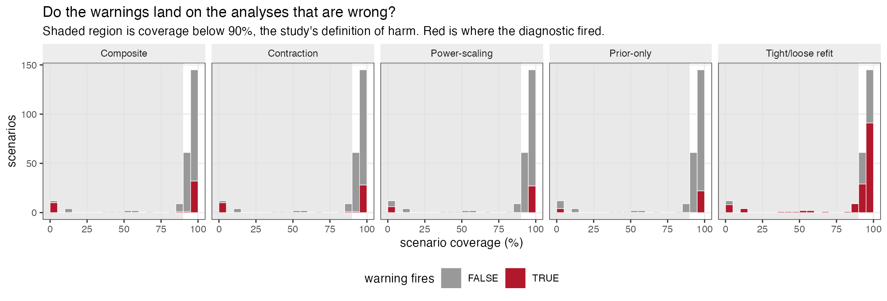
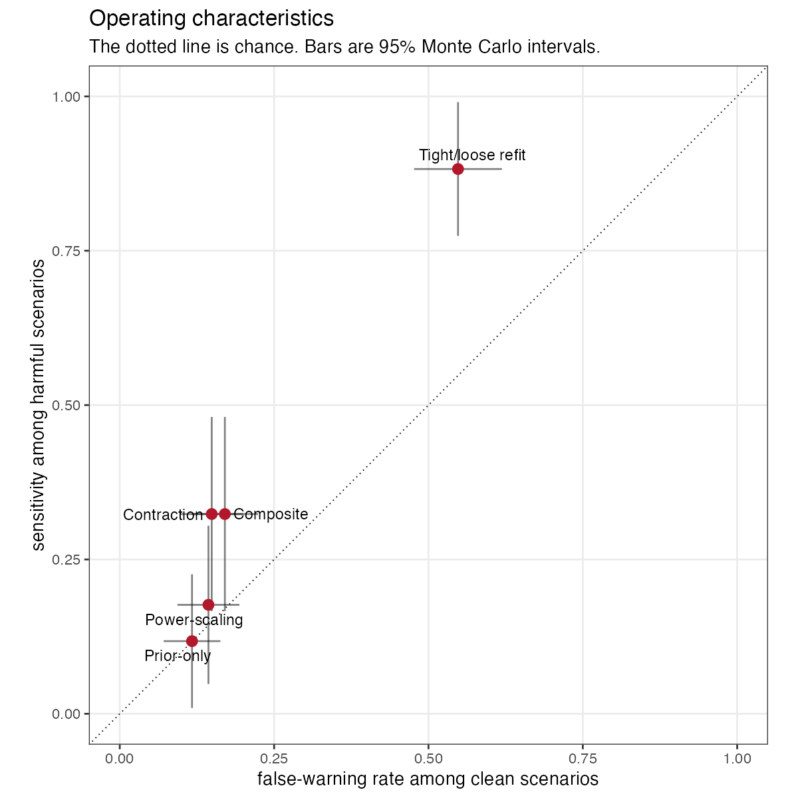
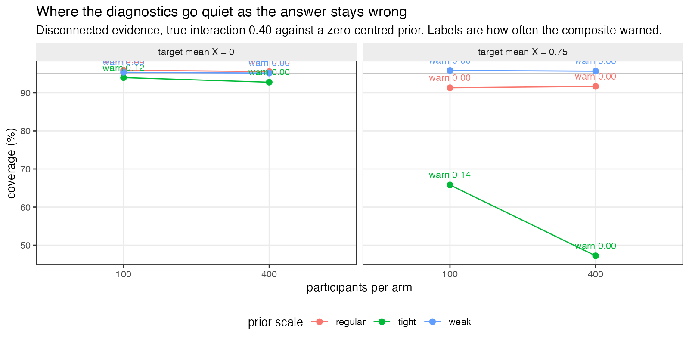

```{r setup}
S <- ".."
s <- read.csv(file.path(S, "results", "summary.csv"), stringsAsFactors = FALSE)
oc <- read.csv(file.path(S, "results", "operating-characteristics.csv"), stringsAsFactors = FALSE)
s$harmful <- s$coverage < 0.90
s$clean <- s$coverage >= 0.94
f2 <- function(x, d = 2) formatC(x, format = "f", digits = d)
f3 <- function(x) formatC(x, format = "f", digits = 3)
pct <- function(x, d = 1) paste0(formatC(100 * x, format = "f", digits = d), "%")
NICE <- c(r_contraction = "Contraction", r_prioronly = "Prior-only benchmark",
          r_powerscale = "Power-scaling", r_refit = "Tight and loose refit",
          composite = "Composite (2 of 4)")
oc$Rule <- NICE[oc$rule]
comp <- oc[oc$rule == "composite", ]

real <- s[!s$positive_control, ]
fires <- function(v) v >= 0.5
ocr <- do.call(rbind, lapply(names(NICE), function(r) {
  f <- fires(real[[paste0("fire_", r)]])
  data.frame(Rule = NICE[r],
             sens = if (sum(real$harmful)) mean(f[real$harmful]) else NA,
             fwr = if (sum(real$clean)) mean(f[real$clean]) else NA,
             stringsAsFactors = FALSE)
}))
n_harm <- sum(s$harmful); n_harm_real <- sum(real$harmful)
```

# Abstract {.unnumbered}

A proper prior yields a proper posterior even along directions a likelihood cannot identify,
so a narrow credible interval in a population-adjusted network can reflect the prior rather
than the evidence, and a clean $\hat R$ does not rule it out. Catalog entry CMU-02 says the
diagnostics that would expose this already exist and have never been calibrated here.

We calibrate them. In a conjugate Gaussian network where the posterior and every power-scaled
posterior are exact, so that no diagnostic is contaminated by Monte Carlo error, we measure
sensitivity and false-warning rate for prior-to-posterior contraction, a prior-only benchmark,
power-scaling sensitivity, a tight-and-loose prior refit, and a composite of the four, against
a reference defined by consequence: whether the 95% credible interval misses the truth.

**They fail.** Across `r n_harm` harmful scenarios the composite has sensitivity
`r f3(comp$sensitivity)` (Monte Carlo SE `r f3(comp$sens_mcse)`) at a false-warning rate of
`r f3(comp$false_warning)`. Outside the two engineered geometries where the likelihood was
deliberately made uninformative, sensitivity falls to
`r f3(ocr$sens[ocr$Rule == "Composite (2 of 4)"])`: roughly one harmful analysis in nine is
flagged. The only rule with high sensitivity, refitting under halved and doubled prior scales,
fires on `r pct(ocr$fwr[ocr$Rule == "Tight and loose refit"], 0)` of the clean scenarios too.

The reason is structural rather than a matter of tuning. **These diagnostics detect a weak
likelihood; the harm here comes from a tight prior that is wrong.** In the worst cells,
coverage is zero and the composite warns on
`r f3(min(s$fire_composite[s$geometry == "disconnected" & s$gamma_C == 0.40 & s$n_arm == 400]))`
of replicates, and increasing the sample size makes the warning quieter while the answer stays
just as wrong.

# The problem {#sec-problem}

Bayesian evidence synthesis in a population-adjusted network routinely estimates quantities the
data barely identify: an interaction informed only by between-study variation, a contrast
across a gap in the network, a component effect appearing in few arms. A proper prior with
finite marginal likelihood produces a proper posterior along every one of those directions.
The output is formatted identically to an estimate the data determined.

Convergence diagnostics do not help, because they interrogate the sampler rather than the
likelihood's contribution. CMU-02 states the position precisely: the diagnostics that would
expose the problem exist as general Bayesian workflow tools, power-scaling sensitivity
[@kallioinen2024] with `priorsense` on CRAN and `multinma`'s prior-versus-posterior
comparison, and what is missing is their application to these models. The entry adds the
reason it matters: **prior dominance grows with scenario severity, so a single check on one
benign dataset says nothing about the cases that matter.**

That is an operating-characteristics question, and this study answers it.

# Design {#sec-design}

The protocol was registered before the run at
`studies/CMU-02-prior-driven-posteriors/protocol.md`. Reporting follows ADEMP [@morris2019].

## Why the model is exact rather than sampled

Every piece of evidence reduces without loss to a normal observation of a linear function of
the treatment parameters, so with $z \sim N(H\theta, V)$ and $\theta \sim N(m_0, S_0)$,

$$S = (H^\top V^{-1} H + S_0^{-1})^{-1}, \qquad m = S(H^\top V^{-1} z + S_0^{-1} m_0).$$ {#eq-post}

This is deliberate. The study evaluates diagnostics that detect when a posterior is held up by
its prior. Were the posterior itself a Monte Carlo approximation, every diagnostic would carry
sampling noise of unknown size and a failure to detect could not be separated from a failure
to converge. With @eq-post a failure belongs to the diagnostic. Power-scaling is exact for the
same reason: raising a normal prior to the power $\alpha$ multiplies its precision by $\alpha$,
so a power-scaled posterior is another closed-form Gaussian rather than an importance-weighted
resample.

Parameters are $\theta = (d_B, d_C, d_D, \gamma_B, \gamma_C, \gamma_D)$ with A as reference,
where $\gamma_t$ is the change in the conditional treatment effect per standard deviation of
the covariate. Between-trial heterogeneity is 0.10, treated as known.

## Factors

| Factor | Levels |
|---|---|
| Evidence about treatment C | within-IPD, AgD-wide, AgD-narrow, AgD-flat, disconnected |
| Participants per arm | 100, 400 |
| True $\gamma_C$ | 0, 0.40 |
| Prior scale | tight, regular, weak |
| Target population mean covariate | 0, 0.75 |

120 scenarios, 2000 replicates, two contrasts: the interaction $\gamma_C$ and the
target-population marginal C versus B mean difference a committee would read.

**AgD-flat and AgD-narrow are positive controls**, engineered so the likelihood carries almost
no information about the interaction. A diagnostic that fails there has failed at its easiest
task; one that fires there has done nothing impressive. Neither is evidence that such
structures are common, and results are reported with and without them.

$\gamma_C = 0$ matters because the zero-centered prior is then accidentally correct: a
prior-driven analysis is right for the wrong reason, and silence must not be credited.

## The reference standard is a consequence, not a geometry {#sec-reference}

The design as first proposed defined "prior-driven" by the share of posterior variance in
directions where likelihood precision is at most a quarter of prior precision, and evaluated
the diagnostics against it. That is circular: for a contrast aligned with one eigen-direction,
contraction is exactly $\lambda/(1+\lambda)$, so the reference cut $\lambda \le 0.25$ **is**
the diagnostic cut contraction $< 0.20$. Sensitivity of contraction against it would have been
an algebraic identity reported as diagnostic accuracy. Review of the design caught this.

The reference is therefore what goes wrong: a 95% credible interval that misses the truth. A
scenario is **harmful** when coverage falls below 0.90. No diagnostic's definition determines
that.

## Diagnostics

| Diagnostic | Fires when |
|---|---|
| Contraction | $1 - \mathrm{Var}_{\text{post}}/\mathrm{Var}_{\text{prior}} < 0.20$ |
| Prior-only benchmark | Hellinger distance to the prior $< 0.10$ and decision-probability change $< 0.05$ |
| Power-scaling | prior sensitivity $\ge 0.05$ and likelihood sensitivity $< 0.05$ |
| Tight and loose refit | posterior mean moves $> 0.25$ posterior SD, or decision probability by $> 0.05$ |
| **Composite** | at least two of the four fire |

Power-scaling is measured **distributionally**, as the Hellinger distance between base and
power-scaled posteriors per unit $\log\alpha$. A first implementation used the shift in the
posterior *mean*, and that cannot work: in a conjugate Gaussian with a zero-centered prior,
raising the prior to $\alpha$ and lowering the likelihood to $1/\alpha$ give posteriors with
identical means, so prior and likelihood sensitivity are equal by construction and a rule of
the form "prior sensitive, likelihood insensitive" can never fire. Measured that way the
diagnostic had sensitivity 0.000 everywhere, which would have been published as a property of
the method rather than of our code. The standard deviations do differ, which is why
@kallioinen2024 define the diagnostic as a divergence between the two posteriors.

The bare posterior is labelled the **no-diagnostic baseline**, not "current practice":
`multinma` ships a prior-versus-posterior plot, so what is measured here is what an *automated*
warning could achieve, not what a careful analyst reviewing plots would.

# Results {#sec-results}

`r n_harm` of `r nrow(s)` scenario-contrasts are harmful, of which `r n_harm_real` lie outside
the engineered positive controls, so the gate on estimating sensitivity only where failure was
manufactured is passed.

```{r tbl-oc}
#| label: tbl-oc
#| tbl-cap: "Operating characteristics. Sensitivity is the share of harmful scenarios in which the rule fires on a majority of replicates; the false-warning rate is the same among scenarios covering at or above 94%. Monte Carlo standard errors in brackets."
tb <- data.frame(
  Rule = oc$Rule,
  `Sensitivity` = sprintf("%s (%s)", f3(oc$sensitivity), f3(oc$sens_mcse)),
  `False-warning rate` = sprintf("%s (%s)", f3(oc$false_warning), f3(oc$fwr_mcse)),
  `Sensitivity, controls excluded` = f3(ocr$sens[match(oc$Rule, ocr$Rule)]),
  `False warning, controls excluded` = f3(ocr$fwr[match(oc$Rule, ocr$Rule)]),
  check.names = FALSE)
knitr::kable(tb, align = "lrrrr", row.names = FALSE)
```

{#fig-cov}

{#fig-oc}

The prespecified conclusion is **diagnostics fail**: the composite's sensitivity is
`r f3(comp$sensitivity)` with a Monte Carlo 95% interval reaching
`r f3(comp$sensitivity + 1.96 * comp$sens_mcse)`, below the 0.50 threshold the protocol set
for that verdict.

Two patterns underlie it.

**The sensitive rule is not specific.** Refitting under halved and doubled prior scales catches
every harmful scenario outside the controls, and also fires on
`r pct(ocr$fwr[ocr$Rule == "Tight and loose refit"], 0)` of clean ones. A warning that
accompanies half of all correct analyses is not actionable; it is a warning that the model has
a prior.

**The specific rules are not sensitive.** Contraction, the prior-only benchmark and
power-scaling each keep false warnings low and catch almost nothing outside the engineered
geometries. Requiring two of four to agree, which the design intended as a way to buy
specificity, inherits the low sensitivity rather than repairing it.

## Why: the diagnostics answer a different question {#sec-why}

{#fig-mech}

Every diagnostic here asks a version of *is the likelihood weak relative to the prior*. The
harm being measured is *is the answer wrong*, and the two come apart exactly where it matters.

The clearest case is disconnected evidence with a tight prior and a true interaction of 0.40
against a prior centered at zero. Coverage is
`r f3(max(s$coverage[s$geometry == "disconnected" & s$gamma_C == 0.40 & s$prior == "tight"]))`
at best, meaning the interval essentially never contains the truth. At 100 participants per arm
the composite warns on
`r f3(max(s$fire_composite[s$geometry == "disconnected" & s$gamma_C == 0.40 & s$prior == "tight" & s$n_arm == 100]))`
of replicates. At 400 it warns on
`r f3(max(s$fire_composite[s$geometry == "disconnected" & s$gamma_C == 0.40 & s$prior == "tight" & s$n_arm == 400]))`.

**More data makes the warning quieter while leaving the answer just as wrong.** The extra data
lets the posterior contract, which is precisely what contraction, the prior-only benchmark and
power-scaling read as reassurance. None of them can see that the prior is centered in the wrong
place, because none of them compares the prior to anything outside itself. This is the sense in
which a prior can only be understood alongside the likelihood it is paired with
[@gelman2017]: a diagnostic that examines the prior's *influence* is silent about the prior's
*location*.

Where the prior is accidentally correct, at $\gamma_C = 0$, coverage runs
`r f3(min(s$coverage[s$gamma_C == 0]))` to `r f3(max(s$coverage[s$gamma_C == 0]))` and the
composite fires in `r pct(mean(fires(s$fire_composite[s$gamma_C == 0])), 0)` of scenarios. The
analyses are right for the wrong reason and mostly unflagged, which is the same blindness seen
from the other side.

# What this answers, and what it does not {#sec-scope}

**Answers, in part.** CMU-02 asks for these diagnostics to be applied to population-adjusted
models and evaluated conditional on scenario severity rather than at one benign dataset. In a
conjugate Gaussian network with graded evidence structures, the answer is that they discriminate
poorly against the consequence that matters, and that the reason is structural: they measure
prior influence, not prior correctness. An analyst who runs them and sees nothing has learned
that the likelihood is not obviously weak, which is a much smaller claim than that the answer
is trustworthy.

**Does not answer.** The other half of CMU-02, wiring these into released software, is
untouched; neither `multinma` nor `cpaic` is run. The model is conjugate Gaussian with an
identity link, a correctly specified linear mean and known variances, so nothing here transfers
directly to a non-conjugate posterior where the diagnostics behave differently and MCMC error
enters. Only automated thresholds are evaluated; a plot read by an experienced analyst is a
different instrument and may do better. Thresholds are those the source literature suggests and
were not tuned, so a better-calibrated rule may exist, though the structural argument in
@sec-why suggests re-tuning cannot fix the failure it describes.

It bears on **CMP-14** only for the generic case of an interaction informed by aggregate data
alone. CMP-14 concerns component models and this design has treatment-specific parameters, so
the component-specific part is untouched. An earlier draft claimed IDN-06 as well; that is
withdrawn, because this design contains no within-study versus between-study discrepancy at all.

# Peer review {#sec-review}

Reviewed in two rounds by two independent reviewers. Reports, responses and the editorial
decision are published in full at
`studies/CMU-02-prior-driven-posteriors/review/peer-review.md`.

# Reproducibility {#sec-repro}

```{r prov, results='asis'}
p <- file.path(S, "results", "provenance.md")
if (file.exists(p)) cat(paste(readLines(p)[-(1:2)], collapse = "\n"))
```

```bash
Rscript R/03-run.R
Rscript R/04-analyze.R
Rscript R/05-figures.R
```

# References {.unnumbered}

::: {#refs}
:::
