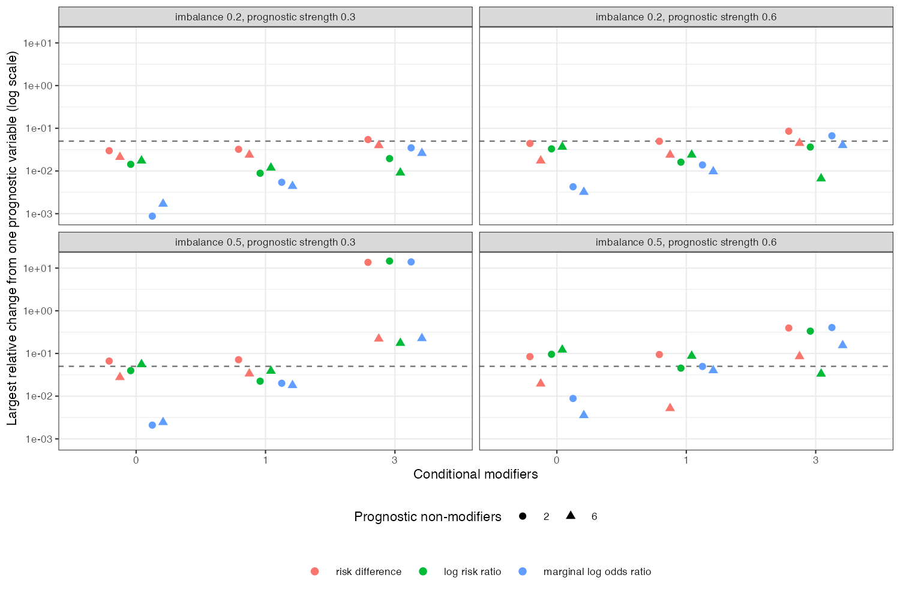

```{r setup}
r <- read.csv("../results/sets.csv")
f3 <- function(x) formatC(x, format = "f", digits = 3)
w <- reshape(r[, c("scen", "m", "k", "g", "mu", "scale", "n_prog_in")], idvar = c("scen", "m", "k", "g", "mu"), timevar = "scale", direction = "wide")
differ <- w$n_prog_in.lor != w$n_prog_in.rd | w$n_prog_in.lor != w$n_prog_in.clor | w$n_prog_in.rd != w$n_prog_in.clor
anym <- w$n_prog_in.rd > 0 | w$n_prog_in.lrr > 0 | w$n_prog_in.lor > 0
nest <- w$n_prog_in.lor >= w$n_prog_in.rd
md <- function(sc) median(r$max_rel_prog[r$scale == sc])
near <- r[r$scale == "lor" & abs(r$contrast) < 0.1, ]
```

# Abstract {.unnumbered}

**Background.** Effect modification is scale-specific, and on non-collapsible scales purely
prognostic covariates change marginal contrasts. Catalog problem COV-02 asks how the set of
covariates a transported contrast depends on differs between the scales a decision might use.

**Methods.** Population-level calculation with a logistic outcome model: zero, one or three
conditional modifiers, two or six prognostic non-modifiers, two prognostic strengths and two
imbalances between source and target (24 scenarios). For each covariate we computed how much
leaving it unbalanced changed the target contrast on the risk difference, log risk ratio,
marginal log odds ratio and conditional log odds ratio scales, and counted it in the scale's
set if the change exceeded 5% of the contrast.

**Results.** The conditional log odds ratio set never contained a prognostic non-modifier;
some marginal scale's set did in `r sum(anym)` of 24 scenarios. The sets differed between the
risk difference, marginal and conditional odds ratio scales in `r sum(differ)` of 24, below the
registered threshold of half, so the refuting sentence holds as registered. DESIGN.md's
prediction that the marginal odds ratio set contains the risk-difference set failed in
`r sum(!nest)` scenarios, because with a logistic model every prognostic variable modifies the
risk difference. The median relative change from leaving one prognostic variable unbalanced
was `r f3(md("rd"))` on the risk difference, `r f3(md("lrr"))` on the log risk ratio and
`r f3(md("lor"))` on the marginal log odds ratio scale: the risk difference, not the odds ratio,
was the most sensitive.

**Conclusion.** The covariates a transport must balance depend on the decision scale, and
prognostic variables can matter on every marginal scale, the risk difference included. The
dependence is a matter of degree around any threshold, not a nested rule; declare the scale and
balance prognostic variables that are imbalanced.

# The problem {#sec-problem}

With a logistic model the conditional risk difference is
$\operatorname{expit}(\alpha + \gamma^\top x + \delta + \beta^\top x) - \operatorname{expit}(\alpha + \gamma^\top x)$, which
depends on $\gamma^\top x$ even when $\beta = 0$. DESIGN.md said that on the risk-difference scale
only conditional modifiers matter; that holds for a linear-risk model, not a logistic one. On
the marginal odds ratio scale prognostic variables enter through non-collapsibility
[@daniel2021]. Only the conditional log odds ratio depends on modifiers alone.

# Design {#sec-design}

Registered protocol: `protocol.md`. $\operatorname{logit}p = \operatorname{logit}(0.25) + g\sum_jx_j + A(-0.5 + 0.3\sum_{j\le m}x_j)$;
source $x \sim N(0, I)$, target $N(\mu\mathbf 1, I)$. Balancing a covariate's mean moves it to its
target law (independent normals); an unbalanced covariate stays at its source law. Contrasts
from $10^6$ common random draws.

# Results {#sec-results}

{#fig-change}

The relative changes (@fig-change) rose with imbalance and prognostic strength on every
marginal scale and were zero on the conditional one. Which marginal scale was most sensitive
depended on the scenario: with many prognostic variables the log risk ratio crossed the
threshold where the risk difference and odds ratio did not, and with few the risk difference
crossed first. Because the changes sit close to any fixed threshold, set membership flipped with
small changes in the scenario, which is why a nested rule does not describe it. Where the target
contrast itself was near zero (`r nrow(near)` scenarios with three modifiers and larger imbalance,
contrast `r f3(max(near$contrast))` or closer to zero on the odds ratio scale) relative changes were
very large and set membership says little; absolute changes are the better guide there.

# What this does not answer {#sec-limits}

No time-to-event scale; no sampling, so how well the sets can be estimated (COV-01) and the
cost of balancing more covariates are not studied; independent normal covariates. Peer review
has not been done.

# References {.unnumbered}
