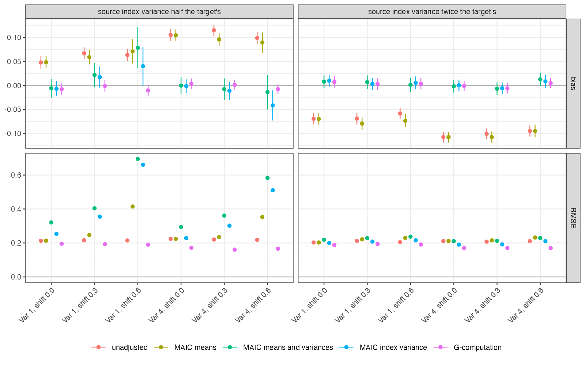

```{r setup}
s <- read.csv("../results/summary.csv")
f3 <- function(x) formatC(x, format = "f", digits = 3); f0 <- function(x) formatC(x, format = "f", digits = 0)
p <- s[s$design == "anchored" & s$em == "none" & s$ratio %in% c(0.5, 2) & s$var_T %in% c(1, 4), ]
m <- function(k, d = p) d[d$method == k, ]
mm <- m("maic_means"); mv <- m("maic_meanvar"); mi <- m("maic_index"); gc <- m("gcomp")
big <- mm$mcse * 1.96 < abs(mm$bias) - 0.05
nv <- s[s$design == "anchored" & s$em == "none" & s$method == "unadjusted", ]
fit <- stats::lm(bias ~ exact_unadj, data = nv, weights = 1 / nv$mcse^2)
r05 <- p$ratio == 0.5
un <- s[s$design == "unanchored", ]
```

# Abstract {.unnumbered}

**Background.** Guidance for anchored population adjustment says only effect
modifiers need balancing, because purely prognostic covariates cancel in the relative
effect. On the log odds ratio scale that is false: the marginal odds ratio depends on
the spread of prognosis in the population (Remiro-Azócar 2024,
doi:10.1002/sim.10111). Catalog problem COV-03 asks whether this matters in practice.

**Methods.** Anchored and unanchored binary-outcome comparisons, 500 per arm, three
purely prognostic covariates. We varied the variance of the prognostic index in the
target, its ratio between source and target, the target mean shift and effect
modification: 108 scenarios, 1000 replicates each. MAIC on means, MAIC on means and
variances, MAIC on means and the variance of an estimated prognostic index, and
G-computation.

**Results.** In the 12 primary anchored scenarios without effect modification, MAIC on
means was biased by `r f3(min(abs(mm$bias)))` to `r f3(max(abs(mm$bias)))` on the log odds
ratio scale, beyond 0.05 in `r sum(big)`; balancing variances cut it to
`r f3(sort(abs(mv$bias))[11])` or less in 11 scenarios (`r f3(max(abs(mv$bias)))` in the one with
an effective sample size of `r f0(min(mv$ess))`). The unadjusted bias matched the exact population bias (slope
`r f3(coef(fit)[[2]])`). The price was effective sample size: when the source's
prognostic spread was half the target's, balancing variances left `r f0(min(mv$ess[mv$ratio == 0.5]))`
to `r f0(max(mv$ess[mv$ratio == 0.5]))` of 1000 and raised RMSE above that of MAIC on means.
G-computation was unbiased (at most `r f3(max(abs(gc$bias)))`) with the lowest RMSE in every
primary scenario.

**Conclusion.** On a non-collapsible scale an anchored comparison must account for
differences in the spread of prognosis between trials. G-computation does so without
losing precision; with MAIC, balancing variances helps when the source's prognostic
spread exceeds the target's and costs more than it gains when it is smaller.

# The problem {#sec-problem}

With prognostic index $u = \gamma^\top x$ and no effect modification, the marginal log
odds ratio in population $F$ is
$\operatorname{logit}\int\operatorname{expit}(\alpha + u + \delta)\,dF - \operatorname{logit}\int\operatorname{expit}(\alpha + u)\,dF$,
which moves toward zero as $\operatorname{Var}_F(u)$ grows and also depends on the index
mean. The A versus C effect in the source differs from the one in the target even with
no modification, and MAIC [@signorovitch2010] on means leaves the difference in spread
untouched. DESIGN.md claimed the effect depends on $F$ only through $\operatorname{Var}(u)$;
the probe showed a mean shift alone moves it by 0.004 to 0.018.

# Design {#sec-design}

Registered protocol: `protocol.md`; ADEMP structure [@morris2019]. Source A versus C
with $x \sim N(0, rI_3)$; target B versus C reporting arm events and covariate means and
SDs, $x \sim N(s\mathbf 1, I_3)$. $\operatorname{logit}P(y = 1) = \operatorname{logit}(0.3) + g\sum_jx_j + \delta_t + \beta x_1\mathbb 1[A]$.
Factors: $\operatorname{Var}_T(u) = 3g^2 \in \{0.25, 1, 4\}$; $r \in \{0.5, 1, 2\}$;
$s \in \{0, 0.3, 0.6\}$; $\beta \in \{0, 0.4\}$; anchored or unanchored. G-computation fits
the logistic model in the source and marginalizes over normals with the published
moments. Primary scenarios: anchored, no modification, $r \ne 1$, $\operatorname{Var}_T(u) \ge 1$.

# Results {#sec-results}

{#fig-primary}

MAIC on means removed none of the bias that the unadjusted Bucher comparison carried
when prognostic spread differed (@fig-primary): both were biased in the direction the
exact calculation predicted, negative when the source was more dispersed. Balancing
variances or the index variance removed it in all 12 scenarios.

Effective sample size decided whether that removal paid. With the source less
dispersed than the target, variance balancing had to up-weight the few extreme source
patients, and its RMSE exceeded that of MAIC on means in
`r sum(mv$rmse[r05] > mm$rmse[r05])` of 6 scenarios. With the source more dispersed, it
cost little: balancing the index variance lowered RMSE in
`r sum(mi$rmse[!r05] < mm$rmse[!r05])` of 6 scenarios and balancing every variance in
`r sum(mv$rmse[!r05] < mm$rmse[!r05])`, the rest within 0.01. Balancing only the estimated index variance kept more
effective sample size than balancing every variance
(`r f0(mean(mi$ess))` against `r f0(mean(mv$ess))` on average) with similar bias.

With effect modification present the same pattern held (largest MAIC-on-means bias
`r f3(max(abs(s$bias[s$design == "anchored" & s$em == "present" & s$method == "maic_means"])))`).
Unanchored, every adjustment beat the unadjusted comparison, whose bias reached
`r f3(max(abs(un$bias[un$method == "unadjusted"])))`, and G-computation was again unbiased.
Controls held: with identical populations every method was unbiased, and the positive
control was biased as predicted.

# What this does not answer {#sec-limits}

Independent normal covariates and a correctly specified logistic model, which favor
G-computation; with a misspecified outcome model its advantage can reverse. Hazard
ratios, skewed covariates and augmented estimators were not run. MAIC intervals treat
the weights as fixed. Peer review has not been done.

# References {.unnumbered}
