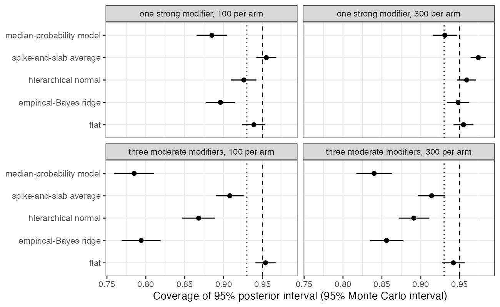

# Shrinkage priors on interactions do not give honest intervals for a
transported effect
Ahmad Sofi-Mahmudi
2026-09-23

# Abstract

**Background.** Simulated treatment comparison needs the
treatment-by-covariate interactions, and with many candidates analysts
shrink or select them. Continuous shrinkage does not select, so its
posterior interval is often taken to be honest by construction. Catalog
problem COV-04 asks whether it is.

**Methods.** Continuous-outcome STC with eight candidate interactions,
one strong modifier or three moderate ones, 100 or 300 patients per arm;
1000 replicates per cell with the whole procedure rerun each time. Five
priors on the interactions: flat, empirical-Bayes ridge, hierarchical
normal, spike-and-slab averaging and the median-probability model.

**Results.** Coverage of the transported effect’s 95% interval was 0.794
to 0.948 for empirical-Bayes ridge, 0.868 to 0.959 for the hierarchical
normal, 0.908 to 0.974 for spike-and-slab averaging, 0.785 to 0.931 for
the median-probability model and 0.939 to 0.955 for the flat prior.
Every non-flat prior’s bias was negative, toward no effect modification,
reaching 0.191 with three moderate modifiers at 100 per arm.

**Conclusion.** Shrinkage does not select but it still undercovers: when
the interactions the target weights push the effect in one direction,
their joint shrinkage biases the transported effect and the narrower
interval does not carry that bias. Only the flat prior was honest in
every cell.

# The problem

The transported effect in STC is the conditional effect plus the
interactions weighted by the target’s covariate means. Shrinking the
interactions toward zero pulls that sum toward the source-population
effect. If the interactions share a sign relative to the target shift,
the pull accumulates rather than averaging out. A posterior interval is
centered on the shrunk sum and is narrower than the flat one, so whether
it covers at a fixed truth is an empirical question, not a property of
the prior class. The median-probability model ([1](#ref-barbieri2004))
conditions on a selected set and is the Bayesian form of DEC-11’s
selection problem.

# Design

Registered protocol: `protocol.md`; ADEMP as in ([2](#ref-morris2019)).
Eight independent $N(0, 1)$ covariates;
$y = 0.5\sum_j x_j + A(-0.5 + \sum_m \beta_m x_m) + e$,
$e \sim N(0, 1)$, with $\beta = 0.5$ on one covariate or $0.25$ on
three. Target covariate means 0.5; estimand $-0.5 + 0.5\sum_m\beta_m$.
Main effects flat, residual SD plugged in, conjugate normal posteriors
computed exactly. Empirical-Bayes ridge sets the interaction prior SD by
maximizing the marginal likelihood; the hierarchical normal integrates
it over a half-Cauchy(0, 0.5) prior ([3](#ref-gelman2006));
spike-and-slab averages over all 256 inclusion patterns (slab SD 0.5,
inclusion probability 0.5).

# Results

Figure 1: Coverage by prior. Dashed: nominal 0.95; dotted: the
registered threshold 0.93.

Table 1: 1000 replicates per cell; coverage MCSE at most 0.013.

| n per arm | modifiers      | prior        |   bias | coverage | width |
|----------:|----------------|--------------|-------:|---------:|------:|
|       100 | one strong     | eb ridge     | -0.109 |    0.896 | 0.813 |
|       100 | one strong     | flat         | -0.002 |    0.939 | 1.004 |
|       100 | one strong     | hier normal  | -0.105 |    0.926 | 0.862 |
|       100 | one strong     | median model | -0.030 |    0.885 | 0.664 |
|       100 | one strong     | spike slab   | -0.036 |    0.955 | 0.829 |
|       300 | one strong     | eb ridge     | -0.045 |    0.948 | 0.523 |
|       300 | one strong     | flat         |  0.003 |    0.955 | 0.562 |
|       300 | one strong     | hier normal  | -0.042 |    0.959 | 0.534 |
|       300 | one strong     | median model | -0.004 |    0.931 | 0.372 |
|       300 | one strong     | spike slab   | -0.005 |    0.974 | 0.450 |
|       100 | three moderate | eb ridge     | -0.191 |    0.794 | 0.784 |
|       100 | three moderate | flat         | -0.007 |    0.954 | 1.003 |
|       100 | three moderate | hier normal  | -0.181 |    0.868 | 0.869 |
|       100 | three moderate | median model | -0.127 |    0.785 | 0.686 |
|       100 | three moderate | spike slab   | -0.138 |    0.908 | 0.865 |
|       300 | three moderate | eb ridge     | -0.093 |    0.856 | 0.511 |
|       300 | three moderate | flat         | -0.004 |    0.942 | 0.563 |
|       300 | three moderate | hier normal  | -0.088 |    0.891 | 0.542 |
|       300 | three moderate | median model | -0.037 |    0.840 | 0.418 |
|       300 | three moderate | spike slab   | -0.056 |    0.914 | 0.505 |

The registered failure condition held: both continuous-shrinkage priors
covered below 0.93 beyond Monte Carlo error, worst with three moderate
modifiers at 100 per arm (empirical-Bayes ridge 0.794, hierarchical
normal 0.868). Three moderate modifiers were worse than one strong one
because each is individually weak and is shrunk further, while the
target sums all three.

Integrating the prior scale instead of plugging in its maximum recovered
part of the loss (0.794 to 0.868), which is the uncertainty in the
fitted scale that DESIGN.md pointed to. The rest is the bias a
zero-centered prior imposes at a fixed nonzero truth, and fully Bayesian
averaging does not remove it. Spike-and-slab averaging undercovered less
(lowest 0.908) because its slab leaves included interactions nearly
unshrunk. Selecting the median-probability model and conditioning on it
was the worst prior at 300 per arm and within 0.011 of the
empirical-Bayes ridge at 100.

Larger trials reduced every bias, and with one strong modifier at 300
per arm every prior except the median-probability model covered at least
0.948.

# What this does not answer

Continuous outcome with conjugate normal priors; the regularized
horseshoe, heredity constraints and projection-predictive selection were
not run. All true interactions were nonnegative and the target shift was
the same for every covariate, which is the aligned case; with
interactions of mixed sign relative to the shift the shrinkage bias
partly cancels and coverage should be closer to nominal. No null
scenario without modifiers. Peer review has not been done.

# References

1.
Maria Maddalena Barbieri, James O.
Berger. Optimal predictive model selection. The Annals of Statistics.
2004;32(3):870–97.
doi:[10.1214/009053604000000238](https://doi.org/10.1214/009053604000000238)

2.
Tim P. Morris, Ian R. White,
Michael J. Crowther. Using simulation studies to evaluate statistical
methods. Statistics in Medicine. 2019;38(11):2074–102.
doi:[10.1002/sim.8086](https://doi.org/10.1002/sim.8086)

3.
Andrew Gelman. Prior distributions
for variance parameters in hierarchical models. Bayesian Analysis.
2006;1(3):515–34.
doi:[10.1214/06-BA117A](https://doi.org/10.1214/06-BA117A)

