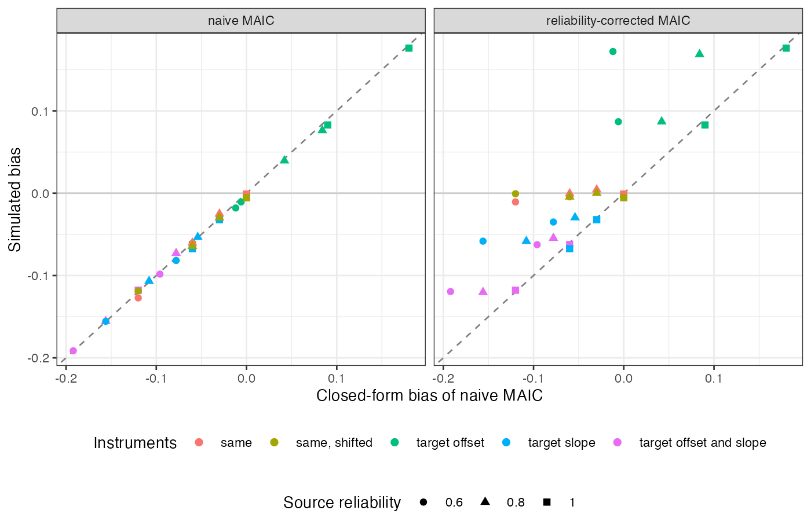

```{r setup}
s <- read.csv("../results/summary.csv")
f3 <- function(x) formatC(x, format = "f", digits = 3)
nv <- s[s$method == "naive", ]; rc <- s[s$method == "reliability_corrected", ]; bd <- s[s$method == "bounded", ]
fit <- stats::lm(bias ~ predicted, data = nv, weights = 1 / nv$mcse^2)
sh <- c("same", "same_shifted")
rcs <- rc[rc$scen %in% sh & rc$beta > 0, ]; rcd <- rc[!rc$scen %in% sh & rc$beta > 0, ]
g <- function(d, sc, r, b = 0.6) d[d$scen == sc & d$rel == r & d$beta == b, ]
wr <- bd$width / nv$width[match(bd$cell, nv$cell)]
```

# Abstract {.unnumbered}

**Background.** MAIC balances a covariate by name. When the source trial and the
target publication measured it with different instruments, the matched means agree
on paper while the underlying populations do not. Catalog problem COV-09 asks how
MAIC is biased and whether a reliability correction repairs it.

**Methods.** Latent effect modifier recorded in the source and reported by the target
through linear instruments with offsets, slopes and measurement error. Five instrument
pairs, source reliability 1, 0.8 or 0.6, modification 0, 0.3 or 0.6: 45 scenarios,
1000 replicates each. Naive MAIC, MAIC with a reliability correction, and an envelope
of corrected intervals over declared instrument differences.

**Results.** Naive bias followed its closed form (slope `r f3(coef(fit)[[2]])`). With a
shared instrument the reliability correction removed the bias (at most
`r f3(max(abs(rcs$bias)))`). With differing instruments it left bias up to
`r f3(max(abs(rcd$bias)))` and could increase it: at reliability 0.6 a target offset
and the attenuation cancelled in the naive analysis (bias
`r f3(g(nv, "target_offset", 0.6)$bias)`), and the correction undid the cancellation
(`r f3(g(rc, "target_offset", 0.6)$bias)`). The envelope over declared instrument
differences covered `r f3(min(bd$coverage))` or more at `r formatC(min(wr), format = "f", digits = 1)`
to `r formatC(max(wr), format = "f", digits = 1)` times the naive width.

**Conclusion.** A balance table cannot show instrument differences, and no source-side
correction identifies them. Where instruments may differ, report a bounded analysis over
declared differences.

# The problem {#sec-problem}

The source records $X_S = a_S + b_SX + e_S$ and the target reports the mean of
$X_T = a_T + b_TX + e_T$. MAIC [@signorovitch2010] tilts the source on $X_S$ to the
reported mean. For a normal source the latent mean moves by
$\kappa = b_S/(b_S^2 + \operatorname{Var}e_S)$ times the shift in $X_S$, so with effect
modification $\beta$ the transported effect is biased by
$\beta\{\mu_T - \kappa(a_T + b_T\mu_T - a_S)\}$. With one shared instrument the bias is
attenuation by the source reliability, and dividing by a known reliability repairs it.
With different instruments the bias has either sign, and nothing in the source data
identifies $a_T$ or $b_T$.

# Design {#sec-design}

Registered protocol: `protocol.md`; ADEMP structure [@morris2019]. Latent
$X \sim N(0, 1)$ in the source (200 per arm) and $N(0.5, 1)$ in the target;
$y = 0.5X + A(-0.4 + \beta X) + e$. Instrument pairs $(a_S, b_S, a_T, b_T)$: same
$(0,1,0,1)$; same, shifted $(0.3, 0.8, 0.3, 0.8)$; target offset $(0,1,0.3,1)$; target
slope $(0,1,0,0.8)$; target offset and slope $(0,1,-0.3,1.2)$. The corrected analysis
disattenuates the target point assuming one instrument and a known reliability. The
bounded analysis takes the envelope of corrected intervals over target offsets in
$[-0.3, 0.3]$ and slopes in $[0.8, 1.2]$ relative to the source instrument, a range that
contains every simulated pair.

# Results {#sec-results}

{#fig-bias}

Naive bias matched the closed form in all 45 scenarios (@fig-bias), and with no
modification it was zero whatever the instruments. The reliability correction moved
shared-instrument scenarios onto zero and left differing-instrument scenarios where the
instrument difference put them. Coverage of the corrected interval fell to
`r f3(min(rcd$coverage))` for differing instruments.

The bounded analysis contains the truth whenever the declared range contains the true
instrument difference, which it did here by construction; its cost was width. It does
not protect against differences outside the declared range.

# What this does not answer {#sec-limits}

Identity link and linear instruments; cut-point misclassification of binary covariates
and correction from a bridging sample measured on both instruments were not run. The
target's reported mean was its population value, so target sampling error is absent.
Peer review has not been done.

# References {.unnumbered}
