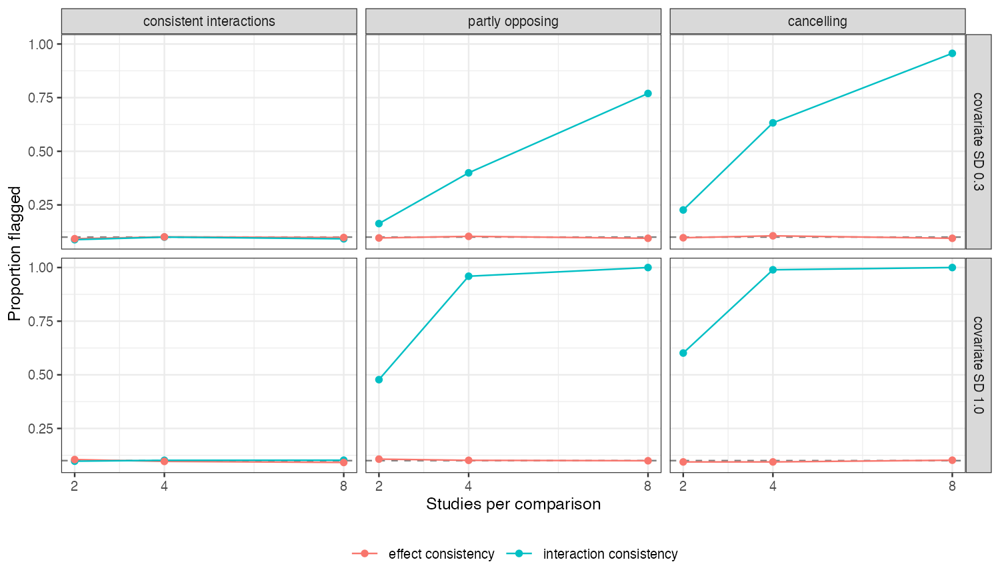

```{r setup}
s <- read.csv("../results/summary.csv")
f3 <- function(x) formatC(x, format = "f", digits = 3); f2 <- function(x) formatC(x, format = "f", digits = 2)
inc <- s[s$scen != "consistent" & s$loop == 0, ]; pa <- s[s$scen == "partial", ]; ca <- s[s$scen == "cancelling", ]
cw <- ca[ca$sdx == 1 & ca$M == 4 & ca$loop == 0, ]
ic <- function(sc, sd, m) s$int_cons[s$scen == sc & s$sdx == sd & s$M == m & s$loop == 0]
```

# Abstract {.unnumbered}

**Background.** In network meta-regression the treatment-by-covariate interactions satisfy
a consistency equation of their own. If direct and indirect paths carry opposing
interactions, the pooled coefficient can be near zero while the usual consistency check on
treatment effects passes. Catalog problem COV-10 asks how often this happens, what it costs
and whether an interaction-consistency check detects it.

**Methods.** Triangle networks with two, four or eight studies per comparison, covariate
spread across studies of 0.3 or 1 SD, path interaction slopes that were consistent, partly
opposing or cancelling (modification of 0.3 on every path pooling to zero), and treatment
effects consistent or not: 36 scenarios, 2000 replicates each.

**Results.** The effect-consistency check flagged `r f3(min(inc$eff_cons))` to
`r f3(max(inc$eff_cons))` of analyses with inconsistent interactions, its null rate. The pooled
interaction for the cancelling configuration averaged `r f3(mean(ca$bC))`; its spread across
analyses was `r f2(min(ca$sd_bC / ca$mean_se_bC))` to `r f2(max(ca$sd_bC / ca$mean_se_bC))` times its model SE
(`r f3(cw$sd_bC)` against `r f3(cw$mean_se_bC)` with four studies and wide spread), so a Wald test still selected the covariate in up to
`r f3(max(ca$select))` of analyses. Either way the target effect was biased: by `r f3(max(pa$bias_sel))`
to `r f3(min(pa$bias_sel))` with partly opposing and `r f3(max(ca$bias_sel))` to `r f3(min(ca$bias_sel))`
with cancelling interactions. An interaction-consistency check detected it in
`r f3(min(inc$int_cons))` to `r f3(max(inc$int_cons))` of analyses depending on study count and
covariate spread.

**Conclusion.** Cancellation is not a knife-edge: partial opposition attenuates the pooled
interaction across a continuum and biases the target effect. Check the consistency of
interactions directly; a passed effect-consistency check says nothing about them.

# The problem {#sec-problem}

Consistency requires $d_{BC} = d_{AC} - d_{AB}$ for effects and, separately,
$\beta_{BC} = \beta_{AC} - \beta_{AB}$ for interactions. With equal precision on the three paths a
consistency meta-regression estimates C's interaction as $(s_{AB} + 2s_{AC} + s_{BC})/3$ from the
path slopes, so slopes of $-0.3$, $0.3$ and $-0.3$ give zero although each path is modified.
The effect check [@bucher1997] compares intercepts, not slopes, and cannot see it.

# Design {#sec-design}

Registered protocol: `protocol.md`; ADEMP structure [@morris2019]. Study estimates with SE 0.1;
covariate means $N(0.5, \text{SD}^2)$; effects $d_{AB} = -0.3$, $d_{AC} = -0.5$, $d_{BC} = -0.2$ plus a
loop shift of 0 or 0.2. Path slopes $(aB, B, cB)$, $B = 0.3$: consistent $(0, 1)$, partly
opposing $(-0.5, -0.5)$, cancelling $(-1, -1)$. The covariate is kept if the Wald test of both
interactions has $p < 0.10$. Target: C versus A at covariate 1.5 with the AC path's truth.

# Results {#sec-results}

{#fig-checks}

The two checks responded to different parameters (@fig-checks): the interaction check
reached `r f3(ic("cancelling", 1, 8))` with eight studies and wide covariate spread but only
`r f3(ic("cancelling", 0.3, 2))` with two studies and narrow spread, while the effect check
fired only when effects themselves were inconsistent.

The masking showed in the value of the pooled coefficient, not in selection: under
inconsistency the model-based SE assumes the paths agree, so the estimate scattered well
beyond it and the Wald test often rejected. Whether selected or not, the analysis used an
attenuated interaction and missed the target by 0.13 to 0.30. With consistent interactions
and narrow covariate spread, selection itself cost coverage (as low as
`r f3(min(s$cov_sel[s$scen == "consistent" & s$sdx == 0.3]))`) because the covariate was often dropped.

# What this does not answer {#sec-limits}

Stylized triangles with continuous study estimates; the design-by-treatment interaction
model and larger networks were not run. Per-path regressions with two studies and narrow
covariate spread were unstable, so the AC-path estimates in `results/decision.md` are not
interpretable there. Peer review has not been done.

# References {.unnumbered}
