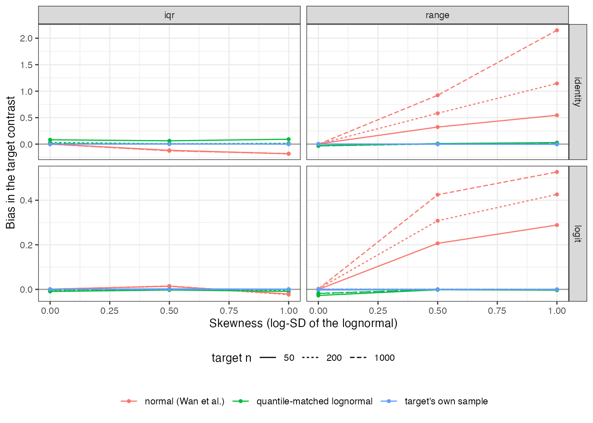

# Reconstructing a target covariate from a median: when the mean is
enough and when it is not
Ahmad Sofi-Mahmudi
2026-09-23

# Abstract

**Background.** Integration-based population adjustment needs the
target’s whole covariate marginal, and publications often report a
skewed covariate as a median with interquartile range or range. Catalog
problem COV-12 asks whether the error this puts into the transported
contrast is controlled by the error in the reconstructed mean, which is
what median-to-mean estimators minimize.

**Methods.** A known conditional model was integrated over reconstructed
target marginals so that reconstruction was the only error. Seventy-two
scenarios crossed the link (identity, logit), skewness (none, moderate,
strong), the reported summary (median with IQR or with range), target
size (50, 200, 1000) and effect modification, 1000 replicates each.
Reconstructions: a normal law with Wan et al.’s mean and SD
([1](#ref-wan2014)), and a shifted lognormal matched to the reported
quantiles.

**Results.** Under the identity link, contrast error equaled the
modification coefficient times the mean error exactly (slope 1.000,
$R^2$ 1.000). Under the logit link it did not ($R^2$ 0.597). With strong
skew and a reported range, the normal reconstruction biased the contrast
by 1.145 (identity) and 0.426 (logit) at 200 patients, and the bias grew
with sample size because the range does. The quantile-matched lognormal
kept every bias within 0.092.

**Conclusion.** The mean is the right target for a collapsible, linear
adjustment and the wrong one for a curved link, where the variance and
shape of the reconstruction also reach the estimate. For a skewed
covariate reported with a range, a normal reconstruction is badly wrong;
a reconstruction that respects the asymmetry of the reported quantiles
is not.

# The problem

For a reconstructed marginal $\hat F$, the contrast error is
$\int\tau(x)\,d(\hat F - F)$. With an identity link and linear
$\tau(x) = \tau_0 + \beta x$, it is $\beta(\hat{\bar x} - \bar x)$: only
the mean matters. With a logit link the marginal contrast integrates a
nonlinear function, so the reconstruction’s variance and higher moments
enter. Reporting a median with a range is itself a signal of skew, which
is where a normal reconstruction’s shape is wrong.

# Design

Registered protocol: `protocol.md`. The target covariate is lognormal
with log-SD 0, 0.5 or 1, rescaled to mean 1 and SD 1. Conditional
A-versus-C effect $-0.6 + \beta x$ with prognostic slope 0.8, on the
identity or logit scale (logit baseline $\operatorname{logit}(0.3)$),
$\beta \in \{0.3, 0.8\}$, held known. Truth integrates over 2000
quantiles of the true law. A third arm integrates over the target’s own
sample, the floor for any reconstruction; the registered regression uses
errors net of that floor. After registration, the regressor was
corrected to measure mean error against the sample mean; two completed
cells were discarded unread (see `protocol.md`).

# Results

Figure 1: Bias in the target contrast by skewness, reported summary and
link ($\beta = 0.8$).

The registered test separates the two links: the refuting sentence holds
under the identity link and fails under the logit link. Under the
identity link the normal reconstruction’s bias is entirely its biased
mean, which reaches -0.123 with moderate skew and an IQR and 2.150 with
strong skew, a range and 1000 patients
(<a href="#fig-bias" class="quarto-xref">Figure 1</a>). Under the logit
link the contrast is less sensitive to the mean but carries errors the
mean does not explain. The lognormal reconstruction’s bias stayed within
0.092 in every scenario. It is not free without skew: sampling asymmetry
in the reported quantiles triggers it, and its bias there reached 0.082
against 0.005 for the normal reconstruction.

# What this does not answer

One covariate with a known conditional model; in practice the outcome
model is also estimated and a multivariate marginal needs a dependence
structure (CMP-15). The lognormal matcher suits right skew; other
shapes, bounded scales and bimodality are not tested. ML-NMR integration
is represented by direct integration over the reconstructed law. Peer
review has not been done.

# References

1.
Xiang Wan, Wenqian Wang, Jiming
Liu, Tiejun Tong. Estimating the sample mean and standard deviation from
the sample size, median, range and/or interquartile range. BMC Medical
Research Methodology. 2014;14:135.
doi:[10.1186/1471-2288-14-135](https://doi.org/10.1186/1471-2288-14-135)

