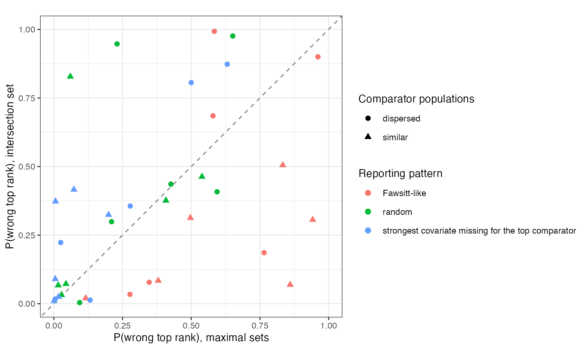

# Comparators reporting different covariates: neither the maximal nor
the common adjustment set protects the ranking
Ahmad Sofi-Mahmudi
2026-09-23

# Abstract

**Background.** One individual-data trial is often compared, unanchored,
with several aggregate comparators that report different covariates.
Adjusting each contrast for all it reports (maximal sets) minimizes each
contrast’s bias; adjusting every contrast for the covariates all
comparators report (intersection) makes the omissions common. Catalog
problem COV-14 asks whether the intersection gives the better ranking.

**Methods.** MAIC of one trial against four comparators with nine
covariates. Three reporting patterns, three covariate strengths, similar
or dispersed comparator populations, separated or nearly tied true
effects: 36 scenarios and 8 controls, 1000 replicates each.

**Results.** In the registered primary scenarios the maximal sets gave
both lower bias and fewer wrong top ranks (0.199 against 0.324; 0.073
against 0.416; 0.006 against 0.373, maximal against intersection), so
the predicted inversion was not confirmed there. It held in all six
Fawsitt-like scenarios with similar populations (for example 0.942
against 0.306). Over all 36 scenarios the intersection ranked better in
15 and the maximal sets in 19. The intersection’s per-contrast bias was
a median 2.42 times the maximal. The difference between the two analyses
did not flag a wrong top rank (AUROC 0.567). A bounded analysis that
lets each unreported mean range over the other comparators’ reported
means covered at least 0.929 with similar populations at 1.00 to 1.99
times the maximal width, and 0.678 with dispersed populations.

**Conclusion.** Which set ranks better depends on whether the omission
bias pushes a lower-ranked comparator past a higher one, which is not
visible in the data. Report the maximal contrasts with the bounded
analysis when comparator populations are similar.

# The problem

With independent normal covariates, MAIC ([1](#ref-signorovitch2010)) on
set $S_k$ has bias
$b_k = \sum_{m \notin S_k}(c_m + \beta_m)(\mu_{m,k} - \mu_{m,\text{IPD}})$,
with $c_m$ the prognostic coefficient and $\beta_m$ A’s modification;
DESIGN.md omitted $c_m$, which matters in an unanchored comparison. A
ranking depends on $b_k - b_j$. Under the intersection this is
$\sum_{m \notin S}(c_m + \beta_m)(\mu_{m,k} - \mu_{m,j})$, small when
comparator populations are similar. Under maximal sets each $b_k$ is
smaller but they differ, and the ranking breaks when a larger bias lands
on a comparator with a smaller true effect.

# Design

Registered protocol: `protocol.md`; ADEMP structure
([2](#ref-morris2019)). Individual data on 300 patients of A, four
comparators of 200, continuous outcome. Patterns: Fawsitt-like
(covariate 1 missing for comparators 2 and 3, covariates 5 to 8 for
comparator 4); random (three missing per comparator); and covariate 1,
the strongest, missing for comparator 1, which has the largest true
effect. True effects separated (0.6, 0.4, 0.2, 0) or tied (0.5, 0.45,
0.2, 0). The primary scenarios were the third pattern with similar
populations and tied effects.

# Results

Figure 1: Probability of a wrong top rank under the intersection set
against the maximal sets. Points above the diagonal favor the maximal
sets.

The primary pattern was not adversarial for the top rank. Omitting
covariate 1 raised comparator 1’s estimate (bias 0.292 at strength 0.5),
widening its lead; the exact-bias table in `results/probes.md` showed
this before the run. In the Fawsitt-like pattern the same omission
raised comparators 2 and 3 past comparator 1, and the intersection,
which gives every comparator a similar bias, preserved the order
(<a href="#fig-rank" class="quarto-xref">Figure 1</a>). With dispersed
populations the intersection’s biases also diverged and neither rule
dominated.

The bounded analysis in effect imputes an unreported mean from the other
comparators, which works when they resemble each other. Maximal-set
coverage fell to 0.086 in similar scenarios where the bounded interval
kept 0.929 or more. Controls held: with complete reporting the methods
coincided and were unbiased; with no covariate effects every contrast
was unbiased; the simulated bias matched the exact bias within 3 MCSE in
142 of 144 contrasts, the two exceptions at 3.1 and 3.4 MCSE.

# What this does not answer

Continuous outcome and independent covariates, so non-collapsibility and
correlated omissions are absent; a single ML-NMR fit of the network and
overlap as a separate factor were not run. The ranking results depend on
where omissions fall relative to the true order, which the three
patterns sample but do not exhaust. Peer review has not been done.

# References

1.
James E. Signorovitch, Eric Q. Wu,
Andrew P. Yu, Charles M. Gerrits, Evan Kantor, Yanjun Bao, Shiraz R.
Gupta, Parvez M. Mulani. Comparative effectiveness without head-to-head
trials: A method for matching-adjusted indirect comparisons applied to
psoriasis treatment with adalimumab or etanercept. PharmacoEconomics.
2010;28(10):935–45.
doi:[10.2165/11538370-000000000-00000](https://doi.org/10.2165/11538370-000000000-00000)

2.
Tim P. Morris, Ian R. White,
Michael J. Crowther. Using simulation studies to evaluate statistical
methods. Statistics in Medicine. 2019;38(11):2074–102.
doi:[10.1002/sim.8086](https://doi.org/10.1002/sim.8086)

