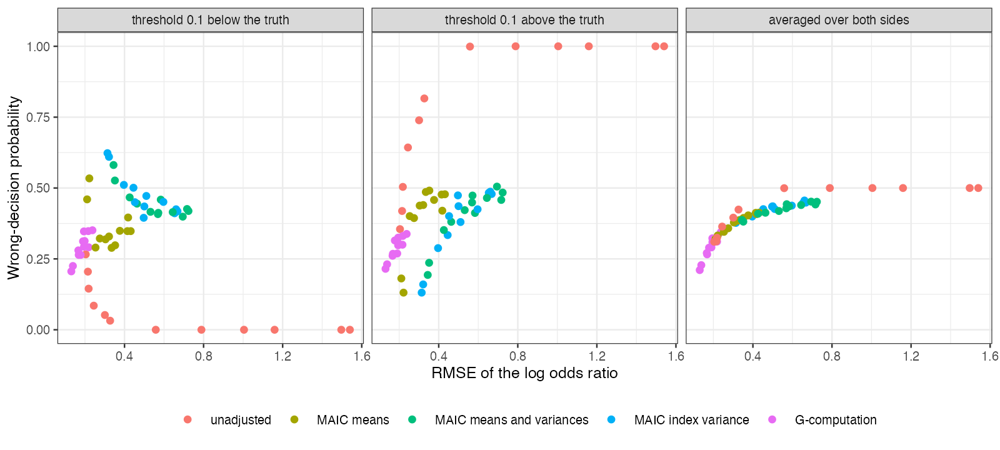

# Decision and estimation rankings of population-adjustment methods
disagree only when the threshold’s side is known
Ahmad Sofi-Mahmudi
2026-09-23

# Abstract

**Background.** Simulation studies rank population-adjustment methods by
bias, RMSE and coverage, but a reimbursement decision depends on whether
the estimate falls on the right side of a threshold. Catalog problem
DEC-01 asks whether ranking methods by decision error changes the
conclusions.

**Methods.** Re-scoring of 108,000 stored replicates from COV-03 (108
binary-outcome scenarios; unadjusted, three MAIC variants and
G-computation). Thresholds were placed 0.1 or 0.3 above or below the
true log odds ratio, with loss ratios of 1, 2 and 5 between wrong
adoption and wrong rejection. Rankings by RMSE and by expected loss were
compared within each scenario and threshold.

**Results.** Near the threshold in poor-overlap scenarios the mean rank
correlation between RMSE and expected loss was 0.45, and the RMSE-best
method was also loss-best in 38% of cases (registered verdict:
confirmed). The disagreement was not Monte Carlo noise: each ranking
reproduced across independent halves of the replicates (1.00 and 0.96).
It came from the direction of bias: a biased method decided wrongly in
0.114 of replicates when its bias pointed away from the threshold and
0.635 when it pointed toward it. Averaged over the two sides of the
threshold the rankings agreed (correlation 0.93, same best method in
every poor-overlap scenario).

**Conclusion.** Decision error can rank methods differently from RMSE,
but only for an analyst who knows which side of the threshold the truth
lies on, and then the favored method is the one whose bias happens to
point the right way. Without that knowledge RMSE is an adequate proxy
for decision error here.

# The problem

The wrong-decision probability
$P\{\operatorname{sign}(\hat\Delta - \tau) \ne \operatorname{sign}(\Delta - \tau)\}$
depends on the estimator’s distribution relative to the threshold
$\tau$, not on its distance from the truth. Bias toward the threshold
increases it and bias away decreases it, so a biased method can decide
correctly more often than an unbiased one. ADEMP performance measures
([1](#ref-morris2019)) contain no decision measure, and whether this
matters for method rankings had not been measured.

# Design

Registered protocol: `protocol.md`, committed before any decision
scoring; COV-03’s estimation results were already known.
$\tau = \Delta + d$, $d \in \{\pm0.1, \pm0.3\}$. With loss ratio $c$, B
is adopted when $P(\Delta < \tau) \ge c/(1 + c)$ under
$N(\hat\Delta, \widehat{\text{SE}}^2)$; $c = 1$ gives
$\hat\Delta < \tau$. Poor overlap: target shift 0.6 SD with the source’s
prognostic-index variance half the target’s. Two analyses were added
after the registered one and are labeled exploratory: split-half
reliability of each ranking, and loss averaged over the two sides of the
threshold.

# Results

Figure 1: Wrong-decision probability against RMSE in the 12 poor-overlap
scenarios, thresholds 0.1 from the truth.

One anchored scenario shows the mechanism. G-computation, unbiased with
the smallest RMSE, decided wrongly in 0.280 and 0.261 of replicates with
the threshold below and above the truth. The unadjusted analysis, biased
upward by 0.099, decided wrongly in 0.145 when the threshold was below
(bias pointing away) and 0.504 when it was above. Across the primary
strata the loss-best method was the unadjusted analysis whenever the
threshold was below the truth and G-computation or MAIC on the index
variance when it was above
(<a href="#fig-dec" class="quarto-xref">Figure 1</a>).

Asymmetric losses did not change the pattern (mean correlations 0.28 to
0.66 across strata). Far from the threshold with identical populations
every method decided correctly in at least 0.919 of replicates.

# What this does not answer

The decision is on the relative effect alone, not a net-benefit model
with costs and utilities. One source of replicates (COV-03), five
methods and no ML-NMR. An analyst with genuine prior information on the
side of the threshold could weigh methods by their likely bias
direction; the study does not model such priors. Peer review has not
been done.

# References

1.
Tim P. Morris, Ian R. White,
Michael J. Crowther. Using simulation studies to evaluate statistical
methods. Statistics in Medicine. 2019;38(11):2074–102.
doi:[10.1002/sim.8086](https://doi.org/10.1002/sim.8086)

