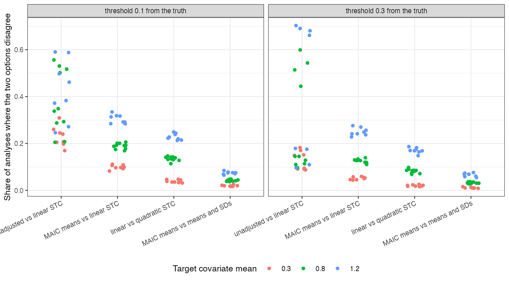

```{r setup}
s <- read.csv("../results/flips.csv")
f3 <- function(x) formatC(x, format = "f", digits = 3); f2 <- function(x) formatC(x, format = "f", digits = 2)
near <- s[abs(s$d) == 0.1, ]; far <- s[abs(s$d) == 0.3, ]
r <- function(d, k) mean(d$flip[d$choice == k])
```

# Abstract {.unnumbered}

**Background.** A population-adjusted analysis involves choices made at different stages, and their
effects on the recommendation are rarely compared. Catalog problem DEC-02 asks which choice most often flips
a decision.

**Methods.** Re-scoring of 32,000 stored replicates from DIA-08 (anchored binary-outcome comparisons under
linear and nonlinear effect modification at three overlap levels). Decision: adopt B when its estimated log
odds ratio against A is below a threshold 0.1 or 0.3 from the truth. For four choices we counted how often the
two options gave different decisions within the same replicate. Changing the target population, which changes
the question, was reported separately.

**Results.** Near the threshold, adjusting or not flipped the decision in `r f3(r(near, "adjust"))` of analyses,
weighting against an outcome model in `r f3(r(near, "family"))`, linear against quadratic STC in
`r f3(r(near, "form"))` and MAIC on means against means and SDs in `r f3(r(near, "moments"))`. Far from the
threshold the rates were `r f3(r(far, "adjust"))`, `r f3(r(far, "family"))`, `r f3(r(far, "form"))` and
`r f3(r(far, "moments"))`. Moving the target covariate mean from 0.3 to 1.2 changed the true log odds ratio by
0.39 to 0.59 across the modification patterns.

**Conclusion.** The choices are ordered, not dominated by one: whether to adjust, then which estimator
family, then model form and moment set. The target population moves the true answer more than any estimator
choice moves the estimate, and should be declared as the question rather than varied as a sensitivity.

# The problem {#sec-problem}

A reversal between two analyses can mean two different questions (two target populations) or two answers to
one question (two estimators). Only the second is sensitivity. Within one question the estimator choices are
nested: whether to adjust at all, whether to weight or model the outcome, and then the specification within a
family.

# Design {#sec-design}

Registered protocol: `protocol.md`, committed before any scoring; DIA-08's estimation results were already
known. Replicates carried the five methods' estimates for the same data, so a flip is a within-replicate
disagreement. ADEMP structure of the source study [@morris2019].

# Results {#sec-results}

{#fig-flips}

The ordering held at every overlap level (@fig-flips). Flip rates rose with the target's distance from the
source, where the options' estimates diverge and their variances grow, and fell by more than half when the
threshold was 0.3 rather than 0.1 from the truth. The unadjusted analysis flipped most because it is biased,
not because it is noisy; the within-family choices flipped through sampling disagreement between correlated
estimates.

# What this does not answer {#sec-limits}

No prior or bridge factor, since the source replicates contain no Bayesian or disconnected analysis; the
decision is on the relative effect alone, not a net-benefit model; one outcome type. Peer review has not been
done.

# References {.unnumbered}
