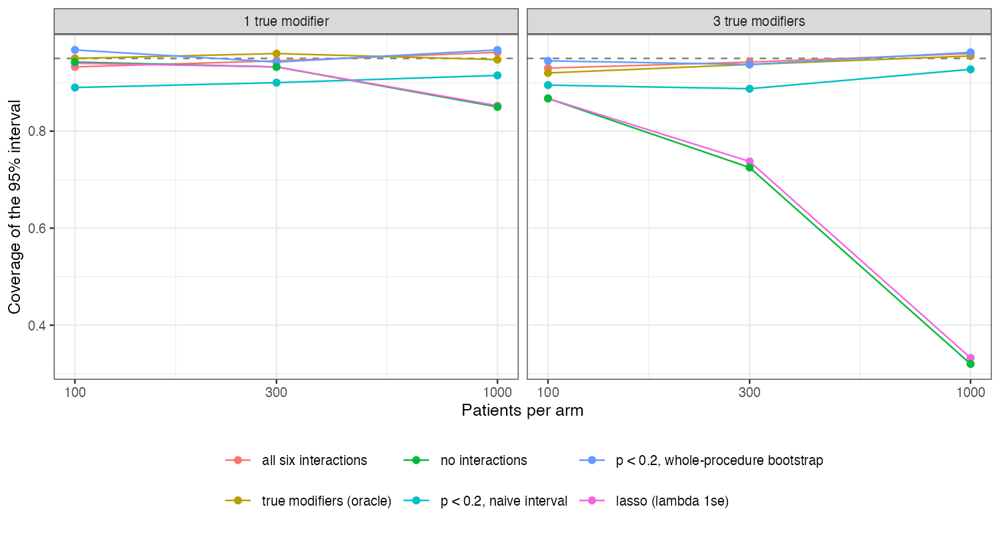

```{r setup}
s <- read.csv("../results/summary.csv")
f3 <- function(x) formatC(x, format = "f", digits = 3); f2 <- function(x) formatC(x, format = "f", digits = 2)
r <- function(k) s[s$rule == k, ]
sg <- r("significance"); bt <- r("significance_boot"); la <- r("lasso"); al <- r("all")
```

# Abstract {.unnumbered}

**Background.** Effect modifiers for a simulated treatment comparison (STC) are often chosen
by testing interactions on the same data, and the interval then treats the chosen model as
fixed. Catalog problem DEC-11 asks how much coverage this costs and whether the interval should
include the selection step.

**Methods.** G-computation STC with six candidate modifiers, one or three of them real, 100 to
1000 patients per arm, binary outcome, target covariate means shifted by 0.4 SD: 6 scenarios,
400 replicates each. Rules: all six interactions, the true ones, none, those with $p < 0.2$, and
lasso; the significance rule was also paired with a bootstrap that repeats the selection.

**Results.** After significance selection the naive interval covered `r f3(min(sg$coverage))` to
`r f3(max(sg$coverage))`, its SE `r formatC(100 * (1 - max(sg$mean_se / sg$emp_sd)), format = "f", digits = 0)`% to
`r formatC(100 * (1 - min(sg$mean_se / sg$emp_sd)), format = "f", digits = 0)`% smaller than the estimate's spread. The
whole-procedure bootstrap covered `r f3(min(bt$coverage))` to `r f3(max(bt$coverage))`. Lasso at the
one-standard-error penalty kept almost no interactions (at most `r f2(max(la$mean_selected))` on
average) and behaved like dropping them all: coverage `r f3(min(la$coverage))` with three real modifiers
at 1000 per arm. Fitting all six interactions covered `r f3(min(al$coverage))` to `r f3(max(al$coverage))`.

**Conclusion.** An interval after data-driven modifier selection must include the selection, by
resampling the whole procedure; otherwise fit all candidate interactions. Penalized selection
tuned for prediction can remove real modifiers and leave the transported effect biased.

# The problem {#sec-problem}

Conditioning on a model chosen from the data makes the naive interval too narrow unless the
selection is part of the variance [@berk2013]. In STC the selected interactions determine how
the effect is transported, so both the point estimate and its interval depend on the selection.

# Design {#sec-design}

Registered protocol: `protocol.md`; ADEMP structure [@morris2019]. Six independent normal
candidates; $\operatorname{logit}p = -0.5 + 0.3\sum_jx_j + A(-0.5 + 0.3\sum_{m \in M}x_m)$ with $M$ the first
one or three; target covariate means 0.4. Estimand: target marginal log odds ratio (Monte Carlo
over $10^6$ draws). G-computation from a logistic model with all six main effects and the
selected interactions; delta-method intervals; whole-procedure bootstrap with 60 resamples.
Lasso [@tibshirani1996] penalized the interactions only, with the penalty chosen by 5-fold
cross-validation (one-standard-error rule).

# Results {#sec-results}

{#fig-cov}

The significance rule's shortfall came from variance, not bias (bias at most
`r f3(max(abs(sg$bias)))`): selection sometimes kept a modifier and sometimes not, and the naive SE saw
only one of those models (@fig-cov). With three modifiers the shortfall was not monotone in sample
size, as registered: it was largest at 300 per arm, where selection was most unstable (all true
modifiers kept in `r f2(sg$all_true_selected[sg$n == 300 & sg$n_mod == 3])` of analyses). Omitting
the interactions biased the effect by about 0.2 with three modifiers, and the lasso rule inherited
that bias because its cross-validated penalty favored prediction of the outcome, to which the
interactions contribute little.

# What this does not answer {#sec-limits}

STC only; MAIC-based selection, overlap levels, larger candidate sets and uncertainty in the target
summaries were not run; 400 replicates and 60 bootstrap resamples per analysis. Peer review has not
been done.

# References {.unnumbered}
