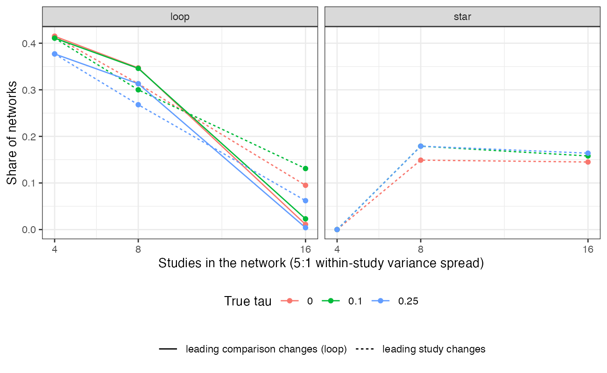

```{r setup}
s <- read.csv("../results/summary.csv"); f3 <- function(x) formatC(x, format = "f", digits = 3); pc <- function(x) sprintf("%.0f%%", 100 * x)
q <- function(net, K, sp, tau) s[s$net == net & s$K == K & s$spread == sp & s$tau == tau, ]
lp <- s[s$net == "loop" & s$K == 4 & s$spread == "5:1", ]
```

# Abstract {.unnumbered}

**Background.** Contribution tables attribute a network meta-analysis contrast to its
studies and comparisons [@papakonstantinou2018] and feed certainty assessments. They are
computed at the point estimate of the between-study SD $\tau$. Catalog problem DEC-17 asks
whether they are stable across its plausible range.

**Methods.** Three-treatment star and loop networks of 4, 8 or 16 two-arm studies, with
equal or 5:1 within-study variances and true $\tau$ of 0, 0.1 or 0.25; absolute hat-matrix
contribution shares for the indirect-or-mixed contrast, evaluated across the REML profile
interval for $\tau$; 1000 networks per cell.

**Results.** In the loop network with four studies and unequal within-study variances,
the leading contributing comparison changed across the $\tau$ interval in
`r pc(min(lp$lead_cmp_changes))` to `r pc(max(lp$lead_cmp_changes))` of networks, and some study's
share moved by `r f3(min(lp$mean_max_move))` to `r f3(max(lp$mean_max_move))` on average. With equal
within-study variances shares did not move at all. The REML estimate of $\tau$ was zero in
`r pc(min(s$tau_hat_zero[s$K == 4]))` to `r pc(max(s$tau_hat_zero[s$K == 4]))` of four-study networks and the interval's
upper end reached the grid's cap in up to `r pc(max(s$ci_hi_at_cap))`.

**Conclusion.** A contribution table is conditional on one value of $\tau$. With few studies
of unequal precision it should be reported across the plausible range of $\tau$, or stated
as conditional on the point estimate.

# The problem {#sec-problem}

Contribution shares are functions of the weights $(V + \tau^2I)^{-1}$. As $\tau$ grows the weights
flatten, so precise studies lose share and imprecise ones gain, and the leading study or
comparison can change. With few studies $\tau$ is poorly determined, so the share reported at
$\hat\tau$ is one point in a wide range. With equal within-study variances the weights are
proportional at every $\tau$ and shares cannot move.

# Design {#sec-design}

Registered protocol: `protocol.md`. Treatments A, B, C; two-arm studies of AB and AC (star)
or AB, AC and BC (loop), allocated in turn; within-study variances 0.04, or 0.02 to 0.10
assigned at random; target contrast C versus B. $\tau^2$ by REML on a grid over $[0, 1]$ with
its 95% profile-likelihood interval. A study's share is its absolute entry in the target
row of the hat matrix over their sum; a comparison's share sums its studies'. In the star
network the target needs both comparisons with coefficient one, so comparison-level
shares are exactly 50% at every $\tau$ and only study-level shares are informative (the
comparison-level entries for the star in `results/decision.md` are ties broken by rounding
and are not results).

# Results {#sec-results}

{#fig-leading}

| network | studies | true $\tau$ | leading comparison changes | leading study changes | mean largest share movement | leading study at $\hat\tau$ differs from true $\tau$ | $\hat\tau = 0$ |
|---|---:|---:|---:|---:|---:|---:|---:|
`r z <- s[s$spread == "5:1", ]; paste(sprintf("| %s | %d | %.2f | %s | %s | %s | %s | %s |", z$net, z$K, z$tau, ifelse(z$net == "star", "tie", pc(z$lead_cmp_changes)), pc(z$lead_study_changes), f3(z$mean_max_move), pc(z$lead_hat_wrong), pc(z$tau_hat_zero)), collapse = "\n")`

: 5:1 within-study variance spread; with equal variances no share moved in any cell. 1000 networks per cell. {#tbl-main}

The registered primary was confirmed (@fig-leading, @tbl-main). Instability was greatest
where $\tau$ is least determined and precision most unequal: four- and eight-study loop
networks. With sixteen studies the interval for $\tau$ narrowed and the leading comparison
was stable in almost every network, but the leading study still changed in 6% to 13% of
them. Taking shares at $\hat\tau$ rather than at the true $\tau$ changed individual shares by only
0.01 to 0.05 on average; the problem is not that $\hat\tau$ is badly biased but that the data
cannot distinguish values of $\tau$ that attribute the contrast differently.

# What this does not answer {#sec-limits}

One contribution measure (absolute hat-matrix row), not the shortest-path or random-walk
flow decompositions; three treatments, two-arm studies; frequentist only, so no posterior
distribution of contributions, information-matrix interval or bootstrap. Peer review has not
been done.

# References {.unnumbered}
