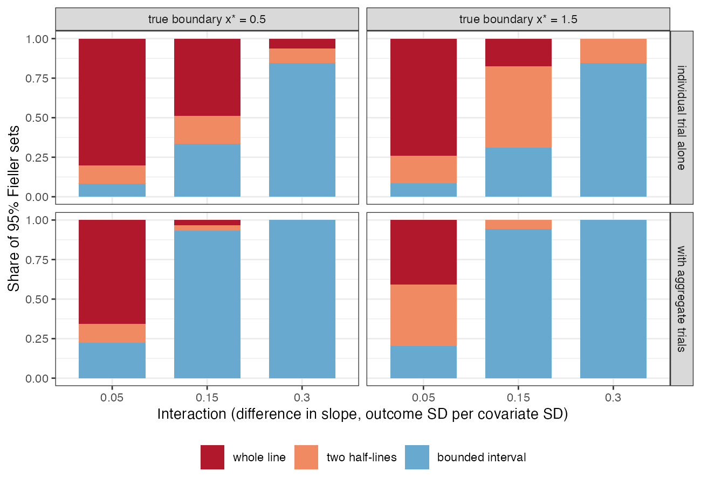

# The covariate value at which the better treatment changes is often not
estimable as a point, and borrowed precision can make its interval wrong
Ahmad Sofi-Mahmudi
2026-09-23

# Abstract

**Background.** With effect modification, the better of two treatments
can change at a covariate value $x^\star = -\delta/\beta$, the ratio of
the treatment effect at zero to the interaction. Applied analyses report
it as a point. Catalog problem DEC-28 asks whether it is well enough
determined for that.

**Methods.** One individual-data trial of 400 patients, alone or
combined with five aggregate trials at different covariate means;
interactions of 0.3, 0.15 and 0.05 outcome SD per covariate SD; an
ecological term in the aggregate trials absent or present; delta-method
and Fieller intervals, and the regret of treating by the point estimate.
2000 replicates per cell.

**Results.** From the individual trial alone at an interaction of 0.15,
the exact (Fieller) 95% confidence set for $x^\star$ was unbounded in
66% to 69% of replicates, while the delta-method interval was always
finite. Adding aggregate trials supplied 81% of the interaction’s
precision and made the sets bounded; with a between-trial ecological
term of 0.1 per covariate SD, their coverage fell to 0.681 to 0.696 for
a boundary at 1.5 while the individual trial’s sets kept 0.949 to 0.952.

**Conclusion.** A cut-point should be reported with its Fieller set,
which can legitimately be unbounded; a bounded interval obtained by
borrowing between-trial interaction information is only as good as the
assumption that that information is free of ecological bias.

# The problem

$x^\star$ is a ratio whose denominator is an interaction, the least
precisely estimated quantity in a trial. The delta method linearizes the
ratio and always returns a finite interval. The exact set of Fieller
([1](#ref-fieller1954)) is
$\{x : (\hat\delta + \hat\beta x)^2 \le z^2\,\widehat{\operatorname{var}}(\hat\delta + \hat\beta x)\}$:
the covariate values at which the treatment difference is not
significantly different from zero. It is a bounded interval only when
the interaction itself is significant, and otherwise two half-lines or
the whole line. It is also the set where the pointwise probability that
A is better lies between 0.025 and 0.975, so a plot of that probability
shows it directly. Treating by the probability at 0.5 is the plug-in
rule, so the two have the same regret; the map changes what is reported,
not the decision.

Precision for the interaction can be borrowed from trials at different
covariate means, as shared-interaction network models do. That
information is between-trial and exposed to ecological bias
([2](#ref-riley2020)), which no interval reflects.

# Design

Registered protocol: `protocol.md`. Individual effect of A over B
$\eta(x) = \delta + \beta x$ with $\beta \in \{0.3, 0.15, 0.05\}$ and
$x^\star \in \{0.5, 1.5\}$. The individual trial: 400 patients,
$x \sim N(0, 1)$, $y = 0.3x + A\eta(x) + e$, $e \sim N(0, 1)$. Five
aggregate trials at covariate means $-1$ to $1.5$ report their effect
with SE 0.1; the ecological term adds $b(m_k - \bar m)$,
$b \in \{0, 0.1\}$. The combined estimator is generalized least squares
on both sources. Regret of the plug-in rule in a target
$x \sim N(0.5, 1)$ is reported as a share of the value of individualized
treatment (the gain from treating by the true boundary over treating
everyone with the better treatment on average).

# Results

Figure 1: Type of the 95% Fieller set for $x^\star$ without the
ecological term.

Table 1: 2000 replicates per cell; coverage MCSE at most 0.011. Regret
share above 1: treating by the estimated boundary did worse than
treating everyone with the better treatment on average.

| interaction | $x^\star$ | ecological term | estimator | median $z$ of interaction | delta coverage | Fieller coverage | Fieller bounded | regret share |
|---:|---:|---:|----|---:|---:|---:|---:|---:|
| 0.30 | 0.5 | 0.0 | combined | 6.9 | 0.964 | 0.957 | 100% | 0.01 |
| 0.30 | 0.5 | 0.0 | individual trial | 3.0 | 0.965 | 0.957 | 84% | 0.08 |
| 0.15 | 0.5 | 0.0 | combined | 3.5 | 0.973 | 0.947 | 93% | 0.05 |
| 0.15 | 0.5 | 0.0 | individual trial | 1.5 | 0.970 | 0.950 | 34% | 0.31 |
| 0.05 | 0.5 | 0.0 | combined | 1.2 | 0.996 | 0.953 | 22% | 0.40 |
| 0.05 | 0.5 | 0.0 | individual trial | 0.5 | 0.986 | 0.946 | 8% | 0.70 |
| 0.30 | 1.5 | 0.0 | combined | 7.0 | 0.947 | 0.945 | 100% | 0.07 |
| 0.30 | 1.5 | 0.0 | individual trial | 3.0 | 0.931 | 0.952 | 85% | 0.38 |
| 0.15 | 1.5 | 0.0 | combined | 3.5 | 0.934 | 0.952 | 94% | 0.24 |
| 0.15 | 1.5 | 0.0 | individual trial | 1.5 | 0.890 | 0.953 | 31% | 0.94 |
| 0.05 | 1.5 | 0.0 | combined | 1.1 | 0.894 | 0.948 | 20% | 1.23 |
| 0.05 | 1.5 | 0.0 | individual trial | 0.5 | 0.859 | 0.947 | 8% | 3.61 |
| 0.30 | 0.5 | 0.1 | combined | 8.8 | 0.923 | 0.930 | 100% | 0.01 |
| 0.30 | 0.5 | 0.1 | individual trial | 3.0 | 0.959 | 0.957 | 84% | 0.09 |
| 0.15 | 0.5 | 0.1 | combined | 5.3 | 0.921 | 0.920 | 100% | 0.02 |
| 0.15 | 0.5 | 0.1 | individual trial | 1.5 | 0.975 | 0.949 | 35% | 0.31 |
| 0.05 | 0.5 | 0.1 | combined | 3.0 | 0.947 | 0.930 | 86% | 0.08 |
| 0.05 | 0.5 | 0.1 | individual trial | 0.5 | 0.991 | 0.949 | 7% | 0.72 |
| 0.30 | 1.5 | 0.1 | combined | 8.8 | 0.577 | 0.681 | 100% | 0.16 |
| 0.30 | 1.5 | 0.1 | individual trial | 3.0 | 0.921 | 0.954 | 85% | 0.38 |
| 0.15 | 1.5 | 0.1 | combined | 5.3 | 0.532 | 0.695 | 100% | 0.44 |
| 0.15 | 1.5 | 0.1 | individual trial | 1.5 | 0.883 | 0.952 | 33% | 0.97 |
| 0.05 | 1.5 | 0.1 | combined | 3.0 | 0.462 | 0.696 | 85% | 1.47 |
| 0.05 | 1.5 | 0.1 | individual trial | 0.5 | 0.838 | 0.955 | 7% | 3.64 |

The registered condition failed
(<a href="#tbl-main" class="quarto-xref">Table 1</a>). From one trial of
400 patients a bounded confidence set for $x^\star$ existed in 84% to
85% of replicates at the largest interaction and 31% to 34% at the
moderate one (<a href="#fig-fieller" class="quarto-xref">Figure 1</a>).
The delta-method interval covered 0.890 to 0.970 there, finite in every
replicate. Regret was a large share of what individualization could
gain, and at the smallest interaction it exceeded that gain.

Borrowing interaction information from the aggregate trials made the
boundary look determined: its sets were bounded in 93% to 94% of
replicates at 0.15. Without the ecological term the Fieller sets kept
their coverage (0.945 to 0.957 over all cells), while the delta-method
interval fell to 0.859 at the weakest interaction. With the term, the
combined estimator’s sets were narrower still and covered 0.681 to 0.696
for the boundary at 1.5, where a slope bias moves the crossing most; for
the boundary at 0.5, near the aggregate trials’ mean covariate value,
coverage was 0.920 to 0.930. The individual trial’s sets were
unaffected. The pointwise optimality probability rarely gave false
certainty (at most 2% of profiles half a unit or more from the
boundary), so the failure is concentrated at the boundary itself.

# What this does not answer

Two treatments and one modifier, so a point boundary; no modifier
selection, which would make every interval narrower than it should be;
frequentist closed-form estimators rather than ML-NMR; the ecological
term is a declared linear shift. Peer review has not been done.

# References

1.
E. C. Fieller. Some problems in
interval estimation. Journal of the Royal Statistical Society Series B.
1954;16(2):175–85.
doi:[10.1111/j.2517-6161.1954.tb00159.x](https://doi.org/10.1111/j.2517-6161.1954.tb00159.x)

2.
Richard D. Riley, Thomas P. A.
Debray, David Fisher, Miriam Hattle, Nadine Marlin, Jeroen Hoogland,
François Gueyffier, Jan A. Staessen, Jiguang Wang, Karel G. M. Moons,
Johannes B. Reitsma, Joie Ensor. Individual participant data
meta-analysis to examine interactions between treatment effect and
participant-level covariates: Statistical recommendations for conduct
and planning. Statistics in Medicine. 2020;39(15):2115–37.
doi:[10.1002/sim.8516](https://doi.org/10.1002/sim.8516)

