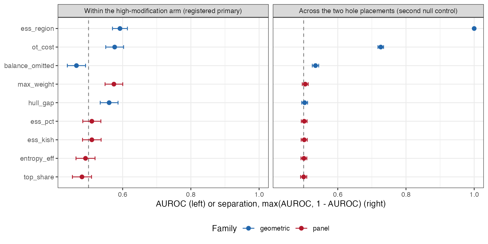
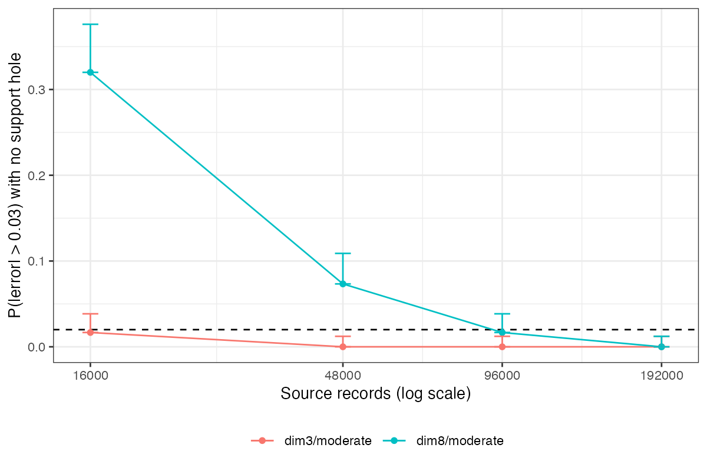

```{r setup}
a  <- readRDS("../results/analysis.rds")
fp <- readRDS("../results/floor-probe.rds")
f3 <- function(x) formatC(x, format = "f", digits = 3)
f4 <- function(x) formatC(x, format = "f", digits = 4)
f2 <- function(x) formatC(x, format = "f", digits = 2)
pr <- a$primary; cr <- a$cross; arm <- a$arm
get <- function(d, s, col) d[d$statistic == s, col]
panel <- c("ess_kish", "ess_pct", "entropy_eff", "max_weight", "top_share")
best_panel_within <- max(pr$auroc[pr$family == "panel"])
best_geo_within   <- max(pr$auroc[pr$family == "geometric"])
panel_cross_max   <- max(cr$separation[cr$family == "panel"])
panel_cross_se    <- max(cr$se[cr$family == "panel"])
hi_strong <- arm[arm$hole == "high_modification" & arm$modification == "strong", ]
lo_strong <- arm[arm$hole == "low_modification" & arm$modification == "strong", ]
inv <- a$invariance
inv_none_panel <- max(inv$max_rel_diff[inv$omitted_moment == "none" & inv$family == "panel"])
inv_om_panel   <- max(inv$max_rel_diff[inv$omitted_moment != "none" & inv$family == "panel"])
```

# Abstract {.unnumbered}

**Background.** Matching-adjusted indirect comparison reports its overlap
diagnostics as a panel of weight summaries: Kish effective sample size, its
percentage of the source sample, entropy efficiency, the largest weight and the
share of weight held by the top units. Every member of that panel is a symmetric
function of the weights, so none can depend on which units carry which weight.
Catalog problem DIA-02 states the consequence: the panel cannot encode where in
covariate space support is missing, or whether the missing region matters for the
contrast being estimated.

**Methods.** We built two source populations that remove the same mass at the same
threshold on exchangeable standard normal coordinates and differ only in which
coordinate carries the hole: the one that modifies the treatment effect, or a
purely prognostic one. A binary outcome on the logit scale makes the target
marginal risk difference non-collapsible. Across 48 cells and
`r format(2000 * a$n_cells_all, big.mark = ",")` replicates we scored the five
panel members and four diagnostics that read covariate position as well as
weight, both within the high-modification arm (the registered primary outcome)
and across the two hole placements (the design's second null control, read as a
number).

**Results.** The manipulation works. With strong effect modification a hole in
the modifying coordinate biases the marginal risk difference by
`r f4(hi_strong$bias)`, and a hole of identical size in a prognostic coordinate
by `r f4(lo_strong$bias)`, while every panel member agrees between the two arms
to within `r f2(100 * inv_none_panel)`%. Across placements, no panel member
separates the two arms: the best reaches `r f3(panel_cross_max)` against 0.5 for
chance, with a standard error of `r f3(panel_cross_se)`. Region-specific ESS
separates them at `r f3(get(cr, "ess_region", "separation"))` and sliced optimal
transport cost at `r f3(get(cr, "ot_cost", "separation"))`. The registered
within-arm primary reads the other way: the best panel member reaches
`r f3(best_panel_within)` and the best geometric diagnostic
`r f3(best_geo_within)`, a gap far below the registered materiality of 0.10, so
the registered rule returns "refuted". We report both readings and explain why
they disagree: within one arm every replicate shares a hole placement, so the
registered outcome asks which replicate drew a bad sample, a variance question a
concentration measure answers as well as anything. Two of three controls failed
on parts of the grid and the analysis runs on the
`r a$n_cells_kept` of `r a$n_cells_all` cells they leave standing.

**Conclusion.** The blindness of the reported panel to support geometry is
algebraic, and it bites in an ordinary covariate law: two analyses whose panels
agree to 2% differ in bias by `r f4(hi_strong$bias - lo_strong$bias)`, about half
the material threshold, and in their rate of material error by a factor of
`r round(hi_strong$p_material / lo_strong$p_material)`. A diagnostic that reads
position is necessary but not sufficient; convex hull distance taken as a
maximum over coordinates is as blind as the panel here. No diagnostic studied is
calibrated, and the one that separated the arms perfectly was given the easiest
possible instance.

# The problem {#sec-problem}

Matching-adjusted indirect comparison (MAIC) reweights individual participant data
from a source trial so its weighted covariate moments equal those published for a
target trial [@signorovitch2010; @phillippo2018]. The adequacy of the reweighting is
reported through summaries of the weights. The effective sample size
[@kish1965],

$$
\mathrm{ESS}(w) \;=\; \frac{\left(\sum_{i=1}^n w_i\right)^2}{\sum_{i=1}^n w_i^2},
$$

is universal; its percentage of $n$, the entropy efficiency
$\exp\{-\sum_i \tilde w_i \log \tilde w_i\}/n$ with $\tilde w_i = w_i/\sum_j w_j$,
the largest normalized weight, and the share of total weight held by the top 5% of
units are common companions. Reporting of even these is incomplete: of 117
oncology MAICs reviewed by Farinasso and colleagues, three met all NICE reporting
recommendations and the weight distribution was among the least reported items
[@farinasso2025].

Each of these statistics is a symmetric function of $(w_1, \ldots, w_n)$. For any
permutation $\pi$,

$$
T(w_{\pi(1)}, \ldots, w_{\pi(n)}) \;=\; T(w_1, \ldots, w_n),
$$

so $T$ depends on the weights only through their multiset. Covariate positions
$x_i$ never enter. Two analyses whose weight multisets coincide therefore report
identical panels, whatever the geometry of the region their source fails to cover.
This is not a property of ESS alone: it holds for every member of the panel at
once, and the equivalence of ESS, ESS as a percentage and the coefficient of
variation of the weights that our DIA-03 study established is a special case of it.

What the invariance does not settle is whether it matters. The refuting sentence
registered in the design was that in realistic covariate laws weight concentration
and support geometry move together tightly enough that the global summary is an
adequate proxy, so that a counterexample requires configurations that do not
occur. That is an empirical claim, and it is what this study tests.

A second defect sits in the same entry: at least three ESS calculations have been
proposed for population adjustment [@threeess2024], so two analyses of the same
evidence can report different numbers. That is a comparability problem rather
than a discrimination problem and is reported separately in @sec-spread.

# Design {#sec-design}

The design of record is `DESIGN.md` in the study directory, written against the
program's design standard. The study was not registered as a separate protocol;
`protocol.md` records which choices were fixed before the first replicate and
which were made after, and the restriction the analysis applies was written after
the run was complete and read. The reporting follows ADEMP [@morris2019].

## Data-generating mechanism

Target covariates are independent standard normal in $d$ dimensions. The source
is the same law shifted by $0.25$ (good overlap) or $0.60$ (moderate overlap) in
every coordinate, with a wedge removed by rejection sampling: source records with
$x_j \geq \Phi^{-1}(0.90)$ are discarded in coordinate $j = 1$ (the
high-modification hole), in coordinate $j = 2$ (the low-modification hole), or not
at all. Coordinate 1 modifies the treatment effect and every coordinate is
prognostic:

$$
\operatorname{logit} P(Y = 1 \mid x, A) \;=\; -0.5 + 0.35 \sum_{k=1}^d x_k
\;+\; A\,(0.4 + \gamma x_1),
$$

with $\gamma = 0.5$ (moderate) or $1.0$ (strong) and treatment $A$ randomized
1:1 in the source. Because the two holes are the same size on exchangeable
coordinates, the amount of extrapolation the weights must perform is nearly the
same in both arms, and so is the weight multiset. Their relevance to the contrast
is not.

The source has 16,000 records. That size was set before the run from a noise floor
measured at the middle of the grid, so that the estimator's own sampling error
would rarely exceed the material threshold with no hole present. The target
sample has 4,000 records, used only to supply the published moments.

## Factors

Six factors fully crossed give 48 cells: covariate dimension (3, 8), hole placement
(none, low modification, high modification), overlap (good, moderate), balancing
set (all first and second moments matched, or the modifier's second moment left
unmatched), and effect modification (moderate, strong). Each cell has 2,000
replicates.

## Estimand and estimator

The estimand is the target-population marginal risk difference, computed as a
Monte Carlo mean over 400,000 target draws per dimension and modification level.
MAIC weights solve the standard dual problem on first and second moments, and the
estimate is the weighted difference in outcome proportions between arms. An
error is **material** when it exceeds 0.03 in absolute value, a threshold set from
the decision context rather than from the spread of the estimates.

## Diagnostics

Five panel members, all symmetric in the weights: Kish ESS, ESS as a percentage,
entropy efficiency, maximum weight, and top 5% share. Four candidates that read
position as well as weight:

- **balance on an omitted moment**, the standardized difference in the second
  moment of $x_1$ between weighted source and target. It is identically near zero
  when that moment is matched and was registered as the comparator most likely to
  overturn the expected headline;
- **region-specific ESS**, Kish ESS computed on source records in the target's
  upper decile of the effect modifier;
- **convex hull distance**, approximated coordinatewise as the largest amount by
  which the target's 1st or 99th percentile lies outside the range of effectively
  weighted source records, maximized over coordinates;
- **sliced optimal transport cost**, the mean absolute difference between weighted
  source and target quantiles along 20 fixed random directions.

The last two are approximations and are named as such.

## Outcomes

Each diagnostic is scored by its area under the ROC curve (AUROC) in the direction
a practitioner reads it, so an AUROC below 0.5 means it misleads. Two readings are
computed.

1. **Registered primary.** Within the high-modification arm, AUROC against
   material error.
2. **Cross-arm separation.** Across the two hole placements, at matched panels,
   $\max(\mathrm{AUROC}, 1 - \mathrm{AUROC})$ for distinguishing the arms. This is
   the design's second null control, which required every panel member to agree
   between the arms, turned into a number.

Standard errors are nonparametric bootstrap standard errors over replicates.

## Controls

- **Null.** With no hole, material error must occur in at most 2% of replicates in
  a stratum; otherwise the label measures the estimator's own noise.
- **Matched multiset.** Every panel member must agree between the two hole arms to
  within 2% relative difference; otherwise the manipulation did not happen.
- **Positive.** With a hole in the modifying coordinate and strong modification,
  MAIC must incur material error at a substantial rate.

# Results {#sec-results}

## What the controls left standing {#sec-controls}

Two of three controls failed on parts of the grid, and the analysis runs on what
they leave (@tbl-null).

```{r}
#| label: tbl-null
#| tbl-cap: "Null control by stratum: probability of material error with no support hole. The registered limit is 0.02."
nb <- a$null_by
knitr::kable(data.frame(stratum = names(nb), `P(material error)` = f4(as.numeric(nb)),
                        passes = ifelse(nb <= 0.02, "yes", "no"), check.names = FALSE),
             align = "lrc")
```

At eight covariates and a moderate shift, MAIC's own sampling error exceeds the
material threshold in `r f3(a$null_by[["dim8/moderate"]])` of replicates with no
hole at all. The source size had been set from a noise floor measured at the middle
of the grid, and the middle is not the worst corner. The same defect, a threshold
below the estimator's own noise, is what our IDN-05 study documented. The
`dim3/moderate` stratum fails narrowly at `r f4(a$null_by[["dim3/moderate"]])`;
adding it back changes no separation by more than
`r f3(max(abs(merge(cr, a$sensitivity, by = "statistic")$separation.x - merge(cr, a$sensitivity, by = "statistic")$separation.y)))`,
so the cut is not doing the work.

The matched-multiset control passes when every moment is matched (largest panel
residual `r f2(100 * inv_none_panel)`%) and fails when the modifier's second
moment is left unmatched (largest residual `r f2(100 * inv_om_panel)`%). Dropping
that moment breaks the coordinate symmetry the manipulation rests on: the
high-modification hole now truncates a coordinate whose spread the weights no
longer control, and the multisets diverge. This eliminates every cell in which
balance on the omitted moment has anything to see. **The comparator registered as
most likely to overturn the headline was therefore never given a fair test**, and
that is recorded as a live threat in @sec-limits.

The positive control passes: with strong modification and a hole in the modifying
coordinate, material error occurs in `r f3(hi_strong$p_material)` of replicates on
the surviving subgrid.

The analysis runs on `r a$n_cells_kept` of `r a$n_cells_all` cells,
`r format(a$n_rep_kept, big.mark = ",")` replicates: dimensions 3 and 8 at good
overlap, all moments matched, all three hole placements and both modification
strengths.

## The manipulation {#sec-manipulation}

```{r}
#| label: tbl-arm
#| tbl-cap: "Bias, mean absolute error and probability of material error by hole placement, on the surviving subgrid. `mod share` is the share of the target's effect-modification mass lying in the unsupported region."
x <- arm[order(arm$modification, factor(arm$hole, c("none", "low_modification", "high_modification"))), ]
knitr::kable(data.frame(modification = x$modification, hole = x$hole,
                        bias = f4(x$bias), `mean abs error` = f4(x$mae),
                        `P(material)` = f4(x$p_material), `mod share` = f2(x$mod_share),
                        check.names = FALSE), align = "llrrrr")
```

A hole in the modifying coordinate biases the estimate; a hole of the same size in
a prognostic coordinate does not, to the fourth decimal place (@tbl-arm,
@fig-manip). The panel agrees between the two arms to within
`r f2(100 * inv_none_panel)`%. That is the counterexample the refuting sentence
said would require configurations that do not occur, built from a symmetry in an
ordinary multivariate normal law.

{#fig-manip width=70%}

## Two readings {#sec-readings}

```{r}
#| label: tbl-readings
#| tbl-cap: "Within-arm AUROC against material error (registered primary) and cross-arm separation of the two hole placements (second null control), with bootstrap standard errors."
m <- merge(pr, cr[, c("statistic", "separation", "se")], by = "statistic",
           suffixes = c("_w", "_c"))
m <- m[order(-m$separation), ]
knitr::kable(data.frame(statistic = paste0("`", m$statistic, "`"), family = m$family,
                        `within AUROC` = f3(m$auroc), SE = f3(m$se_w),
                        `cross separation` = f3(m$separation), ` SE` = f4(m$se_c),
                        check.names = FALSE), align = "llrrrr")
```

The two readings disagree (@tbl-readings, @fig-readings).

**Across placements**, which is the question the proposition asks, every panel
member sits within `r f3(panel_cross_max - 0.5)` of chance. With
`r format(sum(a$arm$n[a$arm$hole != "none"]), big.mark = ",")` replicates and a
standard error near `r f3(panel_cross_se)`, that is a measured blindness rather
than an unrejected null. Region-specific ESS separates the arms at
`r f3(get(cr, "ess_region", "separation"))` and sliced transport cost at
`r f3(get(cr, "ot_cost", "separation"))`. Convex hull distance, though it reads
position, separates at `r f3(get(cr, "hull_gap", "separation"))`: it takes a
maximum over coordinates, both arms remove an identical wedge, and the maximum is
therefore identical. Reading position is not enough if the reading is then
symmetrized.

**Within the high-modification arm**, which is the registered primary, the best
geometric diagnostic reaches `r f3(best_geo_within)` and the best panel member
`r f3(best_panel_within)`. The gap of `r f3(best_geo_within - best_panel_within)`
is far below the registered materiality of 0.10, and the registered rule reads
**refuted**: the panel discriminates as well as the geometric diagnostics.

{#fig-readings}

The reason is that the registered outcome measured the wrong thing. Within one
arm every replicate shares a hole placement, so the only thing varying across
replicates is sampling noise, and AUROC against material error asks which
replicate drew a bad sample. A concentration measure answers that about as well
as anything, which is why the panel is competitive there. The proposition is
about where the support sits, and answering it requires comparing analyses at
different placements. **The registered primary outcome was the wrong measurement
for the proposition, and the design's own control was the right one.** We report
the registered verdict as it stands and do not relabel the cross-arm reading as
primary after the fact.

## The comparability defect {#sec-spread}

On identical data, the largest of the three ESS definitions divided by the smallest
has median `r f2(a$ess_spread[["median"]])`, 90th percentile
`r f2(a$ess_spread[["p90"]])` and maximum `r f2(a$ess_spread[["max"]])`. One
qualification changes what that number means. As implemented, the Kish form and the
coefficient-of-variation form $n/(1 + \mathrm{CV}^2)$ are the same statistic up to
the $n - 1$ divisor, because the weights are normalized to a fixed mean; their
ratio is one on every replicate. The measured spread is therefore between Kish ESS
and the entropy form alone. Two analyses reporting "the ESS" of the same weights can
still differ by a factor of 1.5 at the median and 3.5 at the 90th percentile, which
is the comparability complaint quantified, but the three published definitions
[@threeess2024] were not all implemented and the figure should not be read as their
spread.

## What rescuing the failed strata would cost {#sec-rescue}

A post hoc probe measured the source size at which the two failed strata would pass
the null control, using the upper Clopper-Pearson bound on 300 replicates rather
than the point estimate (@fig-floor). `dim3/moderate` needs 48,000 source records and
`dim8/moderate` needs 192,000. At those sizes the per-replicate cost is dominated by
the sliced transport cost and was not measured, so the rescue run was not done.

{#fig-floor width=70%}

# What this does not answer {#sec-limits}

1. **Balance on the omitted moment was not tested.** It was the registered
   comparator most likely to overturn the headline, and every cell where it had
   something to see was removed by the matched-multiset control. Its separation of
   `r f3(get(cr, "balance_omitted", "separation"))` on the surviving cells is the
   tautological near-zero its definition predicts. Whether a free check that every
   implementation can compute would do as well as a geometric diagnostic remains
   open.
2. **Region-specific ESS was handed the easiest possible instance.** The region it
   examines and the region the hole empties are the same construction, the
   modifier's upper decile, so its separation of
   `r f3(get(cr, "ess_region", "separation"))` is an upper bound on field
   performance rather than an estimate of it. Two things keep it from being
   circular: the region is chosen from the effect-modifier structure MAIC already
   requires naming, not from knowledge of the hole, and in the prognostic-hole arm
   the statistic reads near normal rather than firing on any hole at all. A hole in
   a high-modification region the analyst did not think to examine is untested,
   and there it would fail as the panel does.
3. **No diagnostic is calibrated.** Separating two placements is not a threshold,
   and this study supplies none.
4. **The analysis subgrid was chosen after the results were read.** The rule that
   chose it is mechanical and derived from the controls, and adding back the
   borderline stratum changes nothing, but it was written after the run.
5. **Scope.** MAIC weights only, a binary outcome, multivariate normal covariates, a
   single rectangular hole, moderate or strong linear effect modification in one
   coordinate, and two of the three published ESS definitions. STC and ML-NMR produce
   no weight vector and are outside the complaint. Moderate overlap was removed by
   the null control, so every positive result here is at good overlap.
6. **The high-modification hole is weaker than its registered definition.** The
   configuration registered that a hole counts as high-modification when it holds
   at least 25% of the target's effect-modification mass. The realized share is
   `r f2(hi_strong$mod_share)`, so by its own definition the hole falls short, and
   the positive control passed at that weaker strength. A stronger hole would make
   the manipulation larger, not the panel less blind.
7. **Peer review has not been done.**

# Reproducing this study {.unnumbered}

```
Rscript R/03-run.R        # 48 cells, resumable, one file per cell
Rscript R/04-analyze.R    # controls, restriction, both readings
Rscript R/05-decision.R   # results/decision.md
Rscript R/06-floor-probe.R
Rscript R/07-figures.R
```

Seeds are a deterministic function of the cell and replicate. Per-replicate output
is regenerable and not tracked; `results/analysis.rds` and `results/decision.md`
are.

# References {.unnumbered}
