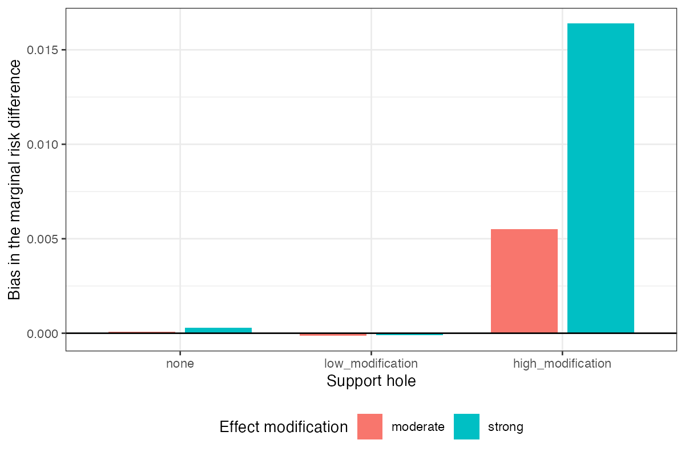

# The reported weight panel cannot see where support is missing
Ahmad Sofi-Mahmudi
2026-09-22

# Abstract

**Background.** Matching-adjusted indirect comparison reports its
overlap diagnostics as a panel of weight summaries: Kish effective
sample size, its percentage of the source sample, entropy efficiency,
the largest weight and the share of weight held by the top units. Every
member of that panel is a symmetric function of the weights, so none can
depend on which units carry which weight. Catalog problem DIA-02 states
the consequence: the panel cannot encode where in covariate space
support is missing, or whether the missing region matters for the
contrast being estimated.

**Methods.** We built two source populations that remove the same mass
at the same threshold on exchangeable standard normal coordinates and
differ only in which coordinate carries the hole: the one that modifies
the treatment effect, or a purely prognostic one. A binary outcome on
the logit scale makes the target marginal risk difference
non-collapsible. Across 48 cells and 96,000 replicates we scored the
five panel members and four diagnostics that read covariate position as
well as weight, both within the high-modification arm (the registered
primary outcome) and across the two hole placements (the design’s second
null control, read as a number).

**Results.** The manipulation works. With strong effect modification a
hole in the modifying coordinate biases the marginal risk difference by
0.0164, and a hole of identical size in a prognostic coordinate by
-0.0001, while every panel member agrees between the two arms to within
1.62%. Across placements, no panel member separates the two arms: the
best reaches 0.505 against 0.5 for chance, with a standard error of
0.005. Region-specific ESS separates them at 1.000 and sliced optimal
transport cost at 0.726. The registered within-arm primary reads the
other way: the best panel member reaches 0.574 and the best geometric
diagnostic 0.592, a gap far below the registered materiality of 0.10, so
the registered rule returns “refuted”. We report both readings and
explain why they disagree: within one arm every replicate shares a hole
placement, so the registered outcome asks which replicate drew a bad
sample, a variance question a concentration measure answers as well as
anything. Two of three controls failed on parts of the grid and the
analysis runs on the 12 of 48 cells they leave standing.

**Conclusion.** The blindness of the reported panel to support geometry
is algebraic, and it bites in an ordinary covariate law: two analyses
whose panels agree to 2% differ in bias by 0.0165, about half the
material threshold, and in their rate of material error by a factor of
24. A diagnostic that reads position is necessary but not sufficient;
convex hull distance taken as a maximum over coordinates is as blind as
the panel here. No diagnostic studied is calibrated, and the one that
separated the arms perfectly was given the easiest possible instance.

# The problem

Matching-adjusted indirect comparison (MAIC) reweights individual
participant data from a source trial so its weighted covariate moments
equal those published for a target trial
([1](#ref-signorovitch2010),[2](#ref-phillippo2018)). The adequacy of
the reweighting is reported through summaries of the weights. The
effective sample size ([3](#ref-kish1965)),

$$
\mathrm{ESS}(w) \;=\; \frac{\left(\sum_{i=1}^n w_i\right)^2}{\sum_{i=1}^n w_i^2},
$$

is universal; its percentage of $n$, the entropy efficiency
$\exp\{-\sum_i \tilde w_i \log \tilde w_i\}/n$ with
$\tilde w_i = w_i/\sum_j w_j$, the largest normalized weight, and the
share of total weight held by the top 5% of units are common companions.
Reporting of even these is incomplete: of 117 oncology MAICs reviewed by
Farinasso and colleagues, three met all NICE reporting recommendations
and the weight distribution was among the least reported items
([4](#ref-farinasso2025)).

Each of these statistics is a symmetric function of
$(w_1, \ldots, w_n)$. For any permutation $\pi$,

$$
T(w_{\pi(1)}, \ldots, w_{\pi(n)}) \;=\; T(w_1, \ldots, w_n),
$$

so $T$ depends on the weights only through their multiset. Covariate
positions $x_i$ never enter. Two analyses whose weight multisets
coincide therefore report identical panels, whatever the geometry of the
region their source fails to cover. This is not a property of ESS alone:
it holds for every member of the panel at once, and the equivalence of
ESS, ESS as a percentage and the coefficient of variation of the weights
that our DIA-03 study established is a special case of it.

What the invariance does not settle is whether it matters. The refuting
sentence registered in the design was that in realistic covariate laws
weight concentration and support geometry move together tightly enough
that the global summary is an adequate proxy, so that a counterexample
requires configurations that do not occur. That is an empirical claim,
and it is what this study tests.

A second defect sits in the same entry: at least three ESS calculations
have been proposed for population adjustment ([5](#ref-threeess2024)),
so two analyses of the same evidence can report different numbers. That
is a comparability problem rather than a discrimination problem and is
reported separately in
<a href="#sec-spread" class="quarto-xref">Section 3.4</a>.

# Design

The design of record is `DESIGN.md` in the study directory, written
against the program’s design standard. The study was not registered as a
separate protocol; `protocol.md` records which choices were fixed before
the first replicate and which were made after, and the restriction the
analysis applies was written after the run was complete and read. The
reporting follows ADEMP ([6](#ref-morris2019)).

## Data-generating mechanism

Target covariates are independent standard normal in $d$ dimensions. The
source is the same law shifted by $0.25$ (good overlap) or $0.60$
(moderate overlap) in every coordinate, with a wedge removed by
rejection sampling: source records with $x_j \geq \Phi^{-1}(0.90)$ are
discarded in coordinate $j = 1$ (the high-modification hole), in
coordinate $j = 2$ (the low-modification hole), or not at all.
Coordinate 1 modifies the treatment effect and every coordinate is
prognostic:

$$
\operatorname{logit} P(Y = 1 \mid x, A) \;=\; -0.5 + 0.35 \sum_{k=1}^d x_k
\;+\; A\,(0.4 + \gamma x_1),
$$

with $\gamma = 0.5$ (moderate) or $1.0$ (strong) and treatment $A$
randomized 1:1 in the source. Because the two holes are the same size on
exchangeable coordinates, the amount of extrapolation the weights must
perform is nearly the same in both arms, and so is the weight multiset.
Their relevance to the contrast is not.

The source has 16,000 records. That size was set before the run from a
noise floor measured at the middle of the grid, so that the estimator’s
own sampling error would rarely exceed the material threshold with no
hole present. The target sample has 4,000 records, used only to supply
the published moments.

## Factors

Six factors fully crossed give 48 cells: covariate dimension (3, 8),
hole placement (none, low modification, high modification), overlap
(good, moderate), balancing set (all first and second moments matched,
or the modifier’s second moment left unmatched), and effect modification
(moderate, strong). Each cell has 2,000 replicates.

## Estimand and estimator

The estimand is the target-population marginal risk difference, computed
as a Monte Carlo mean over 400,000 target draws per dimension and
modification level. MAIC weights solve the standard dual problem on
first and second moments, and the estimate is the weighted difference in
outcome proportions between arms. An error is **material** when it
exceeds 0.03 in absolute value, a threshold set from the decision
context rather than from the spread of the estimates.

## Diagnostics

Five panel members, all symmetric in the weights: Kish ESS, ESS as a
percentage, entropy efficiency, maximum weight, and top 5% share. Four
candidates that read position as well as weight:

- **balance on an omitted moment**, the standardized difference in the
  second moment of $x_1$ between weighted source and target. It is
  identically near zero when that moment is matched and was registered
  as the comparator most likely to overturn the expected headline;
- **region-specific ESS**, Kish ESS computed on source records in the
  target’s upper decile of the effect modifier;
- **convex hull distance**, approximated coordinatewise as the largest
  amount by which the target’s 1st or 99th percentile lies outside the
  range of effectively weighted source records, maximized over
  coordinates;
- **sliced optimal transport cost**, the mean absolute difference
  between weighted source and target quantiles along 20 fixed random
  directions.

The last two are approximations and are named as such.

## Outcomes

Each diagnostic is scored by its area under the ROC curve (AUROC) in the
direction a practitioner reads it, so an AUROC below 0.5 means it
misleads. Two readings are computed.

1.  **Registered primary.** Within the high-modification arm, AUROC
    against material error.
2.  **Cross-arm separation.** Across the two hole placements, at matched
    panels, $\max(\mathrm{AUROC}, 1 - \mathrm{AUROC})$ for
    distinguishing the arms. This is the design’s second null control,
    which required every panel member to agree between the arms, turned
    into a number.

Standard errors are nonparametric bootstrap standard errors over
replicates.

## Controls

- **Null.** With no hole, material error must occur in at most 2% of
  replicates in a stratum; otherwise the label measures the estimator’s
  own noise.
- **Matched multiset.** Every panel member must agree between the two
  hole arms to within 2% relative difference; otherwise the manipulation
  did not happen.
- **Positive.** With a hole in the modifying coordinate and strong
  modification, MAIC must incur material error at a substantial rate.

# Results

## What the controls left standing

Two of three controls failed on parts of the grid, and the analysis runs
on what they leave
(<a href="#tbl-null" class="quarto-xref">Table 1</a>).

Table 1: Null control by stratum: probability of material error with no
support hole. The registered limit is 0.02.

|               | stratum       | P(material error) | passes |
|:--------------|:--------------|------------------:|:------:|
| dim3/good     | dim3/good     |            0.0005 |  yes   |
| dim3/moderate | dim3/moderate |            0.0213 |   no   |
| dim8/good     | dim8/good     |            0.0026 |  yes   |
| dim8/moderate | dim8/moderate |            0.2885 |   no   |

At eight covariates and a moderate shift, MAIC’s own sampling error
exceeds the material threshold in 0.288 of replicates with no hole at
all. The source size had been set from a noise floor measured at the
middle of the grid, and the middle is not the worst corner. The same
defect, a threshold below the estimator’s own noise, is what our IDN-05
study documented. The `dim3/moderate` stratum fails narrowly at 0.0213;
adding it back changes no separation by more than 0.034, so the cut is
not doing the work.

The matched-multiset control passes when every moment is matched
(largest panel residual 1.62%) and fails when the modifier’s second
moment is left unmatched (largest residual 90.80%). Dropping that moment
breaks the coordinate symmetry the manipulation rests on: the
high-modification hole now truncates a coordinate whose spread the
weights no longer control, and the multisets diverge. This eliminates
every cell in which balance on the omitted moment has anything to see.
**The comparator registered as most likely to overturn the headline was
therefore never given a fair test**, and that is recorded as a live
threat in <a href="#sec-limits" class="quarto-xref">Section 4</a>.

The positive control passes: with strong modification and a hole in the
modifying coordinate, material error occurs in 0.106 of replicates on
the surviving subgrid.

The analysis runs on 12 of 48 cells, 24,000 replicates: dimensions 3 and
8 at good overlap, all moments matched, all three hole placements and
both modification strengths.

## The manipulation

Table 2: Bias, mean absolute error and probability of material error by
hole placement, on the surviving subgrid. `mod share` is the share of
the target’s effect-modification mass lying in the unsupported region.

| modification | hole              |    bias | mean abs error | P(material) | mod share |
|:-------------|:------------------|--------:|---------------:|------------:|----------:|
| moderate     | none              |  0.0001 |         0.0073 |      0.0018 |      0.00 |
| moderate     | low_modification  | -0.0001 |         0.0081 |      0.0037 |      0.10 |
| moderate     | high_modification |  0.0055 |         0.0093 |      0.0090 |      0.22 |
| strong       | none              |  0.0003 |         0.0076 |      0.0025 |      0.00 |
| strong       | low_modification  | -0.0001 |         0.0084 |      0.0045 |      0.10 |
| strong       | high_modification |  0.0164 |         0.0170 |      0.1062 |      0.22 |

A hole in the modifying coordinate biases the estimate; a hole of the
same size in a prognostic coordinate does not, to the fourth decimal
place (<a href="#tbl-arm" class="quarto-xref">Table 2</a>,
<a href="#fig-manip" class="quarto-xref">Figure 1</a>). The panel agrees
between the two arms to within 1.62%. That is the counterexample the
refuting sentence said would require configurations that do not occur,
built from a symmetry in an ordinary multivariate normal law.

Figure 1: Bias of the MAIC estimate of the marginal risk difference by
hole placement, on the surviving subgrid.

## Two readings

Table 3: Within-arm AUROC against material error (registered primary)
and cross-arm separation of the two hole placements (second null
control), with bootstrap standard errors.

| statistic         | family    | within AUROC |    SE | cross separation |     SE |
|:------------------|:----------|-------------:|------:|-----------------:|-------:|
| `ess_region`      | geometric |        0.592 | 0.011 |            1.000 | 0.0000 |
| `ot_cost`         | geometric |        0.577 | 0.013 |            0.726 | 0.0042 |
| `balance_omitted` | geometric |        0.465 | 0.014 |            0.535 | 0.0048 |
| `max_weight`      | panel     |        0.574 | 0.013 |            0.505 | 0.0044 |
| `hull_gap`        | geometric |        0.560 | 0.013 |            0.503 | 0.0044 |
| `ess_kish`        | panel     |        0.510 | 0.014 |            0.502 | 0.0045 |
| `ess_pct`         | panel     |        0.510 | 0.014 |            0.502 | 0.0043 |
| `entropy_eff`     | panel     |        0.491 | 0.014 |            0.501 | 0.0044 |
| `top_share`       | panel     |        0.481 | 0.014 |            0.500 | 0.0046 |

The two readings disagree
(<a href="#tbl-readings" class="quarto-xref">Table 3</a>,
<a href="#fig-readings" class="quarto-xref">Figure 2</a>).

**Across placements**, which is the question the proposition asks, every
panel member sits within 0.005 of chance. With 16,000 replicates and a
standard error near 0.005, that is a measured blindness rather than an
unrejected null. Region-specific ESS separates the arms at 1.000 and
sliced transport cost at 0.726. Convex hull distance, though it reads
position, separates at 0.503: it takes a maximum over coordinates, both
arms remove an identical wedge, and the maximum is therefore identical.
Reading position is not enough if the reading is then symmetrized.

**Within the high-modification arm**, which is the registered primary,
the best geometric diagnostic reaches 0.592 and the best panel member
0.574. The gap of 0.018 is far below the registered materiality of 0.10,
and the registered rule reads **refuted**: the panel discriminates as
well as the geometric diagnostics.

Figure 2: Within-arm AUROC (left, registered primary) and cross-arm
separation (right). Bars are 95% intervals from bootstrap standard
errors. The dashed line is chance.

The reason is that the registered outcome measured the wrong thing.
Within one arm every replicate shares a hole placement, so the only
thing varying across replicates is sampling noise, and AUROC against
material error asks which replicate drew a bad sample. A concentration
measure answers that about as well as anything, which is why the panel
is competitive there. The proposition is about where the support sits,
and answering it requires comparing analyses at different placements.
**The registered primary outcome was the wrong measurement for the
proposition, and the design’s own control was the right one.** We report
the registered verdict as it stands and do not relabel the cross-arm
reading as primary after the fact.

## The comparability defect

On identical data, the largest of the three ESS definitions divided by
the smallest has median 1.55, 90th percentile 3.50 and maximum 15.48.
One qualification changes what that number means. As implemented, the
Kish form and the coefficient-of-variation form $n/(1 + \mathrm{CV}^2)$
are the same statistic up to the $n - 1$ divisor, because the weights
are normalized to a fixed mean; their ratio is one on every replicate.
The measured spread is therefore between Kish ESS and the entropy form
alone. Two analyses reporting “the ESS” of the same weights can still
differ by a factor of 1.5 at the median and 3.5 at the 90th percentile,
which is the comparability complaint quantified, but the three published
definitions ([5](#ref-threeess2024)) were not all implemented and the
figure should not be read as their spread.

## What rescuing the failed strata would cost

A post hoc probe measured the source size at which the two failed strata
would pass the null control, using the upper Clopper-Pearson bound on
300 replicates rather than the point estimate
(<a href="#fig-floor" class="quarto-xref">Figure 3</a>). `dim3/moderate`
needs 48,000 source records and `dim8/moderate` needs 192,000. At those
sizes the per-replicate cost is dominated by the sliced transport cost
and was not measured, so the rescue run was not done.

Figure 3: Probability of material error with no support hole, by source
size, in the two strata that failed the null control. Bars run to the
upper Clopper-Pearson bound; the dashed line is the 0.02 limit.

# What this does not answer

1.  **Balance on the omitted moment was not tested.** It was the
    registered comparator most likely to overturn the headline, and
    every cell where it had something to see was removed by the
    matched-multiset control. Its separation of 0.535 on the surviving
    cells is the tautological near-zero its definition predicts. Whether
    a free check that every implementation can compute would do as well
    as a geometric diagnostic remains open.
2.  **Region-specific ESS was handed the easiest possible instance.**
    The region it examines and the region the hole empties are the same
    construction, the modifier’s upper decile, so its separation of
    1.000 is an upper bound on field performance rather than an estimate
    of it. Two things keep it from being circular: the region is chosen
    from the effect-modifier structure MAIC already requires naming, not
    from knowledge of the hole, and in the prognostic-hole arm the
    statistic reads near normal rather than firing on any hole at all. A
    hole in a high-modification region the analyst did not think to
    examine is untested, and there it would fail as the panel does.
3.  **No diagnostic is calibrated.** Separating two placements is not a
    threshold, and this study supplies none.
4.  **The analysis subgrid was chosen after the results were read.** The
    rule that chose it is mechanical and derived from the controls, and
    adding back the borderline stratum changes nothing, but it was
    written after the run.
5.  **Scope.** MAIC weights only, a binary outcome, multivariate normal
    covariates, a single rectangular hole, moderate or strong linear
    effect modification in one coordinate, and two of the three
    published ESS definitions. STC and ML-NMR produce no weight vector
    and are outside the complaint. Moderate overlap was removed by the
    null control, so every positive result here is at good overlap.
6.  **The high-modification hole is weaker than its registered
    definition.** The configuration registered that a hole counts as
    high-modification when it holds at least 25% of the target’s
    effect-modification mass. The realized share is 0.22, so by its own
    definition the hole falls short, and the positive control passed at
    that weaker strength. A stronger hole would make the manipulation
    larger, not the panel less blind.
7.  **Peer review has not been done.**

# Reproducing this study

    Rscript R/03-run.R        # 48 cells, resumable, one file per cell
    Rscript R/04-analyze.R    # controls, restriction, both readings
    Rscript R/05-decision.R   # results/decision.md
    Rscript R/06-floor-probe.R
    Rscript R/07-figures.R

Seeds are a deterministic function of the cell and replicate.
Per-replicate output is regenerable and not tracked;
`results/analysis.rds` and `results/decision.md` are.

# References

1.
James E. Signorovitch, Eric Q. Wu,
Andrew P. Yu, Charles M. Gerrits, Evan Kantor, Yanjun Bao, Shiraz R.
Gupta, Parvez M. Mulani. Comparative effectiveness without head-to-head
trials: A method for matching-adjusted indirect comparisons applied to
psoriasis treatment with adalimumab or etanercept. PharmacoEconomics.
2010;28(10):935–45.
doi:[10.2165/11538370-000000000-00000](https://doi.org/10.2165/11538370-000000000-00000)

2.
David M. Phillippo, A. E. Ades,
Sofia Dias, Stephen Palmer, Keith R. Abrams, Nicky J. Welton. Methods
for population-adjusted indirect comparisons in health technology
appraisal. Medical Decision Making. 2018;38(2):200–11.
doi:[10.1177/0272989X17725740](https://doi.org/10.1177/0272989X17725740)

3.
Leslie Kish. Survey sampling. New
York: Wiley; 1965.

4.
Farinasso, others.
Matching-adjusted indirect comparison studies in oncology: A scoping
review focused on reporting quality. Value in Health Regional Issues.
2025.
doi:[10.1016/j.vhri.2025.101088](https://doi.org/10.1016/j.vhri.2025.101088)

5.
Three new methodologies for
calculating the effective sample size when performing population
adjustment. BMC Medical Research Methodology. 2024.
doi:[10.1186/s12874-024-02412-1](https://doi.org/10.1186/s12874-024-02412-1)

6.
Tim P. Morris, Ian R. White,
Michael J. Crowther. Using simulation studies to evaluate statistical
methods. Statistics in Medicine. 2019;38(11):2074–102.
doi:[10.1002/sim.8086](https://doi.org/10.1002/sim.8086)

