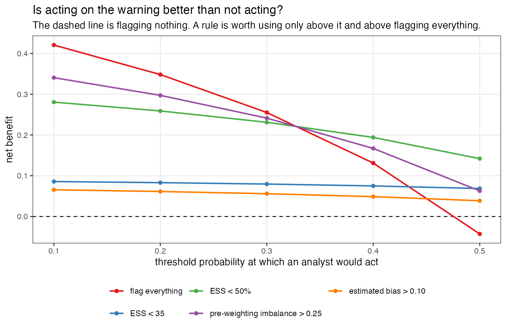
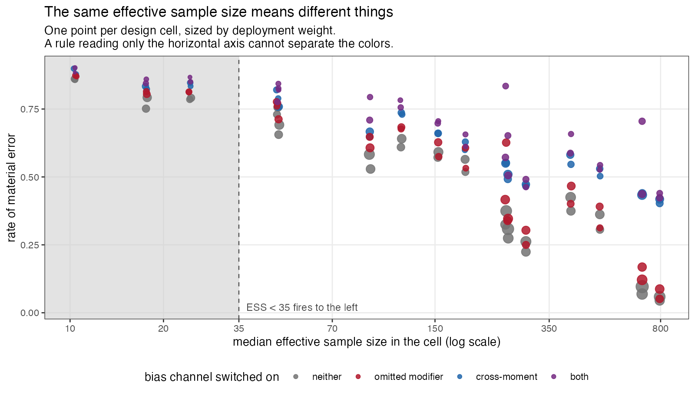
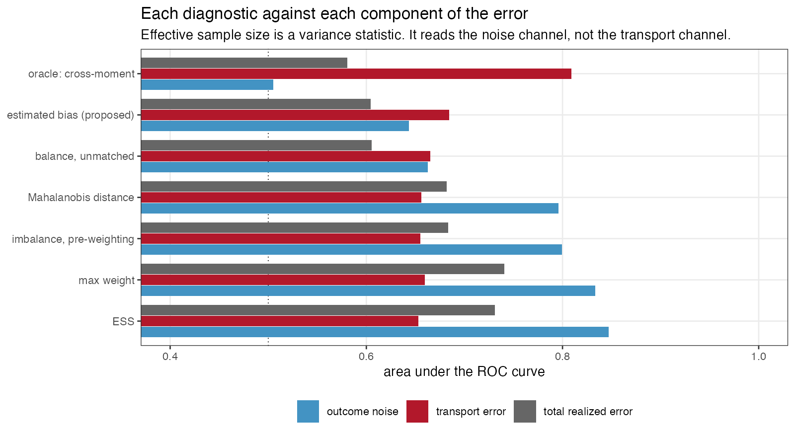

# Effective sample size is a variance statistic being read as a bias
warning
Ahmad Sofi-Mahmudi
2026-07-27

# Abstract

Population-adjusted indirect comparisons are conventionally reported
with a panel of numbers beside them: the effective sample size after
weighting, the same figure as a percentage, the largest individual
weight, standardized differences before and after adjustment. These
conventions come from the NICE DSU guidance on population adjustment
([1](#ref-phillippo2018)) and, for the overlap statistics, from the
transportability literature ([2](#ref-stuart2011),[3](#ref-tipton2014)).
A simulation reported at ISPOR Europe 2024 found bias in unanchored MAIC
once absolute effective sample size fell below roughly 30 to 35
([4](#ref-msr65)), and that region is now widely quoted informally as a
cutoff. We have not surveyed how appraisal committees actually use these
numbers, and this paper makes no claim about that. What a structured
audit of an open-problem catalog did establish is that no published work
scores any of them as a classifier of realized error, with
discrimination and calibration, against a known truth.

We do that. The design is an anchored indirect comparison with a
continuous outcome and an identity link, chosen because on that scale
the realized error of a linear estimator splits **exactly** into three
pieces: chance covariate imbalance between the source arms, transport
error, and outcome noise. Transport error is the only piece a covariate
diagnostic could know about before an outcome is seen, so a diagnostic
can be scored against the part it has a claim on rather than only
against the part it does not. The design has 128 cells crossing an
omitted effect modifier, a cross-moment modifier that no baseline table
could ever reveal, overlap, source size, how correlated the omitted
modifier is with the adjustment set, and a target dispersion ratio that
destroys effective sample size while adding no bias wherever the
modifier structure is correctly specified. 4,000 replicates per cell,
four estimators.

The prespecified verdict is that **no evaluated fixed cutoff met the
registered operating requirements**, sensitivity 0.80 at specificity
0.50 in every misspecification stratum. Effective sample size below 35
reaches sensitivity 0.309 at specificity 0.926 where an effect modifier
is omitted and the omission is diagnosable in principle. The panel is
not uninformative; what it is informative about is the wrong thing.
Effective sample size separates the two components that are functions of
covariates, assignment and weights at 0.847 and 0.813, and the transport
component, which is what adjustment exists to remove, at 0.653.

Three of the panel’s members are one statistic written three ways,
because $\mathrm{ESS}/n = 1/(1+\mathrm{CV}^2(w))$ exactly
([5](#ref-kish1965)) and area under the ROC curve is invariant to
monotone transformation; a fourth, the post-weighting balance on the
matched moments, is zero at the solution of the calibration equations
and among converged analyses cannot discriminate anything. Where the
bias is an omitted modifier the target reports, checking balance on the
covariate that was measured and not matched reaches 0.946 against the
transport component; where the bias sits in a cross-moment no baseline
table reports, nothing computable and no oracle we could construct
exceeds 0.648. Two of four registered mechanism claims failed, including
one of our own proposals, and both failures are reported as failures.

# What the audit left open

The catalog entry DIA-03 originally said that whether
population-adjustment diagnostics predict error “has never been
quantified”. Two independent auditors judged that too strong, and they
were right. An ISPOR Europe 2024 simulation reported bias in unanchored
MAIC once absolute effective sample size fell below roughly 30 to 35
([4](#ref-msr65)), and Remiro-Azócar, Heath and Baio tied small
effective sample size to underestimation of variability by the robust
sandwich variance estimator ([6](#ref-remiroazocar2021)). What survived
the audit is narrower:

> Neither treats a diagnostic as a classifier with discrimination and
> calibration against known truth.

One auditor added the objection that turns this from a complaint into a
research question. Computing a diagnostic from the fitted data does not
logically prevent it from predicting error. Sensitivity, specificity and
calibration are defined only relative to a specified distribution of
analyses and a prespecified threshold for material error; they are not
intrinsic properties of a statistic. That is why the field has no
numbers: nobody has written the distribution down. This study writes one
down in advance, and reports everything twice, once under it and once
with all cells weighted equally.

It also reports the primary results **within** strata of
misspecification rather than over a mixture of them, which removes the
dependence on our chosen frequencies entirely. That change came from an
adversarial critique of this design, before the run.

# What a covariate diagnostic could possibly know

Write the source trial’s outcome as
$Y_i = f(X_i) + \mathbb{1}(A_i)\{d_A + g_A(X_i)\} + \varepsilon_i$ with
$\varepsilon_i \sim N(0, \sigma^2)$, and let the estimand be the
transported effect in the target superpopulation,
$\theta_{AC}(T) = d_A + \mathbb{E}_T\{g_A(X)\}$. The identity link does
not make the heterogeneous conditional effect equal to the marginal one;
what it buys is the absence of non-collapsibility, so the marginal
effect is exactly the average of the conditional effects over the target
covariate distribution.

MAIC, STC and the unadjusted comparison are all **linear in the outcome
vector** for a fixed design: each is $\hat\theta = L(Y)$ for some linear
functional $L$. For MAIC,
$L(y) = \sum_{i \in A} w_i y_i / \sum_{i \in A} w_i - \sum_{i \in C} w_i y_i / \sum_{i \in C} w_i$;
for STC, $L(y) = a^\top y$ with $a = M(M^\top M)^{-1} e_A$. Applying the
same $L$ to each piece of $\mathbb{E}[Y \mid X, A]$ gives an identity,
not an approximation:

$$\underbrace{\hat\theta - \theta_{AC}(T)}_{\text{realized error}}
= \underbrace{L(f)}_{\text{arm imbalance}}
\;+\; \underbrace{L\big(\mathbb{1}(A)\{d_A + g_A\}\big) - \theta_{AC}(T)}_{\text{transport error}}
\;+\; \underbrace{L(Y) - L\big(\mathbb{E}[Y \mid X, A]\big)}_{\text{outcome noise}}.$$

**Only the middle term is what adjustment exists to remove.** The first
is chance covariate imbalance between the source arms, which
randomization makes mean-zero but not zero in any one trial. The third
is sampling error in the outcomes. The identity holds per replicate; we
verified it numerically to $3 \times 10^{-14}$ before the run.

An earlier version of this manuscript claimed that the middle term is
the only one knowable from covariates. All three reviewers of the first
round said that is wrong, and it is. The correction matters enough to
state precisely, because it changes what the headline number means.

**The arm-imbalance term uses no outcome at all.** $L(f)$ applies the
estimator’s linear functional to the prognostic index, which is a
function of the realized covariates, the treatment assignment and the
weights. It is therefore diagnosable in principle from exactly the
information the panel has. It is now scored like the other two.

**The noise term’s variance is a known function of the weights.** For
MAIC,

$$\mathrm{Var}\{L(\varepsilon) \mid X, A, w\}
= \sigma^2\left(\frac{\sum_{i \in A} w_i^2}{(\sum_{i \in A} w_i)^2}
+ \frac{\sum_{i \in C} w_i^2}{(\sum_{i \in C} w_i)^2}\right)
= \sigma^2\left(\frac{1}{\mathrm{ESS}_A} + \frac{1}{\mathrm{ESS}_C}\right),$$

with arm-specific effective sample sizes. So a statistic built from the
weights is not merely correlated with the noise channel, it is the
natural sufficient summary of it. This is not quite the identity it
looks like for the reported number: submissions report the **pooled**
effective sample size, and $2\sigma^2/\mathrm{ESS}_{\text{pooled}}$ is
about half the correct value in a representative cell of this design,
correlating with the exact noise standard deviation at $-0.92$ on the
log scale rather than at $-1$. But it is close enough that a high area
under the ROC curve against the noise channel should be read as a check
on the arithmetic and not as an empirical discovery.

**What survives, and it is the point of the paper.** Two of the three
components are functions of covariates, treatment assignment and weights
alone; the panel is built out of those same ingredients, and it tracks
both of them well. The third, transport error, is the one covariate
adjustment exists to remove, and it is the one the panel tracks poorly.
That comparison is not arithmetic: nothing forces a weight-dispersion
statistic to be uninformative about the gap between a weighted source
and a target, and where the modifier structure is correctly specified it
is in fact highly informative. What it cannot see is the part of the
modifier structure the weights never touched.

# Two facts that algebra settles before any data exist

The panel is smaller than it appears.

**Effective sample size, effective sample size as a percentage, and the
coefficient of variation of the weights are one statistic.** With
$\bar w$ the mean weight and $s^2$ the population variance of the
weights,

$$\frac{\mathrm{ESS}}{n} = \frac{\left(\sum_i w_i\right)^2}{n \sum_i w_i^2}
= \frac{n^2 \bar w^2}{n \cdot n\left(s^2 + \bar w^2\right)}
= \frac{\bar w^2}{s^2 + \bar w^2} = \frac{1}{1 + \mathrm{CV}^2(w)}.$$

Area under the ROC curve depends on the score only through its ranks, so
a strictly monotone transformation cannot change it. Within a fixed
source size the three therefore have **identical** discrimination as a
matter of arithmetic. Across sizes they differ, because $n$ varies. A
submission that reports all three is reporting one number three times
and calling it triangulation.

**The post-weighting standardized difference on the matched moments is
zero.** The MAIC calibration equations are
$\sum_i w_i\{h(X_i) - m_T\} = 0$; the balance statistic is that
expression divided by a standard deviation. It is set to zero by the
thing being reported as evidence that it worked. In this run it never
exceeded 1.4e-14.

Both are checked in the results rather than assumed, because the check
is a test of the implementation.

# Design

The full protocol was registered before the run and follows ADEMP
([7](#ref-morris2019)). What matters for reading the results:

**Four estimators.** MAIC calibrating the target’s means and standard
deviations of the adjustment set; MAIC calibrating means only; STC with
a heteroskedasticity-consistent variance ([8](#ref-mackinnon1985)); and
no adjustment at all. All adjust for the same three covariates, so when
a modifier is omitted they are misspecified in the same way. MAIC’s
variance is the M-estimation sandwich over the stacked calibration and
arm-mean equations ([9](#ref-stefanski2002)).

**Three bias channels, differing in whether anything could see them.**
An omitted effect modifier $X_4$, which the source data can estimate an
interaction for and a baseline table may report a mean for, so it is
diagnosable in principle. A cross-moment term in $X_1 X_2$ with source
and target correlations of 0.30 and 0.70, which no marginal balance
statistic can see and which no baseline table reports. And
extrapolation, which moves effective sample size and bias together and
is what gives effective sample size its only real chance.

**The factor that makes the study falsifiable.** The target’s covariate
standard deviations are either equal to the source’s or 25% larger.
Matching second moments to a more dispersed target destroys effective
sample size while adding no bias in the well-specified stratum, because
the modifier is linear in the adjustment set and its mean is matched
either way. Without it, every low-effective-sample-size cell would also
be a poor-overlap cell, and a variance statistic would look like a bias
statistic because the design never separated the two.

**The reference, and what is scored.** Material error means
$\lvert\hat\theta_{AC} - \theta_{AC}(T)\rvert > 0.20$: the error in the
**transported $A$ versus $C$ effect**, not in the anchored $A$ versus
$B$ contrast. That is deliberate, because the anchored contrast
additionally carries the target trial’s own sampling error, which no
source-side diagnostic has any information about, and including it would
depress every discrimination measure by a common amount. It gives the
panel the most favorable version of the question. Two reviewers pointed
out that calling the design anchored while scoring only the transported
component is not licensed, and they are right; the anchored contrast is
now reported alongside throughout, and the conclusions are the same.

0.20 is a fifth of the **residual** standard deviation. It is not a
fifth of the marginal outcome standard deviation, which also contains
the prognostic index and runs from 1.37 to 1.66 across the design; an
earlier version of this manuscript said outcome standard deviation and
was corrected in review. Results at 0.10 and 0.30 are reported. No
diagnostic enters the definition of the reference.

**Scale.** 128 cells, 4,000 replicates each, four estimators. MAIC found
a solution on 99.3% of replicates; the rest are reported per cell rather
than dropped silently.

# Results

## The panel at the thresholds in use

Table 1: Sensitivity and specificity for material error, within each
misspecification stratum, cells weighted equally inside a stratum. Monte
Carlo standard errors in brackets.

| diagnostic (sensitivity / specificity) | well.specified | omitted.modifier | cross.moment | both |
|:---|:--:|:--:|:--:|:--:|
| ESS | 0.326 / 0.923 | 0.309 / 0.926 | 0.265 / 0.918 | 0.251 / 0.915 |
| ESS % | 0.742 / 0.623 | 0.735 / 0.654 | 0.649 / 0.607 | 0.642 / 0.633 |
| largest weight | 0.350 / 0.919 | 0.332 / 0.920 | 0.285 / 0.913 | 0.269 / 0.909 |
| balance, matched moments | 0.000 / 1.000 | 0.000 / 1.000 | 0.000 / 1.000 | 0.000 / 1.000 |
| imbalance before weighting | 0.822 / 0.408 | 0.823 / 0.431 | 0.767 / 0.403 | 0.771 / 0.440 |
| Mahalanobis distance | 0.656 / 0.692 | 0.652 / 0.721 | 0.570 / 0.683 | 0.564 / 0.707 |
| balance, unmatched covariate | 0.559 / 0.610 | 0.571 / 0.639 | 0.520 / 0.608 | 0.543 / 0.681 |
| estimated bias (proposed) | 0.099 / 0.962 | 0.393 / 0.807 | 0.091 / 0.957 | 0.358 / 0.827 |

The prespecified bar was sensitivity at least 0.80 with specificity at
least 0.50 in every stratum, lower Monte Carlo limits above both. No
rule met it.

In the omitted-modifier stratum, which is where a diagnostic has both
something to find and the information with which to find it, the
published cutoff reaches sensitivity 0.309 (0.001) at specificity 0.926.
Two members of the panel reach high sensitivity by firing on nearly
everything: the pre-weighting imbalance rule fires on 70.6% of analyses
in that stratum and the unmatched-balance rule on 47.4%. A rule that
warns about almost every analysis is not a classifier, and its
specificity says so: 0.431 and 0.639.

Replicates on which MAIC had no solution: 3,747. Those replicates are
excluded from every operating point above, because an analysis that does
not exist has no realized error to classify. Bracketing the primary
rule’s sensitivity by counting every one of them as a caught failure,
then as a missed one, gives 0.285 and 0.273. The bracket is over the
whole design with cells weighted equally, not within the
omitted-modifier stratum, and it moves the figure by less than a
percentage point either way because MAIC found a solution on 99.3% of
replicates.

## The statistics carry information the thresholds do not use

Table 2: Discrimination under the declared deployment distribution. The
last two columns are the point of the study: which component of the
realized error does each statistic actually track?

|  | diagnostic | AUROC | AUPRC | vs outcome noise | vs transport error |
|:---|:---|---:|---:|---:|---:|
| ess | ESS | 0.731 (0.001) | 0.707 | 0.847 | 0.653 |
| ess_pct | ESS % | 0.723 (0.001) | 0.698 | 0.813 | 0.667 |
| cv_w | CV(w) | 0.723 (0.001) | 0.698 | 0.813 | 0.667 |
| max_w | largest weight | 0.741 (0.001) | 0.716 | 0.833 | 0.660 |
| smd_matched | balance, matched moments | 0.550 (0.001) | 0.509 | 0.571 | 0.538 |
| smd_pre | imbalance before weighting | 0.683 (0.001) | 0.671 | 0.799 | 0.655 |
| maha | Mahalanobis distance | 0.682 (0.001) | 0.669 | 0.796 | 0.656 |
| smd_unmatched | balance, unmatched covariate | 0.606 (0.001) | 0.592 | 0.663 | 0.665 |
| bias_hat | estimated bias (proposed) | 0.604 (0.001) | 0.591 | 0.643 | 0.684 |
| orc_cross | oracle: cross-moment | 0.581 (0.001) | 0.551 | 0.505 | 0.809 |

Table 3: All three components of the realized error, the other two
material thresholds, equal cell weights, and the anchored contrast. The
first column is new since round one of review: the arm-imbalance
component uses no outcome and is therefore diagnosable in principle from
exactly the information the panel has.

|  | diagnostic | vs arm imbalance | vs transport | vs noise | equal weights | material 0.10 | material 0.30 | anchored |
|:---|:---|---:|---:|---:|---:|---:|---:|---:|
| ess | ESS | 0.813 | 0.653 | 0.847 | 0.721 | 0.683 | 0.779 | 0.699 |
| ess_pct | ESS % | 0.807 | 0.667 | 0.813 | 0.717 | 0.675 | 0.770 | 0.692 |
| cv_w | CV(w) | 0.807 | 0.667 | 0.813 | 0.717 | 0.675 | 0.770 | 0.692 |
| max_w | largest weight | 0.837 | 0.660 | 0.833 | 0.729 | 0.690 | 0.791 | 0.708 |
| smd_matched | balance, matched moments | 0.583 | 0.538 | 0.571 | 0.557 | 0.537 | 0.564 | 0.544 |
| smd_pre | imbalance before weighting | 0.739 | 0.655 | 0.799 | 0.690 | 0.641 | 0.728 | 0.658 |
| maha | Mahalanobis distance | 0.737 | 0.656 | 0.796 | 0.690 | 0.640 | 0.726 | 0.657 |
| smd_unmatched | balance, unmatched covariate | 0.615 | 0.665 | 0.663 | 0.623 | 0.583 | 0.629 | 0.590 |
| bias_hat | estimated bias (proposed) | 0.603 | 0.684 | 0.643 | 0.619 | 0.582 | 0.625 | 0.588 |
| orc_cross | oracle: cross-moment | 0.502 | 0.809 | 0.505 | 0.586 | 0.577 | 0.576 | 0.566 |

Discrimination is not zero. Nothing here is uninformative in the sense
of being independent of error. The pattern across components is the
answer to what the panel is measuring. Effective sample size reaches
0.847 against the noise channel and 0.813 against the arm-imbalance
channel, which are the two components that are functions of covariates,
assignment and weights; against the transport component, which is what
adjustment exists to remove, it reaches 0.653. The first of those
numbers is close to arithmetic for the reason given in
<a href="#sec-decomposition" class="quarto-xref">Section 2</a>. The
second is not, and the third is not. A statistic that reads two channels
at above 0.80 and the third at 0.653 is a variance statistic, and it is
being read as a bias warning.

The conclusion does not depend on the material threshold: at 0.10 and
0.30 the ordering is unchanged, and it survives the switch from the
declared mixture to equal cell weights and the switch from the
transported component to the anchored contrast a submission reports.

The oracle row separates two different failures. The cross-moment oracle
uses the target’s true $\mathbb{E}[X_1X_2]$, which no baseline table
reports, and reaches 0.809 against transport error while everything
computable sits near 0.667. Where the oracle wins, the information is
missing rather than the statistic being the wrong function of it.

One row needs a warning label. The balance statistic on the matched
moments shows AUROC 0.550, which is not 0.5 and might be read as weak
signal. It is not. That statistic never exceeded 1.4e-14 anywhere in the
run: what is being ranked is floating-point residual from the
calibration solver, and the residual is larger in cells where the
equations were harder to solve, which are also harder cells. The
apparent discrimination is discrimination of arithmetic difficulty.

That claim has a boundary a reviewer was right to insist on, and it is
narrower than it first appears. Post-weighting balance on the matched
moments is zero **conditional on accepting a solution to the calibration
equations**, and this analysis conditions on exactly that. Its real
operational job is to reveal that the balancing algorithm failed or
nearly failed, and by scoring only accepted fits we removed the cases
where it can do that job. So the finding is: among analyses that
converged, the matched-moment balance statistic is redundant by
construction and reporting it as evidence the adjustment worked is
reporting that the solver terminated. Whether it is useful as a
convergence check is a different question and this design cannot answer
it. MAIC found no solution on 0.7% of replicates, 3,747 in total, and
those are reported as an operational outcome rather than folded into the
classifier analysis.

## The panel is smaller than it looks

Table 4: The algebraic identities, checked. Within a fixed source size
the three weight-dispersion statistics have the same AUROC to machine
precision, and the matched-moment balance statistic is zero.

| source per arm |   ESS | ESS % | CV(w) | max matched imbalance |
|---------------:|------:|------:|------:|----------------------:|
|            150 | 0.706 | 0.706 | 0.706 |               1.3e-14 |
|            400 | 0.740 | 0.740 | 0.740 |               1.4e-14 |

## Calibration

A diagnostic is calibrated if a mapping from it to a risk of material
error, fitted once and locked, tells the truth on analyses it has not
seen ([10](#ref-austin2019)). The mapping is a logistic regression of
the material-error indicator on one transformed diagnostic, minus the
natural logarithm where a low value is the warning and the statistic
itself otherwise, with a single linear term and no splines.

The first version of this analysis trained on odd-numbered cells and
tested on even ones. A reviewer warned that such a split can separate
levels of a design factor depending on how cells are enumerated, and in
this design it did so perfectly: cells are enumerated with the target
dispersion ratio varying fastest, so every odd cell had ratio 1.00 and
every even cell 1.25. That analysis measured transport across one factor
and reported it as transport in general. It is replaced by
**leave-one-factor-level-out**: fourteen folds, each holding out every
cell at one level of one factor, balanced across everything else by
construction.

Table 5: Calibration of a locked logistic mapping from each diagnostic
to the risk of material error. Perfect calibration is intercept 0 and
slope 1.

|  | diagnostic | intercept | slope | error, median fold | error, worst fold | error, same cells |
|:---|:---|---:|---:|---:|---:|---:|
| ess | ESS | -0.257 | 1.179 | 0.076 | 0.197 | 0.066 |
| ess_pct | ESS % | -0.269 | 1.195 | 0.095 | 0.200 | 0.069 |
| max_w | largest weight | -0.350 | 1.381 | 0.117 | 0.201 | 0.091 |
| smd_pre | imbalance before weighting | -0.317 | 1.227 | 0.098 | 0.235 | 0.075 |
| maha | Mahalanobis distance | -0.315 | 1.192 | 0.096 | 0.235 | 0.075 |
| smd_unmatched | balance, unmatched covariate | -0.331 | 0.877 | 0.163 | 0.362 | 0.101 |
| bias_hat | estimated bias (proposed) | -0.430 | 1.151 | 0.165 | 0.280 | 0.086 |

Table 6: Which held-out factor level breaks each mapping. For every
weight-dispersion statistic it is the cross-moment channel: a risk
mapping learned where that bias is present does not transport to where
it is absent, or the reverse.

| diagnostic                   | held-out factor | level | calibration error |
|:-----------------------------|:----------------|------:|------------------:|
| ESS                          | joint           |     0 |             0.197 |
| ESS %                        | joint           |     0 |             0.200 |
| largest weight               | joint           |     0 |             0.201 |
| imbalance before weighting   | sd_target       |     1 |             0.235 |
| Mahalanobis distance         | sd_target       |     1 |             0.235 |
| balance, unmatched covariate | rho4            |     0 |             0.362 |
| estimated bias (proposed)    | overlap         |     0 |             0.280 |
| oracle: cross-moment         | overlap         |     0 |             0.299 |

Across a median fold the weight-dispersion statistics calibrate
tolerably: effective sample size has intercept -0.257, slope 1.179 and
an integrated calibration error of 0.076. The worst fold is what matters
for an analyst, who does not know which setting they are in, and there
the error is 0.197: a mapping from effective sample size to risk,
learned elsewhere, is off by about twenty points of absolute risk in the
setting it transports worst to.

That worst setting is the same for every weight-dispersion statistic in
the panel, and it is the cross-moment channel. A mapping fitted where a
bias no baseline table can reveal is operating, applied where it is not,
or the reverse, gets the risk badly wrong. This is the substantive
version of the transportability question, and it is the analysis the
registered mechanism claim should have used; the registered version
compared predictive values across cells, which move with prevalence and
case mix even when a rule’s operating characteristics are stable, and a
reviewer was right that it is not a test of transportability at all.

## Is acting on the warning better than not acting?

Net benefit relative to flagging nothing, over a range of threshold
probabilities at which an analyst would act ([11](#ref-vickers2006)). A
rule earns its place only above both flagging nothing and flagging
everything.

Table 7: Net benefit relative to flagging nothing, under the deployment
weights.

| action threshold | flag nothing | flag everything | ESS \< 35 | ESS \< 50% | imbalance \> 0.25 | Mahalanobis \> 1 | estimated bias \> 0.10 |
|---:|---:|---:|---:|---:|---:|---:|---:|
| 0.1 | 0 | 0.421 | 0.086 | 0.281 | 0.341 | 0.242 | 0.066 |
| 0.2 | 0 | 0.348 | 0.083 | 0.259 | 0.297 | 0.224 | 0.061 |
| 0.3 | 0 | 0.255 | 0.080 | 0.231 | 0.241 | 0.202 | 0.056 |
| 0.4 | 0 | 0.131 | 0.075 | 0.194 | 0.167 | 0.172 | 0.049 |
| 0.5 | 0 | -0.043 | 0.069 | 0.142 | 0.063 | 0.130 | 0.039 |

Every rule in the panel is beaten by flagging everything at action
thresholds up to 0.300. An analyst who would act on a 10.0% chance of
material error does better scrutinizing every population adjustment than
reading any of these numbers. From an action threshold of 0.400 upwards,
meaning an analyst who intervenes only when material error is at least
that likely, 4 rules beat both alternatives: relative effective sample
size, pre-weighting imbalance and Mahalanobis distance. The absolute
effective-sample-size cutoff that gets quoted is not among them at any
threshold examined.

## The four prespecified mechanism claims

Table 8: The four claims registered before the run, and whether the run
supports them.

| claim | holds | evidence |
|:---|:--:|:---|
| It is a variance statistic, not a bias statistic | yes | Effective sample size discriminates outcome noise at AUROC 0.847 and transport error at 0.653, a gap of 0.194 against a prespecified 0.10. |
| The threshold is not transportable | no | Across the 24 cells the rule flags on most replicates, the material-error rate runs from 0.751 to 0.902, a span of 0.150 against a prespecified 0.30. Across the 88 cells it is silent on, the rate runs from 0.045 to 0.835. |
| The panel is one statistic | yes | Within a fixed source size the three agree to 0.0e+00 in AUROC, and the matched-moment balance statistic never exceeds 1.4e-14. |
| A better statistic is available from the same information | no | In the diagnosable stratum, against the transport component, the proposal reaches 0.937 and the best routinely reported diagnostic 0.851, a gain of 0.086 against a prespecified 0.10. |

Two of the four hold and two do not, and the two that do not are
reported as they were registered rather than adjusted until they did.
The two gaps that carry the surviving claims, 0.194 and 0.086, are
reported as **point estimates against a registered threshold** and not
as tested differences: the bootstrap used for the areas under the curve
is cell-stratified and unpaired, so it does not give a Monte Carlo
interval for a difference between two diagnostics on the same
replicates. A reviewer asked for paired intervals and this is the reason
they are absent.

**The threshold-transportability claim failed as written.** We
registered a span of at least 0.30 in the material-error rate across the
cells the rule *flags*. The observed span is 0.150, and the reason is
visible in <a href="#fig-ess" class="quarto-xref">Figure 1</a>: the
flagged cells are all in the low-effective-sample-size region where
almost everything is wrong, so there is little room for a spread. Across
the 88 cells the rule is **silent** on, the material-error rate runs
from 0.045 to 0.835.

A first draft called that second number a stronger version of the
registered claim. It is not, and a reviewer was right to object. Both
spans are variation in **predictive value** across cells, and predictive
value moves with prevalence and case mix even when sensitivity and
specificity are stable, so neither is a test of whether a threshold
transports. They are descriptions of what an analyst faces: the same
silence covers a 4.5% and an 83.5% chance of material error depending on
which cell you are in. The claim registered as a test of
transportability failed, and the proper evidence on transportability is
the calibration of a locked risk model in held-out cells, which is
<a href="#sec-calibration" class="quarto-xref">Section 5.4</a>.

**The proposal missed its bar too.** Registered at a gain of at least
0.10 in area under the ROC curve against the transport component in the
diagnosable stratum; observed 0.937 against 0.851, a gain of 0.086. It
is a real improvement and it is not the one we said would count.

Table 9: Discrimination against the transport component within each
stratum, cells weighted equally. This is where the two numbers behind
mechanism claim 4 live; in round one of review they appeared in the
abstract and in no table.

| diagnostic | well specified | omitted modifier | cross-moment | both |
|:---|---:|---:|---:|---:|
| ESS | 0.946 | 0.837 | 0.637 | 0.658 |
| ESS % | 0.925 | 0.862 | 0.642 | 0.679 |
| largest weight | 0.940 | 0.841 | 0.643 | 0.664 |
| imbalance before weighting | 0.897 | 0.859 | 0.617 | 0.681 |
| Mahalanobis distance | 0.894 | 0.859 | 0.618 | 0.683 |
| balance, unmatched covariate | 0.737 | 0.946 | 0.573 | 0.755 |
| estimated bias (proposed) | 0.725 | 0.938 | 0.566 | 0.746 |
| oracle: cross-moment | 0.500 | 0.500 | 0.648 | 0.626 |

Two things in that table matter more than the registered claim. Where
the omitted modifier is the only bias channel, checking balance on the
covariate you did **not** match reaches 0.946 and converting it into
effect units reaches 0.938, against 0.862 for effective sample size. The
plain balance check is as good as our conversion here, because with a
single unmatched covariate the estimated interaction adds noise without
adding information; with several unmatched covariates of differing
importance the conversion should separate them and this design cannot
show that. The practical advice that survives is the plain one: **check
balance on everything you measured, not only on what you matched.**

Where the bias sits in a cross-moment, everything collapses to 0.566 to
0.637, including the oracle. No baseline table reports a correlation, so
nothing computable and nothing we could construct sees it.

Figure 1

## The other estimators

Table 10: The same replicates seen by the other three estimators. Median
effective sample size is over the whole design.

| method | diagnostic | AUROC | vs transport | material error | median ESS | coverage |
|:---|:---|---:|---:|---:|---:|---:|
| MAIC, means only | ESS | 0.704 | 0.599 | 0.433 | 261.783 | 0.730 |
| MAIC, means only | imbalance before weighting | 0.685 | 0.607 | 0.433 | 261.783 | 0.730 |
| MAIC, means only | Mahalanobis distance | 0.683 | 0.608 | 0.433 | 261.783 | 0.730 |
| MAIC, means only | balance, unmatched covariate | 0.602 | 0.624 | 0.433 | 261.783 | 0.730 |
| MAIC, means only | estimated bias (proposed) | 0.602 | 0.641 | 0.433 | 261.783 | 0.730 |
| STC | imbalance before weighting | 0.656 | 0.635 | 0.340 | 550.000 | 0.533 |
| STC | Mahalanobis distance | 0.655 | 0.636 | 0.340 | 550.000 | 0.533 |
| STC | balance, unmatched covariate | 0.606 | 0.619 | 0.340 | 550.000 | 0.533 |
| STC | estimated bias (proposed) | 0.611 | 0.628 | 0.340 | 550.000 | 0.533 |
| no adjustment | imbalance before weighting | 0.804 | 0.891 | 0.596 | 550.000 | 0.357 |
| no adjustment | Mahalanobis distance | 0.804 | 0.891 | 0.596 | 550.000 | 0.357 |
| no adjustment | balance, unmatched covariate | 0.802 | 0.892 | 0.596 | 550.000 | 0.357 |
| no adjustment | estimated bias (proposed) | 0.798 | 0.873 | 0.596 | 550.000 | 0.357 |

Table 11: Coverage of the nominal 95% interval, over the whole design.
Added after round one of review, which noted that the primary
estimator’s coverage was missing.

|           | method              | transported effect | anchored contrast | fitted |
|:----------|:--------------------|-------------------:|------------------:|-------:|
| maic      | MAIC, means and SDs |              0.748 |             0.774 |  0.993 |
| maic_mean | MAIC, means only    |              0.730 |             0.773 |  1.000 |
| stc       | STC                 |              0.533 |             0.609 |  1.000 |
| unadj     | no adjustment       |              0.357 |             0.428 |  1.000 |

No estimator here covers at nominal. MAIC reaches 0.748 on the
transported effect over a design that contains a great deal of
deliberate misspecification, and the sandwich contributes its own
shortfall at small effective sample size, which is the failure
Remiro-Azócar and colleagues documented for the variance estimator used
in their study ([6](#ref-remiroazocar2021)). That is context for the
diagnostic results rather than a finding about the estimators: an
interval that misses is one of the things a diagnostic might be asked to
predict, and <a href="#tbl-auc" class="quarto-xref">Table 2</a> reports
discrimination against non-coverage as well.

The unadjusted comparison is the control that explains the rest of the
paper. Its pre-weighting imbalance statistic predicts its own transport
error at AUROC 0.891, against 0.655 for the same statistic applied to
MAIC. The statistic is not weak. It is an excellent measure of the gap
between the two populations, and the gap between the two populations is
exactly the error of an estimator that does nothing about it. Once
weighting has closed those gaps, the statistic is measuring something
that has been removed, and what remains is the part of the modifier
structure the weights never touched. The diagnostic is informative about
the problem and uninformative about the solution.

Means-only MAIC is worth a line for the same reason. It carries a median
effective sample size of 261.783 against 170.748 for the version that
also matches standard deviations, and a lower material-error rate, 0.433
against 0.479. Calibrating second moments that the modifier structure
does not use costs effective sample size and buys nothing here. A reader
should not generalize that: with a modifier that is nonlinear in the
covariates, those moments would matter.

# What this answers, and what it does not

**DIA-03.** The entry asked for the routine panel to be scored as a
classifier of realized error with discrimination and calibration against
a known truth, under a specified scenario distribution and a
prespecified material-error threshold. That is done, for the MAIC
weighting panel and the overlap statistics it shares with STC. The
second half of the entry, the mismatch between the hierarchical level at
which cross-validation is reported and the level at which the prediction
is made, is untouched: no PSIS-LOO is computed at any level here, and
grouped study-level leave-one-out is no more implemented in this study
than it is in the packages. That half remains open.

**DIA-06.** Answered in part, and the part is small. Four estimators
from two families see the same replicates, so their failure modes can be
compared on identical data; but ML-NMR, NMI, doubly robust estimators
and flexible learners are absent, and the entry names five families. A
design critique made this point before the run and it is accepted rather
than argued with.

**What the mechanism deliberately makes true.** Randomization holds. The
prognostic and modifier functions are shared across trials, so
conditional constancy holds. Covariates are normal. The link is the
identity. Target moments are exact, because study 1 of this program
already measured what their sampling error costs and carrying it here
would add a noise channel no source-side diagnostic can observe. Every
estimator adjusts for the same covariates.

**Therefore the study says nothing about** non-collapsible effect
measures, time-to-event outcomes, skewed or discrete covariates,
unanchored comparisons, target-moment sampling error, or the diagnostics
specific to Bayesian population adjustment. A binary or survival outcome
would add a component of error that is a collapsibility artifact rather
than an adjustment failure, and the exact decomposition in
<a href="#sec-decomposition" class="quarto-xref">Section 2</a> would not
be available; that is the price paid for the instrument, and it is the
largest limitation here.

**The deployment weights are a judgment, not a measurement.** Nothing in
this program estimated how often an effect modifier is omitted in
practice. That is why the primary results are within strata and why
every mixture-level figure is reported under two weightings. Reporting
within strata removes the dependence on the *misspecification*
frequencies only. The design points themselves, the overlap levels, the
sample sizes, the dispersion ratio, the magnitude of the modifier
coefficients, and equal weighting of cells inside a stratum are all
still ours, and every operating characteristic in this paper is a
property of that distribution rather than an intrinsic property of a
diagnostic. An earlier draft said the stratum reporting removed the
dependence “entirely”; it does not.

**Extensions this study does not attempt, each named because a reviewer
asked for it.** Heteroskedastic outcome errors, which would loosen the
tie between weight dispersion and the noise channel. Multiple omitted
modifiers, or one entering nonlinearly, which is where converting
imbalance into effect units should beat a plain balance check and where
this design cannot show it. Target moments carrying their own sampling
error, measured separately in study 1 of this program. Cross-fitting the
interaction that the proposed diagnostic uses, which would remove the
in-sample optimism we have instead disclosed. And a design in which the
target mean is displaced by different amounts in different covariates:
here the displacement is common, which is why the maximum standardized
difference and the Mahalanobis distance agree to three decimals
throughout and cannot be told apart.

**The transport component is not pure bias.** It is the realized
effect-modifier component of one replicate, containing finite-sample
source composition and allocation variation as well as systematic
transport bias. Scoring against it answers “can the panel see the part
of this analysis’s error that came from the covariate structure”, which
is the question here, and not “can the panel see the expected bias of
this cell”, which would need a per-cell Monte Carlo expectation and is a
different analysis.

**The proposal is ours, and it is not compared on an equal footing.**
$\widehat{b}$ uses the source **outcomes**, through a
treatment-by-covariate interaction estimated in the same sample whose
error is being diagnosed, while every routine diagnostic in the panel is
an outcome-free function of covariates and weights. It is therefore an
outcome-model-assisted diagnostic and should be read as one; a reviewer
was right that comparing it with the panel without saying so overstates
it. Estimating the interaction in-sample also invites optimism that
cross-fitting would remove and that we did not do. It missed its
registered bar, the plain balance check on unmatched covariates does
about as well in this design, and the practical recommendation that
survives is the plain one.

**The verdict is about cutoffs, not about the statistics.** “The panel
does not classify realized error at the thresholds in use” is a
registered label, and what it means precisely is that no evaluated fixed
cutoff met a sensitivity and specificity pair chosen in advance. Those
requirements were not derived from an elicited loss function. The
statistics do carry information, effective sample size calibrates
tolerably out of cell, and a reader who wants a different operating
point can take one off the ROC curves. What the decision-curve analysis
adds is that at the action thresholds a cautious analyst would use, none
of the available operating points beats scrutinizing everything.

# Peer review

This manuscript was reviewed by three independent reviewers over two
rounds. The reports, the authors’ responses and the editorial decision
are published in full and unedited alongside it.

# Reproducibility

All code is in the study directory. `R/00-config.R` holds the design,
the thresholds and the decision rule; `R/01-dgm.R` the mechanism;
`R/02-estimators.R` the four estimators and the exact error
decomposition; `R/03-diagnostics.R` the panel; `R/04-run.R` the run;
`R/05-analyze.R` the analysis; `R/06-figures.R` the figures. Replicates
are seeded from one master seed through independent L’Ecuyer-CMRG
streams, so a replicate draws the same data whatever the core count.
`results/provenance.md` records the R version and package versions that
produced these numbers. Raw replicate output is regenerable from the
seed and is not tracked; the tracked artifacts are the summary tables,
the figures and the rendered manuscript.

# References

1.
David M. Phillippo, A. E. Ades,
Sofia Dias, Stephen Palmer, Keith R. Abrams, Nicky J. Welton. Methods
for population-adjusted indirect comparisons in health technology
appraisal. Medical Decision Making. 2018;38(2):200–11.
doi:[10.1177/0272989X17725740](https://doi.org/10.1177/0272989X17725740)

2.
Elizabeth A. Stuart, Stephen R.
Cole, Catherine P. Bradshaw, Philip J. Leaf. The use of propensity
scores to assess the generalizability of results from randomized trials.
Journal of the Royal Statistical Society Series A. 2011;174(2):369–86.
doi:[10.1111/j.1467-985X.2010.00673.x](https://doi.org/10.1111/j.1467-985X.2010.00673.x)

3.
Elizabeth Tipton. How
generalizable is your experiment? An index for comparing experimental
samples and populations. Journal of Educational and Behavioral
Statistics. 2014;39(6):478–501.
doi:[10.3102/1076998614558486](https://doi.org/10.3102/1076998614558486)

4.
MSR65 can low effective sample
size in matching-adjusted indirect comparisons (MAICs) lead to bias?
Findings from a simulation study \[Internet\]. ISPOR Europe 2024,
abstract published in Value in Health; 2024. Available from:
<https://www.valueinhealthjournal.com/article/S1098-3015(24)05162-3/fulltext>

5.
Leslie Kish. Survey sampling. New
York: Wiley; 1965.

6.
Antonio Remiro-Azócar, Anna Heath,
Gianluca Baio. Methods for population adjustment with limited access to
individual patient data: A review and simulation study. Research
Synthesis Methods. 2021;12(6):750–75.
doi:[10.1002/jrsm.1511](https://doi.org/10.1002/jrsm.1511)

7.
Tim P. Morris, Ian R. White,
Michael J. Crowther. Using simulation studies to evaluate statistical
methods. Statistics in Medicine. 2019;38(11):2074–102.
doi:[10.1002/sim.8086](https://doi.org/10.1002/sim.8086)

8.
James G. MacKinnon, Halbert White.
Some heteroskedasticity-consistent covariance matrix estimators with
improved finite sample properties. Journal of Econometrics.
1985;29(3):305–25.
doi:[10.1016/0304-4076(85)90158-7](https://doi.org/10.1016/0304-4076(85)90158-7)

9.
Leonard A. Stefanski, Dennis D.
Boos. The calculus of m-estimation. The American Statistician.
2002;56(1):29–38.
doi:[10.1198/000313002753631330](https://doi.org/10.1198/000313002753631330)

10.
Peter C. Austin, Ewout W.
Steyerberg. The integrated calibration index (ICI) and related metrics
for quantifying the calibration of logistic regression models.
Statistics in Medicine. 2019;38(21):4051–65.
doi:[10.1002/sim.8281](https://doi.org/10.1002/sim.8281)

11.
Andrew J. Vickers, Elena B. Elkin.
Decision curve analysis: A novel method for evaluating prediction
models. Medical Decision Making. 2006;26(6):565–74.
doi:[10.1177/0272989X06295361](https://doi.org/10.1177/0272989X06295361)

