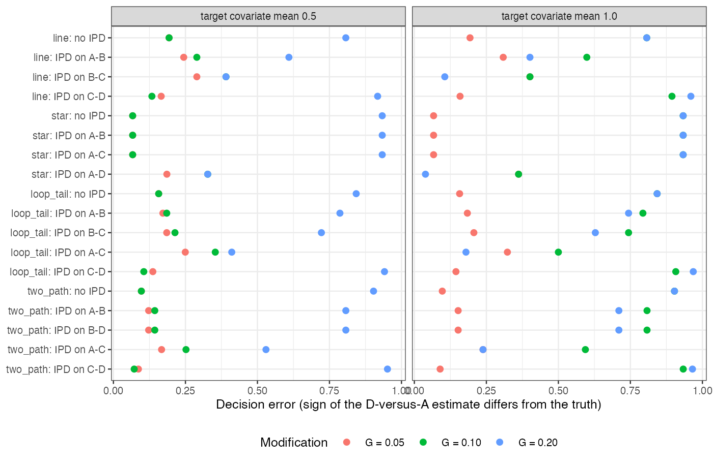

# Where the individual data sit decides the error of a
population-adjusted network contrast at the same total sample size
Ahmad Sofi-Mahmudi
2026-09-23

# Abstract

**Background.** Simulation studies of population adjustment use
two-trial templates and index information by sample size. Catalog
problem DIA-07 asks whether, at the same total size, the network’s
topology and the position of the individual-data trial change the error
of the decision contrast.

**Methods.** An exact calculation for four-treatment networks (line,
star, loop-with-tail, two paths) of 1200 patients, with effect
modification on every treatment, one individual-data trial standardized
to the target and placed on each edge in turn, and a fixed-effect
network meta-analysis of the rest.

**Results.** With moderate modification and a target shifted by one
covariate SD, the probability of getting the sign of D versus A wrong
ranged from 0.362 to 0.933 across topologies and placements. An
individual-data trial off every path to the contrast carried zero weight
and changed nothing. Standardizing one edge could increase the bias,
from 0.20 to 0.30 in the line network, by removing an error that had
offset the others.

**Conclusion.** Results from a two-trial template do not transfer to a
network by matching total size. Reports should state the topology, where
the individual data sit, and the share of the decision contrast those
data carry.

# The problem

A network estimate of a contrast is a weighted sum of the trial
estimates, the target row of the hat matrix. In a population-adjusted
network only some trials are standardized to the target; the rest
estimate their own population’s effect. The error of the contrast is the
weighted sum of the unadjusted trials’ population biases, so it depends
on which trials lie on the paths to the contrast, with what weights, and
on whether their biases add or cancel. None of that is a function of
total sample size. Multilevel network meta-regression addresses this by
modeling the modification throughout the network
([1](#ref-phillippo2020mlnmr)); a trial-by-trial adjustment does not.

# Design

Registered protocol: `protocol.md`. Effect of treatment $k$ against A at
covariate $x$: $d_k + g_kx$ with $d = (0, -0.1, -0.2, -0.15)$ and
$g = (0, G, 3G, 2G)$, $G \in \{0.05, 0.1, 0.2\}$. The decision contrast
D versus A in a target with covariate mean $M_T \in \{0.5, 1\}$; all
trial populations have mean 0. 1200 patients split equally over the
trials; the individual-data trial is standardized by regression
(unbiased, variance inflated by $1 + M_T^2$); the others report their
own population’s effect. Bias, SD, coverage and decision error are
exact.

# Results

Figure 1: Decision error by topology and position of the individual-data
trial.

Table 1: $G = 0.1$, $M_T = 1$: D is slightly worse than A in the target
(truth 0.05) but better in the trials’ populations. IPD share: the
individual-data trial’s share of the absolute hat-matrix row.

| configuration         | truth |   bias |    SD | coverage | decision error | IPD share |
|-----------------------|------:|-------:|------:|---------:|---------------:|----------:|
| line, no IPD          |  0.05 | -0.200 | 0.173 |    0.789 |          0.807 |      0.00 |
| line, IPD on A-B      |  0.05 | -0.100 | 0.200 |    0.921 |          0.599 |      0.33 |
| line, IPD on B-C      |  0.05 |  0.000 | 0.200 |    0.950 |          0.401 |      0.33 |
| line, IPD on C-D      |  0.05 | -0.300 | 0.200 |    0.677 |          0.894 |      0.33 |
| star, no IPD          |  0.05 | -0.200 | 0.100 |    0.484 |          0.933 |      0.00 |
| star, IPD on A-B      |  0.05 | -0.200 | 0.100 |    0.484 |          0.933 |      0.00 |
| star, IPD on A-C      |  0.05 | -0.200 | 0.100 |    0.484 |          0.933 |      0.00 |
| star, IPD on A-D      |  0.05 |  0.000 | 0.141 |    0.950 |          0.362 |      1.00 |
| loop_tail, no IPD     |  0.05 | -0.200 | 0.149 |    0.731 |          0.843 |      0.00 |
| loop_tail, IPD on A-B |  0.05 | -0.175 | 0.153 |    0.791 |          0.793 |      0.11 |
| loop_tail, IPD on B-C |  0.05 | -0.150 | 0.153 |    0.834 |          0.744 |      0.11 |
| loop_tail, IPD on A-C |  0.05 | -0.050 | 0.163 |    0.939 |          0.500 |      0.20 |
| loop_tail, IPD on C-D |  0.05 | -0.300 | 0.189 |    0.644 |          0.908 |      0.43 |
| two_path, no IPD      |  0.05 | -0.200 | 0.115 |    0.590 |          0.903 |      0.00 |
| two_path, IPD on A-B  |  0.05 | -0.160 | 0.126 |    0.756 |          0.808 |      0.20 |
| two_path, IPD on B-D  |  0.05 | -0.160 | 0.126 |    0.756 |          0.808 |      0.20 |
| two_path, IPD on A-C  |  0.05 | -0.080 | 0.126 |    0.903 |          0.594 |      0.20 |
| two_path, IPD on C-D  |  0.05 | -0.240 | 0.126 |    0.525 |          0.933 |      0.20 |

The registered condition failed in all six scenarios: decision error
spread by 0.223 to 0.930 across configurations at the same total size
(<a href="#fig-decision" class="quarto-xref">Figure 1</a>). Three
mechanisms produced the spread
(<a href="#tbl-main" class="quarto-xref">Table 1</a>). **Zero weight:**
in the star, an individual-data trial of A versus B or A versus C has no
weight on D versus A, so standardizing it changed nothing; only the
direct A-D trial removed the bias. **Cancellation:** in the line, the
modification differences along A-B-C-D are $G$, $2G$ and $-G$;
standardizing B-C left $G - G = 0$ and an unbiased estimate by
coincidence. **Partial adjustment making things worse:** standardizing
C-D removed the one bias that offset the others, raising the bias from
0.20 to 0.30 and dropping coverage to 0.677.

# What this does not answer

A deterministic calculation for a continuous outcome with linear
modification, four hand-built topologies, one individual-data trial and
a fixed-effect model; no generated topology families, component
networks, ML-NMR or articulation-edge enumeration. Peer review has not
been done.

# References

1.
David M. Phillippo, Sofia Dias, A.
E. Ades, Mark Belger, Alan Brnabic, Alexander Schacht, Daniel Saure,
Zbigniew Kadziola, Nicky J. Welton. Multilevel network meta-regression
for population-adjusted treatment comparisons. Journal of the Royal
Statistical Society Series A. 2020;183(3):1189–210.
doi:[10.1111/rssa.12579](https://doi.org/10.1111/rssa.12579)

