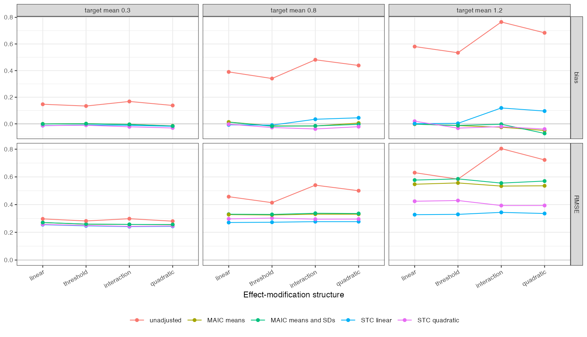

```{r setup}
s <- read.csv("../results/summary.csv"); rc <- read.csv("../results/rank-correlation.csv")
f3 <- function(x) formatC(x, format = "f", digits = 3); f2 <- function(x) formatC(x, format = "f", digits = 2)
n <- s[s$law == "normal" & s$departure != "none", ]
sl <- n[n$method == "stc_linear", ]; mm <- n[n$method == "maic_means", ]
dep <- rc[!grepl("skewed", rc$against), ]
g12 <- function(k) n$rmse[n$method == k & n$m == 1.2 & n$departure == "interaction"]
```

# Abstract {.unnumbered}

**Background.** Simulation studies of population adjustment usually generate shared linear
effect modification, which makes the restriction of a linear outcome model true. Catalog
problem DIA-08 asks whether departures from that structure reverse the method ranking, so
that published rankings reflect the generator.

**Methods.** Anchored binary-outcome comparison with reported moments held fixed. A's effect
modification was linear, a threshold, a modifier-by-modifier interaction or quadratic, at
target covariate means of 0.3, 0.8 and 1.2 SD, plus skewed covariates with linear
modification: 16 scenarios, 2000 replicates each. Unadjusted, MAIC on means, MAIC on means
and SDs, STC with linear interactions and STC with quadratic and product terms were ranked by
RMSE.

**Results.** The RMSE ordering under linear modification was reproduced under every
departure (rank correlation `r f2(min(dep$rho))` to `r f2(max(dep$rho))`); the only change was
a swap between the two worst methods. STC with linear interactions ranked first in every
scenario, although its bias grew to `r f3(max(sl$bias))` under the interaction departure at
the poorest overlap, because MAIC's variance there was far larger (RMSE `r f3(g12("stc_linear"))`
against `r f3(g12("maic_means"))`). Registered verdict: refuted.

**Conclusion.** At these magnitudes, departures that break a linear model's restriction
biased it less than weighting's loss of effective sample size cost the alternatives, so
rankings were set by variance and survived. A generator decides a ranking only when the
departure's bias exceeds the precision differences between methods.

# The problem {#sec-problem}

A method that imposes a restriction true under the generator gains efficiency for free, so
under shared linear modification a linear STC should win on RMSE. A departure from linearity
biases it and leaves MAIC's matching of moments comparatively unaffected, so the ranking
might reverse. Whether it does depends on whether the new bias is large relative to the
variance differences, which published comparisons [@phillippo2020] do not separate.

# Design {#sec-design}

Registered protocol: `protocol.md`; ADEMP structure [@morris2019]. AC trial with individual
data, 300 per arm; BC trial in the target, 300 per arm, reporting covariate means and SDs and
arm event counts. $\operatorname{logit}p = -0.5 + 0.5(x_1 + x_2) + \text{treatment}$; B's effect
$-0.8$; A's effect $-0.6 + 0.4x_1 + 0.4x_2$ (linear), with the $x_1$ term replaced by
$0.8\,\mathbb 1(x_1 > 0.5)$ (threshold), or plus $0.4x_1x_2$ (interaction) or $0.3x_1^2$
(quadratic). Estimand: marginal log odds ratio, B versus A, in the target. STC marginalizes
over normals with the reported moments.

The registered rule reads a Spearman correlation of at least 0.9 as orderings surviving. With
five methods one adjacent swap gives exactly 0.9, which the first run of the analysis stored as
0.8999… and classified as partial; the correlation is now rounded before comparison, which
changes the verdict to refuted and nothing else.

# Results {#sec-results}

{#fig-rmse}

RMSE was nearly flat across departures for every method (@fig-rmse); what changed it was
overlap. The departures moved the linear STC's bias from about zero to
`r f3(max(sl$bias))`, while its RMSE advantage over MAIC at the poorest overlap exceeded 0.2. The
quadratic STC, correctly specified under two of the departures, paid more in variance than it
saved in bias. Skewed covariates reordered the second and third methods at the smallest
shift, as much as any modification departure did.

# What this does not answer {#sec-limits}

Departure magnitudes were moderate (they changed the target effect by 0.1 to 0.3 on the log
odds ratio scale); stronger departures or larger trials, where variance matters less, can
reverse the ranking. Treatment-specific, subnetwork and within-versus-between departures need
a network and were not run; no ML-NMR. Peer review has not been done.

# References {.unnumbered}
