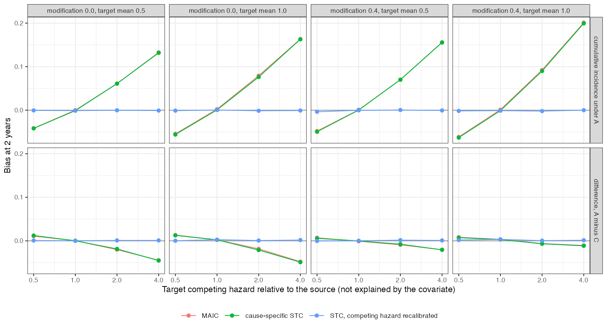

# Transporting competing-risks outcomes: the hazard ratio travels, the
cumulative incidence does not
Ahmad Sofi-Mahmudi
2026-09-23

# Abstract

**Background.** Population adjustment reweights or models covariates,
and results for hazard ratios are assumed to carry over to other outcome
types. For competing risks the quantity a decision model uses, the
cumulative incidence, also depends on the competing cause’s hazard in
the target. Catalog problem DIA-09 asks whether outcome families beyond
the hazard ratio behave differently; this study runs the competing-risks
family.

**Methods.** Transport from a trial of A versus C (300 per arm) to a
target whose competing hazard was 0.5, 1, 2 or 4 times the source’s
beyond what a measured covariate explains, with and without effect
modification, at two overlap levels: 16 scenarios, 1000 replicates each.
MAIC, cause-specific STC, and STC with the competing hazard recalibrated
to the target’s reported proportion of control patients with a competing
event.

**Results.** The cause-1 log hazard ratio was unbiased in every scenario
(largest bias 0.013). A’s cumulative incidence at two years, from MAIC
or STC, was biased by 0.132 to 0.201 with coverage at most 0.030 when
the target’s competing hazard was four times the source’s (true
incidence 0.164 to 0.249), and by -0.063 to -0.042 when it was half. The
A-minus-C difference was affected less (at most 0.049). Recalibration
removed the bias (at most 0.004) but its intervals for the absolute
incidence covered 0.851 to 0.943 because they ignore the uncertainty in
the reported proportion. The registered rule, bias beyond 0.05 in every
scenario with a differing competing hazard, was met in 20 of 24
method-scenarios; the four exceptions were at half the competing hazard.

**Conclusion.** Covariate adjustment transports cause-specific hazards,
not cumulative incidences. When a decision model uses absolute event
probabilities, the target’s competing risk must be supplied from target
data.

# The problem

With cause-specific hazards $h_1$ and $h_2$, the cumulative incidence of
cause 1 is $\int_0^t h_1(u)S(u)\,du$ with $S$ depending on both hazards
([1](#ref-putter2007)). MAIC ([2](#ref-signorovitch2010)) or a
cause-specific outcome model can transport $h_1$ correctly and still
compute the incidence with the source’s $h_2$. If the target’s competing
risk differs for reasons the measured covariates do not capture (age,
comorbidity, background mortality in another country), the absolute
incidence is wrong while every hazard ratio is right.

# Design

Registered protocol: `protocol.md`; ADEMP structure
([3](#ref-morris2019)). Source $x \sim N(0, 1)$, target
$x \sim N(\mu_T, 1)$, $\mu_T \in \{0.5, 1\}$. Exponential hazards
$h_1 = 0.3\exp\{0.5x + A(-0.5 + bx)\}$, $b \in \{0, 0.4\}$, and
$h_2 = K\cdot0.2\exp(0.5x)$ with $K = 1$ in the source and $K_T$ in the
target. Administrative censoring at 3 years; horizon 2 years. The target
reports covariate means and SDs and the proportion of its 300 control
patients with a competing event by 2 years. MAIC uses weighted
proportions (no censoring before the horizon); STC fits exponential
cause-specific models and integrates over the target; recalibration
shifts the competing-cause intercept to reproduce the reported
proportion.

# Results

Figure 1: Bias at 2 years of A’s cumulative incidence and of the
A-minus-C difference against the target’s relative competing hazard.

The bias of the absolute incidence grew with the competing-hazard ratio
and had the sign the mechanism predicts
(<a href="#fig-bias" class="quarto-xref">Figure 1</a>): a higher
competing hazard in the target removes patients before they can have the
event, so source-based estimates were too high. The difference between
arms moved in the same direction but by less, because the competing
hazard scales both arms’ incidence.

The recalibrated analysis was unbiased for both quantities. Its
intervals for the difference held nominal coverage (0.943 to 0.972); for
the absolute incidence they did not, and adding the sampling variance of
the reported proportion would be needed.

# What this does not answer

Only the competing-risks family was run; cure fractions, recurrent
events, ordinal outcomes and joint net-benefit outcomes, which DESIGN.md
lists, were not. OUT-11 covers non-proportional survival. Exponential
hazards and one covariate; no ML-NMR. Peer review has not been done.

# References

1.
Hein Putter, Marta Fiocco, Ronald
B. Geskus. Tutorial in biostatistics: Competing risks and multi-state
models. Statistics in Medicine. 2007;26(11):2389–430.
doi:[10.1002/sim.2712](https://doi.org/10.1002/sim.2712)

2.
James E. Signorovitch, Eric Q. Wu,
Andrew P. Yu, Charles M. Gerrits, Evan Kantor, Yanjun Bao, Shiraz R.
Gupta, Parvez M. Mulani. Comparative effectiveness without head-to-head
trials: A method for matching-adjusted indirect comparisons applied to
psoriasis treatment with adalimumab or etanercept. PharmacoEconomics.
2010;28(10):935–45.
doi:[10.2165/11538370-000000000-00000](https://doi.org/10.2165/11538370-000000000-00000)

3.
Tim P. Morris, Ian R. White,
Michael J. Crowther. Using simulation studies to evaluate statistical
methods. Statistics in Medicine. 2019;38(11):2074–102.
doi:[10.1002/sim.8086](https://doi.org/10.1002/sim.8086)

