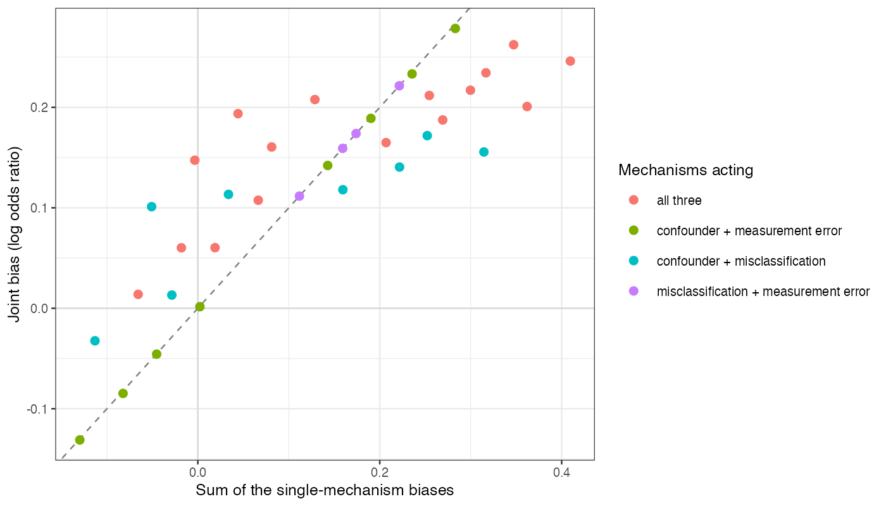

```{r setup}
g <- read.csv("../results/surface.csv")
f3 <- function(x) formatC(x, format = "f", digits = 3); f0 <- function(x) formatC(x, format = "f", digits = 0)
a <- g[(g$gu != 0) + (g$m != 0) + (g$r != 1) >= 2, ]
om <- a[a$gu != 0 & a$m != 0, ]; nm <- a[!(a$gu != 0 & a$m != 0), ]
flip <- a[sign(a$b) != sign(a$sum_marg) & abs(a$sum_marg) > 0.01, ]
v <- function(gu, m, r, col) g[g$gu == gu & g$m == m & g$r == r, col]
```

# Abstract {.unnumbered}

**Background.** Quantitative bias analyses for unanchored comparisons usually vary one bias
mechanism at a time. Catalog problem DIA-13 asks whether mechanisms acting together produce the
sum of their separate biases, and whether a one-at-a-time analysis bounds the joint bias.

**Methods.** Exact population-level calculation for an unanchored MAIC with a binary outcome,
under an omitted confounder (outcome log odds ratio $-1$ to 1, prevalence 0.3 against 0.5),
misclassification of the comparator's reported outcome (sensitivity down to 0.8) and
measurement error in the matched covariate (reliability down to 0.6): 45 combinations.

**Results.** Where the confounder and misclassification acted together, the interaction was up
to `r f3(max(abs(om$interaction)))` on the log odds ratio scale; where either was absent it was at most
`r f3(max(abs(nm$interaction)))`. The median interaction was `r f0(100 * median(a$rel_inter, na.rm = TRUE))`% of
the sum of the separate biases. With both at their largest the joint bias was
`r f3(v(1, 0.2, 1, "b"))` against a sum of `r f3(v(1, 0.2, 1, "sum_marg"))`; with the confounder reversed,
the joint bias was `r f3(v(-1, 0.2, 1, "b"))` against a sum of `r f3(v(-1, 0.2, 1, "sum_marg"))`, the opposite
sign. The joint bias exceeded the largest single-mechanism bias in `r sum(a$exceeds_oat)` of
`r nrow(a)` combinations.

**Conclusion.** One-at-a-time bias analyses neither add up to nor bound the joint bias. Mechanisms
that change the outcome rate on which another mechanism acts interact strongly; these should be
analyzed jointly, while mechanisms acting on different parts of the estimator can be combined
additively.

# The problem {#sec-problem}

An unanchored MAIC [@signorovitch2010] compares A's outcome, reweighted to the target, with B's
published outcome. An omitted confounder shifts A's transported rate; comparator misclassification
distorts B's reported rate by an amount that depends on the true rate; measurement error in a
matched covariate under-corrects A's rate. On the log odds scale each mechanism's bias depends on
the rates the others have moved, so the joint bias is not the sum. Standard bias-analysis practice
treats mechanisms separately or combines them by simulation [@lash2021] without reporting the
interaction.

# Design {#sec-design}

Registered protocol: `protocol.md`. $\operatorname{logit}P(Y = 1) = -1 + 0.5x + g_uU + \text{treatment}$ with
B's effect $-0.4$; source $x \sim N(0, 1)$, $U \sim \text{Bern}(0.3)$; target $x \sim N(0.5, 1)$,
$U \sim \text{Bern}(0.5)$. Misclassification: reported proportion $(1 - m)p + (m/2)(1 - p)$. Measurement
error: MAIC on the error-prone covariate moves the latent mean by the reliability times 0.5. Exact
80-point Gauss-Hermite quadrature. Interaction: joint bias minus the three single-mechanism biases.

# Results {#sec-results}

{#fig-joint}

Combinations involving measurement error with only one other mechanism lay on the additivity
line (@fig-joint); every combination of the confounder with misclassification lay off it.
Misclassification pulls a reported proportion toward the middle by an amount that depends on
the proportion itself, and the confounder changes which proportion B's arm has, so the two
mechanisms compose rather than add. Both additivity and bounding failed; the median relative
interaction is inflated where the separate biases cancel, so absolute interactions are the
better summary.

# What this does not answer {#sec-limits}

Population-level only: no estimation, no bias-analysis procedure, no false reassurance or tipping
sets (DIA-14 scores those). Three mechanisms; selection, correlated sensitivity parameters and
overlap were not varied. Peer review has not been done.

# References {.unnumbered}
