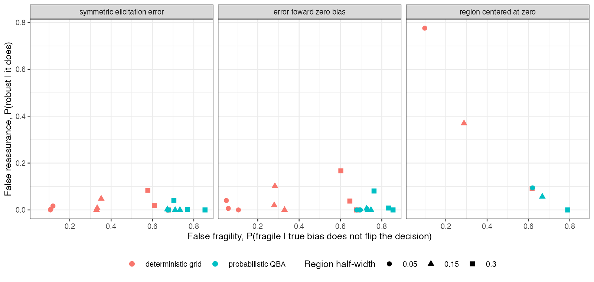

```{r setup}
f <- read.csv("../results/frontier.csv"); oc <- read.csv("../results/oracle.csv")
f3 <- function(x) formatC(x, format = "f", digits = 3)
z <- f[f$dir == "zero", ]; nz <- f[f$dir != "zero", ]
v <- function(dir, q, w, col) f[f$dir == dir & f$q == q & f$width == w, col]
```

# Abstract {.unnumbered}

**Background.** A quantitative bias analysis (QBA) for an unanchored MAIC declares a
decision robust when it holds across an assumed region of bias. Such analyses are usually
checked by recovering the truth when the bias is known, which tests the arithmetic but not
whether a "robust" verdict can be trusted. Catalog problem DIA-14 asks how often the verdict
is wrong.

**Methods.** Unanchored MAIC with an unmeasured binary confounder whose prevalence differs
between populations; 18 scenarios, 2000 replicates each. Elicited bias regions of
half-width 0.05, 0.15 or 0.3 missed the true bias with probability 0, 0.1 or 0.3
(symmetric errors or errors toward zero bias), or were centered at zero bias. A
deterministic grid (equivalent here to bounds and to the tipping point) and a
probabilistic QBA were scored on false reassurance (robust although the true bias
reverses the decision) and false fragility.

**Results.** Whenever the region contained the true bias the grid never reassured
falsely, an exact property confirmed in every replicate. With elicitation errors scaled
to the region's width, false reassurance stayed at or below `r f3(max(nz$fr_grid))`. With a
region centered at zero bias it reached `r f3(z$fr_grid[z$width == 0.05])`, `r f3(z$fr_grid[z$width == 0.15])`
and `r f3(z$fr_grid[z$width == 0.3])` for half-widths 0.05, 0.15 and 0.3. Probabilistic QBA
almost never reassured falsely but called `r f3(min(f$ff_prob))` to `r f3(max(f$ff_prob))` of sound
decisions fragile, because its verdict absorbs sampling uncertainty. Oracle recovery was
nominal in every scenario (coverage `r f3(min(oc$oracle_cover))` to `r f3(max(oc$oracle_cover))`).

**Conclusion.** A QBA verdict's reliability is set by where the analyst puts the region,
not by the QBA method, and oracle recovery cannot show it. Report the tipping point and the
region separately, and justify the region's center.

# The problem {#sec-problem}

Let $b^*$ be the true bias of the MAIC [@signorovitch2010] estimate $\hat\theta$ and the
decision be "B better" when the bias-adjusted estimate is below 0. The decision at the true
bias differs from the unadjusted one ("flip") when $\operatorname{sign}(\hat\theta - b^*) \ne \operatorname{sign}(\hat\theta)$.
A grid over a region declares ROBUST when $\hat\theta - b$ keeps its sign for every $b$ in it.
If the region contains $b^*$, ROBUST implies no flip, so false reassurance is exactly zero;
overall it is at most the probability that the region excludes $b^*$. For one scalar bias,
the grid, the bounds over the region and a comparison of the tipping point $b = \hat\theta$ with
the region give the same verdict, so the methods DESIGN.md listed collapse to two.

# Design {#sec-design}

Registered protocol: `protocol.md`; ADEMP structure [@morris2019]. MAIC of A (300 patients)
against B (300) on a measured covariate; unmeasured binary $U$ with outcome log odds ratio
0.5 or 1, prevalence 0.3 in the source and 0.3, 0.5 or 0.7 in the target; true B effect
$-0.3$, $-0.1$ or $0.1$; $b^*$ from 0 to 0.37. Region $[b^* + e - w, b^* + e + w]$ with
$e \sim N(0, s^2)$ and $s = w/\Phi^{-1}(1 - q/2)$, so that it excludes $b^*$ with probability
$q$; errors symmetric or pointed toward zero; or $[-w, w]$. Probabilistic QBA: $b$ uniform
on the region plus sampling error, ROBUST when the adjusted estimate keeps its sign with
probability at least 0.95.

# Results {#sec-results}

{#fig-front}

Neither method dominated (@fig-front). The grid traded false fragility for false reassurance
through the region's width. Under symmetric or understated errors a wider region raised
false reassurance slightly, because the errors grew with it (for example
`r f3(v("understated", 0.3, 0.05, "fr_grid"))` to `r f3(v("understated", 0.3, 0.3, "fr_grid"))` at
exclusion 0.3); when the region was anchored at zero, width protected (from
`r f3(z$fr_grid[z$width == 0.05])` to `r f3(z$fr_grid[z$width == 0.3])`). Most regions that missed the
truth still did not produce false reassurance: that needs the region to miss on the far side
of the estimate.

Probabilistic QBA's verdict requires the adjusted estimate to be clear of zero, so it
behaves like a significance test and is fragile whenever the estimate is small, whatever
the bias. Its own Monte Carlo error, with 1000 draws, changed the verdict in
`r f3(min(f$qba_mc_disagree))` to `r f3(max(f$qba_mc_disagree))` of analyses.

# What this does not answer {#sec-limits}

One scalar bias parameter, so dependence between bias parameters is not studied; effect
modification and overlap were not varied; the elicitation model is assumed, so the study
cannot say how often real regions miss. Peer review has not been done.

# References {.unnumbered}
