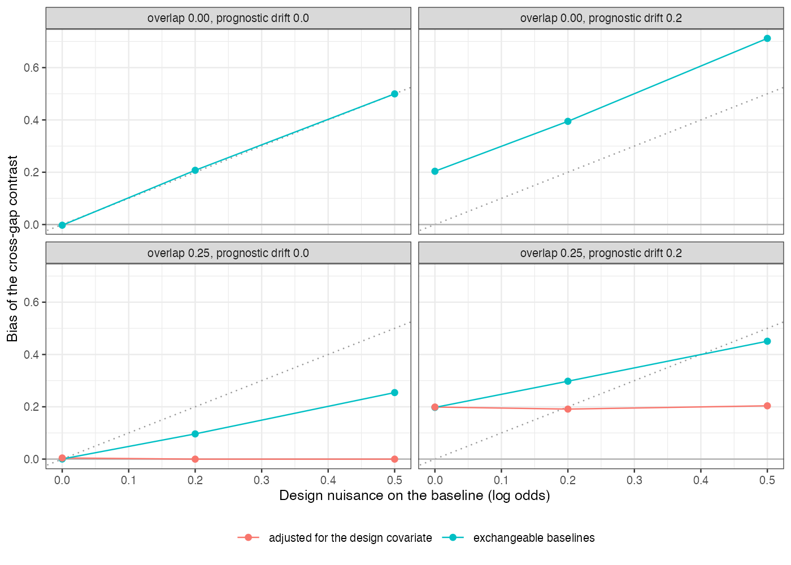

# A baseline-risk bridge carries design nuisance across a disconnected
network as if it were prognosis
Ahmad Sofi-Mahmudi
2026-09-23

# Abstract

**Background.** Disconnected networks are sometimes linked by assuming
that study baseline risks are exchangeable across subnetworks. Catalog
problem DIS-03 asks whether design differences between subnetworks, such
as endpoint definitions, pass into the cross-gap contrast and whether
design covariates can separate them from prognosis.

**Methods.** Two subnetworks of 5 or 10 trials; study baselines with
prognostic variation, possible prognostic drift between subnetworks (0
or 0.2 on the log odds scale) and a design nuisance of 0, 0.2 or 0.5
attached to a binary design covariate that either coincided with the
subnetwork or was used by a quarter of the other subnetwork’s trials: 24
scenarios, 2000 replicates each. Exchangeable bridge with and without
adjustment for the design covariate.

**Results.** When the design covariate coincided with the subnetwork,
adjustment was impossible and the bridge carried the nuisance one for
one (bias 0.207 and 0.500 for nuisance 0.2 and 0.5; coverage 0.084).
With a quarter of trials crossing over, adjustment removed the nuisance
(bias -0.000) but not prognostic drift, which stayed at 0.204.

**Conclusion.** A baseline bridge transports whatever makes the
subnetworks’ baselines differ. Design covariates separate nuisance from
prognosis only if they vary within subnetworks; prognostic differences
between subnetworks remain unidentified. Report how much of each
cross-gap contrast the bridge supplies and treat it as an assumption,
not an estimate.

# The problem

Study baselines are $\mu_s = \mu + b_s + \nu_s$: prognosis $b_s$, which
the bridge is meant to carry, plus design nuisance $\nu_s$ from endpoint
definition, follow-up or ascertainment. The likelihood sees only
$\mu_s$, and the contrast that would separate $b$ from $\nu$ spans the
gap. A design covariate identifies $\nu$ only where it varies within a
subnetwork.

# Design

Registered protocol: `protocol.md`; ADEMP structure
([1](#ref-morris2019)). Subnetwork 1: A versus B; subnetwork 2: C versus
D. Arm-level log odds $\mu_s + d_t$ with arm-level SE 0.15;
$d_C - d_A = 0.2$. The exchangeable bridge estimates $d_C - d_A$ as the
difference in mean control-arm log odds between subnetworks; the
adjusted bridge regresses control-arm log odds on subnetwork and the
design covariate.

# Results

Figure 1: Bias of the cross-gap contrast by design nuisance, with and
without adjustment, ten trials per subnetwork. The dotted line is bias
equal to the nuisance.

Without crossover the unadjusted bias lay on the identity line
(<a href="#fig-bias" class="quarto-xref">Figure 1</a>), plus any
prognostic drift. With crossover the unadjusted bias was diluted but not
removed, and adjustment removed exactly the part attributable to the
design covariate. Prognostic drift is by definition a baseline
difference with no design signature, so no covariate in the network
could remove it.

# What this does not answer

Study-level summaries on the log odds scale rather than an arm-based
Bayesian model; no commensurate prior; one design covariate. Peer review
has not been done.

# References

1.
Tim P. Morris, Ian R. White,
Michael J. Crowther. Using simulation studies to evaluate statistical
methods. Statistics in Medicine. 2019;38(11):2074–102.
doi:[10.1002/sim.8086](https://doi.org/10.1002/sim.8086)

