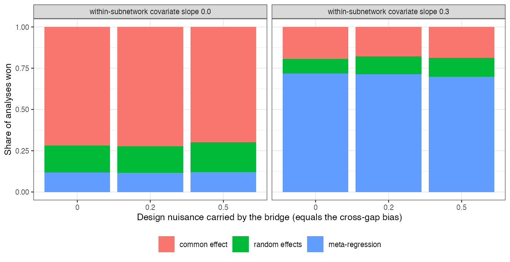

```{r setup}
s <- read.csv("../results/summary.csv")
f3 <- function(x) formatC(x, format = "f", digits = 3); f2 <- function(x) formatC(x, format = "f", digits = 2)
```

# Abstract {.unnumbered}

**Background.** Disconnected-network analyses are checked with predictive criteria such as
leave-one-out cross-validation. Catalog problem DIS-11 asks whether such criteria can rank models by the
error of the bridge that links the subnetworks.

**Methods.** Two subnetworks of eight trials linked by exchangeable baselines, with a design nuisance of
0, 0.2 or 0.5 that the bridge carries into the cross-gap contrast; three candidate models sharing the
bridge (common effect, random effects, meta-regression on a trial covariate) ranked by leave-one-trial-out
log predictive density (6 scenarios, 1000 replicates each).

**Results.** The cross-gap bias was `r f3(min(s$bridge_bias))` to `r f3(max(s$bridge_bias))` for every candidate
alike. The leave-one-out winner was set by the within-subnetwork structure (meta-regression won
`r f2(max(s$metareg))` of analyses when the covariate mattered, the common-effect model
`r f2(max(s$common))` when it did not), and its distribution did not change with the bridge error.

**Conclusion.** A predictive criterion computed on observed trials cannot see an error that all candidates
share, and cannot separate candidates whose bridges are observationally equivalent. Its winner says nothing
about the cross-gap contrast; validation of a bridge needs evidence that crosses the gap.

# The problem {#sec-problem}

Leave-one-out [@vehtari2017] scores each candidate by its predictions of observed units. Write a candidate's
cross-gap error as its within-network error plus the bridge's; when the bridge is shared, the second term is
common and drops out of the ranking. Candidates that differ only in an observationally equivalent bridge fit
the observed data identically, so their scores are equal by definition.

# Design {#sec-design}

Registered protocol: `protocol.md`. Study-level log odds summaries as in DIS-03, with within-subnetwork
contrasts varying with a trial covariate (slope 0 or 0.3) and heterogeneity SD 0.1. Predictive densities
use each candidate's fit to the other trials of the same subnetwork. The first launch stopped on a naming
error in the runner before producing any result; it was fixed and rerun.

# Results {#sec-results}

{#fig-win}

The bars are the same at every bridge error (@fig-win): the criterion answered a within-subnetwork
question correctly, choosing meta-regression when trial covariates changed the contrast, and was silent on
the bridge.

# What this does not answer {#sec-limits}

Frequentist predictive densities on study summaries rather than LOO-PSIS on an ML-NMR fit; grouped
leave-subnetwork-out and synthetic deletion, which do cross something like a gap, were not run;
population-comparison checks were not simulated. Peer review has not been done.

# References {.unnumbered}
