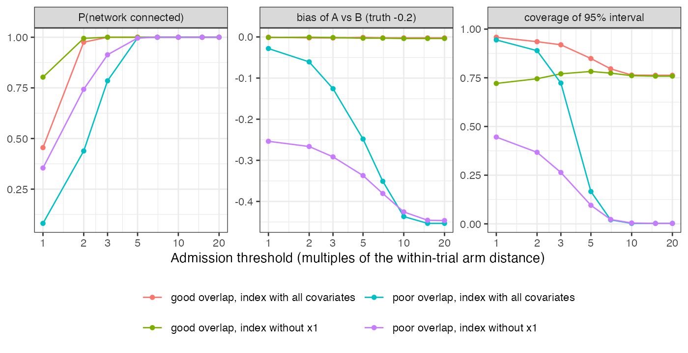

# A matched bridge’s admission threshold sets its bias: at the threshold
used in practice the bridged contrast was biased by twice the true
effect
Ahmad Sofi-Mahmudi
2026-09-23

# Abstract

**Background.** A disconnected network can be bridged by matching arms
of trials on either side on their reported covariate means and treating
a close pair as if randomized. The analyst sets the maximum admissible
distance. In the one published calibration, arms of the same trial
differed by about a tenth of the threshold used ([1](#ref-schmitz2018)).
Catalog problem DIS-21 asks how the threshold relates to the bridge’s
bias.

**Methods.** Two subnetworks of six trials each, with populations close
or shifted across the gap; control arms matched at thresholds of 1 to 20
times the median distance between arms of one randomized trial; an index
with all three covariates or without the most prognostic one;
study-level baseline heterogeneity absent or present. 2000 replicates
per cell.

**Results.** With populations shifted across the gap, the bridged
contrast (truth $-0.2$) was biased by -0.028 at the within-trial
distance, where the network was connected in 8% of replicates, by -0.126
at three times it, and by -0.437 at ten times it, where it was always
connected and its interval covered 0% of the time. An index that omitted
the most prognostic covariate was biased by -0.254 even at the tightest
threshold.

**Conclusion.** The threshold trades bias against whether the comparison
exists, and neither the trade nor its terms are visible in a single
analysis. A bridged estimate should be reported as a curve over the
threshold in within-trial units, with the probability that the bridge
exists at each point.

# The problem

A matched bridge assumes that two arms from different trials, similar on
reported covariates, differ only by their treatments. The residual
difference in prognosis is the bridge’s bias, and it grows with the
distance admitted. The threshold also decides which pairs exist, so
tightening it to control bias can disconnect the network. The natural
unit for the threshold is the distance between two arms of one
randomized trial, which are exchangeable by design. A case study
comparing this bridge with component network meta-analysis found they
could disagree ([2](#ref-rucker2021)).

# Design

Registered protocol: `protocol.md`. Six trials of A versus C and six of
B versus D, 150 patients per arm. Trial populations have three covariate
means from $N(0, 0.3^2)$ on one side of the gap and $N(s, 0.3^2)$ on the
other, $s \in \{0, 0.5\}$; arm means add sampling error. Arm outcome
means: study-level baseline $\alpha_t \sim N(0, \tau^2)$,
$\tau \in \{0, 0.1\}$, plus $0.5\bar x_1 + 0.3\bar x_2 + 0.1\bar x_3$,
plus the treatment effect (A $-0.3$, B $-0.1$, C and D 0). Every C-D arm
pair within the threshold enters as a pseudo-trial; all pairs, A-C
trials and B-D trials are pooled by fixed effect, as in practice. The
within-trial unit was 0.104 (all covariates).

# Results

Figure 1: Probability the bridge exists, bias and coverage against the
threshold, without study-level heterogeneity. Bias and coverage are
conditional on the bridge existing.

Table 1: Threshold in multiples of the within-trial distance; no
study-level heterogeneity; 2000 replicates, bias MCSE at most 0.010.

| gap shift | index          | threshold | connected | pairs |   bias | coverage |
|----------:|----------------|----------:|----------:|------:|-------:|---------:|
|       0.0 | all covariates |         1 |       46% |   0.6 | -0.001 |    0.958 |
|       0.0 | all covariates |         3 |      100% |  11.4 | -0.002 |    0.919 |
|       0.0 | all covariates |         5 |      100% |  27.4 | -0.001 |    0.849 |
|       0.0 | all covariates |        10 |      100% |  36.0 | -0.002 |    0.764 |
|       0.5 | all covariates |         1 |        8% |   0.1 | -0.028 |    0.944 |
|       0.5 | all covariates |         3 |       78% |   2.7 | -0.126 |    0.723 |
|       0.5 | all covariates |         5 |      100% |  11.6 | -0.248 |    0.166 |
|       0.5 | all covariates |        10 |      100% |  34.6 | -0.437 |    0.003 |
|       0.0 | without x1     |         1 |       80% |   1.8 | -0.001 |    0.721 |
|       0.0 | without x1     |         3 |      100% |  12.7 | -0.002 |    0.770 |
|       0.0 | without x1     |         5 |      100% |  25.4 | -0.003 |    0.782 |
|       0.0 | without x1     |        10 |      100% |  35.7 | -0.004 |    0.761 |
|       0.5 | without x1     |         1 |       35% |   0.5 | -0.254 |    0.446 |
|       0.5 | without x1     |         3 |       91% |   4.5 | -0.292 |    0.264 |
|       0.5 | without x1     |         5 |      100% |  12.4 | -0.337 |    0.095 |
|       0.5 | without x1     |        10 |      100% |  32.3 | -0.425 |    0.004 |

The registered condition failed: in the poor-overlap cells the bias
moved by 0.19 to 0.39 across the thresholds at which the bridge existed
at least a fifth of the time
(<a href="#fig-threshold" class="quarto-xref">Figure 1</a>,
<a href="#tbl-main" class="quarto-xref">Table 1</a>). The threshold near
the one used in practice, about ten within-trial units here, admitted
almost every pair and returned the bias of an unmatched comparison.
Tight thresholds removed most of the bias only when the index contained
the prognostic covariates, and then the bridge often did not exist.

Coverage failed even without bias. With populations close across the
gap, the interval covered 96% at the tightest threshold and 76% at ten
units, because pairs that reuse the same arms were pooled as
independent. An index missing a prognostic covariate left each pair’s
prognostic difference as unmodeled noise, and coverage was about three
quarters at every threshold. Study-level baseline heterogeneity (SD 0.1)
lowered coverage further at every threshold (to 80% at the tightest with
good overlap), since no covariate distance can see it.

# What this does not answer

Monte Carlo networks only, no deletions from real networks; one distance
with two covariate sets and no alternative normalization; no component
network meta-analysis bridge; admitted pairs pooled as independent, as
in practice, rather than by a model for shared arms. Peer review has not
been done.

# References

1.
Susanne Schmitz, others. The use
of single armed observational data to closing the gap in otherwise
disconnected evidence networks: A network meta-analysis in multiple
myeloma. BMC Medical Research Methodology. 2018;18.
doi:[10.1186/s12874-018-0509-7](https://doi.org/10.1186/s12874-018-0509-7)

2.
Gerta Rücker, Susanne Schmitz,
Guido Schwarzer. Component network meta-analysis compared to a matching
method in a disconnected network: A case study. Biometrical Journal.
2021;63.
doi:[10.1002/bimj.201900339](https://doi.org/10.1002/bimj.201900339)

