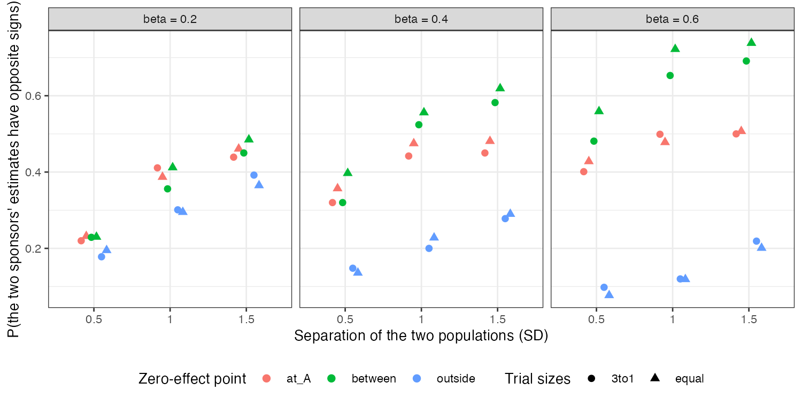

# When two sponsors’ MAICs disagree: how often, why, and which common
target resolves it
Ahmad Sofi-Mahmudi
2026-09-23

# Abstract

**Background.** Two sponsors analyzing the same two trials, each holding
its own individual data and weighting it to the other trial’s
population, can reach opposite conclusions while each analysis is
internally coherent ([1](#ref-jiang2025)). Catalog problem EST-06 asks
how often, under what configurations, and whether the disagreement is a
target-population difference or sampling error and differing adjustment
sets.

**Methods.** Two trials (A versus C in population $F_A$, B versus C in
$F_B$) with linear modification of B’s effect by one covariate. The
sponsors’ targets, $\Delta(F_B)$ and $\Delta(F_A)$, have opposite signs
exactly when the zero-effect point of the modifier lies between the two
populations. We placed that point between, at, or outside the
populations and crossed separation, modification strength, trial sizes
and adjustment sets over 108 scenarios, 1000 replicates each; we also
scored transport of both trials to a declared population and the average
of the two analyses.

**Results.** Placing the zero-effect point between the populations
rather than outside raised the probability that the sponsors’ estimates
had opposite signs by more than 0.20 in 11 of 18 common-set
configurations (median 0.314). In the plausible range (separation up to
1 SD, modification up to 0.4) reversals occurred in 0.229 to 0.556 of
analyses. The two sponsors’ estimates were correlated (0.143 to 0.994),
and a normal approximation ignoring that correlation misstated the
reversal probability by up to 0.436. When one sponsor omitted the
modifier its bias was 0.101 to 0.907. Transport of both trials to a
declared population and the simple average of the two analyses had
essentially the same error (median RMSE 0.231 and 0.239).

**Conclusion.** Disagreement between sponsors is mostly a real
difference in target populations, and it is frequent at ordinary
separations. Under linear modification the average of the two analyses
is not arbitrary: it estimates the effect in the population with the
midpoint covariate mean, as accurately as transporting both trials
there.

# The problem

With $\Delta(F) = d_B - d_A + \beta\,\bar x_{1,F}$, the zero-effect
point is $x_1^* = -(d_B - d_A)/\beta$, and the sponsors’ targets differ
in sign exactly when $x_1^*$ lies between the populations’ means.
Sampling error can reverse estimates anywhere, and a sponsor that leaves
the modifier out of its weights estimates neither target. The simulation
separates these.

# Design

Registered protocol: `protocol.md`. Two covariates (prognostic
coefficients 0.5), $F_A$ and $F_B$ with $x_1$ means $\mp$sep/2;
continuous outcome, residual SD 1. Factors: separation 0.5, 1 or 1.5 SD;
$\beta \in \{0.2, 0.4, 0.6\}$; $x_1^*$ at $0.1\cdot$sep (between), at
$F_A$’s mean, or at sep/2 + 0.5 (outside); 200 per arm in both trials or
300 and 100; common adjustment sets, or sponsor B adjusting for $x_2$
only. Estimands in closed form; $F_D$ has covariate means 0.

# Results

Figure 1: Probability that the two sponsors’ estimates have opposite
signs, common adjustment sets.

Reversal probability tracked the position of the zero-effect point far
more than any other factor
(<a href="#fig-rev" class="quarto-xref">Figure 1</a>). With the point
outside the populations, reversals came from sampling error alone and
fell as separation and modification grew; with it between, they rose
toward the true reversal. A bivariate normal with the estimates’
correlation predicted the simulated reversal probability within 0.036.
The correlation arises because both sponsors use both trials’ data, one
as individual records and one as its published contrast.

Omitting the modifier made sponsor B’s estimate a mixture of the two
targets, biased by up to 0.907 against its own. Both remedies were
unbiased for $\Delta(F_D)$ (largest bias 0.027). The average of the two
analyses needs no individual data from both sponsors, but it equals the
midpoint population’s effect only because modification is linear here.

# What this does not answer

Linear modification and a continuous outcome; under nonlinear
modification or a non-collapsible scale the average is not the midpoint
effect. The arbitrated indirect comparison and measurement differences
between trials were not run; overlap was set by separation rather than
varied separately. Peer review has not been done.

# References

1.
Ziren Jiang, others. A critical
assessment of matching-adjusted indirect comparisons in relation to
target populations. Research Synthesis Methods. 2025;16:569–74.
doi:[10.1017/rsm.2025.10](https://doi.org/10.1017/rsm.2025.10)

