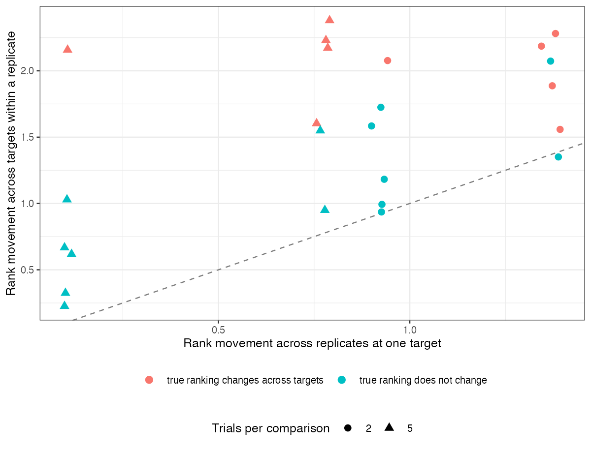

```{r setup}
s <- read.csv("../results/summary.csv")
f2 <- function(x) formatC(x, format = "f", digits = 2); f3 <- function(x) formatC(x, format = "f", digits = 3)
mv <- s[s$true_across > 0, ]; st <- s[s$true_across == 0, ]
```

# Abstract {.unnumbered}

**Background.** Treatment hierarchies (SUCRA, P-scores) are reported without naming the
population they refer to, although every contrast they combine can depend on the population.
Catalog problem EST-12 asks whether ranks move more across plausible target populations than
through sampling variability.

**Methods.** Star networks of five treatments against a common comparator, two or five trials per
comparison, with treatment-specific linear effect modification of three strengths and two effect
spacings; fixed-effect meta-regression and P-scores at three target covariate means (24
scenarios, 1000 replicates each). Rank movement per treatment was compared across targets within
an analysis and across independent replicates at one target.

**Results.** Where the true ranking changed across targets, the estimated hierarchy moved
`r f2(min(mv$across_targets))` to `r f2(max(mv$across_targets))` places per treatment across targets
against `r f2(min(mv$across_replicates))` to `r f2(max(mv$across_replicates))` across replicates. Where the
true ranking did not change, the estimated hierarchy still moved `r f2(min(st$across_targets))` to
`r f2(max(st$across_targets))` places across targets, because evaluating a meta-regression away from the
center of the data amplifies the uncertainty in its slopes. The best treatment was misidentified at
an outer target in up to `r f3(max(s$wrong_best_edge))` of analyses.

**Conclusion.** A hierarchy should name its target population: effect modification of plausible
size moves ranks more than sampling does. But a hierarchy that changes between targets is not by
itself evidence of population dependence; report target-specific hierarchies with their
uncertainty.

# The problem {#sec-problem}

Under linear modification treatment $k$'s effect at target covariate mean $\bar x$ is
$\delta_k + \beta_k\bar x$, and two treatments swap ranks between targets exactly when the targets lie
on opposite sides of their zero-difference point. Ranking metrics such as the P-score
[@rucker2015] combine every pairwise contrast, so they inherit each one's population dependence.

# Design {#sec-design}

Registered protocol: `protocol.md`; ADEMP structure [@morris2019]. Trials of treatment $t$ against
A with covariate means uniform on $[-1, 1]$ and estimates $\delta_t + \beta_t\bar x + e$, SE 0.1;
$\delta = s(0, 1, 2, 3, 4)$, $s \in \{-0.05, -0.15\}$; $\beta_t = \text{spread}(2, 1, 0, -1, -2)/2$,
spread 0, 0.2 or 0.4. Targets at $-w$, 0 and $w$, $w \in \{0.5, 1\}$. Movement: mean absolute
rank change per treatment between the outer targets, and between two replicates at the middle
target.

# Results {#sec-results}

{#fig-move}

Every scenario with a true rank change lay above the line (@fig-move), so the refuting sentence
fails. Scenarios without a true change lay above it too when effects were well separated relative
to their sampling error: the replicate-to-replicate movement at the center was small, while the
outer targets depended on slope estimates from few trials. The two kinds of movement are therefore
separable only with the uncertainty of each target-specific hierarchy, not from the point hierarchies.

# What this does not answer {#sec-limits}

Study-level meta-regression rather than ML-NMR on individual data; P-scores only; one covariate
and fixed-effect models. Peer review has not been done.

# References {.unnumbered}
