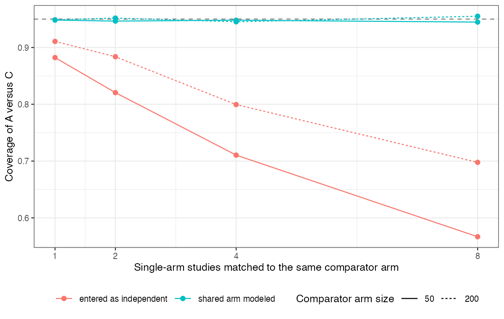

# Single-arm studies matched to one comparator arm must enter a network
with their shared covariance
Ahmad Sofi-Mahmudi
2026-09-23

# Abstract

**Background.** When several single-arm studies are each matched to the
same comparator arm, their pseudo-contrasts share that arm’s sampling
error. Published implementations enter them as independent. Catalog
problem HET-02 asks what that does to a network estimate.

**Methods.** Network of two randomized trials (B versus C with a C arm
of 50 or 200, A versus B) and one to eight single-arm studies of A
matched to trial 1’s C arm; fixed-effect generalized least squares with
the correct block covariance or with the pseudo-contrasts treated as
independent (8 scenarios, 4000 replicates each).

**Results.** Modeling the shared arm gave coverage of 0.945 to 0.955.
Treating the pseudo-contrasts as independent shrank the reported SE as
studies were added (0.137 to 0.059 with a C arm of 50) while the
estimate’s true spread barely changed (0.168 to 0.149); coverage fell to
0.567. The two analyses’ point estimates differed little (mean absolute
difference at most 0.020) and rarely in sign.

**Conclusion.** A comparator arm reused by several matched studies must
be counted once. Ignoring the shared covariance leaves the estimate
nearly unchanged here but reports a precision that grows with the number
of studies, so the interval, and any decision based on significance, is
wrong.

# The problem

With $d_k = \hat\mu_k - \hat\mu_C$, every pair has
$\operatorname{Cov}(d_j, d_k) = \operatorname{Var}(\hat\mu_C)$, and each
also shares it with any other contrast estimated from the same C arm.
This is the multi-arm correlation of network meta-analysis
([1](#ref-franchini2012)) arising without a multi-arm trial.

# Design

Registered protocol: `protocol.md`; ADEMP structure
([2](#ref-morris2019)). Continuous outcome, SD 1; single-arm studies of
100; trial 2 with 200 per arm; true A versus C 0.15, B versus C 0.3. The
correct covariance puts $\operatorname{Var}(\hat\mu_C)$ between every
pair of pseudo-contrasts and between each pseudo-contrast and trial 1’s
contrast. A first probe had the latter sign wrong; it was corrected
before the run.

# Results

Figure 1: Coverage of the A-versus-C estimate by the number of
single-arm studies sharing one comparator arm.

The naive SE fell roughly as $1/\sqrt{M}$ because the C arm’s error was
treated as averaging out, while it is common to every pseudo-contrast
(<a href="#fig-cov" class="quarto-xref">Figure 1</a>). The damage grew
with the number of studies and was worse when the shared arm was small,
since then its error is a larger part of each pseudo-contrast’s
variance.

# What this does not answer

Fixed-effect network with continuous outcomes and no weighting step;
with heterogeneity or conflicting direct and indirect evidence,
reweighting the shared arm can also move the point estimate, which is
how a published network reversed its conclusion. The weighting-induced
covariance is CMP-12’s subject. Peer review has not been done.

# References

1.
Alexander J. Franchini, Sofia
Dias, A. E. Ades, Jeroen P. Jansen, Nicky J. Welton. Accounting for
correlation in network meta-analysis with multi-arm trials. Research
Synthesis Methods. 2012;3(2):142–60.
doi:[10.1002/jrsm.1049](https://doi.org/10.1002/jrsm.1049)

2.
Tim P. Morris, Ian R. White,
Michael J. Crowther. Using simulation studies to evaluate statistical
methods. Statistics in Medicine. 2019;38(11):2074–102.
doi:[10.1002/sim.8086](https://doi.org/10.1002/sim.8086)

