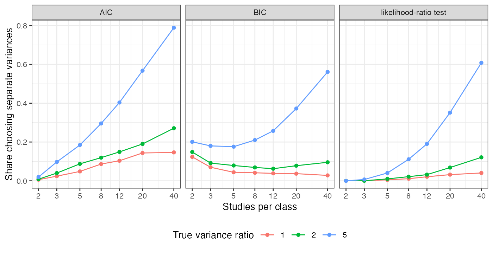

```{r setup}
s <- read.csv("../results/summary.csv"); a <- read.csv("../results/accuracy.csv"); f3 <- function(x) formatC(x, format = "f", digits = 3); pc <- function(x) sprintf("%.0f%%", 100 * x)
q <- function(m, r, c0) s[[paste0(c0, "_sep")]][s$m == m & s$ratio == r]
```

# Abstract {.unnumbered}

**Background.** Network analyses usually assume one between-study variance for all
treatment classes. Separate variances are available, but whether the data can choose between
the structures at realistic network sizes has not been measured. Catalog problem HET-03 asks
at what number of studies per class they become distinguishable.

**Methods.** Two classes of 2 to 40 studies each, with a between-study variance ratio of 1, 2
or 5; shared and separate REML fits compared by AIC, BIC and a likelihood-ratio test; 2000
replicates per cell.

**Results.** With a fivefold variance ratio, AIC chose separate variances in `r pc(q(5, 5, "aic"))` of
networks with five studies per class, `r pc(q(12, 5, "aic"))` with twelve and `r pc(q(40, 5, "aic"))` with forty.
Balanced accuracy (choosing correctly under both truths) reached 0.8 only at 40 studies per
class, and only for AIC; BIC and the likelihood-ratio test did not reach it within 40. With a
twofold ratio no criterion detected the difference in more than `r pc(max(s$aic_sep[s$ratio == 2]))` of networks.

**Conclusion.** At the network sizes population-adjusted analyses use, the heterogeneity
structure cannot be chosen from the data. The shared default is untested rather than
supported, and structure should be set by prior evidence and reported as an assumption.

# The problem {#sec-problem}

The likelihood information about a class-specific between-study variance grows with that
class's study count, and with few studies a separate variance is only nominally identified.
Empirical priors for heterogeneity exist [@turner2012], but whether the variance structure
itself can be selected from data has not been established for network sizes typical of
population-adjusted analyses.

# Design {#sec-design}

Registered protocol: `protocol.md`. Two classes of $m$ studies; study estimates with
within-study SE uniform on 0.1 to 0.25 and between-study SDs 0.1 and $0.1\sqrt{R}$. REML fits with
one or two variances; selection by AIC, BIC (with $2m - 2$ residual degrees of freedom) and a
5% likelihood-ratio test against $\chi^2_1$.

# Results {#sec-results}

{#fig-selection}

| studies per class | AIC: separate chosen, ratio 5 | ratio 2 | ratio 1 (false positive) | balanced accuracy AIC | BIC | LRT |
|---:|---:|---:|---:|---:|---:|---:|
`r paste(sprintf("| %d | %s | %s | %s | %s | %s | %s |", a$m, f3(a$aic_sep_r5), f3(vapply(a$m, function(m) q(m, 2, "aic"), 0)), f3(a$aic_sep_r1), f3(a$acc_aic), f3(a$acc_bic), f3(a$acc_lrt)), collapse = "\n")`

: 2000 replicates per cell. {#tbl-main}

The registered deliverable is a threshold of 40 studies per class for AIC and none within 40
for the other criteria (@tbl-main, @fig-selection). Below twelve studies per class every
criterion chose the shared structure in most networks even when the variances differed
fivefold, so a converged separate-variance fit in a small network says little about the data.
BIC with very few studies chose separate variances more often under the null than AIC,
because its penalty per parameter, $\log(2m - 2)$, is below 2 when $m = 2$.

# What this does not answer {#sec-limits}

Two classes, contrast-level data and frequentist criteria; no Bayesian model comparison,
informative priors, ML-NMR fit or class-specific treatment SD. Peer review has not been done.

# References {.unnumbered}
