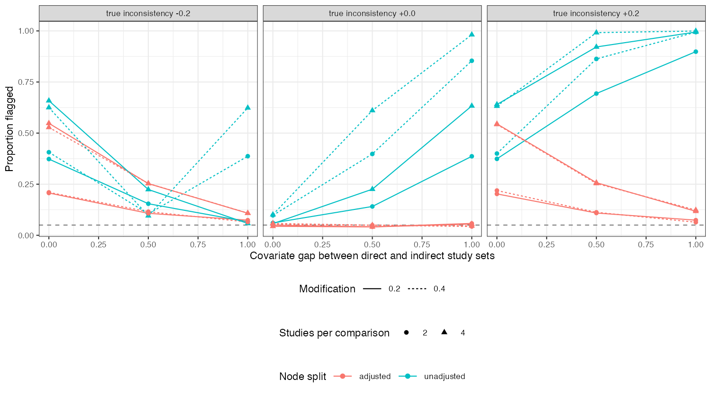

```{r setup}
s <- read.csv("../results/summary.csv")
f3 <- function(x) formatC(x, format = "f", digits = 3)
fp <- s[s$iota == 0 & s$beta > 0 & s$gap > 0, ]
mk <- s[abs(s$iota + s$beta * s$gap) < 1e-9 & s$iota != 0, ]
v <- function(gp, io, col, b = 0.4, m = 4) s[s$gap == gp & s$iota == io & s$beta == b & s$M == m, col]
nul <- s[s$gap == 0 & s$iota == 0 & s$beta == 0.4, ]
```

# Abstract {.unnumbered}

**Background.** Node splitting compares direct and indirect evidence for a contrast. If the
studies supplying the two paths differ in an effect modifier, the difference arrives as
inconsistency. Catalog problem HET-04 asks how often the unadjusted split flags a population
difference or misses a real conflict that the difference cancels.

**Methods.** Triangle networks with two or four studies per comparison, a covariate gap of 0,
0.5 or 1 SD between the direct and indirect study sets, modification 0, 0.2 or 0.4 and true
loop inconsistency of −0.2, 0 or 0.2: 54 scenarios, 2000 replicates each. Unadjusted node
split against a meta-regression-adjusted split with a loop-specific inconsistency term.

**Results.** With no true inconsistency the unadjusted split flagged `r f3(min(fp$flag_unadj))`
to `r f3(max(fp$flag_unadj))` of analyses where populations differed, and the adjusted split
`r f3(min(fp$flag_adj))` to `r f3(max(fp$flag_adj))`. Where the gap cancelled a real inconsistency
the unadjusted split flagged `r f3(min(mk$flag_unadj))` to `r f3(max(mk$flag_unadj))`, its null
rate, and the adjusted split up to `r f3(max(mk$flag_adj))`. Adjustment cost precision: its SE
for the inconsistency rose from `r f3(v(0, 0, "se_adj"))` to `r f3(v(1, 0, "se_adj"))` as the gap
grew, because the inconsistency and the interaction are separated only by the covariate spread
within each study set.

**Conclusion.** An unadjusted node split tests a composite of inconsistency and population
mismatch. Adjust the split for the modifiers whose distribution differs between the paths; its
power then falls with the gap, which should be reported.

# The problem {#sec-problem}

Under linear modification the node-split statistic [@dias2010] is
$w = \iota + \beta(\bar x_{\text{direct}} - \bar x_{\text{indirect}})$. With $\iota = 0$ it is the population
mismatch; with $\iota = -\beta\Delta\bar x$ a real conflict disappears. An adjusted split estimates
the interaction from the study-level covariates and the inconsistency beyond it.

# Design {#sec-design}

Registered protocol: `protocol.md`; ADEMP structure [@morris2019]. Study estimates with SE 0.1;
AB and AC studies with covariate means $N(0, 0.2^2)$, BC studies $N(\text{gap}, 0.2^2)$. C's effect
against A is modified by $\beta x$ with consistent interactions; BC studies carry $\iota$. Both
splits at $p < 0.05$.

# Results {#sec-results}

{#fig-flags}

The unadjusted flag rate followed $\lvert\iota + \beta\cdot\text{gap}\rvert$ (@fig-flags): it rose with the gap
when inconsistency was absent or had the same sign, and fell to the null rate when they
cancelled. It was above nominal even with no gap (`r f3(max(nul$flag_unadj))`), because study-level
covariate variation under modification adds between-study heterogeneity that a fixed-effect
split ignores. The adjusted split held nominal size throughout, and its power against an
inconsistency of 0.2 fell from `r f3(v(0, 0.2, "flag_adj"))` with no gap to
`r f3(v(1, 0.2, "flag_adj"))` with a gap of 1.

# What this does not answer {#sec-limits}

Continuous study estimates, so the marginal and conditional inconsistency factors coincide
and marginalization to a named target was not needed; one loop; no Bayesian node split. Peer
review has not been done.

# References {.unnumbered}
