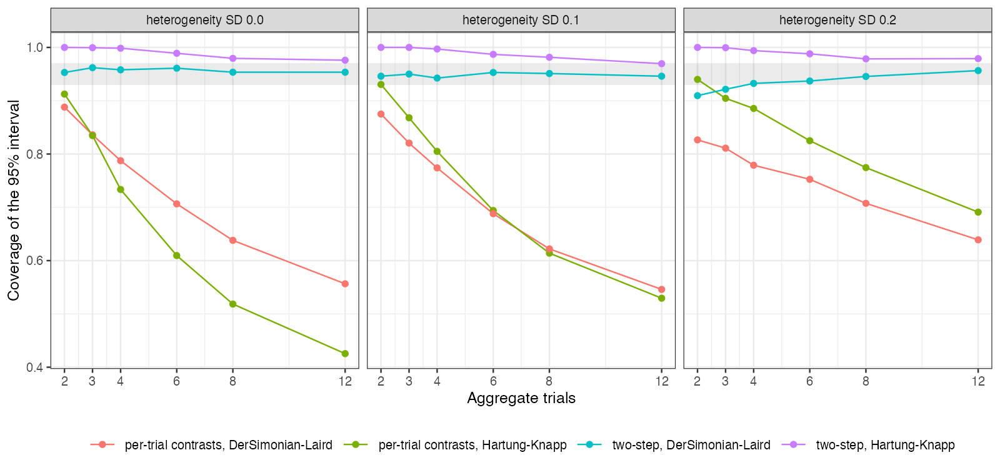

# Population-adjusted synthesis with few studies: pool the aggregate
trials first, then adjust once
Ahmad Sofi-Mahmudi
2026-09-23

# Abstract

**Background.** Random-effects intervals depend on the number of
studies, and in population-adjusted synthesis one individual-data trial
often supplies the adjusted contrast for several aggregate trials.
Catalog problem HET-10 asks how interval coverage behaves at the small
study counts typical of these analyses.

**Methods.** One individual-data trial of A versus C transported by MAIC
to the target, and 2 to 12 aggregate trials of B versus C with
heterogeneity SD 0, 0.1 or 0.2 (18 scenarios, 2000 replicates each).
Per-trial adjusted contrasts meta-analyzed as independent, or a two-step
analysis pooling the aggregate trials before subtracting the transported
contrast once; DerSimonian-Laird or Hartung-Knapp intervals.

**Results.** Meta-analyzing the per-trial contrasts as independent lost
coverage as trials were added (0.546 to 0.888 with DerSimonian-Laird),
because the shared individual-data error does not average out. The
two-step analysis with DerSimonian-Laird covered 0.932 to 0.961 from
four trials and 0.909 at fewer with heterogeneity; with Hartung-Knapp it
was conservative at small counts (up to 1.000).

**Conclusion.** Count the individual-data trial once: pool the aggregate
evidence, then adjust. With fewer than four aggregate trials no interval
here was both calibrated and informative, and that should be stated when
such an analysis is reported.

# The problem

When the same transported A-versus-C estimate is subtracted from each of
$K$ aggregate B-versus-C contrasts, the $K$ adjusted contrasts share its
error. A random-effects meta-analysis ([1](#ref-dersimonian1986)) that
treats them as independent divides that error’s variance by $K$.
Separately, DerSimonian-Laird intervals are too narrow with few studies,
and the Hartung-Knapp adjustment ([2](#ref-hartung2001)) is the usual
repair.

# Design

Registered protocol: `protocol.md`; ADEMP structure
([3](#ref-morris2019)). Individual data: 300 per arm, $x \sim N(0, 1)$,
A’s effect $-0.3 + 0.4x$; aggregate trials of 200 per arm in the target
($x$ mean 0.5), B’s effect $-0.5 + u_k$, $u_k \sim N(0, \tau^2)$.
Estimand: B versus A in the target. MAIC weights the individual-data
trial to the target mean; sandwich variance.

# Results

Figure 1: Coverage by method, number of aggregate trials and
heterogeneity. The shaded band is 0.93 to 0.97.

<a href="#fig-cov" class="quarto-xref">Figure 1</a> separates the two
problems. The independence error grows with $K$ and was present without
heterogeneity; the small-$K$ error of DerSimonian-Laird appeared at two
or three trials with heterogeneity. Hartung-Knapp with $t_{K-1}$ fixed
the latter at the price of very wide intervals when $K$ was 2 or 3.

# What this does not answer

A pairwise synthesis with one individual-data trial rather than a
network; continuous outcome; no one-stage or Bayesian analysis; one
overlap level. Peer review has not been done.

# References

1.
Rebecca DerSimonian, Nan Laird.
Meta-analysis in clinical trials. Controlled Clinical Trials.
1986;7(3):177–88.
doi:[10.1016/0197-2456(86)90046-2](https://doi.org/10.1016/0197-2456(86)90046-2)

2.
Joachim Hartung, Guido Knapp. On
tests of the overall treatment effect in meta-analysis with normally
distributed responses. Statistics in Medicine. 2001;20(12):1771–82.
doi:[10.1002/sim.791](https://doi.org/10.1002/sim.791)

3.
Tim P. Morris, Ian R. White,
Michael J. Crowther. Using simulation studies to evaluate statistical
methods. Statistics in Medicine. 2019;38(11):2074–102.
doi:[10.1002/sim.8086](https://doi.org/10.1002/sim.8086)

