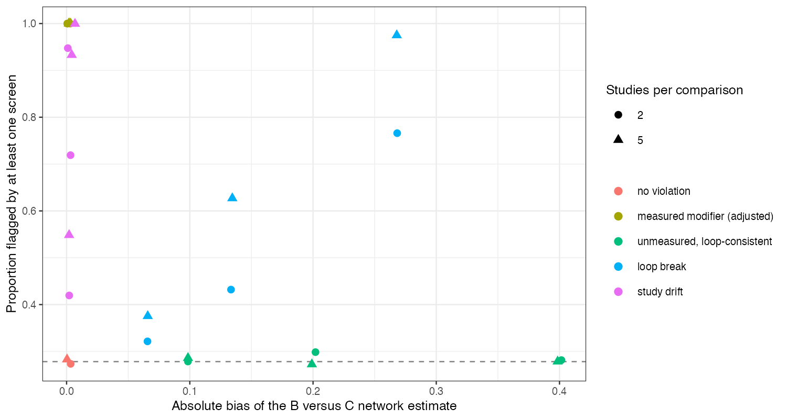

```{r setup}
s <- read.csv("../results/summary.csv"); cf <- read.csv("../results/confusion.csv", row.names = 1)
f3 <- function(x) formatC(x, format = "f", digits = 3)
nn <- s[s$mech == "none", ]; um <- s[s$mech == "unmeasured_em", ]; lb <- s[s$mech == "loop_break", ]
dr <- s[s$mech == "drift", ]; me <- s[s$mech == "measured_em", ]
u4 <- um[um$V == 0.4, ]; l4 <- lb[lb$V == 0.4, ]; d4 <- dr[dr$V == 0.4, ]
acc <- function(m, k) cf[m, k] / sum(cf[m, ])
```

# Abstract {.unnumbered}

**Background.** Transitivity cannot be tested directly; it is screened by comparing reported
study characteristics across comparisons, testing loop inconsistency and measuring
heterogeneity. Catalog problem IDN-01 asks how well these screens perform together and
whether their pattern identifies which assumption failed.

**Methods.** Triangle networks (A, B, C) with two or five studies per comparison. Five
mechanisms of size 0.1, 0.2 or 0.4: none; a measured modifier whose study means differ by
comparison; an unmeasured modifier making C look better in every comparison that includes
it, which keeps the loop consistent; a loop-breaking shift; and study-level drift. 26
scenarios, 2000 replicates each. Screens at $p < 0.10$: dissimilarity of the measured
modifier, the Bucher loop test and Cochran's $Q$. Target: B versus C in a declared
population, by consistency network meta-analysis.

**Results.** The loop-consistent unmeasured modifier of size 0.4 biased the network estimate
by `r f3(u4$bias[1])` (coverage `r f3(max(u4$coverage))` or less) while at least one screen fired
in `r f3(min(u4$any))` to `r f3(max(u4$any))` of analyses, the same as with no violation
(`r f3(min(nn$any))` to `r f3(max(nn$any))`). A loop-breaking shift of 0.4 was flagged in
`r f3(min(l4$any))` to `r f3(max(l4$any))` and drift in `r f3(min(d4$any))` to `r f3(max(d4$any))`. A
measured modifier was flagged every time although meta-regression left the estimate unbiased.
Reading the mechanism from which screen fired was right for `r f3(acc("loop_break", "loop_break"))` of
loop breaks and `r f3(acc("drift", "drift"))` of drift analyses.

**Conclusion.** Each screen sees one direction of violation, and a violation that shifts a
treatment consistently wherever it was tested is invisible to all of them while biasing the
result as much as any. Passing every screen does not establish transitivity, a failed screen
does not identify the mechanism, and a dissimilarity flag need not mean bias.

# The problem {#sec-problem}

A screen $T$ is a function of observed data; if the transport restriction $R$ implies $T$,
then failing $T$ refutes $R$, but passing $T$ does not confirm it. A violation whose
projection onto what $T$ responds to is zero is detected at $T$'s size. Dissimilarity sees
reported covariates, the loop test [@bucher1997] sees violations that break the loop, and
heterogeneity [@cochran1954] sees within-comparison variation. An unreported modifier that
makes one treatment look better in every comparison that includes it changes no reported
covariate, keeps the loop closed and adds no within-comparison variation.

# Design {#sec-design}

Registered protocol: `protocol.md`; ADEMP structure [@morris2019]. Study estimates with SE
0.15; $d_B = -0.3$, $d_C = -0.5$ against A. Measured modifier means 0, 0.5, 1 across AB, AC, BC
in the measured-modifier mechanism and 0.5 otherwise. The estimator is a fixed-effect
consistency model, with meta-regression on the measured modifier when its study means vary.
Mechanisms were read from the flag pattern as: dissimilarity, measured modifier; loop test
without dissimilarity, loop break; heterogeneity alone, drift; nothing, no violation.

# Results {#sec-results}

{#fig-det}

@fig-det shows the blind spot: the loop-consistent mechanism sits at the null detection rate
at every bias. More studies per comparison raised the power of the loop test and $Q$ against
the mechanisms they can see, and did nothing for this one.

Identification from the flag pattern was poor. Drift also raised the loop test's rejection
rate (to `r f3(max(d4$incons))`), so drift and loop breaks were confused, and a loop break was
read as no violation in `r f3(acc("loop_break", "none"))` of analyses pooled over sizes. The
unmeasured mechanism produced the same pattern as no violation in `r f3(acc("unmeasured_em", "none"))` of
analyses (the decision table in `results/decision.md` counts this as the pattern being read
correctly, which it is only in that sense). The dissimilarity screen's firing for a measured
modifier is a correct signal that adjustment is needed, not evidence of bias after it.

# What this does not answer {#sec-limits}

Stylized triangles with continuous study estimates rather than real network geometries;
calendar-time drift represented as random study shifts; the published record of network
meta-analyses abandoned on transitivity grounds was not scored. Peer review has not been
done.

# References {.unnumbered}
