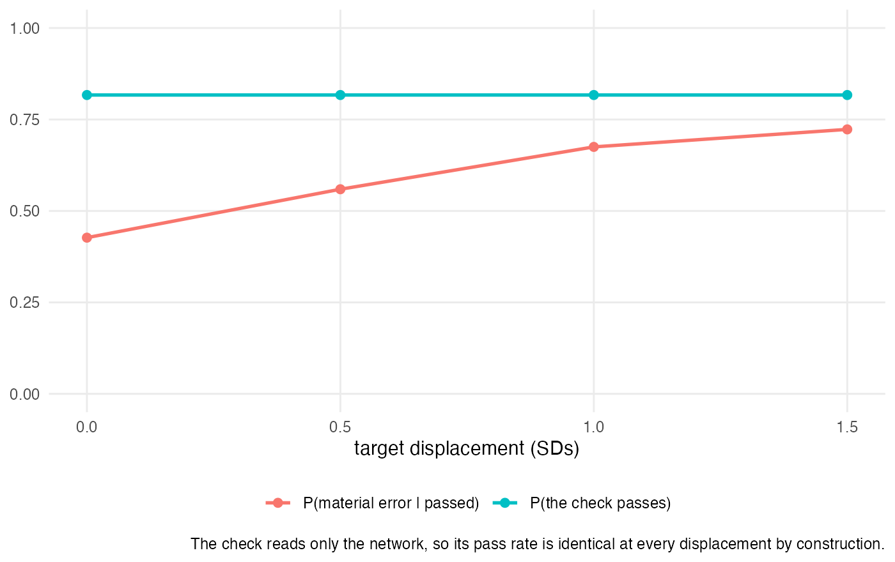
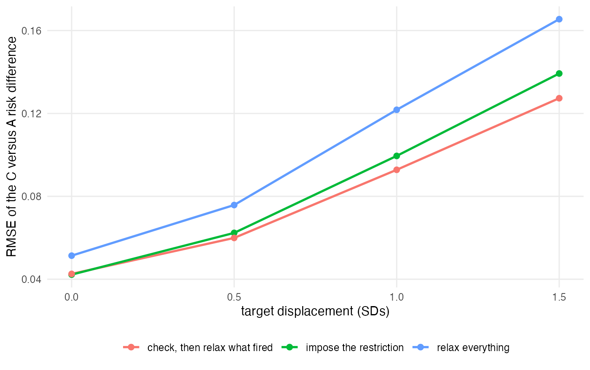

```{r setup}
library(knitr); library(dplyr); library(tidyr)
rd <- function(n) read.csv(file.path("..", "results", paste0(n, ".csv")))
pc <- function(x, d = 3) formatC(x, format = "f", digits = d)
source("../R/00-config.R"); source("../R/01-dgm.R")
```

## What this measures {#sec-intro}

Population adjustment across a network of trials almost always assumes **shared effect
modification**: that a covariate modifies the effect of every active treatment in a class in
the same way. The assumption is what lets an analysis borrow an interaction estimated where
there are individual data and apply it where there are only published summaries.

The check in general use for it is the following. Phillippo et al. [@phillippo2023] fit a
multilevel network meta-regression with a single interaction shared across a treatment class,
refit it with treatment-specific interactions **one covariate at a time**, and compare the
posteriors and the model fit. `multinma` implements it [@multinma]. Their own assessment of
its power is explicit: "it is likely that this approach to assessing the shared effect
modifier assumption has low power, particularly when data are lacking."

We are not aware of a study measuring what it can detect. That is a statement about the ML-NMR
population-adjustment literature, where the check is a within-network comparison of shared
against treatment-specific interactions, and it is not a claim about treatment-by-covariate
interaction modeling in network meta-regression at large, where common, independent and
exchangeable interaction structures have a longer history. It rests on a search of the
population-adjustment methods literature and the `multinma` documentation rather than on a
systematic review, and a reviewer was right to ask that the scope be stated rather than implied.
Within that scope there is no threshold that separates a pass from a failure, no statement of
how much interaction stability is enough, and no statement of what a pass licenses. This study
measures all three, against a truth it constructs, under a design registered before any
replicate was run.

What it measures is not one procedure. "Compare the posteriors and the model fit" is a
description of an exploratory practice, not a decision rule, so this study evaluates five
explicit rules of our own construction that the description admits. Those operating
characteristics are ours; the practice they formalize is the published one, and the
distinction matters for every number below.

```{r headline}
pp <- rd("power-pooled") |> filter(rule == "flag_dic5")
## Stop rather than return nothing. A zero-row lookup here renders as an empty
## string, which is how round two reached three reviewers with the sentence "the
## rate is [, ]" where the amendment result should have been. An inline value
## that cannot be found must break the render, not vanish from it.
g <- function(d) {
  r <- pp[pp$drift == d, ]
  if (nrow(r) != 1L) stop(sprintf("power-pooled has %d rows at drift %s", nrow(r), d))
  r
}
```

The central measurement: when the two treatments' effect modifiers differ by
`r pc(0.30, 2)`, which leaves the transported estimate wrong by twice the amount that would
change a decision, the DIC rule fires in
**`r pc(g(0.30)$rate, 3)`** of analyses, 95% interval
[`r pc(g(0.30)$lo, 3)`, `r pc(g(0.30)$hi, 3)`]. When the assumption holds **exactly** it fires
in `r pc(g(0)$rate, 3)` [`r pc(g(0)$lo, 3)`, `r pc(g(0)$hi, 3)`]. A violation that doubles the
error that matters moves the alarm rate by about three percentage points.

The reason is precision, not thresholds: no network in this design came within a factor of
three of the precision needed to place a 95% interval on the interaction contrast inside the
region where the violation would not matter. Consequently the one reading that could affirm
the assumption rather than merely fail to contradict it never fired, in
`r format(sum(rd("margin-and-equivalence")$n), big.mark = ",")` opportunities. That is a
statement about what these networks can resolve, and @sec-affirm shows it is also partly a
statement about the prior.

Following the check is still better than not, though not uniformly. Relaxing exactly what it
fires on beat relaxing everything at every target examined, and beat imposing the restriction at
every target except the one where nothing is transported. What the practice does not support is
being read as a test the assumption has survived.

## Design {#sec-design}

### The data-generating mechanism

Individual $i$ in study $j$ on treatment $k$, binomial outcome, logit link:

$$\mathrm{logit}\, p_{ijk} = \mu_j + \boldsymbol\beta' x_{ijk} + \mathbb{1}\{k \neq \text{PBO}\}\left(d_k + \delta_{jk} + \boldsymbol\gamma_k' x_{ijk}\right)$$

Two covariates, correlated 0.25, prognostic coefficients 0.40. Reference PBO and two active
treatments **A** and **C** in one class, which is what makes the shared-interaction
restriction bind, with equal main effects 0.70. The drift is carried by $x_1$ and the
parameter **is the contrast**:

$$\gamma_A[x_1] = 0.30 + \tfrac{\text{drift}}{2}, \qquad \gamma_C[x_1] = 0.30 - \tfrac{\text{drift}}{2}, \qquad \gamma_A[x_1] - \gamma_C[x_1] = \text{drift}.$$

$x_2$ is shared exactly, so every replicate supplies one power observation and one type I
error observation from the same four fits.

**One** study contributes individual data and always compares PBO with A. The rest contribute
the arm-level summaries a publication reports. So A is the treatment whose interaction is
estimable within a study, and C appears only in aggregate studies, where its interaction is
identified through between-study contrasts of covariate means and through the curvature of
the aggregate likelihood [@phillippo2020mlnmr]. That asymmetry is the situation population
adjustment exists for.

```{r design-table}
data.frame(
  Factor = c("drift, $\\gamma_A[x_1] - \\gamma_C[x_1]$", "network size $J$",
             "covariate spread $\\tau_x$", "treatment-effect heterogeneity $\\tau_{re}$"),
  Levels = c("0, 0.30, 0.60, 1.20", "6, 12", "0.25, 0.60", "0, 0.15"),
  `What it varies` = c("how far the assumption is violated",
                       "how much evidence the network holds",
                       "the ecological information about interactions",
                       "a second specification error the check was not built to see"),
  check.names = FALSE) |>
  kable(caption = "The registered design: 32 cells, 50 replicates each, four fits per replicate. Eight further cells at drift 0.15 were added by a dated amendment during the run and are reported separately in section 3.8.")
```

### The target, and why it is not a design factor

The check reads only the fitted network. Its output therefore **cannot** depend on the
population an analyst later transports to. One set of fits is scored at every target
displacement $s \in \{0, 0.5, 1.0, 1.5\}$ standard deviations along the drifting covariate,
and that invariance is the mechanism under test rather than an assumption of convenience.

Because $x_1$ is prognostic, displacing the target would also slide the placebo risk along
the logistic curve. The reference intercept is solved separately for each displacement to
hold the marginal placebo risk at 0.30 exactly, so displacement moves the treatment contrast
and nothing else.

```{r truth-table}
tt <- do.call(rbind, lapply(FACTORS$drift, function(d)
  data.frame(drift = d, t(vapply(TARGET_SHIFT, function(s) truth_at(d, s)$rd_CA, numeric(1))))))
names(tt)[-1] <- paste0("s = ", TARGET_SHIFT)
kable(tt, digits = 4,
      caption = "True marginal risk difference for C versus A in the target, computed exactly by Gauss-Hermite quadrature of the true model. Nine of sixteen combinations exceed the 0.03 material threshold; displacement 0 never does.")
```

### The four fits

`class_interactions` in `multinma` 0.9.1.9002 [@multinma_dev] is a single global switch, so on its own it cannot express
a procedure that relaxes one covariate at a time. The split is carried by the regression
formula, using the `.trt` and `.trtclass` specials.

```{r fit-table}
data.frame(
  Fit = c("`common`", "`split_x1`", "`split_x2`", "`split_all`"),
  Formula = c("`~ x1 + x2 + (x1 + x2):.trtclass`",
              "`~ x1 + x2 + (x1):.trt + (x2):.trtclass`",
              "`~ x1 + x2 + (x2):.trt + (x1):.trtclass`",
              "`~ x1 + x2 + (x1 + x2):.trt`")) |>
  kable(caption = "With two covariates these four fits are the complete model lattice, so a strategy that relaxes exactly what the check flagged can be scored rather than approximated.")
```

This only works with `class_interactions = "independent"`. Under the default `"common"`, an
`x:.trt` term in the formula is silently demoted to the class level: the split fit is the
shared fit under another name, with the same parameter names and a DIC that differs only by
Monte Carlo error. An analyst following the published recipe by editing the formula alone
would see no evidence against sharing in any dataset, because no split model was ever fitted.
Every split fit in this study asserts that treatment-specific coefficients exist before any
statistic is computed from it.

### Readings of the check

There is no agreed threshold, so every reading in use is reported. With two active treatments
there is exactly one interaction contrast per covariate, $\gamma_A[x] - \gamma_C[x]$, so no
covariate is selected before the interval is read. That removes one route to miscalibration; it
does not deliver nominal frequentist coverage, and it should not be reported as if it did. An
earlier draft claimed it did, and this study's own type I error contradicts the claim: under the
global null the 95% interval rule fires on
`r pc(rd("type1-by-heterogeneity") |> filter(rule=="flag_post", xvar=="x1", tau_re==0) |> pull(rate), 3)`
of replicates where there is no treatment-effect heterogeneity and
`r pc(rd("type1-by-heterogeneity") |> filter(rule=="flag_post", xvar=="x1", tau_re==0.15) |> pull(rate), 3)`
where there is. Avoiding selection is necessary for coverage, not sufficient.

The rules below are **thresholds we chose**. The DIC differences of 2, 5 and 10 are conventional
reading guides for model comparison in general, not validated cutoffs for detecting a violated
shared effect modifier assumption, and @spiegelhalter2002 is cited for the criterion rather than
for those cutoffs applied to this question.

- **DIC rule**: flag if $\mathrm{DIC}(\text{split}_x) < \mathrm{DIC}(\text{common}) - c$ for
  $c \in \{2, 5, 10\}$, the criterion of @spiegelhalter2002 read at cutoffs of our choosing;
  $c = 5$ is the rule the verdict uses.
- **Posterior rule**: flag if the 95% credible interval for the contrast excludes zero.
- **Margin rule**: flag if $P(|\gamma_A[x] - \gamma_C[x]| > \varepsilon) > 0.95$ with
  $\varepsilon = `r pc(EPS, 4)`$, the contrast that makes the C-versus-A marginal risk
  difference exactly material at displacement 1. The margin is set by consequence, not taste.
- **Continuous scores**: $\Delta\mathrm{DIC}$ and the directional posterior probability,
  scored by AUROC [@hanley1982].
- **Prior-posterior contraction**, so a fit that reported the prior can be told apart from one
  that reported the data.

## Results {#sec-results}

```{r accounting}
fs <- rd("fit-success"); psa <- rd("prior-sensitivity-accounting")
n_main <- sum(fs$n_rep[fs$cell %in% setdiff(DESIGN$cell, BOUNDARY_CELLS)])
n_amd  <- sum(fs$n_rep[fs$cell %in% BOUNDARY_CELLS])
nfit <- function(x) format(x, big.mark = ",")
```

`r nfit(4 * n_main)` ML-NMR fits over the registered design (`r n_main` replicates over 32
cells, four models each), `r nfit(4 * n_amd)` more in the amendment arm, and
`r nfit(psa$fits_total)` in the prior-sensitivity arm. Every cell returned all `r N_REP`
replicates: no replicate was lost to a sampler that failed to start.

**The prior-sensitivity arm is a departure from registration and was not previously disclosed.**
The protocol registers `r psa$registered_cells` cells at `r psa$registered_replicates_per_cell`
replicates each, which is `r nfit(psa$registered_cells * psa$registered_replicates_per_cell * psa$models_per_replicate)`
fits. It ran at `r psa$replicates_per_cell` replicates per cell, `r nfit(psa$fits_total)` fits. A
reviewer noticed that the published fit count could not be produced from the registered design
and asked where it came from; counting the stored cells is how the shortfall was found. Nothing
in the arm was re-selected after results were seen, but at `r psa$replicates_per_cell`
replicates a cell-level rate carries a Monte Carlo standard error near 0.09 rather than the 0.05
the registered size implied, so this arm's comparisons are read as directional and not as
measurements. The protocol now records the departure.

### What the network resolves, and how firmly that can be stated {#sec-resolution}

```{r resolution}
m2 <- rd("m2-contraction")
m2 |> transmute(`studies` = n_studies, `spread` = spread, `heterogeneity` = tau_re,
                `posterior SD, A` = round(post_sd_A, 3),
                `posterior SD, C` = round(post_sd_C, 3),
                `ratio` = round(sd_ratio_C_over_A, 2),
                `what the data alone resolve` = round(data_only_se_contrast, 2),
                `multiples of $\\varepsilon$` = round(data_only_se_contrast / EPS, 1)) |>
  kable(caption = "The standard error the network itself puts on the difference between the two treatments' effect modifiers, with the prior removed, against the difference that would make the target estimate materially wrong.")
```

The difference between the two treatments' interactions is the quantity the whole check is
about. A network of the kind population adjustment is applied to resolves it to a standard
error of **`r pc(min(m2$data_only_se_contrast), 2)` to `r pc(max(m2$data_only_se_contrast), 2)`**
on the log-odds scale. The difference that makes the transported estimate materially wrong is
$\varepsilon = `r pc(EPS, 4)`$. The evidence is therefore between
**`r pc(min(m2$data_only_se_contrast)/EPS, 1)` and `r pc(max(m2$data_only_se_contrast)/EPS, 1)`
times too coarse** to see what matters, before any question of thresholds or rules arises.

**That last column is an approximation and its own sensitivity analysis says so.** Subtracting
prior precision from posterior precision recovers the likelihood exactly only if both are
Gaussian, which a weakly identified interaction is not. Running the same networks under
`normal(0, 1)` instead of `normal(0, 2.5)` gives a data-only standard error of about
`r pc(median(rd("prior-sensitivity")$data_only_se[rd("prior-sensitivity")$prior == "normal(0, 1)" & rd("prior-sensitivity")$xvar == "x1"]), 2)`
where the wider prior gives about
`r pc(median(rd("prior-sensitivity")$data_only_se[rd("prior-sensitivity")$prior == "normal(0, 2.5)" & rd("prior-sensitivity")$xvar == "x1"]), 2)`.
Those should agree and do not. The quantity is therefore reported as an order-of-magnitude
statement, not as a measurement, and **no headline claim in this paper rests on it**; an earlier
draft put it in the title and a reviewer was right that it could not carry that weight.

What is measured rather than derived is the posterior standard deviation itself,
`r pc(min(m2$post_sd_contrast), 2)` to `r pc(max(m2$post_sd_contrast), 2)` across strata, which
is what an analyst reads off the output.

```{r prior-sens}
ps <- rd("prior-sensitivity") |> filter(xvar == "x1")
psg <- function(p, v) ps[[v]][ps$prior == p]
```

**A correction to how contraction was reported.** Contraction is
$1 - \mathrm{sd}(\text{posterior}) / \mathrm{sd}(\text{prior})$. Until round-two review it was
computed by dividing every arm by 2.5, the prior of the main design, including the
prior-sensitivity arm that was fitted under `normal(0, 1)`. A reviewer showed from the published
numbers alone that the figures had to be measured against the wrong denominator, and gave the
argument that settles it: for a fixed likelihood, tightening a prior **cannot raise**
$1 - \mathrm{sd}(\text{post})/\mathrm{sd}(\text{prior})$, yet the paper reported it rising. The
reviewer was right, the error is in `R/02-fit.R`, and the direction of the reported effect was
inverted. Against the prior each arm was actually fitted under, contraction on the drifting
covariate **falls** from `r pc(min(psg("normal(0, 2.5)", "contraction_C")), 2)`--`r pc(max(psg("normal(0, 2.5)", "contraction_C")), 2)`
under `normal(0, 2.5)` to `r pc(min(psg("normal(0, 1)", "contraction_C")), 2)`--`r pc(max(psg("normal(0, 1)", "contraction_C")), 2)`
under `normal(0, 1)`, which is the expected direction.

What survives, and was the point of the arm, is that the check's behavior barely moves: the flag
rate is `r pc(min(psg("normal(0, 2.5)", "flag_rate")), 2)`--`r pc(max(psg("normal(0, 2.5)", "flag_rate")), 2)`
under the wider prior against `r pc(min(psg("normal(0, 1)", "flag_rate")), 2)`--`r pc(max(psg("normal(0, 1)", "flag_rate")), 2)`
under the tighter one. The prior changes how informed the posterior looks relative to itself and
leaves what the check does almost untouched. At `r rd("prior-sensitivity-accounting")$replicates_per_cell`
replicates per cell this arm is directional rather than precise.

The asymmetry the design was built around is large: the treatment with only aggregate data
carries **`r pc(min(m2$sd_ratio_C_over_A), 2)` to `r pc(max(m2$sd_ratio_C_over_A), 2)` times**
the posterior spread of the treatment with individual data. A ratio of two posterior standard
deviations is not free of the prior, as an earlier draft called it; both posteriors are shrunk
toward the same prior. What can be said is narrower and still worth saying: the ratio requires
no subtraction of prior from posterior precision, so it does not inherit the instability that
demoted the derived column above.

{#fig-contraction}

**Registered mechanism claim M2 is partly confirmed.** It asked for a contraction gap of at
least 0.20, widening as the network shrinks. The gap runs from
`r pc(min(m2$gap), 3)` to `r pc(max(m2$gap), 3)` and does widen monotonically as the network
shrinks, but it clears 0.20 in `r sum(m2$gap >= 0.20)` of the `r nrow(m2)` strata rather than
all of them, missing in the largest network at the widest covariate spread. The claim is
reported as partly met rather than met, and the prior-free ratio is offered as the measure that
should have been registered instead.

### Power {#sec-power}

```{r power-table}
pw <- rd("power") |> filter(rule %in% c("flag_dic5", "flag_post")) |>
  mutate(rule = ifelse(rule == "flag_dic5", "DIC < -5", "95% interval")) |>
  select(rule, drift, n_studies, spread, tau_re, power) |>
  pivot_wider(names_from = rule, values_from = power)
pw |> rename(`studies` = n_studies, `spread` = spread, `heterogeneity` = tau_re) |>
  kable(digits = 2, caption = "Probability the check fires on the covariate that actually drifts.")
```

Per cell these rates have a Monte Carlo standard error of about 0.065 at 50 replicates, so the
largest of eight of them is not an upper bound on anything. Pooled across strata, where the
standard error is near 0.01, the picture is this.

```{r power-pooled}
ppall <- rd("power-pooled") |> filter(rule %in% c("flag_dic5", "flag_post")) |>
  mutate(rule = ifelse(rule == "flag_dic5", "DIC < -5", "95% interval"),
         `95% CI` = sprintf("[%.3f, %.3f]", lo, hi)) |>
  select(rule, `true contrast` = drift, arm, n, rate, `95% CI`) |>
  arrange(rule, `true contrast`)
ppall |> kable(digits = 3,
  caption = "Detection on the drifting covariate, pooled across all eight design strata, 400 replicates per row. The contrast 0.15 is the amendment arm and is excluded from every registered claim; 0 is the global null.")
```

At a true contrast of 0.30 the transported estimate is wrong by
`r pc(abs(truth_at(0.30, 1.0)$rd_CA), 3)` absolute risk at displacement 1, twice the material
threshold. The DIC rule fires in `r pc(g(0.30)$rate, 3)`
[`r pc(g(0.30)$lo, 3)`, `r pc(g(0.30)$hi, 3)`] of analyses, against `r pc(g(0)$rate, 3)`
[`r pc(g(0)$lo, 3)`, `r pc(g(0)$hi, 3)`] when the assumption holds exactly. At 0.60 it reaches
`r pc(g(0.60)$rate, 3)` and only at 1.20, eight times the contrast that would make the estimate
materially wrong and a stress test rather than a plausible violation, does it reach
`r pc(g(1.20)$rate, 3)`.

At the amendment level of 0.15 the rate is `r pc(g(0.15)$rate, 3)`
[`r pc(g(0.15)$lo, 3)`, `r pc(g(0.15)$hi, 3)`], whose interval overlaps the null's: at a
violation sitting just under the threshold of mattering, the check does not reliably
distinguish it from no violation at all.

The 95% interval rule is uniformly more sensitive and correspondingly less specific. Per-stratum
rates are below, and are reported for description rather than for comparison.

{#fig-power}

```{r type1}
t1 <- rd("type1-global-null")
t1 |> filter(xvar == "x1") |>
  transmute(rule = c(flag_dic10 = "DIC < -10", flag_dic2 = "DIC < -2", flag_dic5 = "DIC < -5",
                     flag_margin = "margin", flag_post = "95% interval")[rule],
            `type I error` = round(rate, 4),
            `95% CI` = sprintf("[%.3f, %.3f]", lo, hi)) |>
  kable(caption = "Type I error under the global null, where every interaction is shared exactly. 400 replicates per rule.")
```

The 95% interval rule runs at about twice its nominal rate. The margin rule fires in nearly a
quarter of replicates when the true difference is exactly zero, for the reason given in
@sec-affirm.

Every rate above depends on where the cut is put. The registered design also scores the two
continuous statistics threshold-free, as classifiers by AUROC [@hanley1982], which asks whether
the check ranks analyses correctly whatever cut an analyst chooses. **This analysis was
prespecified, computed from the first run onward, and then omitted from the first two drafts.
Three reviewers asked for it. Its absence was an undisclosed departure and this is the
correction.**

```{r auroc-drift}
adp <- rd("auroc-vs-drift-pooled")
adp |> filter(score == "negddic") |>
  transmute(`true contrast` = drift, `AUROC` = round(auc, 3),
            `95% CI` = sprintf("[%.3f, %.3f]", lo, hi), n = n_pos + n_neg) |>
  kable(caption = "Ranking networks with a violation above networks without one, by $-\\Delta$DIC, each violation level against the global null. 0.5 is chance.")
```

Against the check's own hypothesis, $-\Delta$DIC separates a violation from none with an AUROC
of `r pc(adp$auc[adp$score=="negddic" & adp$drift==0.30], 3)`
[`r pc(adp$lo[adp$score=="negddic" & adp$drift==0.30], 3)`,
`r pc(adp$hi[adp$score=="negddic" & adp$drift==0.30], 3)`]
at twice the material violation, rising to
`r pc(adp$auc[adp$score=="negddic" & adp$drift==1.20], 3)` only at the eightfold stress test. The
directional posterior probability is weaker throughout, reaching just
`r pc(adp$auc[adp$score=="pdir" & adp$drift==0.30], 3)`
[`r pc(adp$lo[adp$score=="pdir" & adp$drift==0.30], 3)`,
`r pc(adp$hi[adp$score=="pdir" & adp$drift==0.30], 3)`] at the same violation, an interval that
contains chance.

```{r auroc-material}
am <- rd("auroc-vs-material")
am |> filter(score == "negddic") |>
  transmute(`target displacement` = shift, `AUROC` = round(auc, 3),
            `95% CI` = sprintf("[%.3f, %.3f]", lo, hi)) |>
  kable(caption = "Ranking analyses by whether the transported estimate is materially wrong, by $-\\Delta$DIC. Every replicate of the 32 registered cells counts equally; this is not the deployment-weighted mixture the verdict uses.")
```

Against the outcome that actually matters, a materially wrong transported estimate, the same
statistic reaches `r pc(am$auc[am$score=="negddic" & am$shift==1], 3)` at displacement 1. **No
threshold recovers a ranking the statistic does not contain**, so the weak detection rates above
are a property of the statistic and not an artifact of the cuts chosen for it. This is the
strongest form of the paper's central claim, and it is the one that does not depend on any rule
of ours.

Intervals are Hanley and McNeil's [@hanley1982]. Ties are broken at run boundaries on the sorted
score, which is the exact rather than the approximate treatment; the implementation is checked
against the brute-force definition every time the analysis runs, and agrees to
`r sprintf("%.1e", rd("wauc-verification")$max_abs_error)`.

### The check cannot give an all-clear {#sec-affirm}

```{r margin-eq}
me_all <- rd("margin-and-equivalence")
me <- me_all |> filter(xvar == "x1")
```

A committee reading a check wants to know whether the assumption is safe, which is an
equivalence statement: is the difference between the two treatments' modifiers small enough to
ignore? Computed from the same posteriors, $P(|\gamma_A[x_1] - \gamma_C[x_1]| \leq \varepsilon) > 0.95$
fired in **`r sum(me_all$p_affirms_shared * me_all$n)` of
`r format(sum(me_all$n), big.mark = ",")`** covariate-checks across the registered design. Zero.
Including every one of the `r format(sum(me_all$n[me_all$drift == 0 | me_all$xvar == "x2"]), big.mark = ",")`
in which the two treatments' modifiers were identical by construction.

**Neither of these rules is prior-free, and the direction of the bias must be stated.** Under
independent `normal(0, 2.5)` priors on the two treatment-specific coefficients, their contrast
has prior standard deviation `r pc(sqrt(2) * PRIOR_REG_SD, 3)`. The prior alone therefore
places `r pc(2 * (1 - pnorm(EPS / (sqrt(2) * PRIOR_REG_SD))), 3)` of the contrast beyond
$\varepsilon$, which is **above the 0.95 threshold at which the margin rule fires**, and leaves
only `r pc(1 - 2 * (1 - pnorm(EPS / (sqrt(2) * PRIOR_REG_SD))), 3)` inside the equivalence
region. A reviewer identified this and it is correct: the margin rule fires under the prior
before any data are seen, and the equivalence rule starts from almost nowhere.

So the right statement is not that the procedure cannot affirm the assumption. It is a
statement about precision, and it is sharper. For the equivalence rule to fire, the posterior
standard deviation of the contrast must fall below roughly
$\varepsilon / 1.96 = `r pc(EPS / 1.959964, 4)`$. The tightest stratum in this design achieves
`r pc(min(m2$post_sd_contrast), 3)`, a factor of
`r pc(min(m2$post_sd_contrast) / (EPS / 1.959964), 1)` short, and the loosest
`r pc(max(m2$post_sd_contrast), 2)`. **No network in this design came within a factor of three
of the precision required to affirm the assumption at the margin that matters.**

Three things about that calculation, since round-two review questioned all three and the answers
differ.

The $\varepsilon / 1.96$ condition **is** a normal approximation, and this paper elsewhere says
weakly identified posteriors are not Gaussian, so it is offered as an interpretive gloss and not
as a proof. It is not what produces the count of zero. That count is measured directly:
$P(|\gamma_A[x_1] - \gamma_C[x_1]| \leq \varepsilon)$ is evaluated as the proportion of posterior
draws satisfying the inequality, so it assumes no shape at all.

The contrast's standard deviation likewise **does** account for the covariance between the two
treatment-specific coefficients, because it is not assembled from two marginal standard
deviations: the contrast is formed draw by draw from the joint posterior,
$z^{(m)} = \gamma_A^{(m)}[x_1] - \gamma_C^{(m)}[x_1]$, and its standard deviation is taken over
those draws.

What cannot be defended is the claim an earlier draft made that the count would remain zero
"under any prior that does not itself supply the answer". A prior placed directly on the
contrast, rather than independently on each coefficient, would change the arithmetic above, and
this study did not run one. The count of zero is a result about these networks under these
priors.

The complementary reading runs backwards for the same reason: $P(|\cdot| > \varepsilon) > 0.95$
fires in `r pc(max(me$p_fires_margin[me$drift == 0]), 2)` of replicates at the thinnest cell
under the global null and `r pc(min(me$p_fires_margin[me$drift == 0]), 2)` at the richest,
firing *more often where there is less information*. Both readings are governed by the width of
the posterior rather than its location, and in this design that width is set as much by the
prior as by the network.

### What a pass licenses, and why the registered gate was unreachable {#sec-verdict}

```{r verdict}
vd <- rd("verdict"); orc <- rd("verdict-vs-oracle"); m1 <- rd("m1-floor-and-excess")
orc |> transmute(`displacement` = shift,
                 `P(material error | passed)` = round(passed_rate, 3),
                 `the same for an oracle model` = round(oracle_rate, 3),
                 `excess attributable to the check` = round(excess_over_oracle, 3)) |>
  kable(caption = "The registered gate, and the same quantity for a model that knows which specification is true, on the same replicates.")
```

**The registered verdict fails.** The upper 95% bound on $P(\text{material error} \mid \text{the
check did not fire})$ at displacement 1.0, deployment-weighted, is
`r pc(vd$hi95, 3)` against a threshold of `r VERDICT_PASS_RISK`, on a point estimate of
`r pc(vd$risk_deployed, 3)` with a standard error of `r pc(vd$se_deployed, 4)` over
`r vd$n` passing replicates from `r vd$n_cells` cells. Scored against systematic error alone
rather than realized error the estimate is `r pc(vd$risk_sys_deployed, 3)`. Both fail, by a
factor of about seven.

Two notes on that bound, both from round-two review. First, an earlier draft reported
`r pc(vd$hi95_unweighted_wilson, 3)` here, which is the Wilson bound on the **unweighted** risk
of `r pc(vd$risk_unweighted, 3)` printed beside the **weighted** point estimate; a reviewer
observed that the published bound could not be reconstructed from the stated sample size and was
right. The bound is now computed for the quantity the registered rule names. The verdict is
unchanged, and would be unchanged under any interval this design could produce. Second, the
systematic-error indicator is a deterministic function of a cell's drift and the displacement,
so it does not vary within a cell and its sampling variance is exactly zero; its bound equals
its point estimate by construction rather than through unusual precision, and all remaining
uncertainty sits in deployment weights that are declared rather than estimated.

It fails for a reason that is mostly not the check's doing. An oracle that knows which
specification is correct, fitted to the same replicates, is materially wrong
`r pc(orc$oracle_rate[orc$shift == 1], 3)` of the time. The check's excess over that oracle is
**`r pc(orc$excess_over_oracle[orc$shift == 1], 3)`**, and at displacements 0 and 0.5 the excess
is negative. A perfect check would have failed this gate. The threshold was unreachable by any
procedure, because at a material threshold of 0.03 absolute risk the estimation error of a
six-study network alone exceeds it in
`r pc(rd("error-decomposition") |> filter(drift == 0, n_studies == 6, shift == 1) |> pull(p_material_realized) |> min(), 2)`
to
`r pc(rd("error-decomposition") |> filter(drift == 0, n_studies == 6, shift == 1) |> pull(p_material_realized) |> max(), 2)`
of replicates when the assumption is exactly true.

That is a finding about this program's habit of writing verdict rules, not only about the
check: a threshold on total error charges a diagnostic for noise it was never built to see.
The oracle comparison is the fix, and it was added after a pre-run critique predicted the
failure and computed the noise floor to within the interval the run later measured.

### The mechanism: the check is blind to what determines the harm {#sec-mechanism}

```{r m1}
m1 |> transmute(`displacement` = shift,
                `P(material error | passed)` = round(risk_deployed, 3),
                `noise floor` = round(floor, 3),
                `excess over the floor` = round(excess, 3),
                `systematic only` = round(risk_sys_deployed, 3)) |>
  kable(caption = "The check's output is identical at every displacement by construction; the harm is not.")
```

The check reads the fitted network and nothing else, so its output cannot depend on the
population an analyst transports to. The run confirms this as a bookkeeping identity: the pass
rate is `r pc(rd("m1-bookkeeping-identity")$pass_rate_dic5[1], 6)` at every displacement, with a
maximum absolute deviation of `r rd("m1-bookkeeping-identity")$max_abs_dev[1]`.

Over the same fits, the probability that a passed analysis is materially wrong rises from
`r pc(m1$risk_deployed[m1$shift == 0], 3)` to `r pc(m1$risk_deployed[m1$shift == 1.5], 3)`, an
excess over the noise floor of `r pc(max(m1$excess), 3)`, against a registered threshold of 0.20.
Against systematic error the rise is from 0 to `r pc(max(m1$risk_sys_deployed), 3)`.

{#fig-decoupling}

**Registered mechanism claim M1 is confirmed**, with one qualification a reviewer was right to
press. The first half is an algebraic identity rather than an empirical finding: the same fits
are reused at every displacement, so the pass rate *must* be identical, and the run verifies the
bookkeeping rather than discovering anything. The second half is empirical. And the strong form
of the conclusion is too strong: what a pass is worth depends on the target displacement **and**
on the drift, and the check is blind to both. Displacement is the one this section isolates,
because it can be varied while holding the fitted network exactly fixed.

### The three readings are not three procedures {#sec-readings}

```{r m4}
m4 <- rd("m4-disagreement"); m3 <- rd("m3-null-rules")
```

The published recipe says to compare posteriors *and* model fit, which reads as two independent
opinions. They disagree in `r pc(m4$disagree, 3)` of the `r m4$n` covariate-checks, drawn from
`r m4$n_replicates` replicates. The registered threshold was 0.10 and the point estimate exceeds
it, but the 95% interval is [`r pc(m4$lo, 3)`, `r pc(m4$hi, 3)`], whose lower bound falls below
0.10, so **M4 is reported as not clearly met**. A first draft called it confirmed; a reviewer
pointed out that a point estimate 0.007 above a threshold with a standard error of 0.006 does
not clear it. A second reviewer then noted that the two checks inside a replicate share a fitted
network, so a binomial interval on `r m4$n` independent observations is anti-conservative; the
interval above is clustered by replicate, which widens the standard error from
`r pc(m4$se_naive, 4)` to `r pc(m4$se_clustered, 4)`. The verdict is the same either way.

The substantive point survives the arithmetic, and it is one-sided: the DIC rule fires without
the interval rule in `r pc(m4$dic_only, 4)` of checks, and the interval rule fires without DIC in
`r pc(m4$post_only, 3)`. The DIC rule is very nearly a strict subset of the interval rule, not a
second opinion on the same question.

Under the global null the two rules differ in type I error by
`r pc(m3$gap[m3$pooling == "drifting covariate only"], 3)` on the drifting covariate, the
pooling the table above displays, and by `r pc(m3$gap[m3$pooling == "both covariates"], 3)`
pooling both covariates. Both exceed the registered 0.05, so **M3 is confirmed on either
pooling.** Earlier drafts quoted the second figure beside a table showing the first without
saying which was which, and two reviewers reported the apparent contradiction in successive
rounds.

```{r misattr}
ms <- rd("misattribution") |> filter(rule == "flag_post")
```

When a violation is present the check also points at the wrong covariate. At drift 1.20 the
interval rule fires on the covariate that is shared exactly in `r pc(max(ms$rate), 3)` of
replicates. A fire is not a diagnosis.

### Following the check still beats the alternatives {#sec-strategies}

```{r strategies}
st <- rd("strategy-deployed") |>
  mutate(strategy = recode(strategy, always_common = "impose the restriction",
                           always_relaxed = "relax everything",
                           check_then_relax = "check, then relax what fired"))
st |> filter(shift %in% c(0, 1.0)) |>
  transmute(strategy, displacement = shift, RMSE = round(rmse, 4),
            `P(material error)` = round(p_material, 3),
            `decision reversal` = round(reversal, 3)) |>
  arrange(displacement, strategy) |> kable()
```

Scoring the target estimand for all four fitted models, and defining check-then-relax as
relaxing exactly the covariates that fired, the check earns its keep **on some losses and not
uniformly**. It has the lowest material-error rate at every displacement. On squared error it is
best at displacements 0.5, 1.0 and 1.5 but **not at 0**, where imposing the restriction is
marginally better (`r pc(st$rmse[st$shift == 0 & grepl("^impose", st$strategy)], 4)` against
`r pc(st$rmse[st$shift == 0 & grepl("^check", st$strategy)], 4)`). An earlier draft claimed the
lowest error "at every displacement"; a reviewer found the exception in this paper's own table.
It is reported here as the ordering it is: loss-dependent, and reversed at the one displacement
where there is nothing to transport.

```{r strat-paired}
sp  <- rd("strategy-paired")
spc <- rd("strategy-paired-clean") |> filter(shift == 1.0)
sp |> transmute(displacement = shift, comparison,
                `abs. error diff` = round(w_abs_diff, 5),
                `95% CI` = sprintf("[%.5f, %.5f]", w_abs_lo, w_abs_hi),
                `sq. error diff` = signif(w_sq_diff, 3),
                `95% CI ` = sprintf("[%.6f, %.6f]", w_sq_lo, w_sq_hi)) |>
  kable(caption = "Paired differences at every displacement, on both losses, deployment-weighted to match the primary analysis. The three strategies are scored on the same replicate, so the comparison is paired and its interval is far tighter than a difference of two independent rates. Negative favours check-then-relax.")
```

```{r sprow}
spr <- function(s, i) sp[sp$shift == s, ][i, ]
```

The ordering is not uniform, and saying exactly where it holds is the point.

**Against relaxing everything, check-then-relax wins at every displacement**, by
`r pc(-spr(1, 2)$w_abs_diff, 4)`
[`r pc(-spr(1, 2)$w_abs_hi, 4)`, `r pc(-spr(1, 2)$w_abs_lo, 4)`] in weighted mean absolute error
at displacement 1.0, on both losses, with every interval excluding zero.

**Against imposing the restriction it wins at displacements 0.5, 1.0 and 1.5 and is
indistinguishable at 0.** At displacement 1.0 the advantage is
`r pc(-spr(1, 1)$w_abs_diff, 4)`
[`r pc(-spr(1, 1)$w_abs_hi, 4)`, `r pc(-spr(1, 1)$w_abs_lo, 4)`]. At displacement 0 it is
`r pc(-spr(0, 1)$w_abs_diff, 5)`
[`r pc(-spr(0, 1)$w_abs_hi, 5)`, `r pc(-spr(0, 1)$w_abs_lo, 5)`], an interval containing zero,
and on squared error the point estimate there favours the restricted model. That is the expected
result: at displacement 0 there is nothing to transport, so relaxing can only add variance.

An earlier draft claimed the lowest error "at every displacement". A reviewer found the
exception in this paper's own RMSE column. Checking it exposed a second problem the reviewers
did not see: the paired differences were computed **unweighted** while the RMSE table beside them
was deployment-weighted, and the two disagreed in sign at displacement 0 for that reason alone.
Both are now weighted, so the table and the paired test answer the same question.

Restricting to the `r spc$n[1]` replicates in which **all four** fits met their convergence
criteria changes this hardly at all (`r pc(-spc$mean_abs_error_diff[1], 4)` and
`r pc(-spc$mean_abs_error_diff[2], 4)`), which answers the obvious objection that retaining
badly-behaved relaxed fits is what makes relaxation look poor. It is not.

```{r strat-tau0}
spt <- rd("strategy-paired-tau0") |> filter(shift == 1.0)
```

Restricting instead to the sixteen cells with no treatment-effect heterogeneity, where the
estimand is unambiguous, gives `r pc(-spt$mean_abs_error_diff[1], 4)` and
`r pc(-spt$mean_abs_error_diff[2], 4)` at displacement 1.0. The ordering does not depend on the
cells whose estimand a reviewer correctly questioned.

The margin is small, and the ranking of the alternatives is the interesting part: **relaxing
everything is worse than imposing the restriction** on both RMSE and material error, because
the relaxed model spends precision it does not have. It is better only on decision reversal
(`r pc(st$reversal[st$shift == 1 & grepl("^relax", st$strategy)], 3)` against
`r pc(st$reversal[st$shift == 1 & grepl("^impose", st$strategy)], 3)`), which is what one would
expect of an unbiased but noisy estimator against a biased but precise one.

{#fig-strategies}

That the fully relaxed model is not simply available is visible in the sampler: it fails its
convergence criteria in `r pc(rd("sampler-diagnostics")$p_not_clean[rd("sampler-diagnostics")$model == "split_all"], 3)`
of replicates overall and up to
`r pc(max(rd("convergence-by-cell") |> filter(model == "split_all") |> pull(p_not_clean)), 2)`
in the worst cell, with $\hat R$ reaching
`r pc(rd("sampler-diagnostics")$worst_rhat[rd("sampler-diagnostics")$model == "split_all"], 2)`
and effective sample size falling to
`r pc(rd("sampler-diagnostics")$worst_ess[rd("sampler-diagnostics")$model == "split_all"], 1)`.

```{r worst-diag}
wd <- rd("sampler-worst-overall")
```

Those two figures are the worst reached by the fully relaxed model, and earlier drafts presented
them as the worst in the study. They are not. Across all four models the worst $\hat R$ is
`r pc(wd$worst_rhat_any_model, 2)` and the worst effective sample size is
`r pc(wd$worst_ess_any_model, 2)`, both in the singly-relaxed `r wd$worst_rhat_model` fit. At
least one fit misses its criteria in `r pc(wd$p_replicate_any_fit_bad, 3)` of replicates. Quoting
the better of the two understated the problem, and this correction was found while checking a
reviewer's arithmetic rather than reported by one.
The shared-interaction model never once failed. Those replicates are retained and reported;
excluding them would have removed exactly the cases where relaxation is hardest.

### Nothing in the panel beats scrutinizing everything {#sec-decision-curve}

```{r nb}
nb <- rd("net-benefit")
```

The panel is compared on net benefit [@vickers2006]. The action is to distrust the adjusted
estimate and commission individual patient data; the event the action is meant to catch is a
**material error**, defined throughout this paper as a realized C-versus-A marginal risk
difference wrong by more than `r pc(MATERIAL, 2)` on the absolute scale. It is not a decision
reversal: no external decision threshold is imposed anywhere in this study, so the event is
defined by the size of the error and not by which side of a boundary it lands on. For a rule
that fires on a fraction of analyses, net benefit at threshold $t$ is

$$\text{NB}(t) \;=\; \Pr(\text{fires},\ \text{material}) \;-\; \Pr(\text{fires},\ \text{not material}) \cdot \frac{t}{1 - t},$$

with both probabilities taken over the deployment mixture at displacement 1.0, so $t$ is the
probability of material error at which commissioning the data is worth its cost. Distrusting
every analysis is $\pi - (1 - \pi)\,t / (1 - t)$ for prevalence $\pi$, and distrusting none is
zero by construction. Every rule in the panel is a strict inequality on a continuous statistic
($\Delta\text{DIC} < -5$, and so on), so the firing indicator is exact and no tie-breaking
rule is needed; the one place ties are handled explicitly is the weighted AUROC of
@sec-resolution, where they are broken at run boundaries on the sorted score.

The prevalence entering the curve is the same one the verdict reports: material error is present
in `r pc(vd$risk_deployed, 3)` of passing analyses at displacement 1.0. Sweeping $t$ from 0.05 to
0.60, distrusting every analysis has higher net benefit than every rule in the panel at every
threshold examined.
At a threshold of 0.20 the values are `r pc(nb$distrust_all[nb$threshold == 0.2], 3)` for
distrusting everything against `r pc(nb$dic5[nb$threshold == 0.2], 3)` for the DIC rule and
`r pc(nb$posterior[nb$threshold == 0.2], 3)` for the interval rule.

{#fig-dca}

**This result and the previous one point in opposite directions, and the reconciliation is the
point.** Section @sec-strategies says following the check beats the alternatives; this section
says distrusting everything beats following the check. Both are true because they score
different things. The strategy comparison scores **estimation error**, where the check has
something to contribute and contributes a little. The decision curve scores **whether to trust
an analysis at all**, and the event it must predict is realized material error, most of which is
ordinary sampling noise: at zero drift, with the assumption exactly true, the shared-interaction
fit is already materially wrong in about half of six-study replicates. No covariate check can
predict that, because it is not a covariate phenomenon. A reviewer put it exactly right in round
one: with a prevalence this high, treat-all dominates any rule built on the check almost
regardless of what the check does, so this curve restates the noise-floor finding rather than
measuring the check.

Read together: on the error of the estimate the check earns a small keep, and on the question of
whether a committee should trust a six-study population-adjusted analysis at all, the answer does
not depend on the check. That second statement is about network size, not about this procedure.

The action's consequences are not modeled. Commissioning individual patient data is treated as
an act with a cost expressible as a probability threshold and a benefit of avoiding a material
error; its delay, its chance of being refused, and its chance of not resolving the question are
all set aside. So "nothing in the panel beats scrutinizing everything" is a property of this
coding of the action and this deployment mixture, and is not a general recommendation to
commission data.

### The verdict does not transport across the one axis that matters {#sec-calibration}

```{r calib}
cl <- rd("calibration-lofo") |> filter(score == "ddic")
cl |> transmute(`held-out factor` = factor, level, `observed` = round(observed, 3),
                `predicted` = round(predicted, 3), `absolute error` = round(abs_error, 3)) |>
  kable(caption = "A one-term mapping from the check statistic to the probability of material error, fitted with one level of one factor held out and evaluated on that level.")
```

A mapping from $\Delta\mathrm{DIC}$ to the probability of material error transports across
network size, covariate spread and treatment-effect heterogeneity, with absolute errors of
`r pc(min(cl$abs_error[cl$factor != "drift"]), 3)` to
`r pc(max(cl$abs_error[cl$factor != "drift"]), 3)`. It does not transport across drift, where
the error reaches `r pc(max(cl$abs_error[cl$factor == "drift"]), 3)`. The statistic's meaning
depends on how badly the assumption is violated, which is the one thing the analyst is using it
to find out.

```{r calib-shift}
cs <- rd("calibration-target-blind-vs-not")
```

The protocol also prespecified a target-aware mapping, and its results belong here. **Two
earlier drafts drew the wrong conclusion from it, in two different ways, and the third reading
is the one the numbers support.**

Adding the displacement as a second predictor changes the held-out absolute error from
`r pc(mean(cs$blind), 3)` to `r pc(mean(cs$knows_shift), 3)` on average, which is no change at
all. The first draft explained this by saying displacement cannot help because it does not enter
the check statistic. That is a logical error: a predictor can improve a prediction without
changing another predictor. The second draft said that all four displacements appear in training
within every fold, so displacement carries no information the mapping did not have. A reviewer
answered that correctly: being estimable is not the same as being redundant, and since the check
statistic is identical across the four target rows while the risk of material error changes
strongly across them, displacement must carry information the statistic does not.

The reviewer is right, and the explanation is a property of the registered metric. Absolute
error between *mean* predicted probability and *mean* observed rate is calibration in the large,
and a logistic model fitted by maximum likelihood is calibrated in the large on its training set
by construction. A predictor whose distribution is identical in training and test therefore
cannot move it. The metric is nearly blind to what was being asked.

Discrimination is not, and it answers the question:

```{r calib-auc}
cs |> transmute(`held-out factor` = factor, level,
                `AUROC, statistic only` = round(auc_blind, 3),
                `AUROC, plus displacement` = round(auc_knows_shift, 3)) |>
  kable(caption = "Held-out discrimination for material error, from the check statistic alone and from the check statistic plus the target displacement.")
```

Across the ten folds the check statistic alone discriminates material error at
`r pc(min(cs$auc_blind), 2)` to `r pc(max(cs$auc_blind), 2)`, which is close to chance. Adding
the displacement raises it to `r pc(min(cs$auc_knows_shift), 2)` to
`r pc(max(cs$auc_knows_shift), 2)` over the same folds, and to
`r pc(min(cs$auc_knows_shift[cs$factor != "drift"]), 2)` to
`r pc(max(cs$auc_knows_shift[cs$factor != "drift"]), 2)` over the six that hold out a design
factor rather than a drift level. The single fold where displacement does not help is the one
holding out drift 0, where the test set contains no violation at all and material error is pure
estimation noise that nothing can predict.

**Knowing the target is worth far more than knowing the check statistic**, and the check cannot
tell an analyst the target. That is a sharper version of this section's claim, not a weaker one,
and the paper reached it only because a reviewer refused two wrong explanations of a null
result.

What remains true, and is what the registered metric does measure, is that the mapping transports
across network size, spread and heterogeneity and fails across drift.

### The decision boundary {#sec-boundary}

```{r boundary, eval = file.exists("../results/boundary-detection.csv")}
bd <- rd("boundary-detection")
bd |> transmute(`studies` = n_studies, spread, `heterogeneity` = tau_re,
                `DIC < -5` = round(dic5, 2), `95% interval` = round(post, 2),
                `margin` = round(margin, 2), `affirms sharing` = round(affirm, 2)) |>
  kable(caption = "The amendment arm: drift 0.15, exactly one epsilon, the violation at which the transported estimate becomes materially wrong at displacement 1.")
```

The registered grid ran 0, 1.96, 3.92 and 7.84 multiples of $\varepsilon$, so it measured the
floor and the ceiling and nothing in between. A second pre-run critique caught this while the
run was in progress, and eight cells at exactly one $\varepsilon$ were added by dated amendment.

```{r boundary-narr, eval = file.exists("../results/boundary-detection.csv")}
be <- rd("boundary-error") |> filter(shift == 1.0)
```

**Correction, made under review.** These cells sit just *below* the boundary, not on it. At
drift 0.15 the transported C-versus-A risk difference is wrong by `r pc(abs(be$true_rd[1]), 4)`
at displacement 1, against a material threshold of `r MATERIAL`, so by this study's own
definition the violation is **not** material; the contrast that lands exactly on the threshold
is `r pc(EPS, 4)`. A first draft of this section described drift 0.15 as the exact boundary and
as the violation that "precisely changes a decision", and that was false. What these cells show
is the check's behaviour at a violation just short of mattering. The shared-interaction fit duly delivers that error, with a bias of
`r pc(min(be$bias), 4)` to `r pc(max(be$bias), 4)` and a material-error rate of
`r pc(min(be$p_material), 2)` to `r pc(max(be$p_material), 2)`.

Pooled over the eight strata the DIC rule fires in **`r pc(g(0.15)$rate, 3)`**
[`r pc(g(0.15)$lo, 3)`, `r pc(g(0.15)$hi, 3)`] of those analyses and the interval rule in
`r pc(rd("power-pooled") |> filter(rule == "flag_post", drift == 0.15) |> pull(rate), 3)`,
against `r pc(g(0)$rate, 3)` and
`r pc(rd("power-pooled") |> filter(rule == "flag_post", drift == 0) |> pull(rate), 3)` under the
global null. The intervals overlap. The registered grid could not have produced this
comparison, and it is the one a reader needs: just below the size of violation that would
change a decision, the check does not distinguish the violation from its absence.

### Checks on the machinery {#sec-machinery}

`multinma` reconstructs the joint covariate distribution of the aggregate studies from a copula
whose correlation matrix is estimated from the one individual-level study. That estimate is off
by a mean of
`r pc(mean(rd("correlation-recovery")$mean_abs_cor_error), 3)` on a true correlation of `r RHO`,
so it is not a material source of error here.

```{r integration, eval = file.exists("../results/integration-check.csv"), results = "asis"}
ic <- read.csv("../results/integration-check.csv")
cat(sprintf(paste0("Every DIC difference here is computed from a likelihood that is a numerical ",
                   "integral over 64 points. Refitting the same simulated networks at 256 points ",
                   "moved that difference by a median of %.2f and at most %.2f, and **changed the ",
                   "DIC-5 verdict in %.1f%% of replicates** and the interval verdict in %.1f%%. ",
                   "So a part of what the check reports is quadrature, not evidence. This rate is of the ",
                   "same order as the signal it sits beside: the DIC rule's detection rate rises by ",
                   "about three percentage points between no violation and one twice the size that ",
                   "matters, and the numerical grid alone moves the verdict in 8.3%% of replicates. ",
                   "A first draft called this small; it is not. The check was run on %d simulated ",
                   "networks drawn from two cells, the largest network at the widest covariate ",
                   "spread with and without drift, which is the configuration where quadrature is ",
                   "most stressed; 256 points is not demonstrated to be a converged reference, so ",
                   "this is a lower bound on the instability rather than a measurement of it."),
            median(abs(ic$ddic_shift)), max(abs(ic$ddic_shift)),
            100 * mean(ic$dic5_changed), 100 * mean(ic$flag_changed), nrow(ic)))
```

### An independent reviewer's registered predictions {#sec-predictions}

The second pre-run critique registered a table of predicted results so they could be scored.
Its prediction for the headline was 0.72 to 0.75 on the realized scale against a measured
`r pc(vd$risk_unweighted, 3)` unweighted, and 0.011 for the DIC rule's type I error against a
measured `r pc(t1$rate[t1$rule == "flag_dic5" & t1$xvar == "x1"], 4)`. Both hold. It predicted
M3 would be refuted, on the assumption that the 95% interval rule sits at its nominal 0.05; the
rule actually runs at `r pc(t1$rate[t1$rule == "flag_post" & t1$xvar == "x1"], 3)`, so M3 is
confirmed instead. Its per-cell power predictions are accurate at the low end and optimistic at
the high end.

## Discussion {#sec-discussion}

The shared effect modifier assumption is what allows an interaction estimated where there are
individual data to be applied where there are only summaries. On networks of this size and
composition, the published check on it does not have the resolution to test it. That is not a
defect of the procedure so much as a property of the evidence: the posterior standard deviation
of the difference between two treatments' effect modifiers runs
`r pc(min(m2$post_sd_contrast), 2)` to `r pc(max(m2$post_sd_contrast), 2)`, which is
**`r pc(min(m2$post_sd_contrast)/EPS, 1)` to `r pc(max(m2$post_sd_contrast)/EPS, 1)` times** the
difference that would change a decision. That statement is drawn from the measured posterior
standard deviations, not from the derived data-only quantity that an earlier draft used here and
that @sec-resolution demotes to an order of magnitude.

The threshold-free version is the one that depends on nothing we chose: at a violation twice the
size that matters, $-\Delta\mathrm{DIC}$ ranks a violated network above an intact one with an
AUROC of `r pc(adp$auc[adp$score=="negddic" & adp$drift==0.30], 3)`
[`r pc(adp$lo[adp$score=="negddic" & adp$drift==0.30], 3)`,
`r pc(adp$hi[adp$score=="negddic" & adp$drift==0.30], 3)`].

Three consequences follow, and none of them is a threshold problem.

**Silence is not reassurance.** The check never once affirmed that the assumption holds, in
`r format(sum(me_all$n), big.mark = ",")` opportunities, including every replicate where it held
exactly. A procedure that can only fail to object should not be reported in a way that reads as
confirmation, and the sentence "we assessed the shared effect modifier assumption and found no
evidence against it" carries almost no information about whether the assumption holds.

**A pass is worth what the target makes it worth.** The check's output is invariant to the
population being transported to, exactly and by construction, while the damage from an
undetected violation is proportional to how far that population sits from the network. The same
pass licenses very different things in the two cases, and nothing in the check distinguishes
them.

**Use it anyway, but not as a gate.** Following the check and relaxing exactly what it fires on
beats relaxing everything at every displacement on both losses, and beats imposing the
restriction at every displacement except zero, where the two are indistinguishable and there is
nothing to transport. It is worth running. What it is not worth is treating as a test that the
assumption has survived. This is a comparison of three strategies, and the strategy an analyst
would most want, partial pooling of the interactions, is not among them.

The practical recommendation is to report the *width* alongside the verdict. The posterior
standard deviation of the interaction contrast, compared against the contrast that would move
the decision, says in one number whether the check had any chance of firing. In the thinnest
networks here that ratio is about
`r pc(max(m2$post_sd_contrast)/EPS, 0)` to one, and a reader who saw it would know to discount
the pass entirely.

## What this does not settle {#sec-limits}

**What is being measured is our formalization, not a uniquely defined published rule.** "Compare
the posteriors and the model fit" describes an exploratory practice. The DIC cuts at 2, 5 and
10, the interval rule, the margin rule and the equivalence rule are five decision rules we
constructed that the description admits, and the equivalence rule in particular was never part
of the original proposal. Failure of a rule we invented is not evidence that the authors of the
practice claimed something it does not deliver. What the study establishes is that no rule in
this family, on these networks, separates violations that matter from their absence.

**A departure from the registered eligibility rule.** The protocol said a replicate would be
excluded if any of its four fits had $\hat R$ above 1.05, bulk ESS below 100, or divergences.
The first cell of the run showed that this rule excludes selectively: all six exclusions were
diagnostic failures and five involved a split model, while the shared model never failed once,
so the rule removes exactly the replicates where relaxation is hardest. The rule was amended
before the reported run to record the diagnostics rather than exclude on them, which is a
departure from what was registered and is disclosed as one. The consequences are reported:
convergence failure rates by cell and model, and every primary comparison repeated on the
subset where all four fits converged.

**The estimand under treatment-effect heterogeneity.** Where $\tau_{re} = 0.15$ the truth is
defined at $\delta_{jk} = 0$, which is a superpopulation quantity, while the fixed-effect fits
estimate a precision-weighted function of the realized studies; and on the risk scale,
integrating the inverse link over the random-effect distribution is not the same as setting the
random effect to zero. Part of the error attributed to the check in those cells is that
mismatch. The oracle comparison does not remove it, because the oracle is also a fixed-effect
model there, so it is an interaction-specification oracle and not a fully correct one. Results
restricted to the sixteen $\tau_{re} = 0$ cells are reported for the primary gate
(@sec-verdict) and the strategy comparison (@sec-strategies); an earlier draft said they were
separated "throughout" when they were separated only in the per-cell tables, which a reviewer
caught. Neither conclusion changes. What is *not* repaired is the estimand itself: this study
does not define a single target under heterogeneity and estimate that, and doing so would
require refitting with a random-effects model.

The design is a best case in several specific ways that favour the check, and the failures
attributable to **those** idealizations are conservative. The true marginal reference risk is
supplied, covariate moments in the target are known exactly, the ecological identification route
is unbiased, conditional constancy holds, and the violation is a single linear drift in one
covariate. No general lower-bound claim is made, because three features of the design cut the
other way and could make the check look worse here than in practice: fitting fixed-effect models
to data generated with $\tau_{re} = 0.15$ is a second specification error that inflates firing,
64-point quadrature adds verdict noise that belongs to the implementation rather than to the
evidence, and a single individual-level study is an assumption about the network, not
necessarily a pessimistic one. An earlier draft asserted a lower bound without these
qualifications; a reviewer was right that the general claim is not licensed.

The true marginal reference risk in the target is supplied to the estimator, so no
baseline-risk estimation error enters. Covariates are normal with known target moments, and the
ecological route by which the aggregate-only treatment's interaction is identified is unbiased
by construction: study covariate means are drawn independently of study baselines and of the
random treatment effects. Real networks will often violate that, and the check's failures there
will arrive through a door this study nailed shut. Conditional constancy holds. Only one
covariate drifts, and it drifts linearly.

There are two active treatments in one class and two covariates. A real network has more of
both, so multiplicity across covariates and the selection involved in reading the widest of
several pairwise differences are not measured here; an earlier version of this design had three
treatments and was found, before running, to be reading a selected contrast whose 95% interval
is not a 95% interval.

The fits are fixed-effect while half the cells generate random treatment effects of standard
deviation 0.15. That is deliberate, and it is the realistic case, but it means that in those
cells the check is being read under a second misspecification.

Only one individual-level study. What a second would buy is not measured: that factor was
dropped from the design to pay for treatment-effect heterogeneity, which a pre-run critique
identified as the more consequential omission.

`class_interactions = "exchangeable"` is documented in `multinma` 0.9.1.9002 [@multinma_dev] and raises
"not yet supported", so the hierarchical middle ground between a shared interaction and fully
independent ones could not be fitted at all. That relaxation is the one this catalog's entry
for IDN-05 proposed as the way forward, and the entry's claim that it ships in the package is
wrong for this version and is corrected alongside this study.

**This is the sharpest limit on the recommendation in @sec-strategies.** The three strategies
compared are impose, relax everything, and relax what fired. A fourth, shrinking the
treatment-specific interactions towards each other rather than choosing between identical and
independent, is exactly what the problem entry proposes and is the one most likely to beat all
three, because the failure documented throughout this paper is a precision failure and partial
pooling is the standard answer to a precision failure. **Package non-implementation is a reason
for its absence, not a justification**: we could have written the model. We did not, and until
someone does, "check, then relax what fired" is the best of three options rather than a
recommendation about what to do.

The material threshold of 0.03 absolute risk, the deployment weights, and the choice of
`normal(0, 2.5)` rather than the package default for the regression prior are all declared
judgments. The prior-sensitivity arm shows the headline is insensitive to the last of them.

Fifty replicates per cell gives a per-cell standard error of about 0.065, which is why every
result above is reported by stratum or pooled and why no difference below about 0.13 within a
single cell is claimed.

## References {.unnumbered}

::: {#refs}
:::
