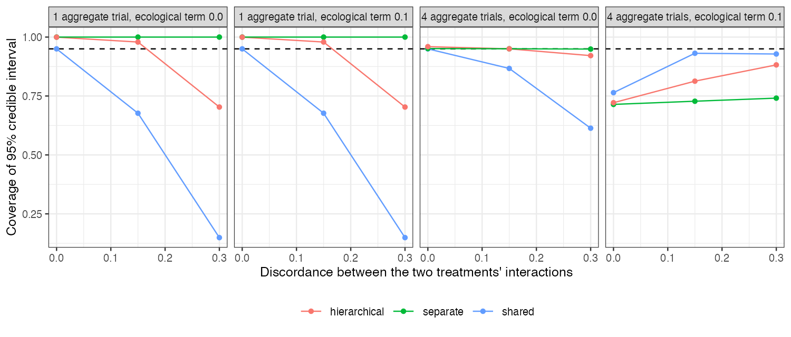

# An aggregate-only treatment’s interaction is identified by assumption,
by an ecological gradient or by the prior, and each fails differently
Ahmad Sofi-Mahmudi
2026-09-23

# Abstract

**Background.** In multilevel network meta-regression a treatment with
only aggregate data gets its effect-modifier interaction from a
shared-interaction assumption, from the gradient across its trials’
covariate means, or from the prior ([1](#ref-phillippo2020mlnmr)).
Catalog problem IDN-06 asks which of these identifies it and what the
credible interval then means.

**Methods.** An exact normal-normal calculation: an individual-data
trial of one treatment, one to four aggregate trials of another,
discordance between the two interactions of 0 to 0.3, and an ecological
term in the aggregate gradient; shared, separate (vague prior) and
hierarchical models. Coverage is exact because every posterior mean is
linear in normal data.

**Results.** With one aggregate trial the data carried no information
about the treatment’s interaction, yet the shared model’s interval was
as narrow as the individual-data trial’s and covered 0.677 and 0.149 at
discordance 0.15 and 0.3; the separate model returned its prior. With
four aggregate trials the separate model covered nominally until an
ecological term of 0.1 entered the gradient, then 0.714. The shared
model then covered better only because the ecological bias happened to
offset the discordance.

**Conclusion.** Report where each interaction’s precision comes from. An
interval for an aggregate-only treatment’s interaction can come entirely
from assumption; one that comes from the gradient inherits ecological
bias; neither can be checked from the network alone.

# The problem

A single aggregate trial reports an effect at one covariate mean and
says nothing about how the effect varies with the covariate. Several
trials at different means give a between-trial gradient, which is
exposed to study-level confounding. The shared restriction imports
another treatment’s within-trial interaction, which is right only if the
two interactions agree. A Bayesian fit converges in all three cases and
reports a proper interval; the source of its precision is not reported.

# Design

Registered protocol: `protocol.md`. $b_j \sim N(\beta_j, 0.01)$ with
$\beta_j = 0.3$; $S \in \{1, 2, 4\}$ aggregate trials of treatment $k$
at covariate means spread 0.3 or 1 around 0.5, each with variance 0.01,
plus $E(m_s - \bar m)$, $E \in \{0, 0.1\}$; $\beta_k = \beta_j + D$.
Shared: $\beta_k = \beta_j$, combining the within-trial estimate and the
gradient. Separate: prior $N(0, 0.5^2)$ and the gradient. Hierarchical:
$\beta_k \sim N(\beta_j, 0.15^2)$ and the gradient. The direct share is
the part of the posterior precision coming from information about
$\beta_k$ itself.

# Results

Figure 1: Coverage of the 95% credible interval for the aggregate-only
treatment’s interaction (covariate-mean spread 1).

Table 1: Covariate-mean spread 1. Full table in `results/decision.md`.

| trials | discordance | ecological | model | bias | posterior SD | coverage | direct share |
|---:|---:|---:|----|---:|---:|---:|---:|
| 1 | 0.00 | 0.0 | shared | 0.000 | 0.100 | 0.950 | 0.000 |
| 1 | 0.00 | 0.0 | separate | -0.300 | 0.500 | 1.000 | 0.000 |
| 1 | 0.00 | 0.0 | hierarchical | 0.000 | 0.180 | 1.000 | 0.000 |
| 4 | 0.00 | 0.0 | shared | 0.000 | 0.056 | 0.950 | 0.690 |
| 4 | 0.00 | 0.0 | separate | -0.005 | 0.066 | 0.951 | 0.982 |
| 4 | 0.00 | 0.0 | hierarchical | 0.000 | 0.063 | 0.959 | 0.878 |
| 1 | 0.15 | 0.0 | shared | -0.150 | 0.100 | 0.677 | 0.000 |
| 1 | 0.15 | 0.0 | separate | -0.450 | 0.500 | 1.000 | 0.000 |
| 1 | 0.15 | 0.0 | hierarchical | -0.150 | 0.180 | 0.979 | 0.000 |
| 4 | 0.15 | 0.0 | shared | -0.047 | 0.056 | 0.867 | 0.690 |
| 4 | 0.15 | 0.0 | separate | -0.008 | 0.066 | 0.950 | 0.982 |
| 4 | 0.15 | 0.0 | hierarchical | -0.018 | 0.063 | 0.950 | 0.878 |
| 1 | 0.30 | 0.0 | shared | -0.300 | 0.100 | 0.149 | 0.000 |
| 1 | 0.30 | 0.0 | separate | -0.600 | 0.500 | 1.000 | 0.000 |
| 1 | 0.30 | 0.0 | hierarchical | -0.300 | 0.180 | 0.703 | 0.000 |
| 4 | 0.30 | 0.0 | shared | -0.093 | 0.056 | 0.613 | 0.690 |
| 4 | 0.30 | 0.0 | separate | -0.011 | 0.066 | 0.949 | 0.982 |
| 4 | 0.30 | 0.0 | hierarchical | -0.036 | 0.063 | 0.921 | 0.878 |
| 1 | 0.00 | 0.1 | shared | 0.000 | 0.100 | 0.950 | 0.000 |
| 1 | 0.00 | 0.1 | separate | -0.300 | 0.500 | 1.000 | 0.000 |
| 1 | 0.00 | 0.1 | hierarchical | 0.000 | 0.180 | 1.000 | 0.000 |
| 4 | 0.00 | 0.1 | shared | 0.069 | 0.056 | 0.764 | 0.690 |
| 4 | 0.00 | 0.1 | separate | 0.093 | 0.066 | 0.714 | 0.982 |
| 4 | 0.00 | 0.1 | hierarchical | 0.088 | 0.063 | 0.722 | 0.878 |
| 1 | 0.15 | 0.1 | shared | -0.150 | 0.100 | 0.677 | 0.000 |
| 1 | 0.15 | 0.1 | separate | -0.450 | 0.500 | 1.000 | 0.000 |
| 1 | 0.15 | 0.1 | hierarchical | -0.150 | 0.180 | 0.979 | 0.000 |
| 4 | 0.15 | 0.1 | shared | 0.022 | 0.056 | 0.931 | 0.690 |
| 4 | 0.15 | 0.1 | separate | 0.090 | 0.066 | 0.728 | 0.982 |
| 4 | 0.15 | 0.1 | hierarchical | 0.070 | 0.063 | 0.813 | 0.878 |
| 1 | 0.30 | 0.1 | shared | -0.300 | 0.100 | 0.149 | 0.000 |
| 1 | 0.30 | 0.1 | separate | -0.600 | 0.500 | 1.000 | 0.000 |
| 1 | 0.30 | 0.1 | hierarchical | -0.300 | 0.180 | 0.703 | 0.000 |
| 4 | 0.30 | 0.1 | shared | -0.024 | 0.056 | 0.928 | 0.690 |
| 4 | 0.30 | 0.1 | separate | 0.088 | 0.066 | 0.741 | 0.982 |
| 4 | 0.30 | 0.1 | hierarchical | 0.051 | 0.063 | 0.882 | 0.878 |

The registered primary was confirmed
(<a href="#fig-coverage" class="quarto-xref">Figure 1</a>,
<a href="#tbl-main" class="quarto-xref">Table 1</a>): the shared model’s
coverage fell to 0.149 at nonzero discordance while the separate model
covered 0.942 to 0.955 wherever it had a gradient and no ecological
term. The three failures are distinct. **Assumption:** with one
aggregate trial the direct share was zero for every model; the shared
interval was narrow and wrong under discordance, and the hierarchical
interval covered only as far as its prior spread allowed. **Ecology:**
with a gradient, the separate model’s direct share was near 1 and its
bias was the ecological term. **Offsetting:** the shared model combined
both sources and could look right when the two errors cancelled.

# What this does not answer

Conjugate normal models on contrast-level data rather than multinma
fits; one covariate; fixed prior scales; the shared model’s gradient and
within-trial information are pooled by precision as a linear model would
pool them. Peer review has not been done.

# References

1.
David M. Phillippo, Sofia Dias, A.
E. Ades, Mark Belger, Alan Brnabic, Alexander Schacht, Daniel Saure,
Zbigniew Kadziola, Nicky J. Welton. Multilevel network meta-regression
for population-adjusted treatment comparisons. Journal of the Royal
Statistical Society Series A. 2020;183(3):1189–210.
doi:[10.1111/rssa.12579](https://doi.org/10.1111/rssa.12579)

