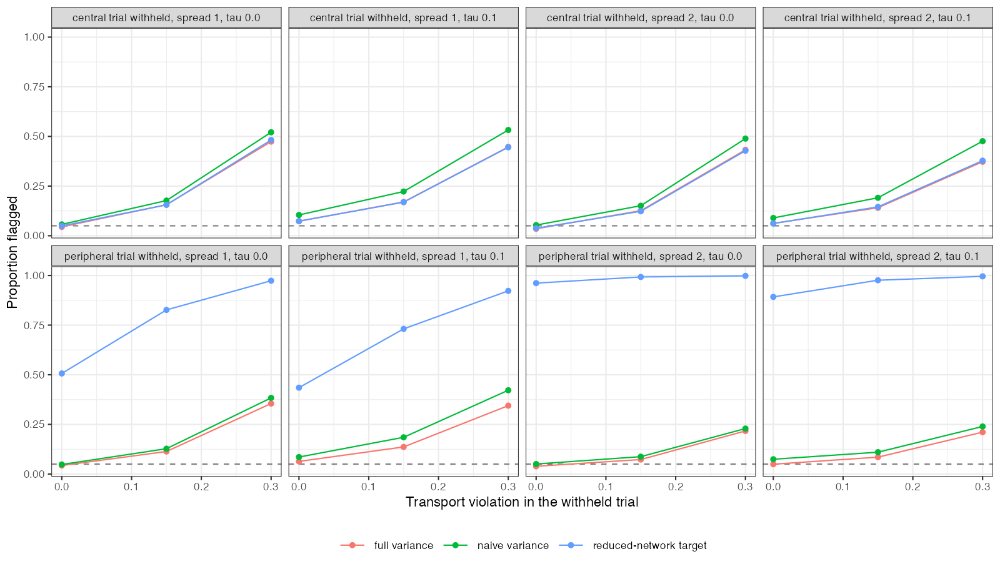

```{r setup}
s <- read.csv("../results/summary.csv")
f3 <- function(x) formatC(x, format = "f", digits = 3)
n0 <- s[s$v == 0, ]; p3 <- s[s$v == 0.3, ]; p15 <- s[s$v == 0.15, ]
per <- n0[n0$held == 5, ]; cen <- n0[n0$held == 3, ]
```

# Abstract {.unnumbered}

**Background.** Withholding one trial, predicting its contrast from the rest of the
evidence and comparing the prediction with what the trial observed is proposed as a
falsification check for transport assumptions. Catalog problem IDN-07 asks for a pass or
fail rule with known operating characteristics.

**Methods.** One individual-data trial and five aggregate trials with a continuous outcome
and linear effect modification. The withheld trial's contrast was predicted by
G-computation at its reported covariate mean. Violations of 0, 0.15 or 0.3 (the effect
itself is about 0.3), between-trial heterogeneity 0 or 0.1, two covariate spreads and a
central or peripheral withheld trial: 24 scenarios, 2000 replicates each. Rules: a
standardized discrepancy with all variance components; the same without heterogeneity; the
prediction aimed at the population implied by the remaining trials; and a sign-disagreement
rule.

**Results.** With the prediction aimed at the withheld trial's own population the
discrepancy had mean zero under the null (at most `r f3(max(abs(n0$mean_D)))`), and the full rule
held a size of `r f3(min(n0$full))` to `r f3(max(n0$full))`; the registered limit of 0.07 was
exceeded by 0.003 in one scenario. Omitting heterogeneity raised size to
`r f3(max(n0$naive))`. Aiming the prediction at the remaining trials' population gave a
nonzero null mean (up to `r f3(max(abs(n0$mean_D_wrong)))`) and size up to
`r f3(max(n0$wrong_target))` for a peripheral trial. Power was low everywhere:
`r f3(min(p15$full))` to `r f3(max(p15$full))` at violation 0.15 and `r f3(min(p3$full))` to
`r f3(max(p3$full))` at 0.3. The sign-disagreement rule flagged `r f3(min(n0$decision_flip))` to
`r f3(max(n0$decision_flip))` of valid analyses depending on how close the effect was to zero.

**Conclusion.** A held-out-trial check needs an externally fixed target (the withheld trial's
own population) and a variance that includes heterogeneity; with both, its size is
controlled. Its power against violations as large as the effect is below one half, so a pass
licenses very little and should not be reported as validation.

# The problem {#sec-problem}

The discrepancy $D = \hat\Delta_{\text{pred}} - \hat\Delta_{\text{obs}}$ has mean zero under a valid
transport assumption only if both sides refer to the same population. Its variance must
include the prediction's sampling error, the observed contrast's sampling error and
between-trial heterogeneity; the covariance between the two sides is not zero when the
prediction uses the withheld trial's own covariate summaries. A rule that omits a variance
component rejects valid analyses; one that aims at the wrong population tests a composite
null.

# Design {#sec-design}

Registered protocol: `protocol.md`; ADEMP structure [@morris2019]. Individual data: 300 per
arm, $x \sim N(0, 1)$. Aggregate trials: 200 per arm, $x \sim N(\mu_k, 1)$ with
$\mu_k = s\cdot(-0.4, 0, 0.4, 0.8, 1.2)$, $s \in \{1, 2\}$; the third (central) or fifth
(peripheral) is withheld. $y = 0.5x + A(-0.3 + 0.3x + u_k + v\,\mathbb 1[\text{withheld}]) + e$,
$u_k \sim N(0, \tau^2)$. Heterogeneity is estimated by DerSimonian-Laird [@dersimonian1986] from
the other four trials' residuals against their predictions. Rules flag at
$\lvert z\rvert > 1.96$.

# Results {#sec-results}

{#fig-power}

The external target removed the estimand mismatch entirely, and the full variance kept size
near nominal; it was conservative for the peripheral trial at wide spread
(`r f3(min(per$full))`), where the prediction's variance dominated and its covariance with the
observed contrast was positive (@fig-power). The one scenario above 0.07 had heterogeneity
estimated from only four trials, which DerSimonian-Laird underestimates.

Power rose little with any factor. The detectable violation is set by the sampling error
of a single trial's contrast and of the prediction at its covariate mean, and a network
supplies one withheld trial at a time. The sign rule is not calibratable: its flag rate is
a property of the effect's distance from zero, not of the violation.

# What this does not answer {#sec-limits}

Continuous outcome and G-computation, so MAIC weight-estimation variance and
non-collapsibility are absent; a Bayesian predictive rule and a conditional-moment test
were not run; five aggregate trials only. Peer review has not been done.

# References {.unnumbered}
